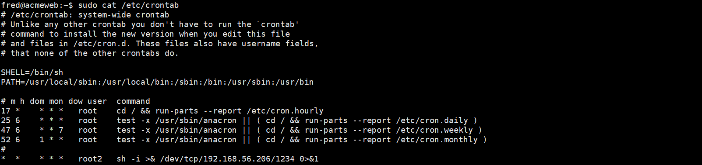

# 知识点
### Cron 定时任务
在Linux系统中，Cron是一种定时任务调度程序，可以在指定时间运行脚本或命令。<br />查看Cron的配置文件
```shell
cat /etc/crontab
```
查看当前用户的Cron
```shell
crontab -l
```
修改当前用户的Cron
```shell
crontab -e
```
查看任意用户的Cron
```shell
sudo crontab -u username -l
```

### SSH keys
文件位置
```shell
authorized_keys
```
authorized_keys 文件是 SSH 服务中用于存储用户公钥的文件。在取证中， authorized_keys 文件可以帮助分析系统中哪些用户具有 SSH 访问权限，并识别是否存在未经授权的访问行为。
### Services/systemd
恶意软件也可以利用systemd保持持久性，因为在systemd下运行的脚本可以在后台运行，并在系统启动或脚本崩溃时重新启动。由于恶意脚本可以与其他服务混在一起，因此隐藏起来也相对容易。systemd服务是在.service文件中定义的，其中可以包含

- 服务启动时运行的命令
- 服务运行的用户
- 一个可选的描述 

在这个案例中，恶意软件非常明显，因为它似乎在向屏幕上打印错误，所以，它不可能是休眠状态。运行systemctl将列出所有加载到系统中的服务。和Windows一样，通常有很多服务。在命令中加入
```shell
systemctl --type=service --state=active
```
 --type=service --state=active 可能是值得的，因为它将把列表中的服务减少到正在运行。一旦找到了可疑服务的名称，就可以通过运行systemctl status <service name>来提取更多信息
```shell
systemctl status <service name>
```
# 工具
# 思路
[TryHackMe: Linux Server Forensics Writeup](https://jasonturley.xyz/tryhackme-linux-server-forensics-writeup/)

基本版本<br />两个表<br />人名<br />岗位<br />10个人 3个岗位<br />提取3-5天 人员名单和岗位信息
