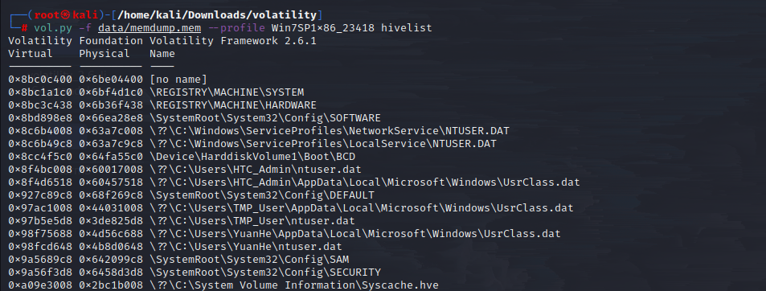
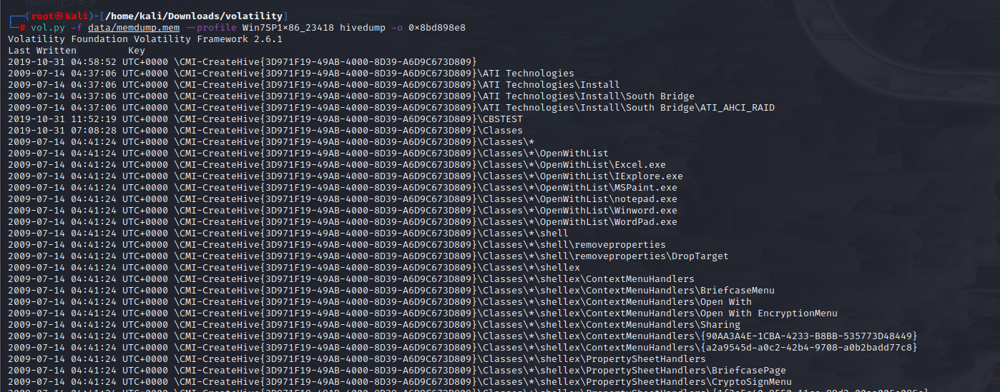
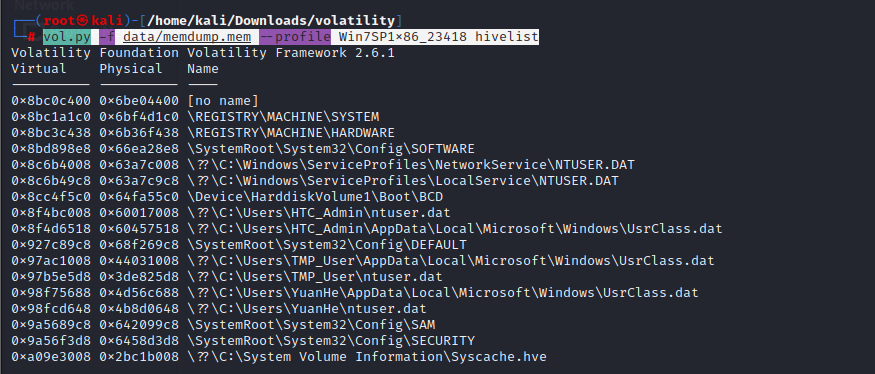
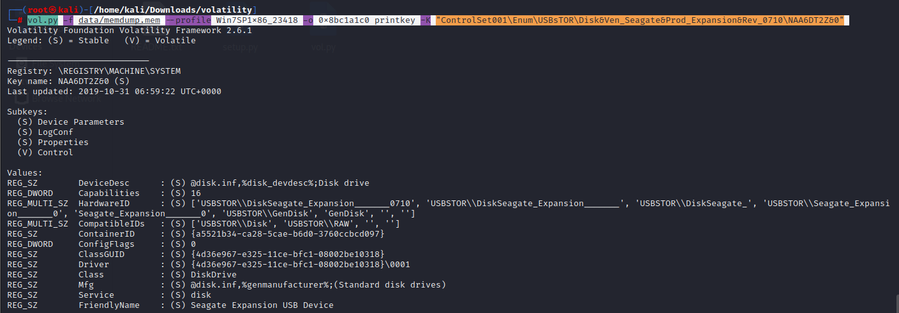
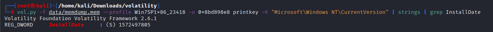
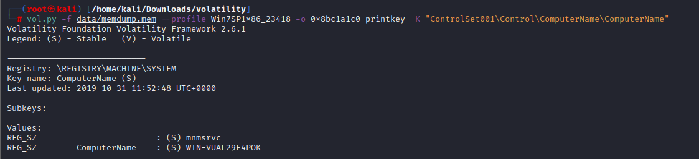
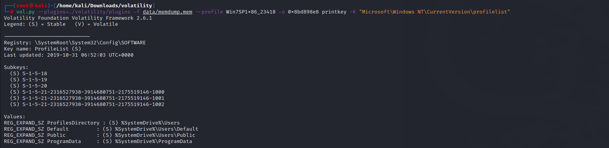
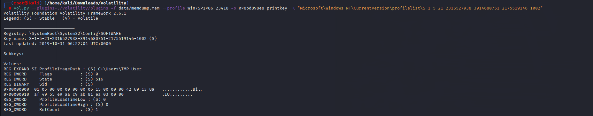
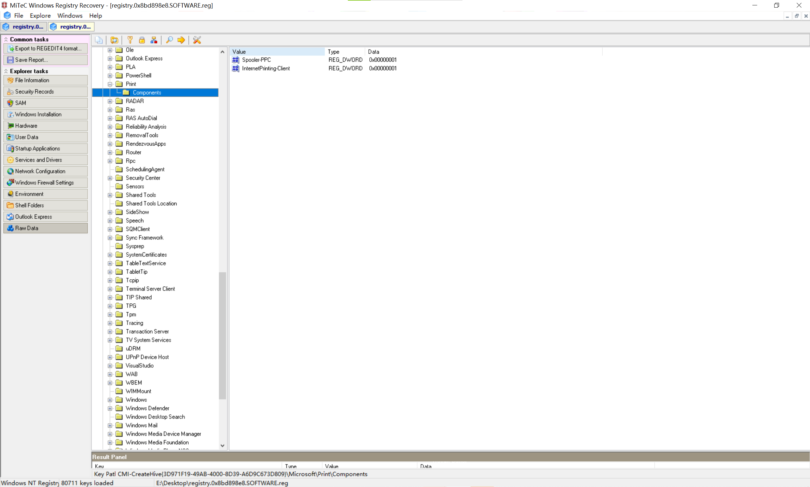

### grep命令不区分大小写
```java
grep -i
```
### Win使用findstr
```java
findstr
```
### 缓存中的注册表的地址
#### hivelist
```java
vol.py -f data/memdump.mem --profile Win7SP1x86_23418 hivelist
```

#### 几个较为重要注册表
##### \SystemRoot\System32\Config\SOFTWARE
对应安装的应用程序
##### \REGISTRY\MACHINE\SYSTEM
操作系统安装信息
##### \??\C:\Users\User\ntuser.dat
用户级信息
##### \SystemRoot\System32\Config\SAM
凭据信息
### 导出注册表文件
**dumpregistry**
```java
vol.py -f data/memdump.mem --profile Win7SP1x86_23418 dumpregistry -o 0x8bc3c438 --dump data/
```

### 详细列出特定注册表
**hivedump**
```java
vol.py -f data/memdump.mem --profile Win7SP1x86_23418 hivedump -o 0x8bd898e8
```

### USB设备
\REGISTRY\MACHINE\SYSTEM
```java
vol.py -f data/memdump.mem --profile Win7SP1x86_23418 hivelist
```
<br />ControlSet001\Enum\USBSTOR
```java
vol.py -f data/memdump.mem --profile Win7SP1x86_23418 -o 0x8bc1a1c0 printkey -K "ControlSet001\Enum\USBsTOR\Disk&Ven_Seagate&Prod_Expansion&Rev_0710\NAA6DT2Z&0"

```

##### 时间戳
[名称＼&属性路径＼&Last Arrival Date＼&{83da6326-97a6-4088-9453-a1923f573b29}＼0066＼&Last Removal Date＼&{83da6326-97a6-4088-9453-a1923f573b29}＼0067＼&Firmware Date＼&{540b947e-8b40-45bc-a8a26a0b894cbda2}＼0011＼&]<br />[名称＼&属性路径＼&Driver Assembly Date＼&{a8b865dd-2e3d-4094-ad97-e593a70c75d6}＼0002＼&Install Date＼&{83da6326-97a6-4088-9453-a1923f573b29}＼0064＼&First Install Date＼&{83da6326-97a6-4088-9453-a1923f573b29}＼0065＼&]
### **安装Windows时间**
SystemRoot\System32\Config\SOFTWARE<br />Microsoft\Windows NT\CurrentVersion   <br />InstallDate
```java
vol.py -f data/memdump.mem --profile Win7SP1x86_23418 -o 0x8bd898e8 printkey -K "Microsoft\Windows NT\CurrentVersion" | strings | grep InstallDate
```

### 计算机名称
HKEY_LOCAL_MACHINE\System\ControlSet001\Control\ComputerName\ComputerName
```java
vol.py -f data/memdump.mem --profile Win7SP1x86_23418 -o 0x8bc1a1c0 printkey -K "ControlSet001\Control\ComputerName\ComputerName" | strings | grep -i ComputerName
```

### 用户名以及SID
SID HKEY_LOCAL_MACHINE\SOFTWARE\Microsoft\Windows NT\CurrentVersion\ProfileList<br />用户名  HKEY_LOCAL_MACHINE\SOFTWARE\Microsoft\Windows NT\CurrentVersion\ProfileList\SID
```java
vol.py --plugins=./volatility/plugins -f data/memdump.mem --profile Win7SP1x86_23418 -o 0x8bd898e8 printkey -K "Microsoft\Windows NT\CurrentVersion\profilelist"
```

```java
vol.py --plugins=./volatility/plugins -f data/memdump.mem --profile Win7SP1x86_23418 -o 0x8bd898e8 printkey -K "Microsoft\Windows NT\CurrentVersion\profilelist\S-1-5-21-2316527938-3914680751-2175519146-1002"
```

### 打印机
SOFTWARE\Microsoft\Print\Components
##### 打印驱动
HKEY_LOCAL_MACHINE/SYSTEM/CurrentControlSet/Control/Print/Environments/Windows NT x86/Drivers
##### 打印处理器
HKEY_LOCAL_MACHINE/SYSTEM/CurrentControlSet/Control/Print/Environments/Windows NT x86/Print Processors
##### 打印机
HKEY_LOCAL_MACHINE/SYSTEM/CurrentControlSet/Control/Print/Printers<br />
### 默认浏览器
[HKEY_CURRENT_USER\Software\Microsoft\Windows\Shell\Associations\UrlAssociations\http\UserChoice]<br />将其子键"Progid"设置为在root下创建的"chrome",即可实现点击链接用此浏览器打开。
