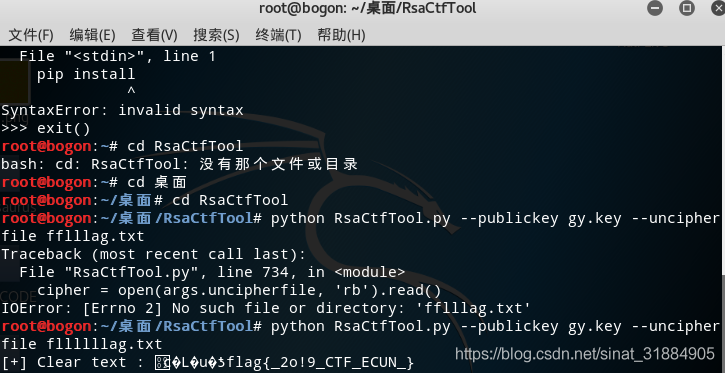
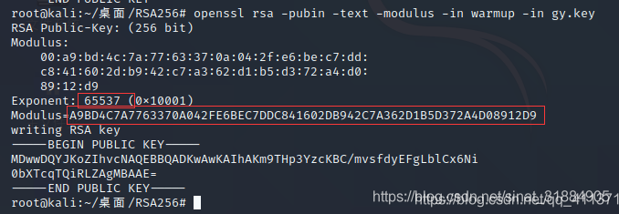
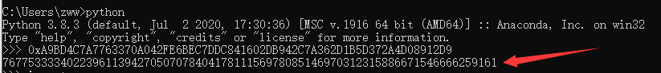
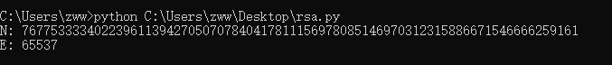
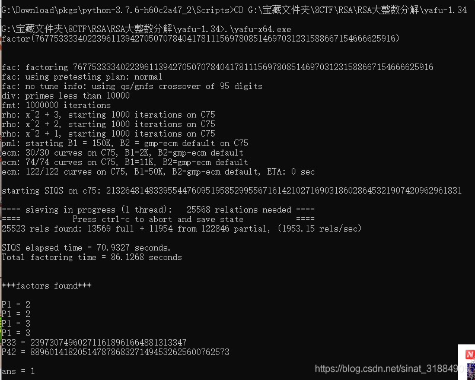

# 方法一：利用RsaCtfTool工具（kali虚拟机中）
已知公钥（自动求私钥）–publickey,密文–uncipherfile<br />命令：python RsaCtfTool.py --publickey 公钥文件 --uncipherfile 加密的文件<br />
## 方法二：利用公钥文件用openssl工具解出e、n，然后python3脚本解出明文
### 1.打开kali虚拟机，用openssl解出e、n(不推荐）
命令：openssl rsa -pubin -text -modulus -in warmup -in gy.key<br /><br />**e为65537，n还比较短，用python先转换成10进制<br />
### 2.用脚本从公钥文件中解出n、e （推荐！！）
```powershell
# -*- coding: cp936 -*-
from Crypto.PublicKey import RSA

#1.从公钥文件中分解n和e
public_key = RSA.importKey(open(r"G:\ctf\CTF题目\8eec4a4af1e14eb08648c8fda7660a0f\8eec4a4af1e14eb08648c8fda7660a0f\RSA256\gy.key",'rb').read())
n = public_key.n
e = public_key.e
print('N:',n)
print('E:',e)
```
运行结果<br />
### 后续 对n进行因数分解
#### 方式1：登录网站http://factordb.com/,解出p和q
#### 方式2：使用yafu工具
(常用于比较大的整数分解)自动整数因式分解，在RSA中，当p、q的取值差异过大或过于相近的时候，使用yafu可以快速的把n值分解出p、q值！<br />用法：<br /><br />到此，已经获取到RSA的全部参数<br />p = 273821108020968288372911424519201044333<br />q = 280385007186315115828483000867559983517<br />n=76775333340223961139427050707840417811156978085146970312315886671546666259161<br />e=65537
```powershell
#coding:utf-8
import gmpy2
import rsa
p = 273821108020968288372911424519201044333
q = 280385007186315115828483000867559983517
n = 76775333340223961139427050707840417811156978085146970312315886671546666259161
e = 65537
d = int(gmpy2.invert(e,(p-1)*(q-1)))
privatekey = rsa.PrivateKey(n,e,d,p,q)
with open("E:\\fllllllag.txt","rb") as f:
    print(rsa.decrypt(f.read(),privatekey).decode())
```
