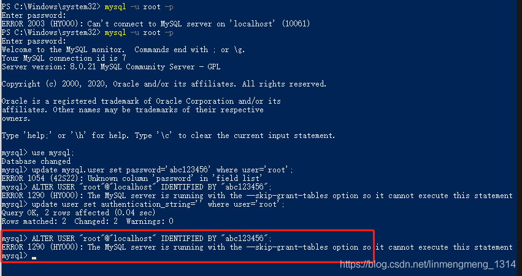

### 以超级管理员打开cmd，关闭mysql服务
win10 直接左下角右键win徽标，选择 Windows PowerShell(管理员)<br />如果没有配置环境变量，则需要切换到mysql的安装目录下，进行关闭mysql服务。<br />输入net stop mysql
### 跳过权限验证登录mysql
输入： mysqld --shared-memory --skip-grant-tables<br />此时命令提示符窗口处于锁定状态，我们重新以管理员权限打开新的命令提示符窗口。<br />
### 在新的窗口中登录mysql
使用命令：mysql -uroot -p，无需输入密码，直接回车即可
### 切换到mysql，将密码置空。
```java
use mysql;
update user set authentication_string='' where user='root';
```
将authentication_string置空。<br />然后刷新权限：flush privileges;
### 设置[加密](https://so.csdn.net/so/search?q=%E5%8A%A0%E5%AF%86&spm=1001.2101.3001.7020)规则并更新新密码，授权
```java
ALTER USER 'root'@'localhost' IDENTIFIED BY 'abc123456' PASSWORD EXPIRE NEVER; 
alter user 'root'@'localhost' identified by 'abc123456';
grant all privileges  on *.*  to "root"@'localhost';
flush privileges;
```
<br /><br /><br />这里强调一下，授权的必要性，因为不是首次安装，所以重置密码之后原来的权限可能会失效了，比如我这里就是，在登陆之后，使用use mysql，提示没有权限。导致后面无法创建用户，和Navicat连接失败也无法修改。
### 设置成功后，重启mysql服务，使用新密码登录
重启服务，也是需要管理员身份运行cmd，否则没权限。<br /><br /><br /><br /><br />
### 异常：
#### Authentication plugin ‘caching_sha2_password’ cannot be loaded
使用Navicat 连接报错：Authentication plugin 'caching_sha2_password' cannot be loaded:<br /><br />加密规则并更新用户密码即可。
```java
ALTER USER 'root'@'localhost' IDENTIFIED BY 'abc123456' PASSWORD EXPIRE NEVER;

ALTER USER 'root'@'localhost' IDENTIFIED WITH mysql_native_password BY 'abc123456';

flush privileges;
————————————————
版权声明：本文为CSDN博主「linmengmeng_1314」的原创文章，遵循CC 4.0 BY-SA版权协议，转载请附上原文出处链接及本声明。
原文链接：https://blog.csdn.net/linmengmeng_1314/article/details/109484951
```

#### The MySQL server is running with the --skip-grant-tables
```java
ERROR 1290 (HY000): The MySQL server is running with the --skip-grant-tables option so it cannot execute this statement
```
如果上面启动的--skip-grant-tables窗口未关闭，然后在下面运行mysql修改命令，则会提示这个。在重置完密码后，就可以关闭了。
