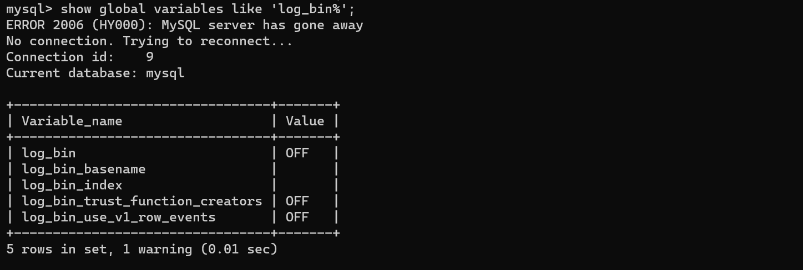
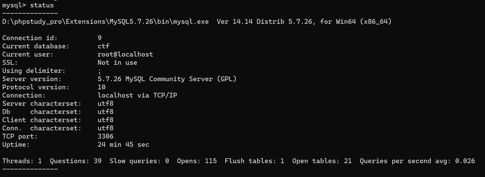
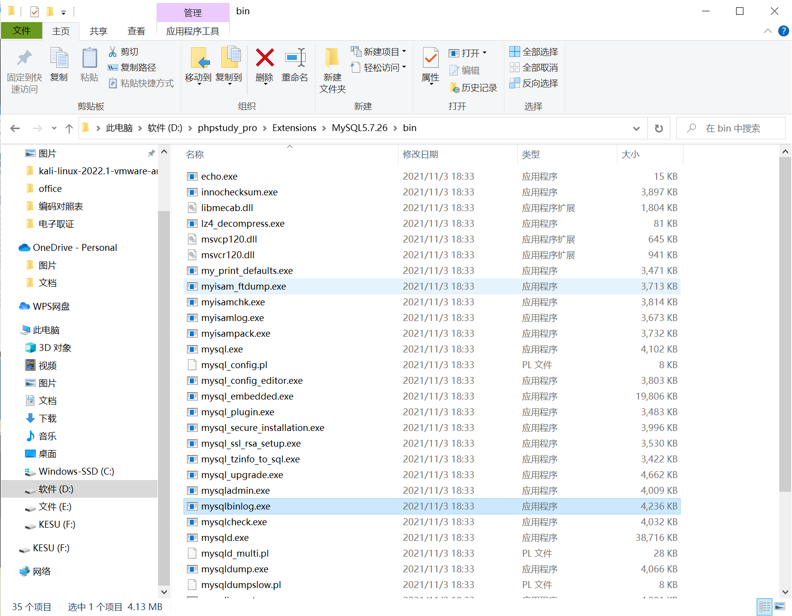

binlog 二进制日志文件
### 查询日志文件是否开启
```java
show global variables like 'log_bin%';
show global variables like 'log%';
```

### 查询当前数据库日志
```java
show binary logs;
show master logs;
```
### 查询数据苦当前状态
```java
status
```

### 解析日志文件
```java
mysqlbinlog.exe [日志文件]
```


除了flag外，还有一份密码表


有可能是172.22.2.16的mssql密码

