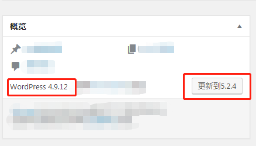
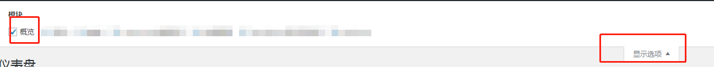
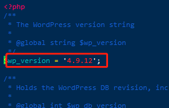
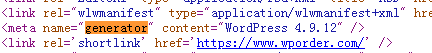

# WordPress版本号
### 后台仪表盘查看
如果您能登录WordPress后台，您就可以方便的查看到WordPress版本号，以及最新的版本。

1. 登录后台，打开 **仪表盘 > 首页**，您就会看到页面概览模块上显示的内容中含有版本号，以及最新版本号，如下图：
2. 如果您打开首页未显示概览，您可以点击页面右上方的显示选项，勾选概览
### 检查version.php文件中的WordPress版本
这是查看您当前WordPress版本的最可靠方法。但是，这也需要最多的时间。

1. 使用ssh或FTP客户端（例如FileZilla）连接到您的服务器
2. 打开**wp-includes**文件夹
3. 查找一个名为**version.php**的文件并打开它。WordPress安装的版本将在第7行（可能会不同，找到wp_version对应的值就行），该行应如下所示：

不用担心 其他人将看不到此文件，因为该信息是用PHP变量编写的，并且不是页面HTML的一部分。这样，在Web浏览器上打开您的站点时，不会显示任何版本详细信息。
### 在浏览器中进行检测
如果您无法登录WordPress仪表板，则可以通过网站的页面源进行查看。通常，使用WordPress创建的网站在HTML元标记中带有版本信息。默认情况下，WordPress主题将此标签插入您的网站。 通过meta标记查找WordPress版本：

1. 在浏览器上打开网站，按下快捷键 CTRL + U 打开网站源代码
2. 打开后按下快捷键 CTRL + F，搜索 **generator**
3. 第一个就是您要找的版本号，如下图：
