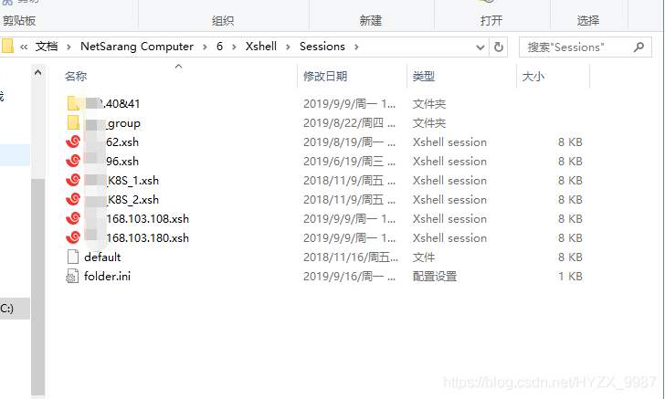

### 简介
Xshell是一个用于ssh连接的软件
### 会话文件
```powershell
C:/Users/<用户名>/Documents/NetSarang Computer/7/Xshell/Sessions
```

### Xshell password解密
[xshell&xftp密码获取 - Yangsir34 - 博客园](https://www.cnblogs.com/Yang34/p/14236254.html)<br />[内网常用工具密码获取1 - one-seven - 博客园](https://www.cnblogs.com/one-seven/p/16083171.html#:~:text=%E5%85%88%E6%89%BE%E5%88%B0xshell%E4%BF%9D%E5%AD%98%E5%AF%86%E7%A0%81%E7%9A%84%E4%BD%8D%E7%BD%AE%EF%BC%8C%E7%82%B9%E6%89%93%E5%BC%80%E4%BC%9A%E8%AF%9D%E6%96%87%E4%BB%B6%E5%A4%B9%20%E5%85%B6%E4%B8%AD.xsh%E9%87%8C%E9%9D%A2%E5%B0%B1%E6%98%AF%E4%BF%9D%E5%AD%98%E7%9A%84%E9%93%BE%E6%8E%A5%E4%BF%A1%E6%81%AF%E5%8C%85%E6%8B%AC%E8%B4%A6%E6%88%B7%E5%AF%86%E7%A0%81%20%E5%89%8D%E6%8F%90%E6%98%AF%E7%99%BB%E5%BD%95%E7%9A%84%E6%97%B6%E5%80%99%E5%BF%85%E9%A1%BB%E5%8B%BE%E9%80%89%E4%BA%86%E8%AE%B0%E4%BD%8F%E8%B4%A6%E6%88%B7%E5%92%8C%E5%AF%86%E7%A0%81%20%E7%A6%BB%E7%BA%BF%E8%A7%A3%E5%AF%86%E5%B7%A5%E5%85%B7%EF%BC%9A%20https%3A%2F%2Fgithub.com%2FHyperSine%2Fhow-does-Xmanager-encrypt-password%20python,XShellCryptoHelper.py%20-d%20-key%20123123%20zVi7hm%2FNsk6y2BGpTNSvXlPRN%2B%2F1P%2BaQ%20123132%E4%B8%BA%E4%B8%BB%E6%8E%A7%E5%AF%86%E7%A0%81%E5%9C%A8%E6%96%87%E4%BB%B6%E5%AF%BC%E5%87%BA%E7%9A%84%E6%97%B6%E5%80%99%E8%AE%BE%E7%BD%AE%20%E5%90%8E%E9%9D%A2%E4%B8%BA.xsh%E6%96%87%E4%BB%B6%E4%B8%AD%E7%9A%84password%E5%AD%97%E6%AE%B5%E7%B1%BB%E5%AE%B9)<br />[工具推荐 | Xshell全版本解密工具（包括Xshell7）——SharpXDecrypt_xshell密码查看密码器下载_小艾搞安全的博客-CSDN博客](https://blog.csdn.net/weixin_48202759/article/details/123090231#:~:text=%E5%9B%A0%E4%B8%BAXshell%E5%AF%86%E7%A0%81%E6%98%AF%E5%9C%A8%E6%9C%AC%E5%9C%B0%E5%8A%A0%E5%AF%86%E5%AD%98%E5%82%A8%E7%9A%84%E3%80%82,%E8%80%8C%E7%BD%91%E4%B8%8A%E4%B9%8B%E5%89%8D%E7%9A%84%E5%B7%A5%E5%85%B7%E4%B8%AD%EF%BC%8C%E5%8F%AA%E8%83%BD%E8%A7%A3%E5%AF%86Xshell5%E5%92%8CXshell6%E7%9A%84%E5%AF%86%E7%A0%81%EF%BC%8C%E5%AF%B9Xshell7%E6%AF%AB%E6%97%A0%E5%8A%9E%E6%B3%95%EF%BC%8C%E4%B8%BA%E4%BA%86%E8%A7%A3%E5%86%B3%E8%BF%99%E4%B8%80%E9%97%AE%E9%A2%98%EF%BC%8C%E6%89%BE%E5%88%B0%E4%BA%86%E8%BF%99%E6%AC%BE%E5%B7%A5%E5%85%B7%E2%80%94%E2%80%94SharpXDecrypt%E3%80%82%20%E5%AE%83%E5%8F%AF%E4%BB%A5%E5%B0%86Xshell%E5%85%A8%E7%89%88%E6%9C%AC%E5%87%AD%E8%AF%81%E4%B8%80%E9%94%AE%E5%AF%BC%E5%87%BA%EF%BC%8C%E9%92%88%E5%AF%B9Xshell%E5%85%A8%E7%89%88%E6%9C%AC%E5%9C%A8%E6%9C%AC%E5%9C%B0%E4%BF%9D%E5%AD%98%E7%9A%84%E5%AF%86%E7%A0%81%E8%BF%9B%E8%A1%8C%E8%A7%A3%E5%AF%86%EF%BC%8C%E5%8C%85%E6%8B%AC%E6%9C%80%E6%96%B0%E7%9A%847%E7%B3%BB%E5%88%97%E7%89%88%E6%9C%AC%EF%BC%81)
