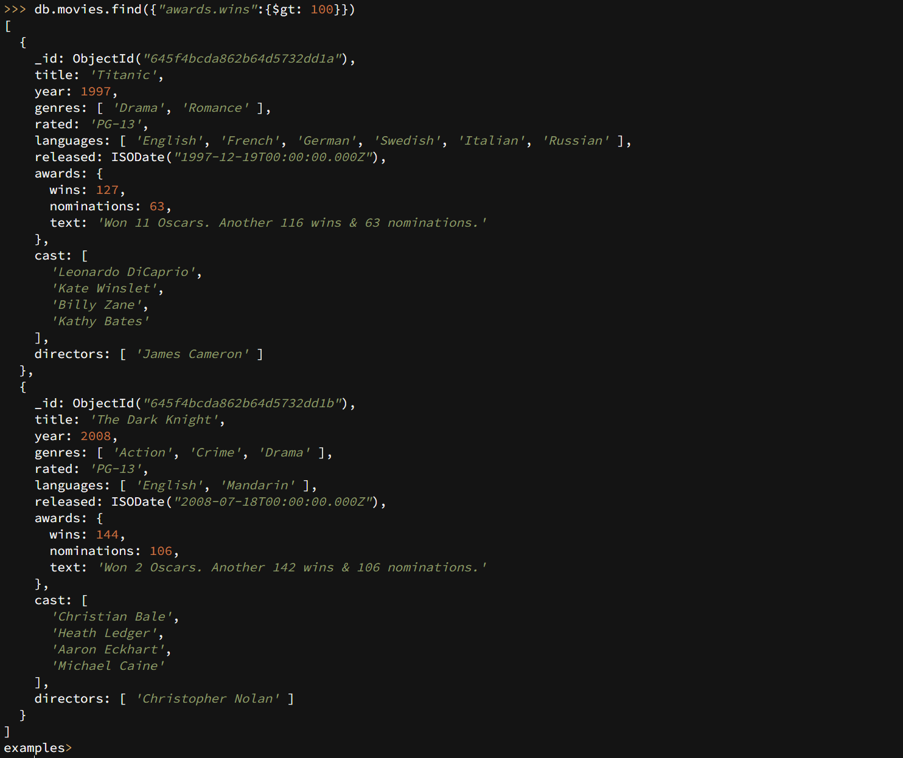

# 文档
[Introduction to MongoDB](https://www.mongodb.com/docs/manual/introduction/)
# 默认文件路径
### 默认数据文件
```powershell
/var/lib/mongodb/
```
### 默认日志文件
```powershell
/var/log/mongodb/mongodb.log
```
### 默认可执行文件
```powershell
/usr/bin/mongo
/usr/bin/mongod
```
### 默认配置文件
```powershell
/etc/mongod.conf 
```
[Configuration File Options](https://www.mongodb.com/docs/manual/reference/configuration-options/)<br />[MongoDB忘记密码、修改密码总结_mongodb修改密码_饮雪煮茶的博客-CSDN博客](https://blog.csdn.net/weixin_41791276/article/details/120198389)<br />[MongoDB忘记密码、修改密码总结_mongodb修改密码_饮雪煮茶的博客-CSDN博客](https://blog.csdn.net/weixin_41791276/article/details/120198389)
# 数据存储
### Document
MongoDB使用document转为存储数据的最小单元，相当于关系型数据库中的row<br />document的形式和JSON对象十分相似，一下是一个具体的例子：<br />
### Collections
一般来说，MongoDB将document存储在collections中，相当于关系型数据库中的tables
# 存储引擎
MongoDB支持多种存储引擎，以下是两种常见的存储引擎：

- [WiredTiger Storage Engine](https://www.mongodb.com/docs/manual/core/wiredtiger/) （默认为该引擎）
- [In-Memory Storage Engine.](https://www.mongodb.com/docs/manual/core/inmemory/)
# DB Shell
### 转换Database
通过db可以查看你当前的database
```powershell
db;
```
<br />通过use <db>来转换database，如果该database没有，则会创建一个新的database<br />例如，我们转换成examples
```powershell
use examples;
```
<br />
### 填充Collection（插入）
接下来的会通过[db.collection.insertMany()](https://www.mongodb.com/docs/manual/reference/method/db.collection.insertMany/#mongodb-method-db.collection.insertMany) 方法来插入新的collections到movies中
```powershell
db.movies.insertMany([
   {
      title: 'Titanic',
      year: 1997,
      genres: [ 'Drama', 'Romance' ],
      rated: 'PG-13',
      languages: [ 'English', 'French', 'German', 'Swedish', 'Italian', 'Russian' ],
      released: ISODate("1997-12-19T00:00:00.000Z"),
      awards: {
         wins: 127,
         nominations: 63,
         text: 'Won 11 Oscars. Another 116 wins & 63 nominations.'
      },
      cast: [ 'Leonardo DiCaprio', 'Kate Winslet', 'Billy Zane', 'Kathy Bates' ],
      directors: [ 'James Cameron' ]
   },
   {
      title: 'The Dark Knight',
      year: 2008,
      genres: [ 'Action', 'Crime', 'Drama' ],
      rated: 'PG-13',
      languages: [ 'English', 'Mandarin' ],
      released: ISODate("2008-07-18T00:00:00.000Z"),
      awards: {
         wins: 144,
         nominations: 106,
         text: 'Won 2 Oscars. Another 142 wins & 106 nominations.'
      },
      cast: [ 'Christian Bale', 'Heath Ledger', 'Aaron Eckhart', 'Michael Caine' ],
      directors: [ 'Christopher Nolan' ]
   },
   {
      title: 'Spirited Away',
      year: 2001,
      genres: [ 'Animation', 'Adventure', 'Family' ],
      rated: 'PG',
      languages: [ 'Japanese' ],
      released: ISODate("2003-03-28T00:00:00.000Z"),
      awards: {
         wins: 52,
         nominations: 22,
         text: 'Won 1 Oscar. Another 51 wins & 22 nominations.'
      },
      cast: [ 'Rumi Hiiragi', 'Miyu Irino', 'Mari Natsuki', 'Takashi Naitè' ],
      directors: [ 'Hayao Miyazaki' ]
   },
   {
      title: 'Casablanca',
      genres: [ 'Drama', 'Romance', 'War' ],
      rated: 'PG',
      cast: [ 'Humphrey Bogart', 'Ingrid Bergman', 'Paul Henreid', 'Claude Rains' ],
      languages: [ 'English', 'French', 'German', 'Italian' ],
      released: ISODate("1943-01-23T00:00:00.000Z"),
      directors: [ 'Michael Curtiz' ],
      awards: {
         wins: 9,
         nominations: 6,
         text: 'Won 3 Oscars. Another 6 wins & 6 nominations.'
      },
      lastupdated: '2015-09-04 00:22:54.600000000',
      year: 1942
   }
])
```
操作后，会返回一个带有acknowledgement的指标和一个包含_id的数组<br />
### 查询
#### 查询所有
为了在collection中获取documents，可以使用[db.collection.find()](https://www.mongodb.com/docs/manual/reference/method/db.collection.find/#mongodb-method-db.collection.find)方法。<br />当要查询movies中所有documents时，可以使用以下命令：
```powershell
db.movies.find({});
```

#### 通过比较符来查询数据
直接指向Christopher Nolan：
```powershell
db.movies.find( { "directors": "Christopher Nolan" } );
```
<br />$lt 小于号，查询2000年以前发行的电影：
```powershell
db.movies.find({"released":{$lt: ISODate("2000-01-01")}});
```
<br />$gt 大于号，查询获得超过100个奖项的电影：
```powershell
db.movies.find({"awards.wins":{$gt: 100}});
```
<br />$in 存在于, 查询支持日语或者普通话的电影：
```powershell
db.movies.find({"languages": {$in: ["Japanese", "Mandarin"]}});
```

:::info
更多比较符请查看 [Query and Projection Operators](https://www.mongodb.com/docs/manual/reference/operator/query/#std-label-query-projection-operators-top)
:::
#### 查询返回指定字段(Projection)
通过[db.collection.find(<query document>, <projection document>)](https://www.mongodb.com/docs/manual/reference/method/db.collection.find/#mongodb-method-db.collection.find)方法可以查询返回指定字段，具体规则如下：

- <field>: 1 to include a field in the returned documents
- <field>: 0 to exclude a field in the returned documents

返回id, title, directors和year：
```powershell
db.movies.find({}, {"title": 1, "directors": 1, "year": 1});
```
<br />_id默认会进行返回。<br />为了不返回_id, 返回title和genres，可以查用如下命令：
```powershell
db.movies.find( { }, { "_id": 0, "title": 1, "genres": 1 } );
```

### 聚合（[$group](https://www.mongodb.com/docs/manual/reference/operator/aggregation/group/#mongodb-pipeline-pipe.-group)）
[通过实例讲清楚：MongoDB九种聚合操作 - 掘金](https://juejin.cn/post/7206302271080415292)
