## MySQL的版本识别
识别MySQL数据库的版本是进行数据库取证的第一步，也是非常关键的一步，因为在进行数据库还原时，如果数据库版本跨度太大，可能会导致我们无法正常恢复目标数据库。例如：MySQL5.7数据库拷贝目录后恢复到MySQL8.0会出现无法读取数据库表的情况。因此，我们在进行数据库还原时，最好的办法就是选用相同版本的数据库，或者是版本跨度不是很大的数据库。例如：MySQL5.6数据库是可以通过拷贝目录恢复到MySQL5.7，反之也可。<br />综上所述，正确识别MySQL数据库版本至关重要，以下整理多种数据库版本识别方法，供读者参考。<br />**1、登录MySQL查看版本**<br />使用mysql -u root -p登录MySQL数据库，登录后会显示数据库版本，如下图所示：<br />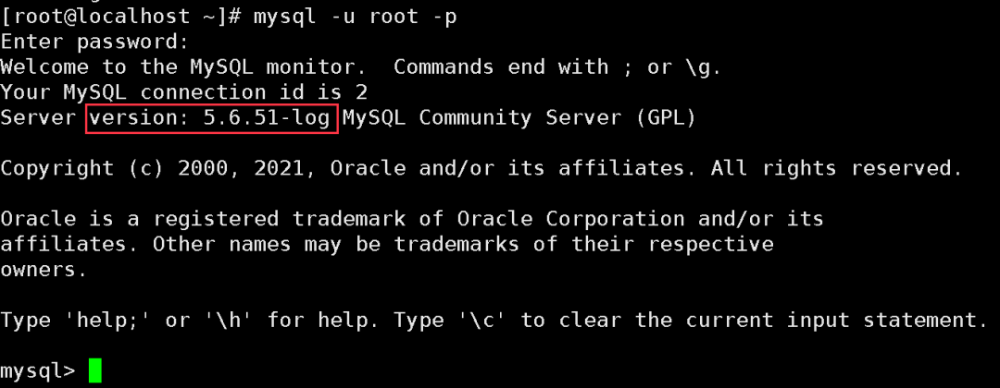<br />**2、使用select version()命令查看**<br />登录MySQL后，使用select  -version()可以查看MySQL数据库版本，如下图所示：<br />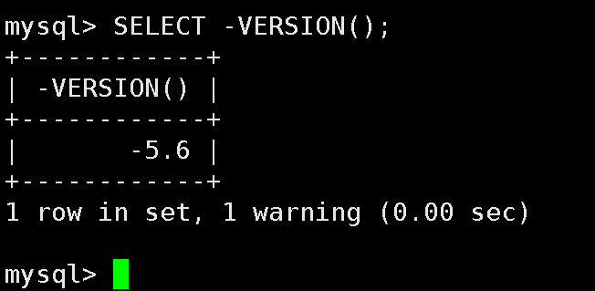<br />**3、使用status命令查看**<br />登录MySQL后，使用status可以查看MySQL数据库版本，如下图所示：<br />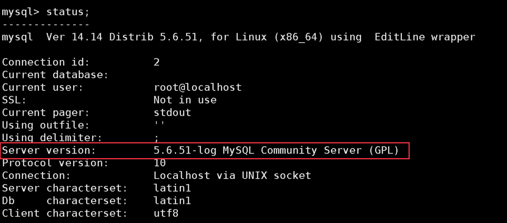<br />**4、使用mysql --help | grep Distrib查看**<br />使用mysql --help | grep Distrib可以查看MySQL数据库版本，如下图所示：<br /><br />**5、使用mysqld –version查看**<br />Linux系统可以使用mysqld --version可以查看MySQL数据库版本，如下图所示：<br /><br />**6、使用navicat连接mysql查看**<br />Navicat连接数据库后，在右侧会显示数据库版本信息，如下图所示：<br />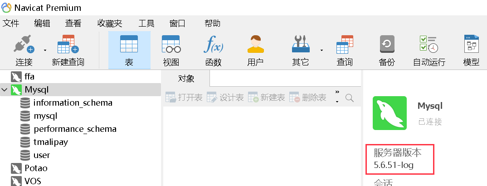<br />**7、三方工具查看**<br />很多网站服务器会安装宝塔面板或是phpstudy，通过登录宝塔面板或是打开phpstudy也可也清楚看到数据库版本，如下图所示：<br />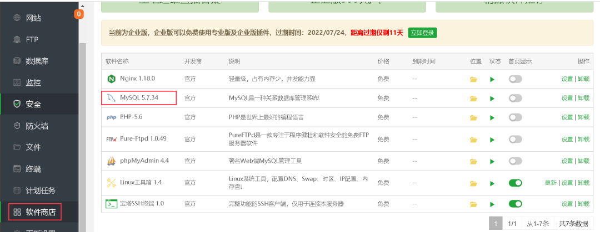<br />**8、底层16进制查看**<br />用winhex打开数据库文件夹下任意后缀为frm的文件，版本偏移量为 34+33 的值，如图所示是5.7.17的版本。<br />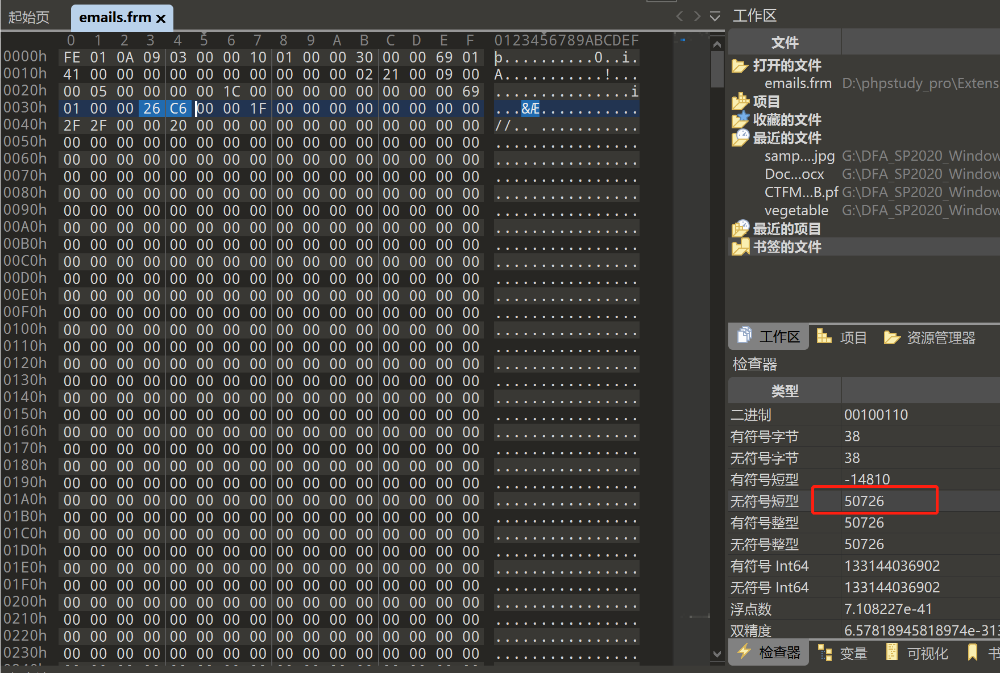
## MySQL配置文件
MySQL数据库的配置文件在Windows系统和Linux系统内各不相同。在Windows系统内一般为my.ini或者my-default.ini，一般存放在MySQL安装路径（C:\ProgramData\MySQL\MySQL Server XXX\Data）。在Linux系统内为my.cnf，一般存放在/etc/目录下，也可以通过搜索文件名来定位数据库配置文件的位置，如：find / -name my.cnf 。
#### MySQL配置文件举例
```sql
[mysqld]
# 设置3306端口
port=3306
# 设置mysql的安装目录
basedir=D:\Program Files\MySQL
# 设置mysql数据库的数据的存放目录
datadir=D:\Users\qiuzhiwen\MySQL\Data
# 允许最大连接数
max_connections=200
# 允许连接失败的次数。这是为了防止有人从该主机试图攻击数据库系统
max_connect_errors=10
# 服务端使用的字符集默认为UTF8
character-set-server=utf8
# 创建新表时将使用的默认存储引擎
default-storage-engine=INNODB
# 默认使用“mysql_native_password”插件认证
default_authentication_plugin=mysql_native_password

[mysql]
# 设置mysql客户端默认字符集
default-character-set=utf8

[client]
# 设置mysql客户端连接服务端时默认使用的端口
port=3306
default-character-set=utf8
```
## MySQL**绕过数据库密码以及修改root密码**
### 绕过数据库密码
1.停止MySQL服务。
```shell
systemctl stop mysqld
```
2.找到MySQL的配置文件所在路径。
```shell
find / -name my.cnf
```
3.修改配置文件。
```shell
vim /文件所在路径/my.cnf
```
4.在配置文件中【mysqld】后面加入语句。
```shell
skip-grant-tables
```
5.开启MySQL服务。
```shell
systemctl start mysqld
```
6.免密登录数据库。
```shell
mysql -u root -p（此处按两次回车即可进入）
```
进入数据库后，需要对连接访问权限进行修改，并对root用户重置密码。<br />1.进入MySQL数据库的user表中查看当前root用户信息。
```sql
use mysql;（此处分号需要一起输入）
```
```sql
select user,authentication_string,host, from user;
```
2.可以看到host字段中root用户的权限是localhost，代表着仅能本地访问。为了让所有主机可以登录，对host字段进行修改。
```sql
update user set host ='%' where user ='root';
```
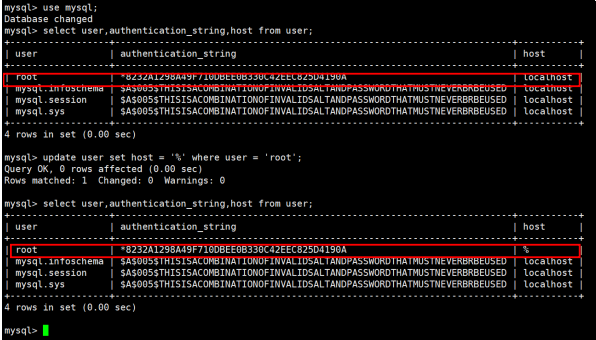<br />3.当前root用户的authentication_string中有内容，则将内容设置为空。
```sql
update user set authentication_string='' where user='root';
```
4.退出MySQL并停止MySQL服务。
```sql
systemctl stop mysqld
```
5.删除 /文件所在路径/my.cnf中的skip-grant-tables，重启MySQL服务。
```sql
systemctl restart mysqld
```
6.使用root重新登录，由于authentication_string为空，则可以免密登录。
```sql
mysql -u root -p（此处需要按两次回车即可进入）
```
### 修改root密码
方式一：
```sql
ALTER USER 'root'@'%' IDENTIFIED WITH mysql_native_password BY '123456';
```
方式二：
```sql
use mybase; （这里的mybase是数据库名）
```
5.7.1以下版本
```sql
update user set password=password('123456') where user='root';
```
5.7.1以上版本
```sql
update user set authentication_string=password('123456') where user='root';
```
## MySQL的数据库的删除恢复
### 在开启binlog日志下恢复删除的数据库
[MySQL数据库删除恢复](https://mp.weixin.qq.com/s?__biz=Mzg3MjE1NjQ0NA==&mid=2247492039&idx=1&sn=533a20f7e007a98b62be7fe1c1a16b72&chksm=cef13db4f986b4a278aada8649d162e11d99c27738d0facb96c35f50ece516546e53c01c8033&scene=178&cur_album_id=1895955433656254465#rd)
#### 测试环境准备
1、Windows10操作系统主机<br />2、MySQL数据库（5.7.26）
#### 新建数据库test10
1、使用create命令创建数据库，create database test10;<br />2、使用数据库管理工具创建数据库，本文使用Navicat Premium进行数据库创建，如下图所示：<br />
#### 新建数据库表
在test10数据库中添加，设计test表，并添加数据。<br />表设计有2个字段，测试数据为1和22.<br /><br />
#### 删除test10数据库
1、使用drop命令删除test10数据库。<br />2、使用数据库管理工具，删除test10数据库。如下图所示：<br />
#### 恢复删除数据库
1、查看binlog日志状态，“Value"为"ON”表示已开启。
```sql
show variables like 'log_bin';
```
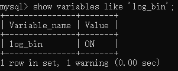<br />2、找到当前mysql记录的binlog文件。
```sql
show master status;
```
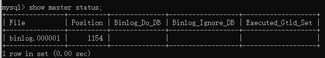<br />3、查看binlog日志，定位原因。
```sql
show binlog events in 'binlog.000001';
```
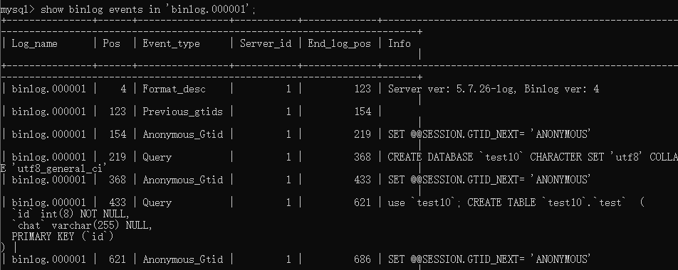<br />4、导出binlog日志文件为sql语句。由于binlog文件为二进制文件，使用文本编辑工具打开后无法正常阅读。<br />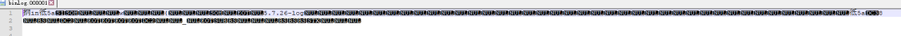<br />将binlog文件导出为001bin.sql文件。
```shell
mysqlbinlog --no-defaults binlog.000001 >001bin.sql
```
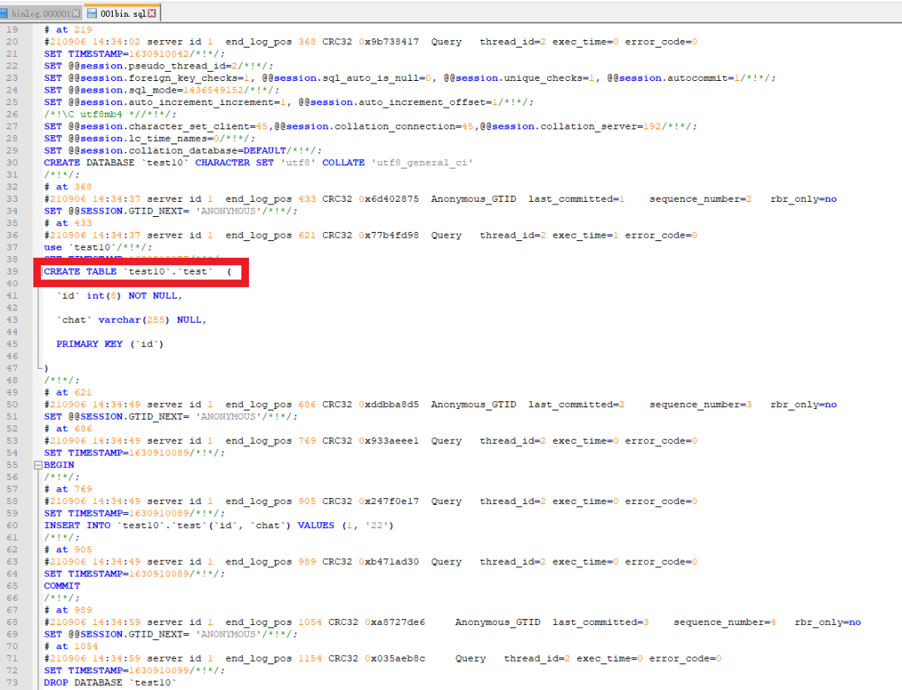<br />从此文件中可以看出创建数据库、创建表、设计表、添加表数据，删除数据的所有SQL语句。接下来的工作可以使用此创建数据库和数据库表部分的语句，插入表内容的语句进行数据库恢复工作。<br />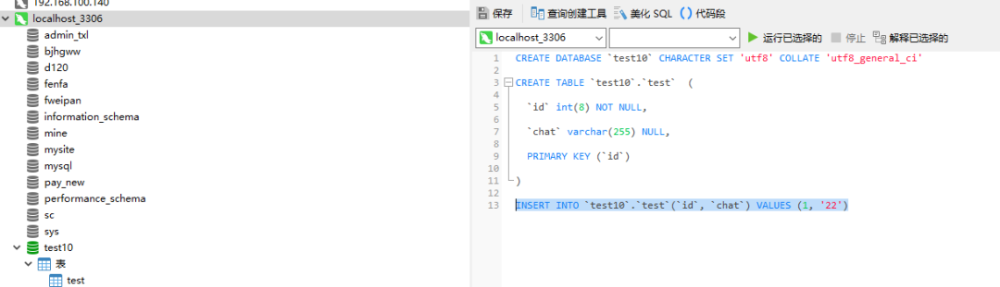

<br />至此，删除的数据库已经成功恢复出来。由于某些原因未开启binlog日志的删除数据库可以使用Percona Data Recovery Tool for InnoDB工具进行恢复，但是恢复效果有限。
### 通过.frm 和.ibd 批量恢复mysql数据
[通过.frm 和.ibd 批量恢复mysql数据_frm ibd 恢复数据_v2ish1yan的博客-CSDN博客](https://blog.csdn.net/weixin_52585514/article/details/127238728)<br />前置<br />首先，只有InnoDB引擎的数据库才需要这样恢复，myisam不需要这么麻烦，只要数据文件存在直接复制过去就可以。<br />其次，mysql数据库必须是按表存放数据的，默认不是，但是大家生产肯定是按分表设置的吧，如果不是，则无法这样恢复数据。mysql.ini的设置为 innodb_file_per_table = 1。<br />.frm文件是mysql表结构定义文件，使用mysql-utilities中的mysqlfrm来将其转换成mysql的create语句，来重建表结构<br />.ibd文件存了每个表的元数据，包括表结构的定义等。就知道是用这个来恢复数据就行<br />工具<br />mysql-utilities [https://downloads.mysql.com/archives/utilities/](https://downloads.mysql.com/archives/utilities/)<br />恢复过程<br />建数据库<br />以一道网站重构题为例<br />题目给了网站源码和mysql的数据库文件<br />首先找到网站源码里对数据库连接的config文件，将其参数改为我们自己建立的数据库。<br />我们要按照它的db.opt来创建对应的数据库<br />default-character-set=utf8mb4<br />default-collation=utf8mb4_general_ci<br />1<br />2<br />数据库名：quzhen<br />用户:quzhen<br />密码:quzhen<br />注意：用phpstudy创建数据库要用innodb引擎<br />建表<br />先将.frm文件的文件名提取出来，他们的文件名对应着一个数据表<br />dir /b /t >frmname.txt<br />1<br />dir命令[https://blog.csdn.net/weixin_41905135/article/details/124881754](https://blog.csdn.net/weixin_41905135/article/details/124881754)<br />然后利用notepad++的功能将.frm文件剪切出来，然后再去掉后缀<br />就可以得到.frm的文件名了<br />将其处理成命令行的格式<br />–server=用户名：密码<br />所以root：root要按照自己的情况修改<br />mysqlfrm --server=root:root@localhost:3306 文件路径\文件名.frm > 文件路径\sql\文件名.sql --diagnostic --port=3307<br />1<br />前面是源文件，后面是目标文件<br />利用正则匹配来处理<br />mysqlfrm --server=root:root@localhost:3306 文件路径\\\1.frm > 文件路径\\sql\\\1.sql --diagnostic --port=3307<br />1<br />然后复制源文件所在的路径和目标路径<br />将其替换到上面<br />源文件路径：C:\Users\39473\Desktop\Desktop\ypzxw<br />目的路径：D:\phpstudy_pro\Extensions\MySQL5.7.26\data\quzhen<br />然后在mysqlfrm所在的目录打开命令行,复制粘贴上面的命令到命令行执行，在sql文件夹得到.sql文件（sql文件夹要先创建好)<br />打开后就都是create语句<br />用命令<br />copy *.sql 1.sql<br />1<br />将所有的sql语句复制到一个sql文件里<br />然后去掉warning:xxx<br />在行尾加上<br /> ROW_FORMAT=COMPACT;<br />1<br />来设置其行格式（原因不用深究）<br />然后利用这些语句来建表<br />主要要修改一下<br />CREATE TABLE `ypzxw`.`m_entries_cache`<br />1<br />为<br />CREATE TABLE `自己的数据库名`.`m_entries_cache`<br />1<br />因为是mysqlfrm工具根据上面的源文件路径来自动生成的<br />表结构就建好了<br />恢复数据<br />使用命令<br />alter table `表名` discard tablespace;<br />1<br />删除刚刚通过建表语句生成的.ibd文件<br />用notepad来处理<br />执行命令，可以看见idb文件已经没了<br />然后将要恢复的数据库的.ibd文件复制到新建数据库的目录下<br />phpstudy_pro的一般路径为<br />可以使用<br />xcopy *.ibd C:\Users\39473\Desktop\Desktop\ypzxw\ibd<br />1<br />来讲.ibd文件都复制到目标文件夹（只能是绝对路径）<br />复制.ibd文件到数据库目录后<br />执行命令<br />alter table `表名` import tablespace;<br />1<br />来导入表空间文件（.ibd)<br />还是用notepad处理<br />然后执行命令<br />数据就恢复了
## [Mysql备份命令Mysqldump导入、导出](https://www.cnblogs.com/builderman/p/15835602.html)
[Mysql备份命令Mysqldump导入、导出以及压缩成zip、gz格式 - builderman - 博客园](https://www.cnblogs.com/builderman/p/15835602.html)
## [Mysql](https://www.cnblogs.com/builderman/p/15835602.html)日志
对MySQL中的6种日志文件，以及配置做简单的记录。
### 二进制日志（binlog）

- 记录所有引起数据变化的操作，用于备份和还原，使用主从复制时也需要开启binlog
- 默认存放在datadir目录下，在刷新和重启数据库是会滚动二进制文件，产生新的binlog；
```shell
[mysql@localhost mysql]$  vi /etc/my.cnf
```
修改[mysqld]下的配置
```shell
#以下为 my.cnf 部分配置
[mysqld]
basedir=/home/mysql/mysql-5.7/
datadir=/home/mysql/mysql-5.7/data/
#序列号
server_id=1
#不指定log文件，默认mysqld-bin.00000* 作为文件名称；
log-bin=mysql-bin
#基于SQL语句的复制(statement-based replication, SBR)，基于行的复制(row-based replication, RBR)，混合模式复制(mixed-based replication, MBR)
binlog_format=Row
#binlog每个日志文件大小
max-binlog-size = 500M
#设置binlog清理时间
expire_logs_days = 7
#binlog缓存大小
binlog_cache_size = 4m
#最大binlog缓存大小
max_binlog_cache_size = 512m
```
登录MySQL查看相关参数
```shell
mysql> show variables like '%log_bin%';
+---------------------------------+--------------------------------------------+
| Variable_name                   | Value                                      |
+---------------------------------+--------------------------------------------+
| log_bin                         | ON                                         |
| log_bin_basename                | /home/mysql/mysql-5.7/data/mysql-bin       |
| log_bin_index                   | /home/mysql/mysql-5.7/data/mysql-bin.index |
| log_bin_trust_function_creators | OFF                                        |
| log_bin_use_v1_row_events       | OFF                                        |
| sql_log_bin                     | ON                                         |
+---------------------------------+--------------------------------------------+
6 rows in set (0.00 sec)

mysql> show variables like '%binlog%';
+--------------------------------------------+----------------------+
| Variable_name                              | Value                |
+--------------------------------------------+----------------------+
| binlog_cache_size                          | 4194304              |
| binlog_checksum                            | CRC32                |
| binlog_direct_non_transactional_updates    | OFF                  |
| binlog_error_action                        | ABORT_SERVER         |
| binlog_format                              | ROW                  |
| binlog_group_commit_sync_delay             | 0                    |
| binlog_group_commit_sync_no_delay_count    | 0                    |
| binlog_gtid_simple_recovery                | ON                   |
| binlog_max_flush_queue_time                | 0                    |
| binlog_order_commits                       | ON                   |
| binlog_row_image                           | FULL                 |
| binlog_rows_query_log_events               | OFF                  |
| binlog_stmt_cache_size                     | 32768                |
| binlog_transaction_dependency_history_size | 25000                |
| binlog_transaction_dependency_tracking     | COMMIT_ORDER         |
| innodb_api_enable_binlog                   | OFF                  |
| innodb_locks_unsafe_for_binlog             | OFF                  |
| log_statements_unsafe_for_binlog           | ON                   |
| max_binlog_cache_size                      | 536870912            |
| max_binlog_size                            | 524288000            |
| max_binlog_stmt_cache_size                 | 18446744073709547520 |
| sync_binlog                                | 1                    |
+--------------------------------------------+----------------------+
22 rows in set (0.00 sec)
```
### 事务日志（redo log / undo log ）

- innodb的事务日志包括redo log重做日志，提供前滚操作，undo log回滚日志，提供回滚操作；
- 保证事务一致性；其中innodb_flush_log_at_trx_commit的配置可控制commit是否刷新log buffer是否刷新到磁盘

当设置为1的时候，事务每次提交都会将log buffer中的日志写入os buffer并调用fsync()刷到log file on disk中。这种方式即使系统崩溃也不会丢失任何数据，但是因为每次提交都写入磁盘，IO的性能较差。 当设置为0的时候，事务提交时不会将log buffer中日志写入到os buffer，而是每秒写入os buffer并调用fsync()写入到log file on disk中。也就是说设置为0时是(大约)每秒刷新写入到磁盘中的，当系统崩溃，会丢失1秒钟的数据。 当设置为2的时候，每次提交都仅写入到os buffer，然后是每秒调用fsync()将os buffer中的日志写入到log file on disk。
```shell
mysql> show variables like '%innodb%log%';
+----------------------------------+------------+
| Variable_name                    | Value      |
+----------------------------------+------------+
| innodb_api_enable_binlog         | OFF        |
| innodb_flush_log_at_timeout      | 1          |
| innodb_flush_log_at_trx_commit   | 1          |
| innodb_locks_unsafe_for_binlog   | OFF        |
| innodb_log_buffer_size           | 33554432   |
| innodb_log_checksums             | ON         |
| innodb_log_compressed_pages      | ON         |
| innodb_log_file_size             | 134217728  |
| innodb_log_files_in_group        | 2          |
| innodb_log_group_home_dir        | ./         |
| innodb_log_write_ahead_size      | 8192       |
| innodb_max_undo_log_size         | 1073741824 |
| innodb_online_alter_log_max_size | 134217728  |
| innodb_undo_log_truncate         | OFF        |
| innodb_undo_logs                 | 128        |
+----------------------------------+------------+
15 rows in set (0.00 sec)
```
### 中继日志（relay-log）

- 从服务器I/O线程将主服务器的二进制日志读取过来记录到从服务器本地文件；
- SQL线程读取relay-log日志的内容并应用到从服务器，从而使从服务器和主服务器的数据保持一致；
```shell
mysql> show variables like '%relay_log%';
+---------------------------+------------------------------------------------------+
| Variable_name             | Value                                                |
+---------------------------+------------------------------------------------------+
| max_relay_log_size        | 0                                                    |
| relay_log                 |                                                      |
| relay_log_basename        | /home/mysql/mysql-5.7/data/localhost-relay-bin       |
| relay_log_index           | /home/mysql/mysql-5.7/data/localhost-relay-bin.index |
| relay_log_info_file       | relay-log.info                                       |
| relay_log_info_repository | FILE                                                 |
| relay_log_purge           | ON                                                   |
| relay_log_recovery        | OFF                                                  |
| relay_log_space_limit     | 0                                                    |
| sync_relay_log            | 10000                                                |
| sync_relay_log_info       | 10000                                                |
+---------------------------+------------------------------------------------------+
11 rows in set (0.00 sec)
```
### 错误日志（mysql_error）

- MySQL服务启动和关闭过程中的信息以及其它运行中的错误和警告信息
- log_error_verbosity：1 错误信息；2 错误信息、告警信息； 3：错误信息、告警信息、通知信息； 修改[mysqld]下的配置
```shell
#以下为 my.cnf 部分配置
[mysqld]
#错误日志目录配置
log-error=/home/mysql/mysql-5.7/logs/mysql_error.log
```
```shell
mysql> show variables like 'log_error%';
+---------------------+--------------------------------------------+
| Variable_name       | Value                                      |
+---------------------+--------------------------------------------+
| log_error           | /home/mysql/mysql-5.7/logs/mysql_error.log |
| log_error_verbosity | 3                                          |
+---------------------+--------------------------------------------+
2 rows in set (0.00 sec)
```
### 一般日志（general_log）

- 记录SQL操作的 DDL / DML 日志，记录信息非常简单，但包括完整的SQL语句；
- 开启general_log会产生非常庞大的日质量，一般不建议开启；
```shell
#以下为 my.cnf 部分配置
[mysqld]
#一般日志开启 默认关闭
general_log=on
#一般日志文件路径
general_log_file=/tmp/mariadb_general_log.log
```
```shell
mysql> show variables like '%general%';
+------------------+------------------------------+
| Variable_name    | Value                        |
+------------------+------------------------------+
| general_log      | ON                           |
| general_log_file | /tmp/mariadb_general_log.log |
+------------------+------------------------------+
2 rows in set (0.00 sec)
```
### 慢查询日志（slow_query_log）

- 记录所有执行超过long_query_time设置的SQL语句；
- 可以通过slow_query_log分析出系统中SQL语句的存在的问题，方便我们进行优化；
```shell
#以下为 my.cnf 部分配置
[mysqld]
#慢查询SQL时间设置(秒)
long_query_time=1
#开启慢查询SQL日志 默认 OFF
slow-query-log=ON
#慢查询日志文件路径
slow-query-log-file=/home/mysql/mysql-5.7/logs/mysql-slow.log
```
```shell
mysql> show variables like '%slow_query_log%';
+---------------------+-------------------------------------------+
| Variable_name       | Value                                     |
+---------------------+-------------------------------------------+
| slow_query_log      | ON                                        |
| slow_query_log_file | /home/mysql/mysql-5.7/logs/mysql-slow.log |
+---------------------+-------------------------------------------+
2 rows in set (0.01 sec)
```
## 
