### 宝塔面板手册
[序言 · 宝塔面板手册 · 看云](https://www.kancloud.cn/chudong/bt2017/424204)
### 宝塔Linux面板命令大全[宝塔linux面板命令大全 - 宝塔面板.pdf](https://www.yuque.com/attachments/yuque/0/2023/pdf/25358086/1685026457368-519644bd-95f8-4d15-a6c9-bcba70883ea0.pdf?_lake_card=%7B%22src%22%3A%22https%3A%2F%2Fwww.yuque.com%2Fattachments%2Fyuque%2F0%2F2023%2Fpdf%2F25358086%2F1685026457368-519644bd-95f8-4d15-a6c9-bcba70883ea0.pdf%22%2C%22name%22%3A%22%E5%AE%9D%E5%A1%94linux%E9%9D%A2%E6%9D%BF%E5%91%BD%E4%BB%A4%E5%A4%A7%E5%85%A8%20-%20%E5%AE%9D%E5%A1%94%E9%9D%A2%E6%9D%BF.pdf%22%2C%22size%22%3A393589%2C%22ext%22%3A%22pdf%22%2C%22source%22%3A%22%22%2C%22status%22%3A%22done%22%2C%22download%22%3Atrue%2C%22taskId%22%3A%22u51163be8-7312-432e-a135-9e91a066800%22%2C%22taskType%22%3A%22upload%22%2C%22type%22%3A%22application%2Fpdf%22%2C%22__spacing%22%3A%22both%22%2C%22id%22%3A%22ue2a01fbd%22%2C%22margin%22%3A%7B%22top%22%3Atrue%2C%22bottom%22%3Atrue%7D%2C%22card%22%3A%22file%22%7D)
[宝塔linux面板命令大全 - 宝塔面板](https://www.bt.cn/btcode.html)
### 宝塔Linux API文档
通过宝塔API，可以完全控制宝塔Linux面板的所有功能，包括第三方插件应用功能，事实上，在用户登录面板后使用的所有功能也是通过相同的接口对接的，这意味着，如果你熟悉使用浏览器调试器，就可以轻松对照宝塔Linux面板的操作参数完成一个第三方的前端对接。<br />[https://www.bt.cn/api-doc.pdf](https://www.bt.cn/api-doc.pdf)
### 宝塔面板取证
[宝塔面板取证](https://mp.weixin.qq.com/s/YUmk2UPzbQqAJbQJQ8wepQ)<br />**宝塔面板是什么？**<br />宝塔Linux面板是提升运维效率的服务器管理软件，支持一键LAMP/LNMP/集群/监控/网站/FTP/数据库/JAVA等100多项服务器管理功能。例如:创建管理网站，轻松简单完成各种配置; 一键创建数据库，一键设置备份还原；方便高效的文件管理器，支持上传、下载、打包、解压以及文件编辑查看等。由此可见，宝塔面板一键管理服务器操作简单便捷，使得一些涉案服务器也使用宝塔面板进行管理。<br />**一. 宝塔面板目录结构**<br />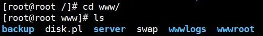<br />1. Backup目录是宝塔面板的备份文件目录，保存数据库备份、站点备份。<br />2. Server目录是宝塔面板的服务目录。<br />3. wwwlogs目录是站点日志目录，保存网站的访问日志及错误日志。<br />4. wwwroot目录是站点根目录，网站源码存放在目录下。

**二、如何发现宝塔服务器是否使用了宝塔服务**<br />1. 当获取到服务器的真实IP地址后，在浏览器输入服务器IP地址，会出现报错页面。如下图所示：<br />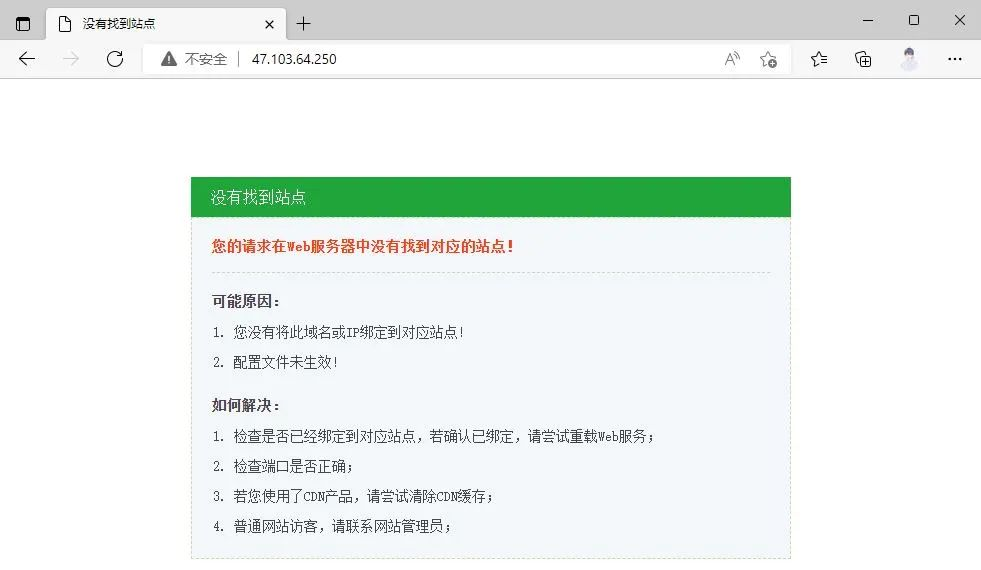<br />2. 在服务器IP地址后加上宝塔面板的默认端口8888，当出现如下图所示时，说明此服务器使用了宝塔服务。注：如端口被修改，可通过简单的端口扫描来发现服务器开放了哪些端口，在通过IP地址加上可疑的端口进行测试来确定是否使用了宝塔服务。<br />

**三、宝塔面板各种安全限制的解决方法**<br />**1. BasicAuth认证**<br />宝塔服务开启BasicAuth认证时，需要输入用户名和密码，如下图。<br />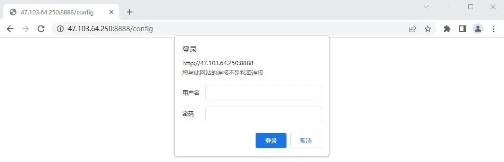<br />方法一：用户名和密码保存在/www/server/panel/config/basic_auth.json 文件中,用户名和密码加密方式为MD5。<br />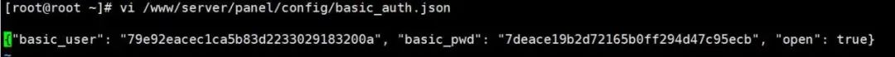<br />方法二：可以使用bt 23将BasicAuth认证关闭。<br />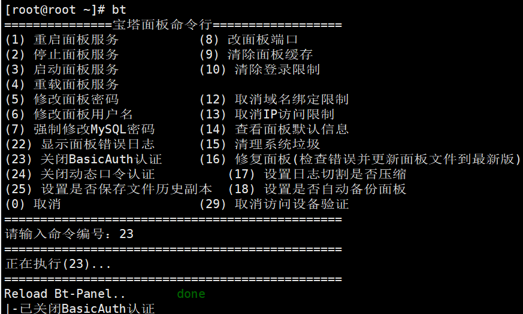<br />**2.IP访问限制**<br />设置的白名单IP保存在/www/server/panel/data/limitip.conf 文件中。<br />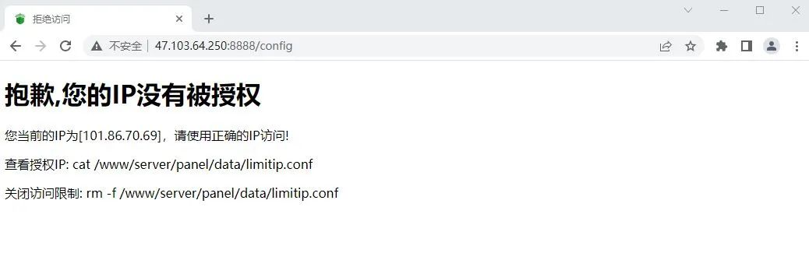<br />方法一：删除limitip.conf文件，命令：rm -rf  /www/server/panel/data/limitip.conf 。<br />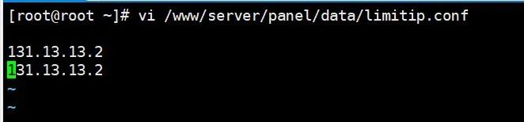<br />方法二：可以使用bt 13取消ip访问限制。<br />**3.安全入口限制**<br />设置的8位字符的安全入口保存在/www/server/panel/data/admin_path.pl 文件中。<br />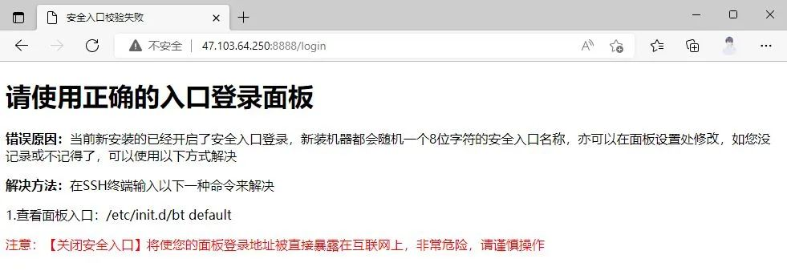<br />方法一：删除admin_path.pl文件，命令：rm -rf /www/server/panel/data/admin_path.pl 。<br />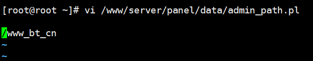<br />方法二：bt 14查看 或者 bt 11删除安全入口。<br />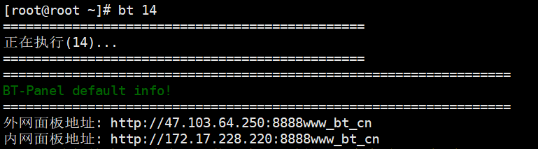<br />**4.面板操作日志被清空或default.db的logs表被篡改或者删除宝塔的web请求日志记录在 /www/server/panel/logs/request，可以查看日志进行分析。**<br />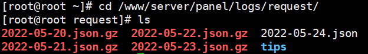<br />**5.查看完整的宝塔账号**<br />宝塔面板管理界面绑定宝塔账号是看到的是不完整的。<br /><br />绑定的账号会记录在www/server/panel/data/userInfo.json 查看即可。<br />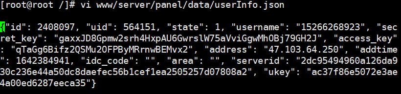

**四、宝塔面板数据**<br />1.当我们登录到宝塔面板界面，首先要关注网站和数据库数据。可以通过网站和数据库来了解服务器的部署情况和备份数据。<br />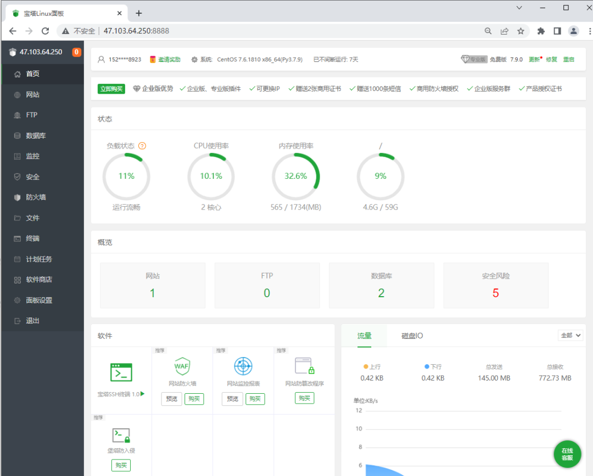<br />2.网站<br />网站-备份站点-下载<br />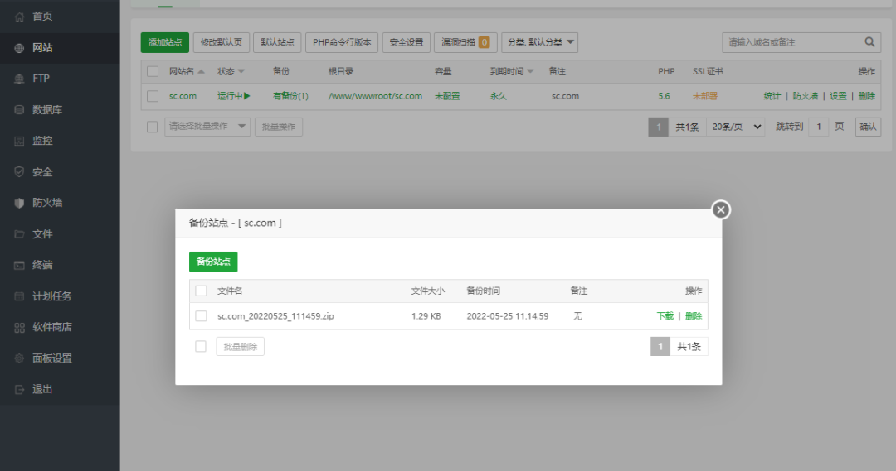<br />同时，在此页面很直观的就能看出服务器存在几个网站网址，方便我们对这些网站进行分析。<br />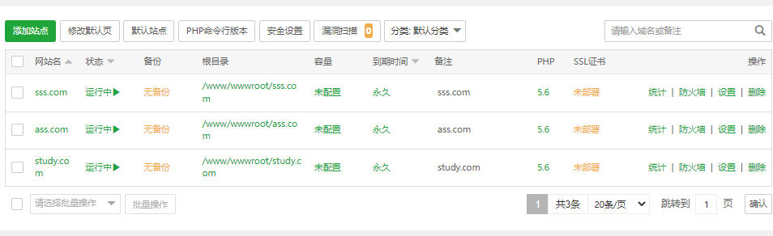<br />3.数据库备份<br />数据库-备份数据库<br />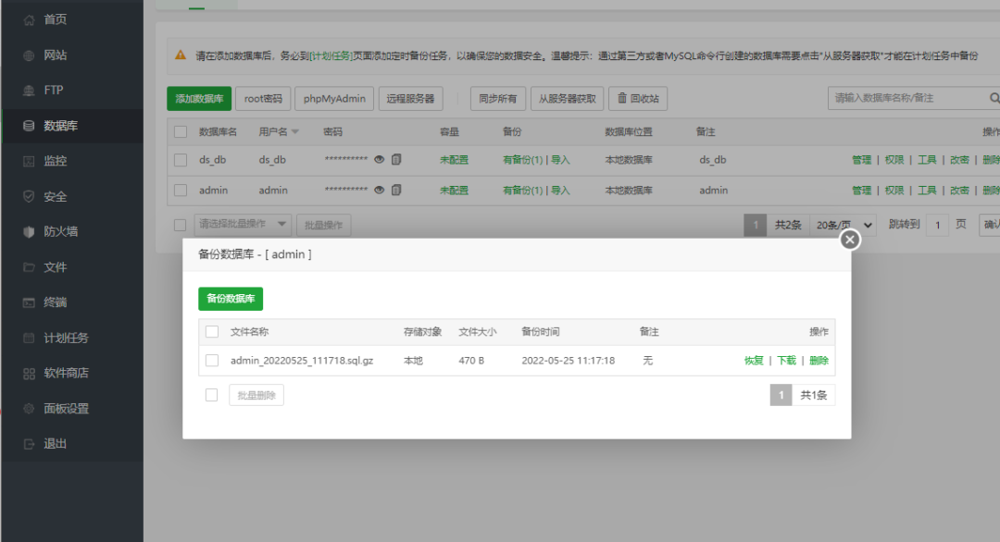<br />同时，在此页面也可获得到数据库的root密码，每个数据库的用户名和密码。<br />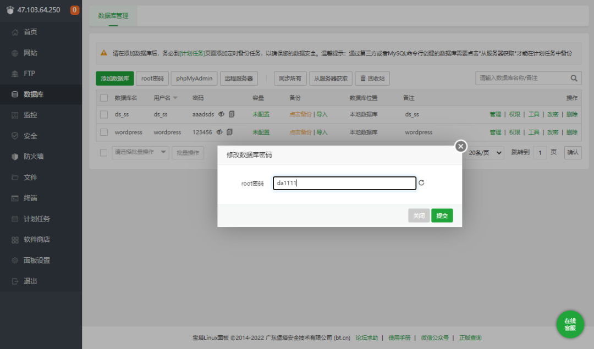<br />4.服务器搭建环境<br />当我们在做网站重构时，服务器搭建环境相对来说是重要的，如果能得知服务器在搭建时，用的是什么数据库，服务器，版本信息等，那么我在重构时会事半功倍。<br />在宝塔面板页面中，可以通过在软件商店直接看面板下载了哪些环境。如下图就很直观的看到这个服务器使用的是常见的LNMP环境及其版本信息。那么在我们重构时，只需要去搭建配置相同的环境就可以相对较轻松地把网站搭建起来。<br />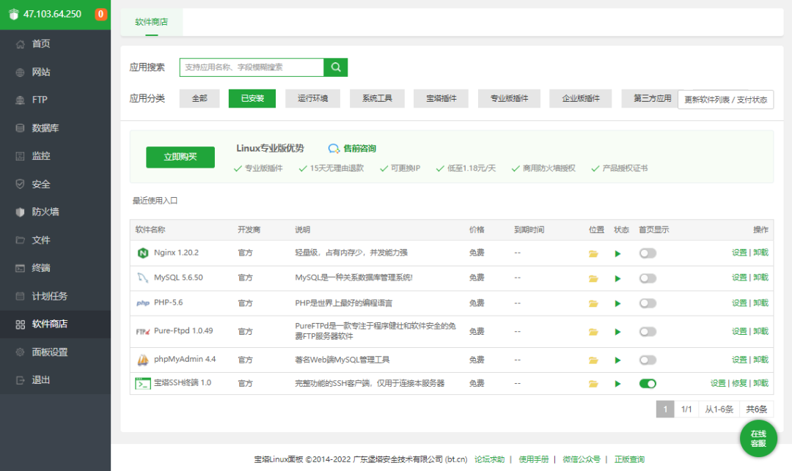
# hosts
```powershell
C:\Windows\System32\drivers\etc\hosts
```
