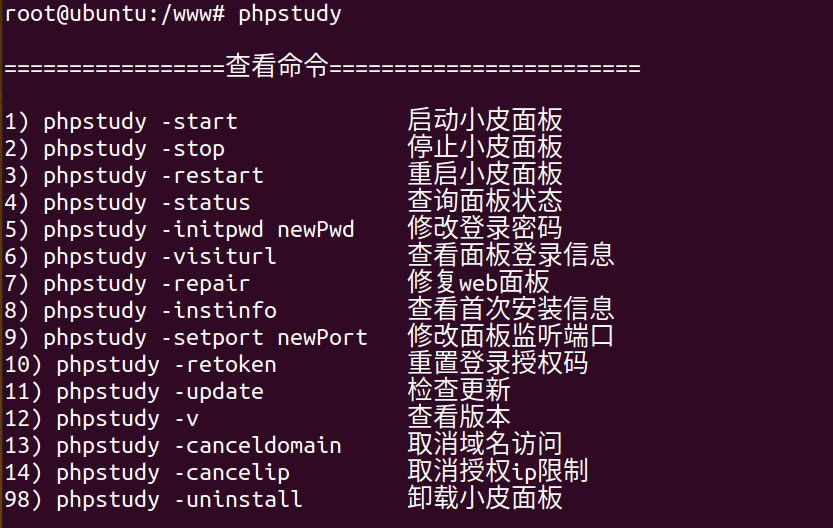

# PHPStudy-linux面板（小皮面板）
## 使用教程
[小皮面板（phpStudy Linux 面板）使用手册 - phpStudy官网](https://www.xp.cn/phpstudy-linux/)
## 安装
安装教程进行安装，我使用的Ubuntu20.04进行安装<br />分为docker版本和无docker版本<br />无docker版本
```powershell
Centos安装脚本 yum install -y wget && wget -O install.sh https://notdocker.xp.cn/install.sh && sh install.sh

Ubuntu安装脚本 wget -O install.sh https://notdocker.xp.cn/install.sh && sudo bash install.sh

Deepin安装脚本 wget -O install.sh https://notdocker.xp.cn/install.sh && sudo bash install.sh

Debian安装脚本 wget -O install.sh https://notdocker.xp.cn/install.sh && sudo bash install.sh
```
docker版本
```powershell
Centos安装脚本 yum install -y wget && wget -O install.sh https://download.xp.cn/install.sh && sh install.sh

Ubuntu安装脚本 wget -O install.sh https://download.xp.cn/install.sh && sudo bash install.sh

Deepin安装脚本 wget -O install.sh https://download.xp.cn/install.sh && sudo bash install.sh

Debian安装脚本 wget -O install.sh https://download.xp.cn/install.sh && sudo bash install.sh
```
安装完成后也和宝塔面板一样，给定初始账号和密码，端口为9080<br /><br />整体界面和功能和宝塔面板功能类似，这里就不再赘述。接下来去看看有没有什么操作命令，以及对认证的一些问题。<br />
## 探索
可以看到在根目录创建了`www`和`YOUR_TMP_PATH_HERE `<br /><br />`www`目录所需权限较高，必须root用户才可以读写和执行<br />输入`xp`会进入指令界面<br /><br />或者输入`phpstudy`，可以有以下参数进行操作<br />
```powershell
1) phpstudy -start             启动小皮面板
2) phpstudy -stop              停止小皮面板
3) phpstudy -restart           重启小皮面板
4) phpstudy -status            查询面板状态
5) phpstudy -initpwd newPwd    修改登录密码
6) phpstudy -visiturl          查看面板登录信息
7) phpstudy -repair            修复web面板
8) phpstudy -instinfo          查看首次安装信息
9) phpstudy -setport newPort   修改面板监听端口
10) phpstudy -rtoken          重置登录授权码
11) phpstudy -update           检查更新
12) phpstudy -v                查看版本
13) phpstudy -canceldomain     取消域名访问
14) phpstudy -cancelip         取消授权ip限制
98) phpstudy -uninstall        卸载小皮面板
```
看到IP限制，搜索一下如何进行IP限制。<br />使用手册中对网站防火墙的配置：<br />[IP白名单设置 - 小皮面板（phpStudy Linux 面板）使用手册](https://www.xp.cn/phpstudy-linux/waf-ip-allow.html)<br />下载了一个nginx防火墙，有比较多的过滤规则<br /><br />过滤规则都存放在`/www/admin/<相应的网站>/data/rule`下<br /><br />waf使用的是`ngx_lua_waf`， 应该参考了相应的开源waf<br />[https://github.com/loveshell/ngx_lua_waf](https://github.com/loveshell/ngx_lua_waf)<br /><br />终于发现了study的主文件夹，在`/usr/local/phpstudy/`下<br /><br />未完待续。。。。。
