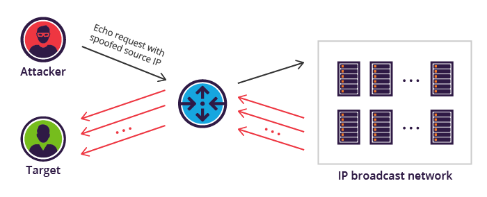
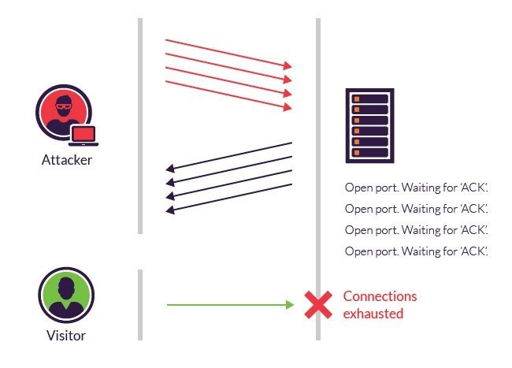
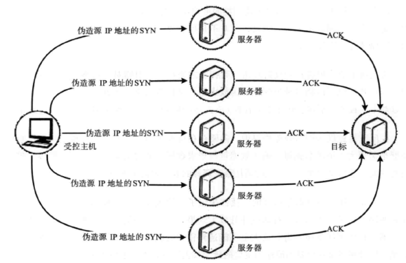
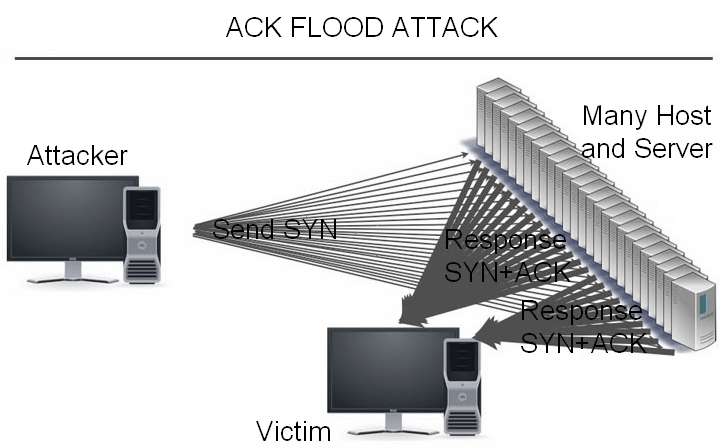
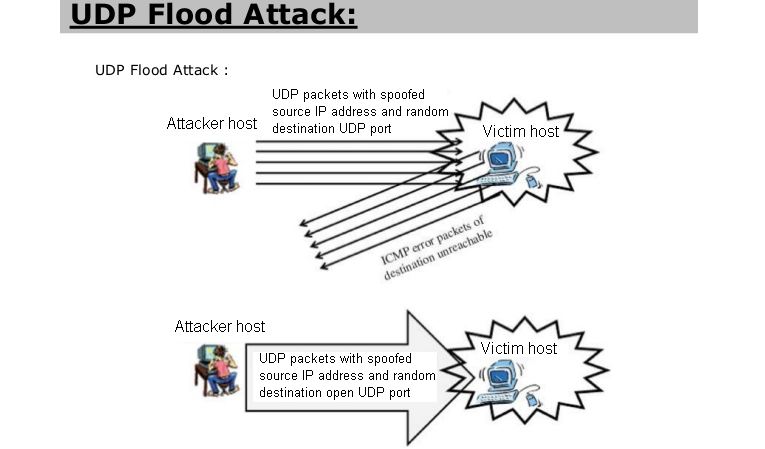
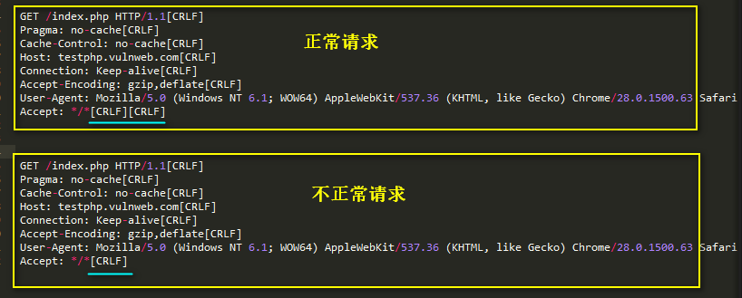
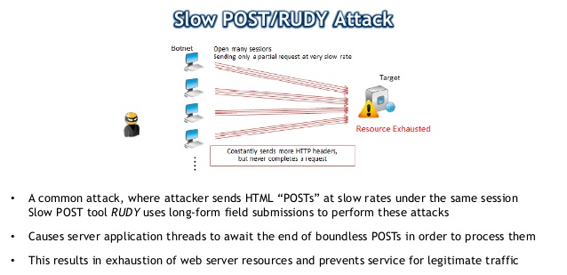
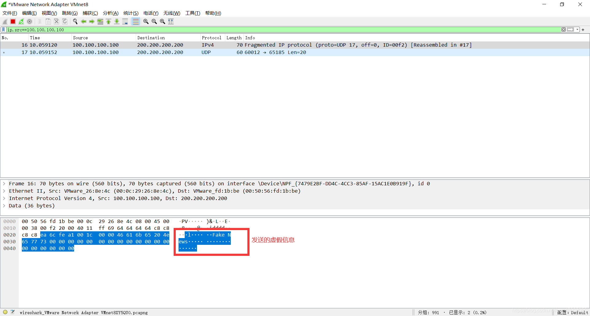

## 1)  Smurf攻击
攻击者向网关发送ICMP请求包，并将该ICMP请求报文的源地址伪造成受害主机IP地址，目的地址为广播地址。路由器接收到该数据包，发现目的地址是广播地址，就会将该数据包广播出去，局域网内所有的存活主机都会受到一个ICMP请求包，源地址是受害主机IP。接下来受害主机就会收到该网络内所有主机发来的ICMP应答报文，通过大量返回的ICMP应答报文来淹没受害主机，最终导致网络阻塞，使受害主机崩溃。下面是smurf攻击示意图：  **防护方案：**禁止路由器广播ICMP请求包；禁止操作系统对广播发出的ICMP请求包做出响应；配置防火墙禁止来自你所处网络外部的ping包。
## 2)  SYN Flood攻击
SYN 泛洪（Flood）攻击是在TCP三次握手过程中产生的。攻击者通过发送大量伪造的带有SYN标志位的TCP报文，与目标主机建立了很多虚假的半开连接，在服务器返回SYN+ACK数据包后，攻击者不对其做出响应，也就是不返回ACK数据包给服务器，这样服务器就会一直等待直到超时。这种攻击方式会使目标服务器连接资源耗尽、链路堵塞，从而达到拒绝服务的目的。SYN Flood攻击图示如下：  **防护方案：** SYN Check：使用防护设备，3次握手变成了6次握手，由防护设备检测SYN请求是否合法，通过后再由防护设备将报文转发给服务器，后续报文仍由防护设备代理。 Micro Blocks：管理员可以在内存中为每个SYN请求创建一个小索引(小于16字节)，而不必把整个连接对象存入内存。 RST Cookies：在客户端发起第一个SYN请求后，服务器故意回应一个错误的SYN+ACK报文。如果合法用户收到这个报文，就会给服务器响应RST报文。当服务器收到这个报文时，就将这个主机的IP记录进合法IP列表，下次该主机发起SYN请求时，就可以直接通过了。 STACK Tweaking：管理员可以调整TCP堆栈以减缓SYN泛洪攻击的影响。这包括减小超时时间，等到堆栈内存释放时再分配连接，否则就随机性地删除传入的连接。
## 3)  ACK Flood攻击
ACK Flood攻击是利用TCP三次握手过程。这里可以分为两种攻击方式。 **第一种：**攻击者伪造大量的SYN+ACK包发送给目标主机，目标主机每收到一个SYN+ACK数据包时，都会去自己的TCP连接表中查看有没有与ACK的发送者建立连接 ，如果有则发送ACK包完成TCP连接，如果没有则发送ACK+RST 断开连接。但是在查询过程中会消耗一定的CPU计算资源。如果瞬间收到大量的SYN+ACK数据包，将会消耗服务器的大量CPU资源，导致正常的连接无法建立或增加延迟，甚至造成服务器瘫痪、死机。  **第二种：**利用TCP三次握手的ACK+SYN应答，攻击者向不同的服务器发送大量的SYN请求，这些SYN请求数据包的源IP均为受害主机IP，这样就会有大量的SYN+ACK应答数据包发往受害主机，从而占用目标的网络带宽资源，形成拒绝服务。  通常DDoS攻击会将ACK Flood与SYN Flood结合在一起，从而扩大攻击造成的影响。 **防护方案**可参考如下：采用CDN进行流量稀释；避免服务器IP暴露在公网上；采用限速或动态指纹进行防御；利用对称性判断来分析出是否有攻击存在；在连续收到用户发送的ACK包时，中断回话，让其重连。
## 4)  UDP Flood攻击
UDP（User Datagram Protocol，用户数据报协议），是一种无连接和无状态的网络协议，UDP不需要像TCP那样进行三次握手，运行开销低，不需要确认数据包是否成功到达目的地。这就造成UDP泛洪攻击不但效率高，而且还可以在资源相对较少的情况下执行。UDPFlood可以使用小数据包(64字节)进行攻击，也可以使用大数据包(大于1500字节，以太网MTU为1500字节)进行攻击。大量小数据包会增大网络设备处理数据包的压力。而对于大数据包，网络设备需要进行分片、重组，最终达到的效果就是占用网络传输接口的带宽、网络堵塞、服务器响应慢等。  **防护方案**：限制每秒钟接收到的流量(可能产生误判)；通过动态指纹学习(需要攻击发生一定时间)，将非法用户加入黑名单或特征过滤进行防御。
## 5)  HTTP慢速攻击
Slow HTTP DoS（Slow HTTP Denial of Service Attack，慢速HTTP拒绝服务攻击），黑客模拟正常用户向web服务器发送慢速http请求，由于是慢速的，服务器端需保持连接，直到数据传输结束或请求结束才可释放连接。当服务器端建立大量慢速连接，就会导致服务器拒绝服务。这种攻击可以分为两类，一类是客户端发数据，另一类是客户端读取服务器发来的数据。HTTP慢速攻击对基于线程处理的web服务器影响显著，如apache、dhttpd，而对基于事件处理的web服务器影响不大，如ngix、lighttpd。HTTP慢速攻击还可以细分成以下几种攻击方式：
#### A.Slowloris攻击方式
HTTP协议规定请求头以一个空行结束，所以完整的HTTP请求头结尾是\r\n\r\n。然而使用非正常的\r\n来结尾，就会导致服务端认为请求头还没结束，等待我们继续发送数据直到超时时间。两种请求头区别如下，CRLF（CarriageReturn Line Feed）表示回车换行： 
#### B.Slow POST攻击方式
在HTTP头部信息，可以使用content-length声明HTTP消息实体的传输长度，服务器端会content-length的值作为HTTP BODY的长度。利用这一特点，攻击者把content-length设置的很大，然后缓慢发送数据部分，比如一次只发送一个字节，这样服务器端就要一直保持连接，直到客户端传完所有的数据。
# 
#### C.Slow read攻击方式
攻击者发送一个完整的HTTP数据请求，之后服务器会给出响应，这时攻击者在将自己的TCP窗口大小设置的很小，服务器会根据客户的TCP窗口大小来传送数据。由于客户端的TCP窗口大小很小，服务器只能缓慢的传输数据给客户端。当建立大量的这种连接时，Web应用的并发连接池空间将被耗尽，最终导致拒绝服务。此项具体实验图在后面。
## Teardrop attack
**介绍**：泪滴攻击涉及黑客向受害者的机器发送重叠的，超大的有效载荷的破碎和混乱的IP片段。由于TCP / IP碎片重新组装的方式存在错误，因此显然会导致操作系统和服务器崩溃。所有操作系统的许多类型的服务器都容易受到这种类型的DOS攻击，包括Linux. **攻击特征**：Teardrop是基于UDP的病态分片数据包的攻击方法，其工作原理是向被攻击者发送多个分片的IP包（IP分片数据包中包括该分片数据包属于哪个数据包以及在数据包中的位置等信息），某些操作系统收到含有重叠偏移的伪造分片数据包时将会出现系统崩溃、重启等现象。（利用UDP包重组时重叠偏移（假设数据包中第二片IP包的偏移量小于第一片结束的位移，而且算上第二片IP包的Data，也未超过第一片的尾部，这就是重叠现象。）的漏洞对系统主机发动畸形报文攻击，最终导致主机宕机；对于Windows系统会导致蓝屏死机，并显示STOP 0x0000000A错误。） 
## Ping of Death
最简单的基于IP的攻击可能要数著名的死亡之ping，这种攻击主要是由于单个包的长度超过了IP协议规范所规定的包长度。产生这样的包很容易，事实上，许多操作系统都提供了称为ping的网络工具。在为Windows操作系统中开一个DOS窗口，输入ping -l 65500 目标ip -t （65500 表示数据长度上限，-t 表示不停地ping目标地址）就可达到该目的。UNIX系统也有类似情况。 通俗来说，就是对方IP内存溢出，达到使对方系统崩溃的效果 [https://cloud.tencent.com/developer/article/1870716](https://cloud.tencent.com/developer/article/1870716)

