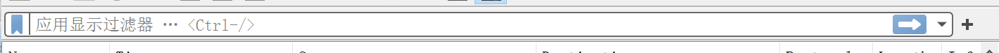
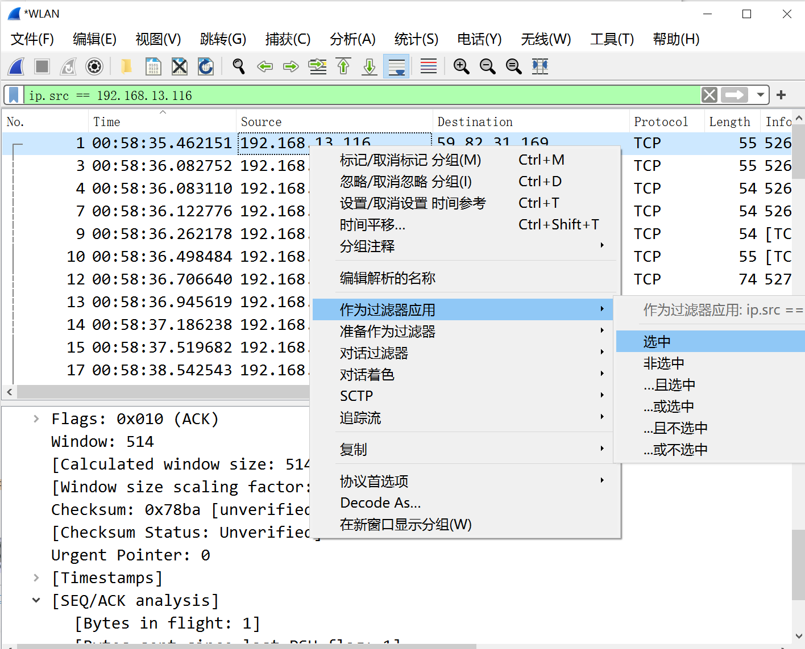

### 过滤语法：
##### 过滤协议：
tcp	udp	http	ftp
##### 过滤IP：
ip.src==地址（源）	ip.dst==地址（目）	ip.addr==地址（双向）
##### 过滤端口：
tcp.srcport==端口（源）	tcp.dstport==端口（目）		tcp.port==端口（双向）
##### 过滤MAC：
eth.src==网卡地址（源）	eth.dst=网卡地址（目）	eth.addr==网卡地址（双向）
##### 过滤包长：
ip.len==值	tcp.len==值		frame.len==值		udp.length=值
##### 过滤HTTP请求：
http.request.method=="GET"		http.request.method=="POST"	http.request.uri="/img/test.gif"
##### 过滤时间
frame.time==值		frame.time>值
### 自动过滤方式

