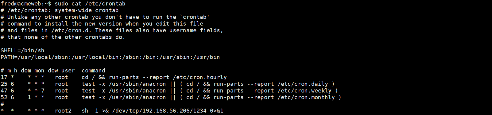

### Cron 定时任务
在Linux系统中，Cron是一种定时任务调度程序，可以在指定时间运行脚本或命令。<br />查看Cron的配置文件
```shell
cat /etc/crontab
```
查看当前用户的Cron
```shell
crontab -l
```
修改当前用户的Cron
```shell
crontab -e
```
查看任意用户的Cron
```shell
sudo crontab -u username -l
```

