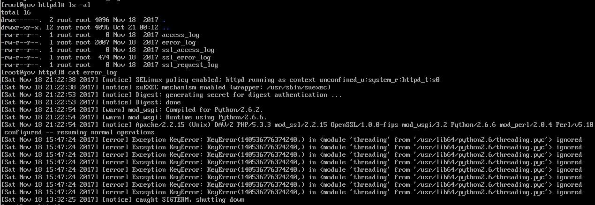

# 日志分析
```java
more access* | egrep "%20select%20|%20and%201=1|%20and%201=2|%20exec|%27exec|information_schema.tables|%20information_schema.tables|%20where%20|%20union%20|%20SELECT%20|%2ctable_name%20|cmdshell|%20table_schema|" > /tmp/sql.log
```
```java
cat access* | egrep "union | select" | grep "200" > /tmp/sql200.log
```
# Apache日志
### 默认路径
:::tips
/var/log/httpd/<br />/var/log/apache2
:::


