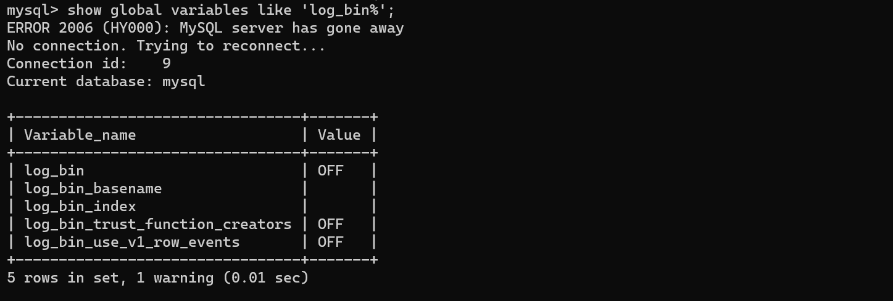

# Mysql日志
### 查询配置文件
通过查看mysql配置文件来查看其日志路径<br />默认路径为/etc/my.cnf
```java
find / -name my.cnf
find / -name *.cnf
```

### mysql内进行查找
```java
show global variables like 'log_bin%';
show global variables like 'log%';
```

