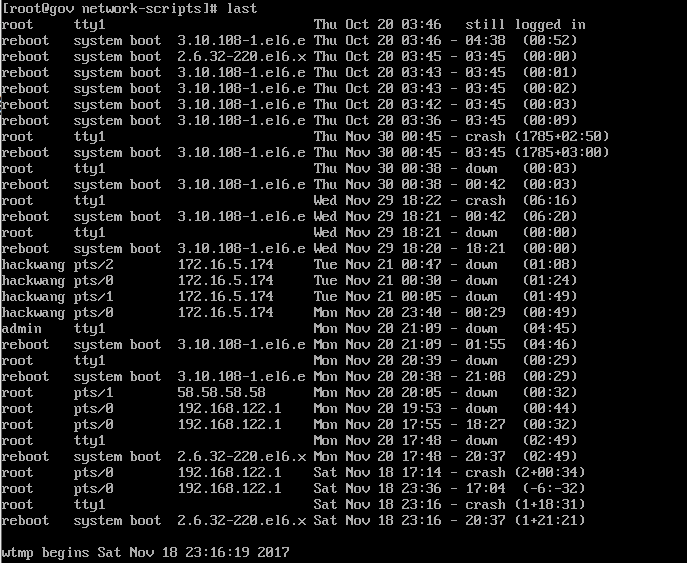
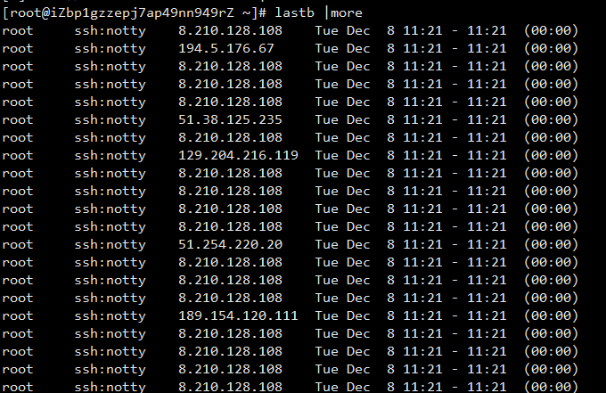

### last 显示近期用户或终端的登录情况
输出的每一行从左到右包含的列分别是：

- 用户名。 当系统重启或者关闭时，last显示指定用户为reboot或者shutdown。
- 会话占用的 tty。:0通常意味着用户登录了一个桌面环境
- IP 地址或者用户登录的主机名
- 会话开始时间和停止时间
- 会话时长。如果会话仍然是激活的，或者用户没有登出，last 将会显示信息，而不是时长。

**参数** • -R: 省略 hostname 的栏位 • -n：指定输出记录的条数。 • -f file：指定用文件 file 作为查询用的 log 文件。（默认是显示 /var/log/wtmp ,/var/log/btmp 可以显示远程登陆） • -t tty：只显示指定的虚拟控制台上登录情况。 5 • -h 节点：只显示指定的节点上的登录情况。 • -i IP：只显示指定的 IP 上登录的情况。 • -1：用 IP 来显示远端地址。 • -F：显示记录的年、月、日。 • -ID：知道查询的用户名。 • -x:显示系统关闭、用户登录和退出的历史。 
### lastb 显示近期用户或终端的登录失败的情况

