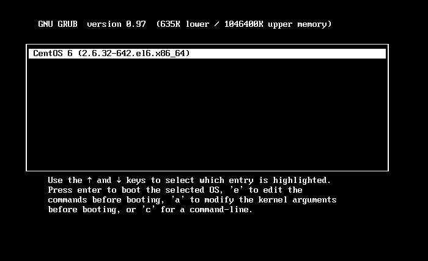
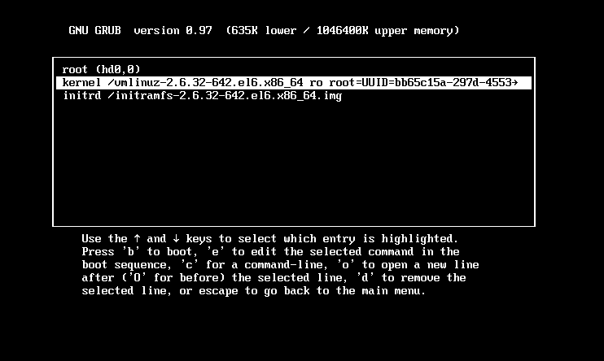
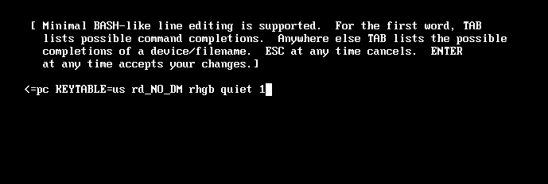
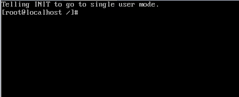
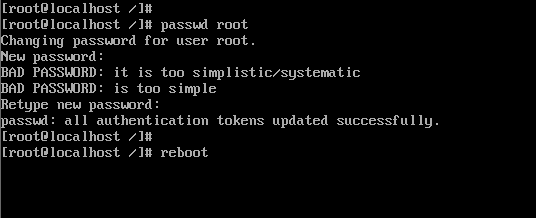

# CentOS6 破解密码
 1、重启服务器，在倒数读秒的时候按任意键，就会出现如下界面 2、按e进入grub模式，选中kernel，然后按e进入内核编辑模式 

3、进入内核编辑模式后，按空格+1回车（或按空格+single回车）退出内核编辑模式 

4、退出内核编辑模式后，再次进入到grub模式 

5、选中kernel，按b进入到单用户模式 

6、修改root密码，重启即可 
# Kali
[https://blog.csdn.net/weixin_44953600/article/details/110402058](https://blog.csdn.net/weixin_44953600/article/details/110402058)
