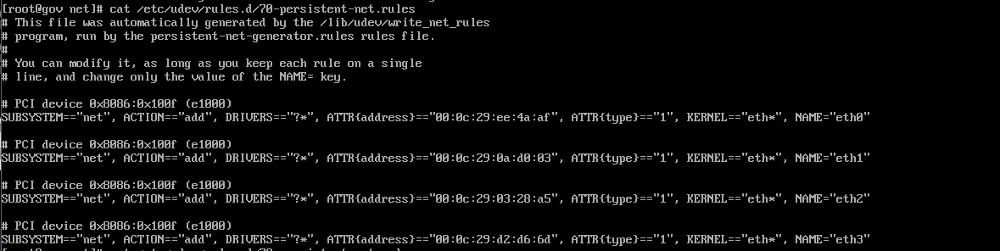
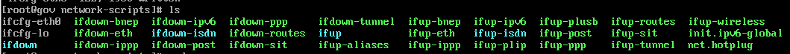

### 网卡插入信息
:::tips
/etc/udev/rules.d/70-persistent-net.rules
:::

### 网卡配置
:::tips
/etc/sysconfig/network-scripts
:::

#### /etc/sysconfig/network-scripts 配置
/etc/sysconfig/network-scripts 目录是在 CentOS 系统中用于存放网络配置文件的目录，其中重要的文件包括：

- ifcfg-*：以网卡名称命名的文件，用于配置网卡的网络参数，如 IP 地址、子网掩码、网关、DNS 等。
- route-*：以“route-”开头命名的文件，用于配置静态路由表。
- network-functions：定义了一些 shell 函数，供其他脚本调用。

下面是一个示例 ifcfg-eth0 配置文件的内容：
```python
Copy CodeTYPE=Ethernet
BOOTPROTO=static #dhcp改为static 
IPADDR=192.168.1.100
NETMASK=255.255.255.0
GATEWAY=192.168.1.1
DNS1=8.8.8.8
DNS2=8.8.4.4
ONBOOT=yes #开机启用本配置
```
这个配置文件指定了 eth0 这个网卡使用静态 IP 地址，并设置了其 IP 地址、子网掩码、网关、DNS 等参数。ONBOOT=yes 参数表示该网卡需要在系统启动时自动启用。
### 网卡信息
:::tips
/sys/class/net<br />存储了各个网卡信息，例如eth0 文件夹内的address 文件记录了eth0 网卡的MAC 地址
:::
### 重启网络
```java
service network restart
```
