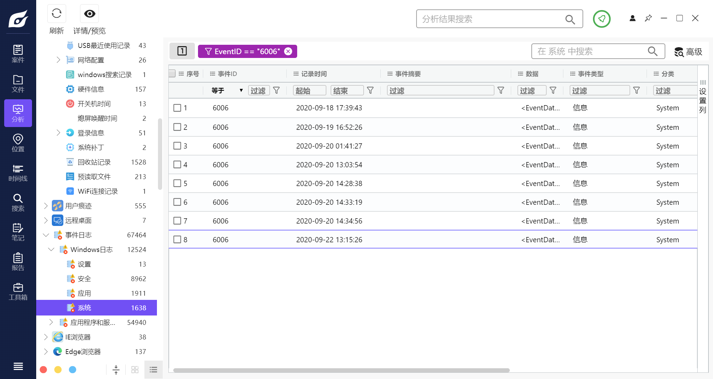

你可以通过以下步骤在 Windows 计算机上查看最后一次正常关机时间： 1、打开“事件查看器”，方法是在开始菜单中搜索“事件查看器”并打开它。 2、在事件查看器的左侧窗格中，选择“Windows 日志”>“系统”。 3、在右侧窗格中，你将看到计算机启动和关闭的事件列表。查找最后一次的“事件 ID 为 6006”的项。这表示上次计算机正常关机的时间。 4、单击该项以查看有关该事件的详细信息，包括日期、时间和持续时间。 注意：如果计算机突然断电或发生崩溃，可能不会记录正常关机事件 
