录题请注意，红色为正确答案，黄底表示该答案也可得分。26-30题每题4分，其余题目每题2分。
# 背景
2021年5月，接某考试信息中心报案称，其单位一存储考生个人信息的服务器疑似被入侵，数据库被破坏并勒索比特币，警方当即固定了服务器的镜像server.e01。经调查警方抓获了嫌疑人并对其使用的笔记本电脑只做了镜像PC.e01，请对两个检材进行分析，并回答下面的问题：
# 题目
### 1. 镜像sever.e01对应的被入侵服务器源盘sha256为
98C53B2AC30758EF0977FC313D5D1A070EBF51AE09E0DF36664A5CCF81DF35C5 对不上 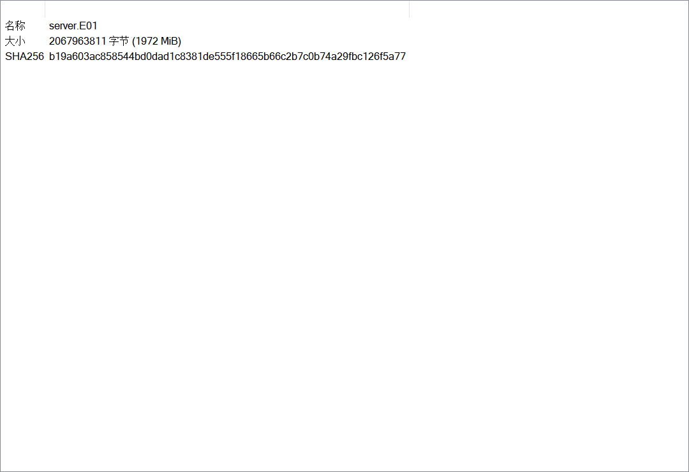
### 2. 服务器操作系统内核版本为3.10.0-957.el7.x86_64

### 3. 服务器配置的网关为192.168.232.2
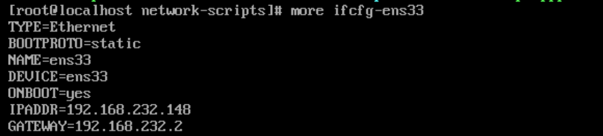
### 4. 服务器中有2个登录过的账号
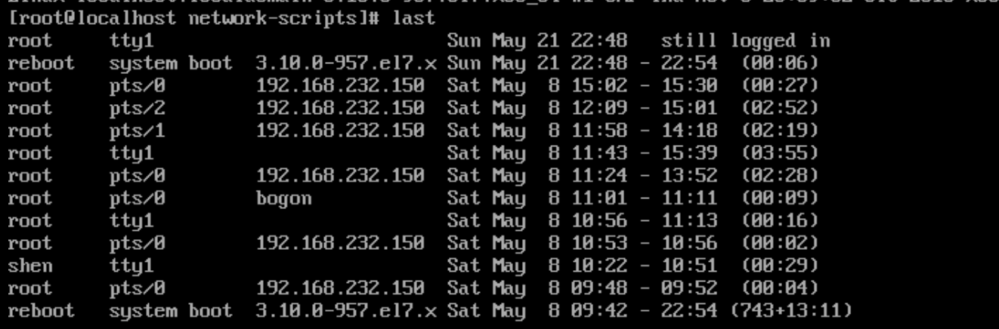
### 5. 服务器中root账号的密码为nb7001
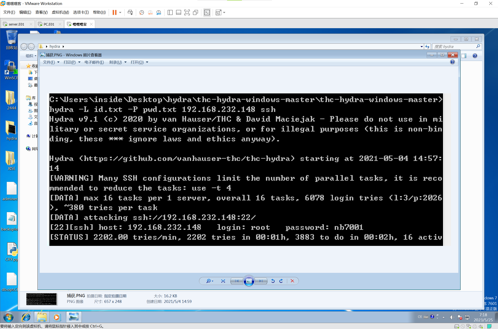
### 6. 入侵者IP为192.168.232.150
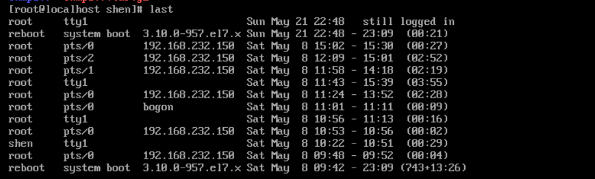
### 7. 入侵者首次登录成功时间为15:01:08（14:57:17）（14:59:21）（格式要求：HH:MM:SS，如14:03:27）

### 8. 入侵者设置了1个定时任务
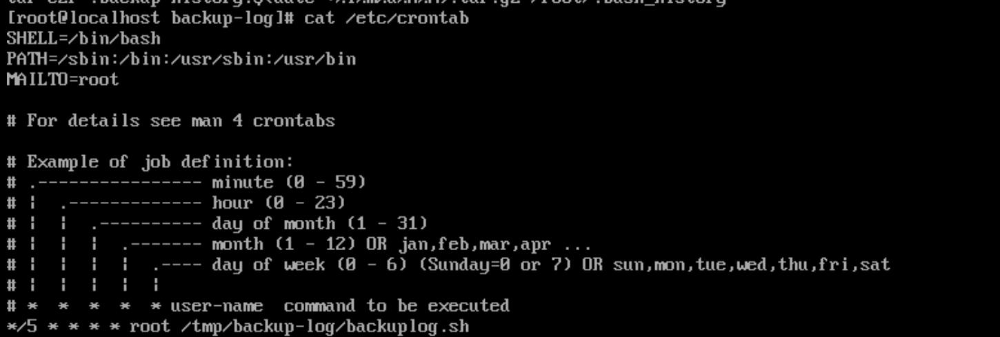
### 9. 定时任务将大量日志文件转存至/tmp/backup-log/（backup-log）目录
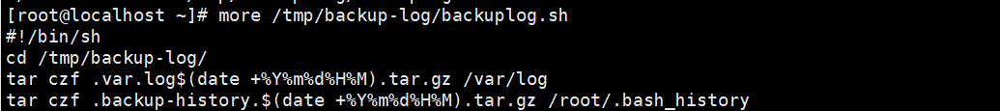
### 10. 服务器的网站目录及子目录中，共存在2（1）个webshell
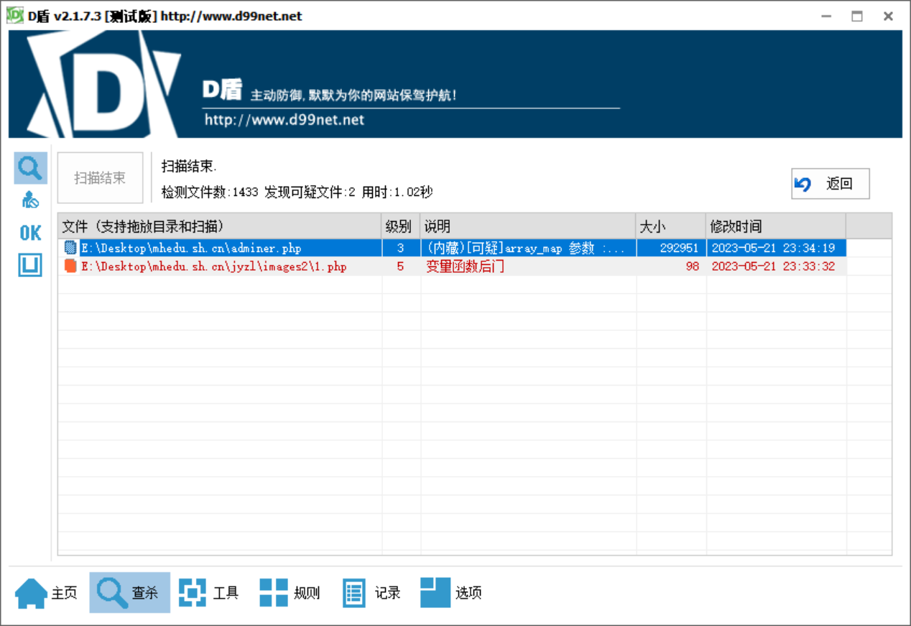
### 11. 数据库账号为root，密码为nb250250
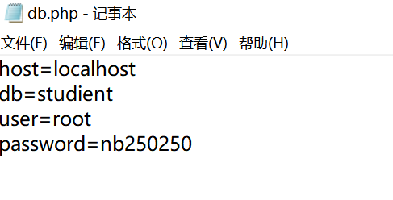
### 12. 数据库版本号为5.5.62

### 13. 嫌疑人入侵服务器后，在数据库中共修改了3个学生的分数

### 14. 嫌疑人入侵服务器后，在数据库中共删除了52条学生相关记录

### 15. 将被篡改的数据库修复，统计全部学生信息中，身份证为31开头的，且分数大于540分的学生共有1048名
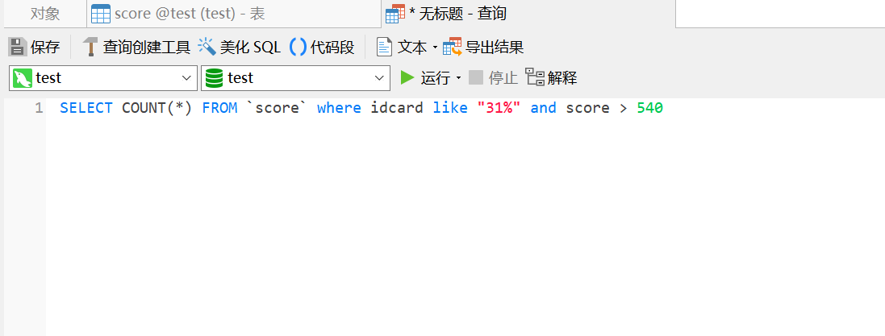
### 16. 将被篡改的数据库修复，统计全部学生信息中，有12对同名的学生。
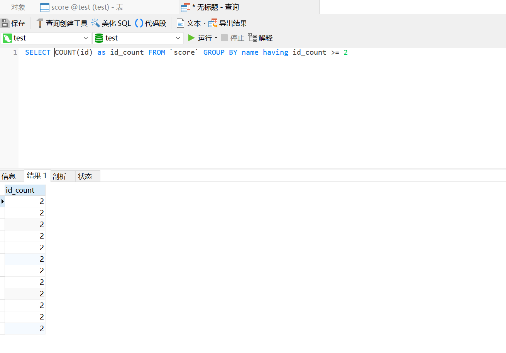
### 17. 镜像PC.e01对应的嫌疑人PC源盘sha256为
6EEF51A3737269D631B733AB476B236E055103115D463DAF81529556C1738199 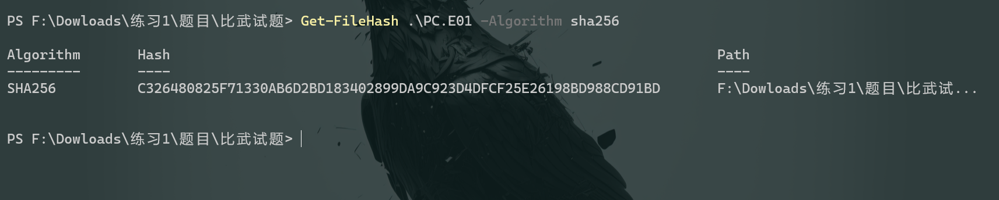
### 18. PC操作系统安装时间为2021-05-02 00:30:44（格式要求：YYYY-MM-DD HH:MM:SS，如2019-03-17 14:03:27）
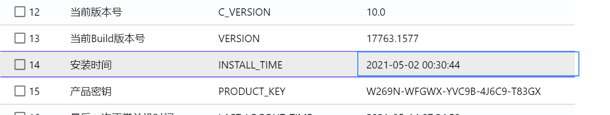
### 19. 嫌疑人破解服务器密码使用的工具/软件名为hydra
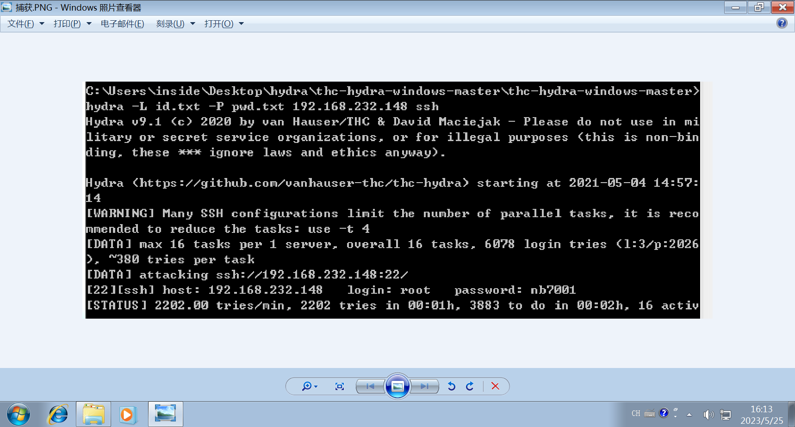
### 20. 嫌疑人PC中，bitlocker分区恢复秘钥为327954-438944-621852-201003-531718-502172-098219-240251
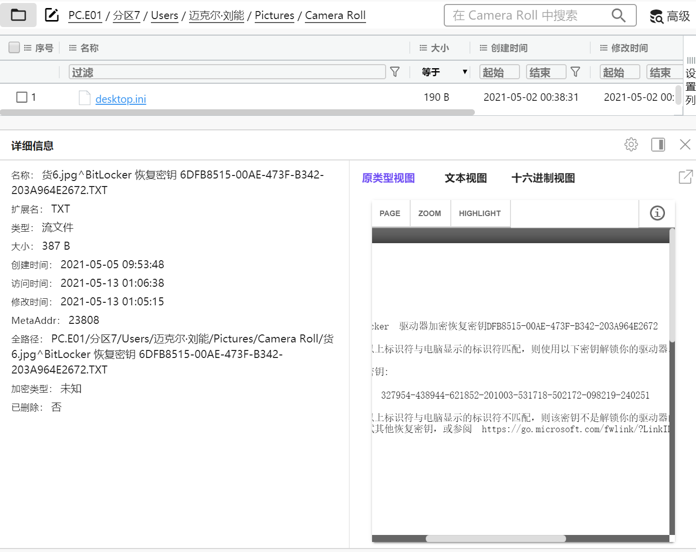
### 21. 嫌疑人将所有学生信息拆分为6份文件

### 22. 所有被拆分的学生信息文件中，有一份被删除，该文件中共有学生信息339条

### 23. 嫌疑人邮箱地址为234011677@qq.com

### 24. 嫌疑人曾通过QQ售卖的学生信息，买家QQ号为234011698
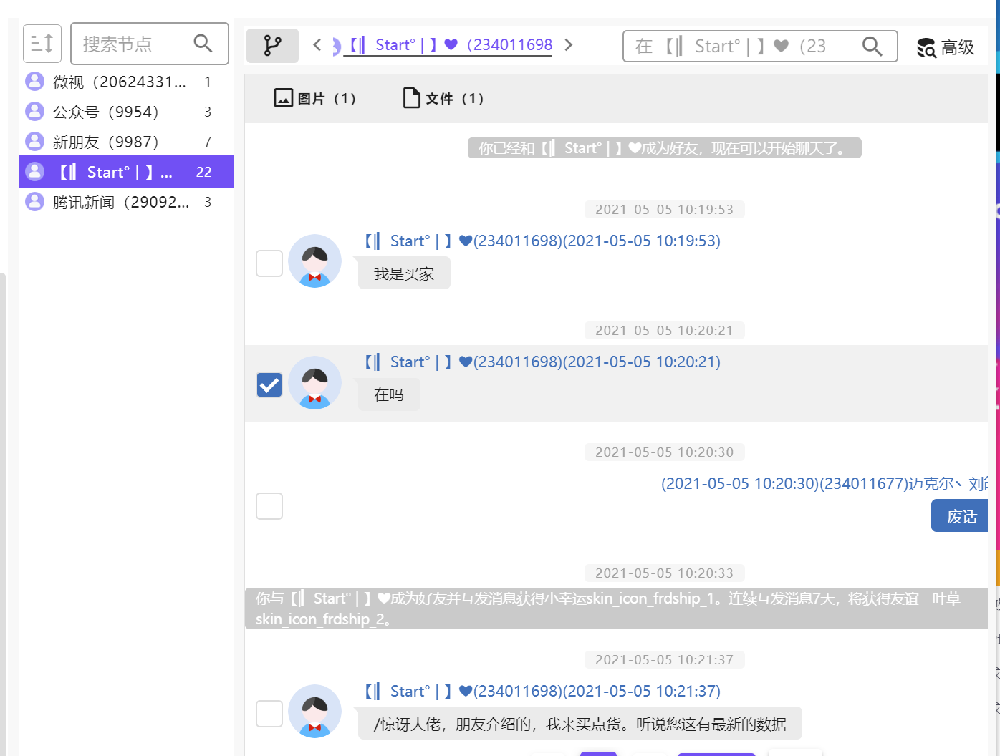
### 25. 嫌疑人首次访问服务器中上传的1.php文件的时间为15:42:43（格式要求：HH:MM:SS，如14:03:27）
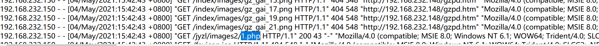
### 26. 提取并分析服务器中的加密程序，该程序执行后会加密7种不同类型的文件
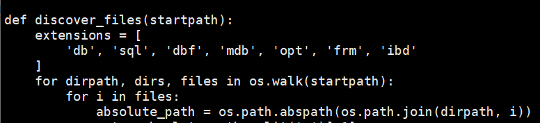
### 27. 嫌疑人共加密了4个文件
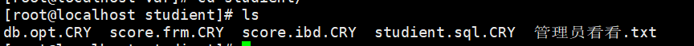
### 28. 首次成功加密文件的时间为2021-05-08 13:33:13（格式要求：YYYY-MM-DD HH:MM:SS，如2019-03-17 14:03:27）
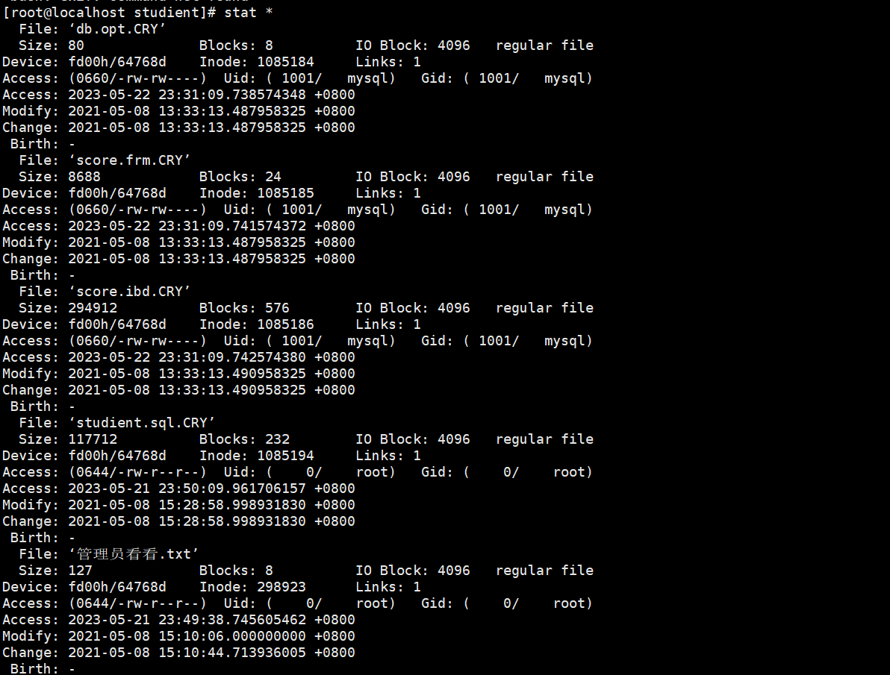
### 29. 该程序对目标文件的加密方式为AES
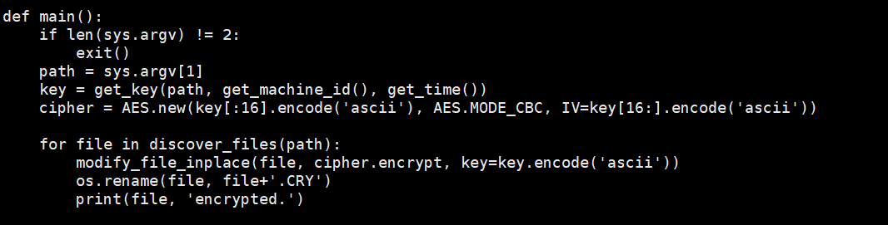
### 30. 该程序对文件studient.sql进行加密时，使用的秘钥为9ff79decd3d6fbb2
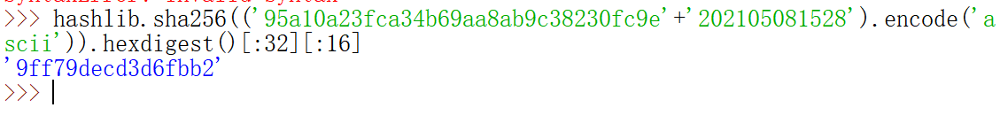 取证过程中，在其电脑中又发现了新的线索。
## *线索1：
民警怀疑加密分区里的access.rar与另外一起入侵活动有关，可能是嫌疑人拷贝到本地的日志文件。该案中，受害网站管理员于2020年9月15日13点19分报案，称有黑客篡改了部分网站页面，并篡改了一张图片，图片文件名为：HackFindx.png，文件大小为45924 Byte
### 31. 该压缩包的sha256值为
255dea58932a6eec318560643000c64338906c8c3c840a70377cd8ec549b9d4f 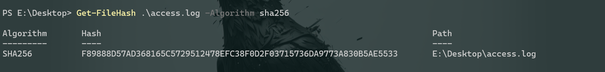
### 32. 该日志共有6079793行（6079794）
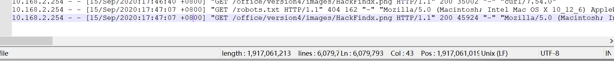
### 33. 嫌疑人篡改HackFindx.png时使用的IP地址是180.121.158.139

### 34. 入侵发生前，嫌疑人最近一次扫描网站时所使用的IP地址是47.98.167.62
### 35. 接上题，这个IP地址在日志文件中出现的总次数是36656
### 36. 2020年内，请求不存在页面总次数超过1000次的IP共有19个
### 37. 2020年内，请求不存在页面总次数最多的IP是183.224.79.34，共有12469次
## 线索2：
民警怀疑加密分区里的web.rar与另外一起入侵活动有关，可能是嫌疑人拷贝到本地的网站源码和日志文件。该案中，受害网站于2020年5月9日左右被入侵并被挂暗链，搜索该网站域名时会跳转到其他违法页面。据嫌疑人交代，入侵中曾使用了名为bypass.php的后门文件，随后删除了该文件。
### 38. 压缩包sha256
ef4261344dca73a04eb0e8660985db9d6e85a6630e9c0a1ae1a4ed5464573201
### 39. 后门文件bypass.php的可能删除时间为18:14:30至18:14:35之间（格式要求：HH:MM:SS，如14:03:27）
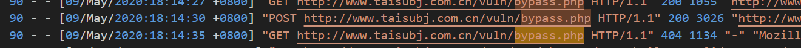
### 40. 嫌疑人为后门文件设置的密码为admin

### 41. 被篡改的网站源码文件名是index(1).php
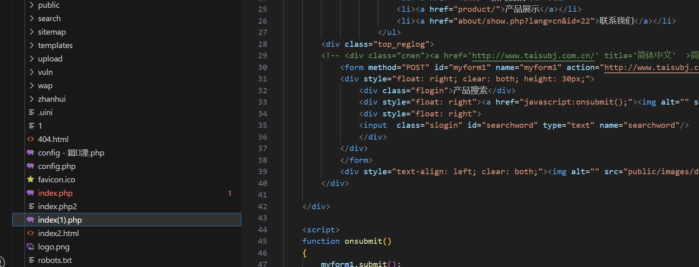
### 42. 暗链中对应的的违法网站域名为132126.com
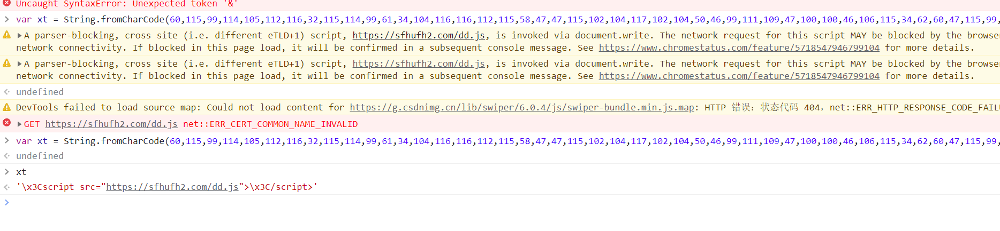
## 线索3：
据嫌疑人交代，其个人电脑的MySQL数据库中也保存着一份公民信息，但MySQL很久未登录账号密码均已经忘记了。
### 43. 该数据库有3个允许远程登录的账号
### 44. student表中，info字段的数据类型是BLOB
### 45. 该数据库中共记录了学生信息4条
