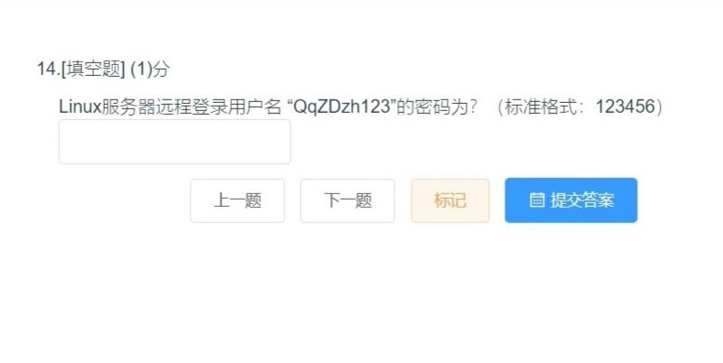
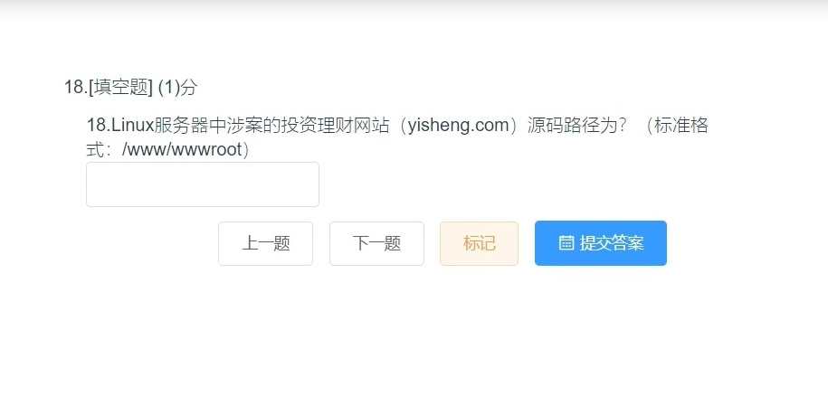

# 服务器勘验
### 1
<br />7601<br />
### 2
<br />45.232.33.144<br />
### 3
<br />ABC<br /><br />
### 4
<br />3032324653<br />
### 5
<br />ABD
### 6*

### 7*

### 8*

### 9
<br />30<br />
### 10
<br /><br />7.5.1804
### 11
<br />115.194.107.60<br />
### 12
<br />51000<br />
### 13
<br />user_info.json<br />
### 14
<br />123123<br />
### 15
<br />/data<br />在后面宝塔面板中可以看到一些网站目录是在/data下，但/data并没有文件<br /><br />猜测是要将数据盘挂载到/data下，使用以下命令挂载
```powershell
fdisk -l
mount /dev/sdb1 /data
```
可以看到网站目录确实在数据盘中<br />
### 16
<br />120<br /><br />
### 17
<br />103.136.124.114<br />
### 18
<br />/www/wwwroot/yisheng.com<br />
### 19
<br />yisheng.com-access_log<br />
### 20
<br />125.119.81.131<br />
### 21
<br />mysql<br />
### 22
<br />database.php<br />
### 23
<br />819a11efed48<br />
### 24
<br />2452<br />
### 25*

### 26*

### 27
<br />粤ICP备17098355号-3<br />
### 28
<br />515098537<br />
### 29
<br />maf.meinuovip.com<br />
### 30
<br />1
