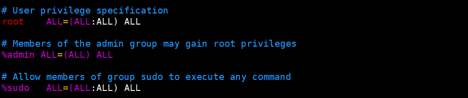
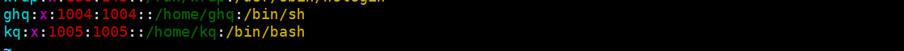
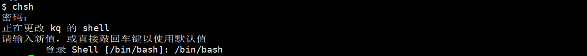

### 添加用户
创建用户
```powershell
addsuer -m <用户名>
```
修改密码
```powershell
passwd <用户名>
```
### 添加到sudo组
查看当前用户属于哪一组
```powershell
groups <用户名>
```
查看某一用户组有哪些用户
```powershell
cat /etc/group| grep <组名>
```
```powershell
awk -F':' '/sudo/{print $4}' /etc/group
```
给与权限<br />一是修改 `/etc/sudoers`	
```powershell
sudo vi /etc/sudoers
```
<br />二是将用户添加到sudo用户组
```powershell
sudo usermod -a -G sudo <用户名>
```
### 删除用户
```powershell
sudo userdel -r <用户名>
```
### 终端更改
登录默认终端为 `sh`，只有一个 `$`符号<br /><br />一是通过修改 `/etc/passwd`将默认终端更改为 `bash`
```powershell
sudo vi /etc/passwd
```
<br />二是通过 `chsh`命令来修改默认终端 
```powershell
chsh
```

