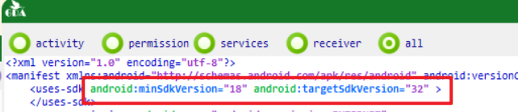
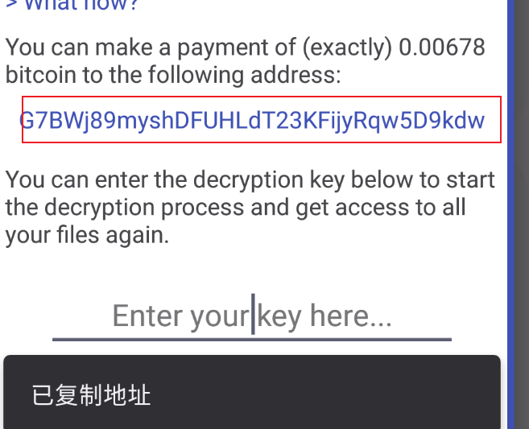
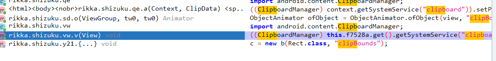
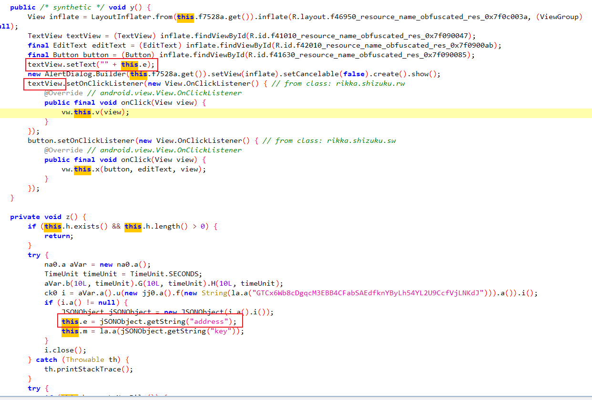
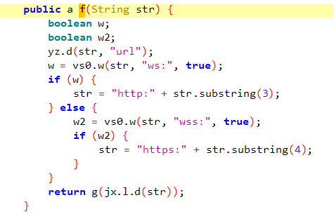
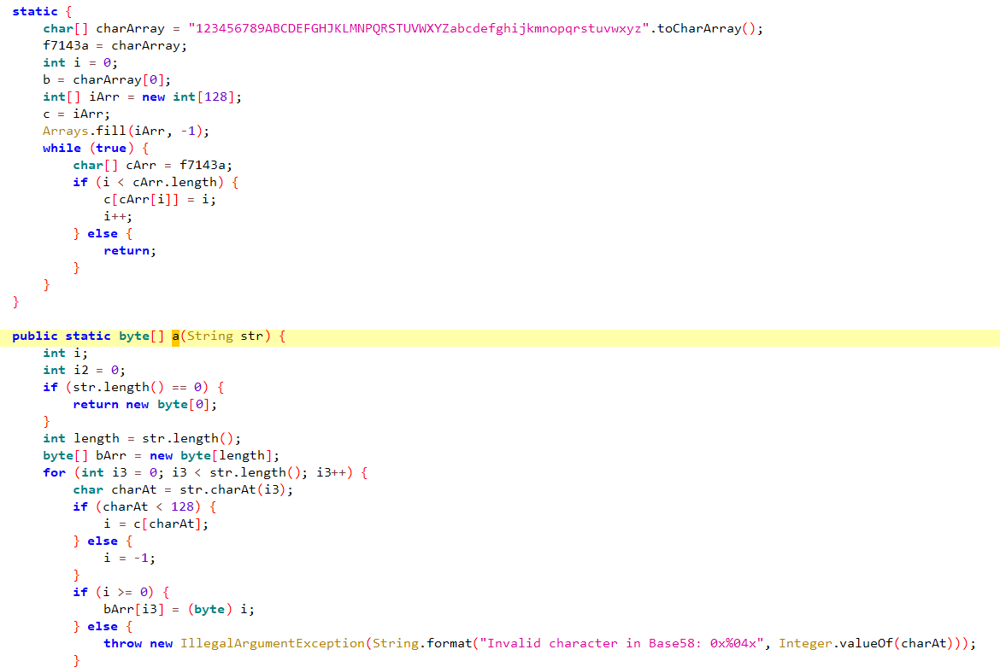
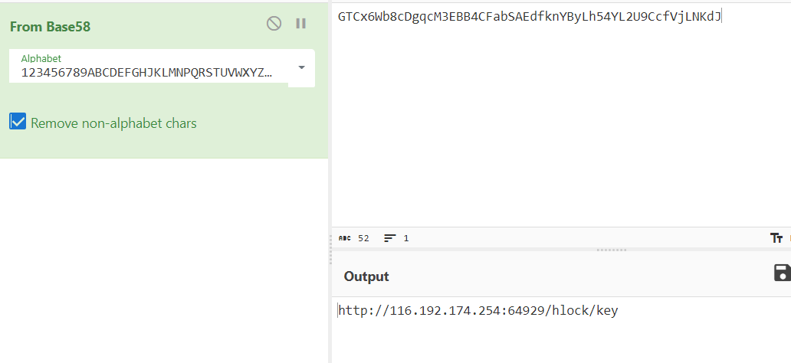

# APK 取证

## 查看APP兼容性（即支持哪些安卓版本）

在ManiFest里面的`uses-sdk`里面能看到使用的SDK，可以查到对应的安卓版本：

https://developer.android.google.cn/studio/releases/platforms?hl=zh-cn

## APK 功能定位技巧

https://www.cnblogs.com/WXjzc/protected/p/17842642.html

WXjzcccc17842642

> ## 2.APK程序在勒索的时候会向服务器申请钱包地址，请问申请后台IP地址为？
>
> 点击地址时会弹出`已复制地址`
>
> 
>
> 因此在源码中搜索`clipboard`
>
> 
>
> 
>
> 查找引用，发现是个textView组件，设置的值为`e`，下面一个`z`方法恰好设置了`e`的值，上面有一串字符，调用的是`f`方法
>
> 
>
> 一眼请求相关
>
> 
>
> 看引入字符的方法，就算没有异常里的提示，也可以通过字符集来判断是`Base58`
>
> 
>
> 解码
>
> 
>
> 结果为`116.192.174.254`