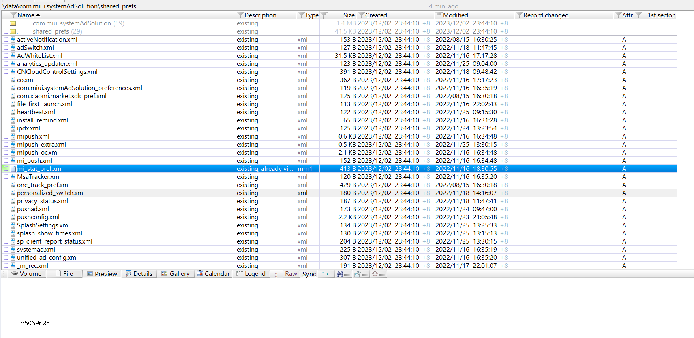
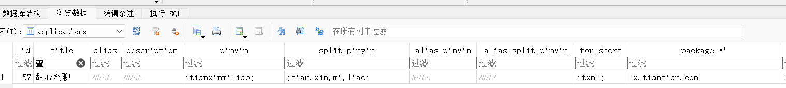
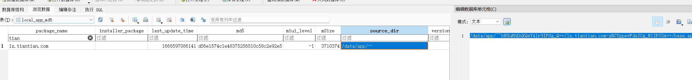
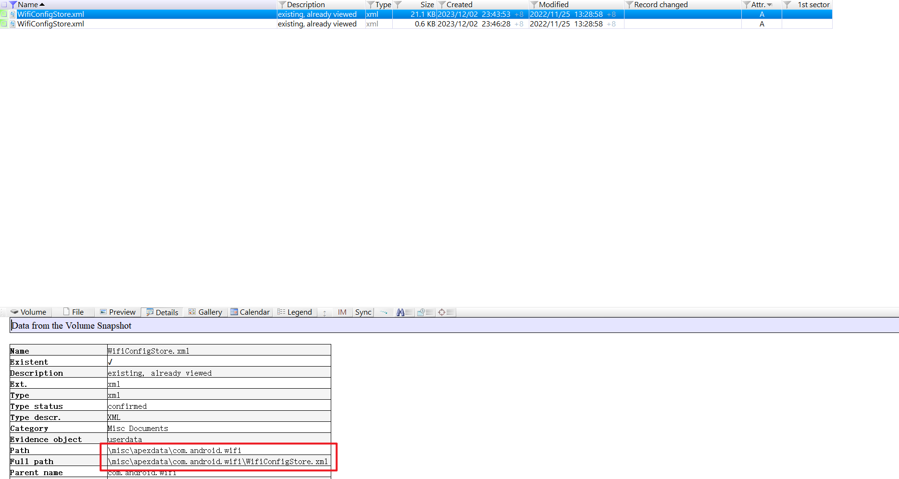
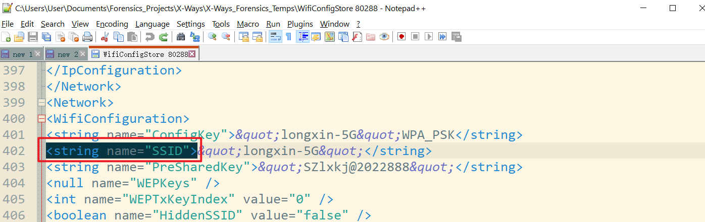
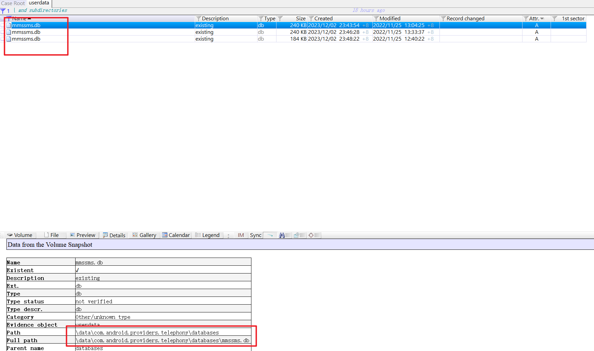
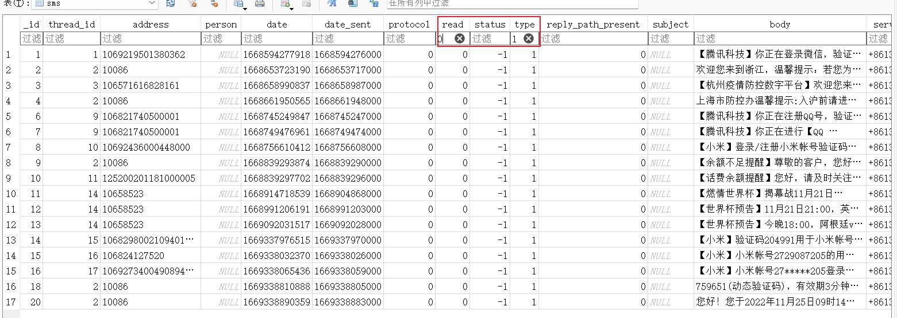

# Android 取证 杂知识点

# 小米手机基本信息

## 设备标识/序列号

`data\com.miui.systemAdSolution\shared_prefs\mi_stat_pref.xml`

## 小米应用商店数据库

应用的安装路径（包括md5）：`/data/com.xiaomi.market/databases/market_2.db` ，在X-Ways里面直接过滤就行

## WiFi 配置文件

`WifiConfigStore.xml`

查看WiFi连接数：

搜索一共有几个SSID即可。

## Android手机短信记录

`mmssms.db`

sms表中read字段值为0表示未读，type字段值为1表示接收的短信：

