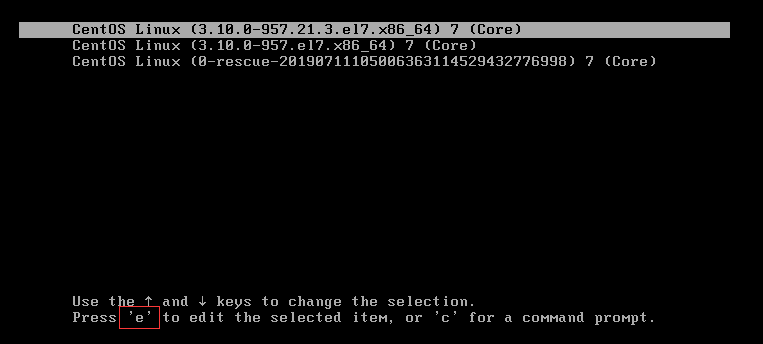
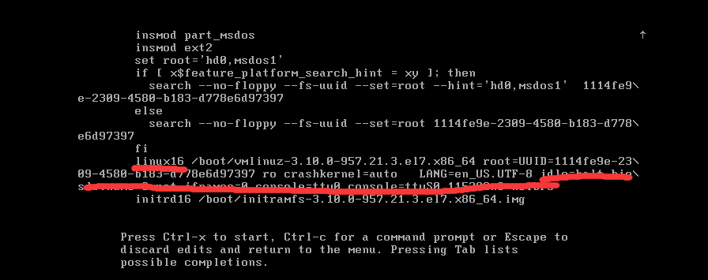
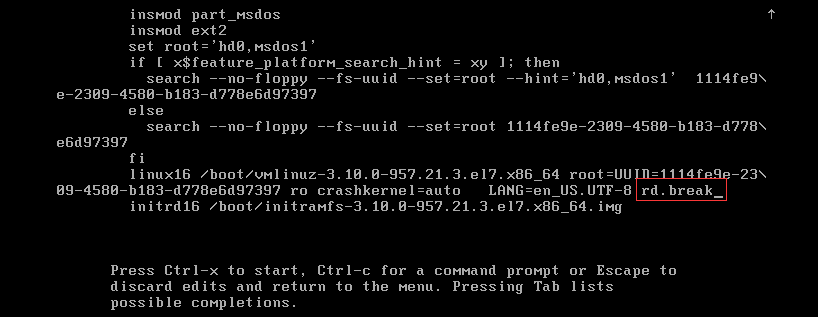
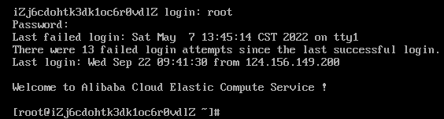

# Linux服务器取证 笔记

宝塔面板：

## 密码绕过（修改）

先进行密码绕过，在这个界面迅速按下方向键，然后按下e进入编辑模式

找到linux16这一行，将lang编码后面的全部删掉，加上`rd.break`

### 

然后`Ctrl+x`直接启动进入switchroot界面，重新挂载根目录`mount -o remount ，rw /sysroot`，然后进入shell`chroot /sysroot`，接下来就可以正常使用命令了，更改原先的密码之前先将shadow备份一下，以免要用到`cp /etc/shadow /root/shadow`

重启后就可以用新密码登录了

仿真完成后要先确认开启ssh服务，方便我们后续进行操作