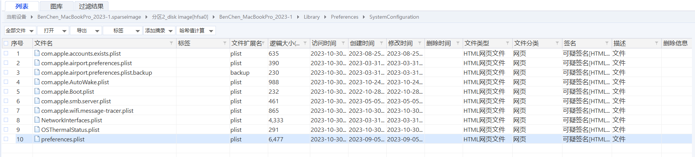
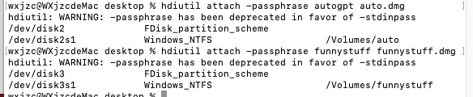

# MacOS 取证


用户主目录：`\Users\<username>\`

Application Logs: `\Users\<username>\Library\Application Support\`

Recent Log:


这个取证软件是可以分析出来的。

## WiFi 记录

`\BenChen_MacBookPro_2023-1\Library\Preferences\SystemConfiguration\com.apple.wifi.message-tracer.plist`

除此以外还有很多其他的文件。




上下两部分的内容是一样的。文件放在img下面的附件目录了。


## 关于DMG文件的取证（加密DMG）

2023美亚杯团体赛

DMG加密命令：

```
hdiutil create -encryption -stdinpass -fs ExFAT -volname funnystuff -o funnystuff.dmg -size 100M
```

DMG文件解密命令（需要指定密钥）：

```
hdiutil attach -passphrase 密码 文件
```

解密后是挂载为一个虚拟的磁盘：


这个DMG文件下有这些文件，其实就是对应用程序所需要的文件进行打包，做成一个虚拟磁盘的映像，以便于安装：


---

以下是WP原文：

> ## 56.请参考陈大昆MacBook镜像文件回答以下题目:有两个加密的.dmg文件在取证镜像文件内。按照.dmg文件的创建时间先后，请填写下面的空白：文件名称包括扩展名(如adcd.dmg)第一个创建.dmg文件的名称是：_____，密码是：____第二个创建.dmg文件的名称是：_____，密码是：____请按照以下格式回答:xxx_xxx_xxx_xxx，例子:如(1)的内容是abc、(2)的内容是123、(3)的内容是DEF、(4)的内容是8.8，答案为：abc_123_DEF_8.8(2分)
>
> 加密命令，密码是终端输入的，不过根据文件名和上题，可以猜测密码分别是`funnystuff`和`autogpt`
>
> [](https://img2023.cnblogs.com/blog/2817142/202311/2817142-20231123224902961-1590463371.png)
>
> 解密测试成功
>
> [](https://img2023.cnblogs.com/blog/2817142/202311/2817142-20231123224902972-1154157609.png)
>
> 结果为`funnystuff.dmg_funnystuff_auto.dmg_autogpt`
>
> ## 57.请参考陈大昆MacBook镜像文件回答以下题目:有一个应用程序托管在.dmg文件中，该程序需要一个密钥才能启用，请填写以下空格：（文件名称包括所有英文字母、数字和符号，区分大小写，不需要空格）存有密钥的文件名称是：________密钥的值是：________请按照以下格式回答:xxx_xxx，例子:密钥文件名称是：abc.def，密钥的值是：123，答案为：abc.def_123(2分)
>
> 进入后能看到是`autogpt`，根据相关文档，密钥配置在`.env`中
>
> [](https://img2023.cnblogs.com/blog/2817142/202311/2817142-20231123224902976-1957950156.png)
>
> [](https://img2023.cnblogs.com/blog/2817142/202311/2817142-20231123224902966-2029520369.png)
>
> 结果为`.env_sk-Px1cCE5XZsXWYXij0K3BT3BlbkFJ4jVGVQ7eUpOmewvth1ep`

## .Spotlight-V100 解析

https://forensicsandsecurity.com/papers/SpotlightMacForensicsSlides.pdf

是什么：每个已安装卷的Spotlight元数据。该**m[dw](https://link.zhihu.com/?target=https%3A//www.macdown.com/z/s_4.html)orker**进程使用这个元数据来更新Spotlight搜索。


