# 2023 弘连 FIC

> 避免11月断更，发个存货

# 日志分析部分

## 1.请分析苹果手机导出日志，airdrop所使用的扫描模式（Scanning mode）为？

启一个macos13以上的虚拟机，然后把日志`system_logs.logarchive`拖进去，访达中双击日志文件就可以查看日志了

搜索`Scanning mode`

[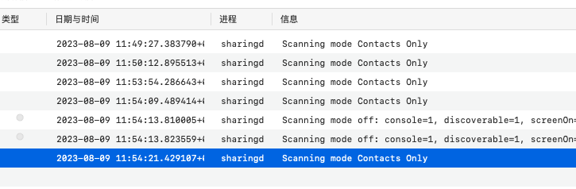](https://img2023.cnblogs.com/blog/2817142/202311/2817142-20231119205818891-1142795831.png)

结果为`Contacts Only`

## 2.AirDrop服务计划监听端口号是多少？

搜索`airdrop`

[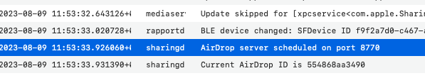](https://img2023.cnblogs.com/blog/2817142/202311/2817142-20231119205818979-1553137613.png)

结果为`8770`

## 3.AirDrop中接收到图片的识别码（identifier）是多少？

查看`sharingd`进程的日志

[](https://img2023.cnblogs.com/blog/2817142/202311/2817142-20231119205819238-997435814.png)

[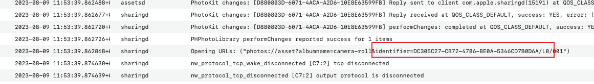](https://img2023.cnblogs.com/blog/2817142/202311/2817142-20231119205818763-1757192661.png)

结果为`DC305C27-CB72-4786-8E0A-5346CD7B0D6A`

## 4.AirDrop日志中可以看到几条接收记录？

往上面翻一翻，可以找到关键字

[](https://img2023.cnblogs.com/blog/2817142/202311/2817142-20231119205819339-1678660161.png)

搜索一下，看起来只有一条记录

[](https://img2023.cnblogs.com/blog/2817142/202311/2817142-20231119205819243-1405082508.png)

结果为`1`

## 5.AirDrop日志中可以分析出图片发送人是谁？

还是`sharingd`慢慢翻

[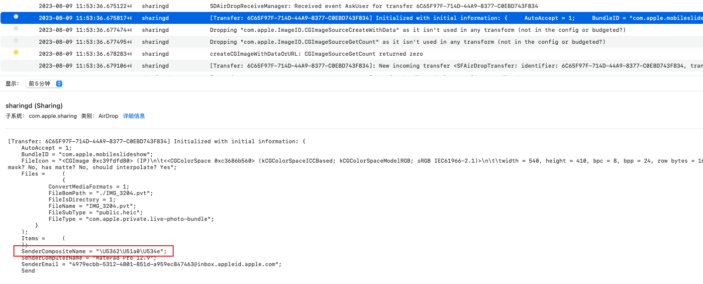](https://img2023.cnblogs.com/blog/2817142/202311/2817142-20231119205818947-1460819607.png)

解一下unicode

[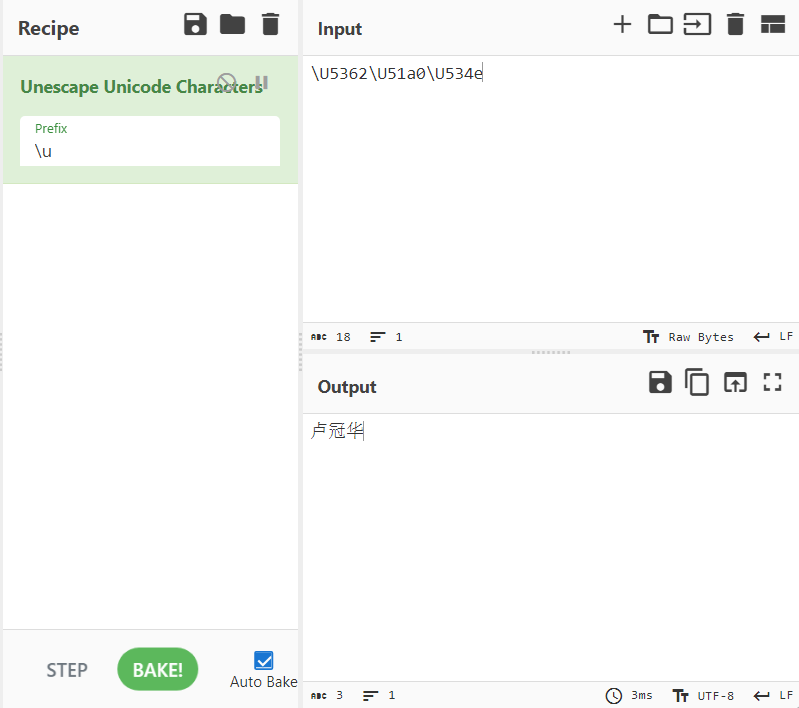](https://img2023.cnblogs.com/blog/2817142/202311/2817142-20231119205819068-386510242.png)

结果为`卢冠华`

## 6.AirDrop日志中可以分析出发送图片的设备名称是什么？

结果为`MatePad Pro 12.9`

## 7.AirDrop日志中可以分析出发送人AppleID邮箱是什么？

结果为`4979ecbb-5312-4801-851d-a959ec847463@inbox.appleid.apple.com`

## 8.AirDrop日志中可以分析出发送的图片文件名是什么？

结果为`IMG_3204.pvt`

## 9.AirDrop日志中可以分析投送嫌疑人的手机号的SHA256后五位是？

[](https://img2023.cnblogs.com/blog/2817142/202311/2817142-20231119205819130-34231109.png)

结果为`2d99d`

## 10.请结合工具分析日志，找出Airdrop投送方的手机号码？

有了手机号的`sha256`的前后10位，就可以爆破出手机号，实际上复杂度并非没有很高，关键是爆破手机号时，需要附带区号（airdrop取证这个小领域，实际上是由于去年开hui期间遇到的不可说案件，就是利用日志寻找哈希，爆破手机号、邮箱去锁定投送人，关键点在于手机号爆破需要加上区号，不然一辈子也跑不出来）（这里我已经知道了手机号了，所以把186提前了，方便截个图）脚本可以优化，但没必要，我只是说明一下为什么可以获取到手机号


```python
from hashlib import sha256
import sys

# 区号
area_code = "86"
# 常见手机号开头
begins = ["186","133","142","144","146","148","149","153","180","181","189","130","131","132","141","143","145","155","156","185","134","135","136","137","138","139","140","147","150","151","152","157","158","159","182","183","187","188"]
# 字符集
for begin in begins:
    for i in range(99999999):
        s256 = sha256()
        v = area_code+begin+"0"*(8-len(str(i))) + str(i)
        s256.update(v.encode('utf-8'))
        _hash = s256.hexdigest()
        if _hash[:5] == "eeb48" and _hash[-5:] == "2d99d":
            print("手机号已找到")
            print(begin+"0"*(8-len(str(i))) + str(i))
            sys.exit(0)
```

[](https://img2023.cnblogs.com/blog/2817142/202311/2817142-20231119205818753-1543823883.png)

各家厂商都已经有工具能够以极快的速度破解出手机号，或者是从制作好的彩虹表中直接获取结果

[](https://img2023.cnblogs.com/blog/2817142/202311/2817142-20231119205819104-400783567.png)

结果为`18697928485`

# 介质分析

## 1.请计算计算机检材2023FIC-PC.E01的原始磁盘的SHA256值？

源盘哈希，注意计算即可

[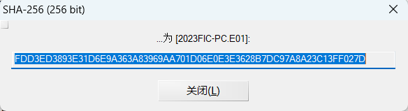](https://img2023.cnblogs.com/blog/2817142/202311/2817142-20231119205819099-1889411961.png)

结果为`FDD3ED3893E31D6E9A363A83969AA701D06E0E3E3628B7DC97A8A23C13FF027D`

## 2.检材2023FIC-PC.E01的计算机开机密码为？

sqlserver的连接密码为`PH4829118`

[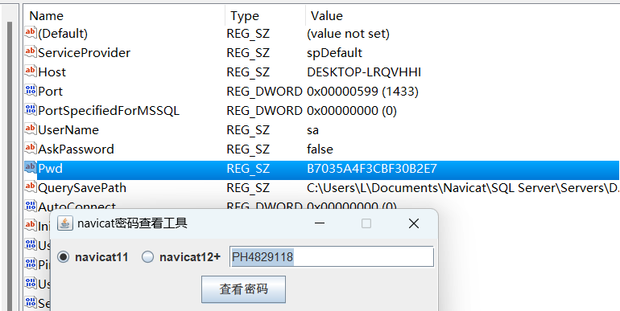](https://img2023.cnblogs.com/blog/2817142/202311/2817142-20231119205818889-1175054117.png)

再没有其他密码

实际上是个工具题，火眼仿真能获取到密码，需要有密码登录才能解开下面的efs加密

结果为`1qaz@WSX3edczhaohong`

## 3.请根据笔录交代，分析计算机检材，找出airdrop投递的图片内容中，违法网站的域名为？

看手笔录

[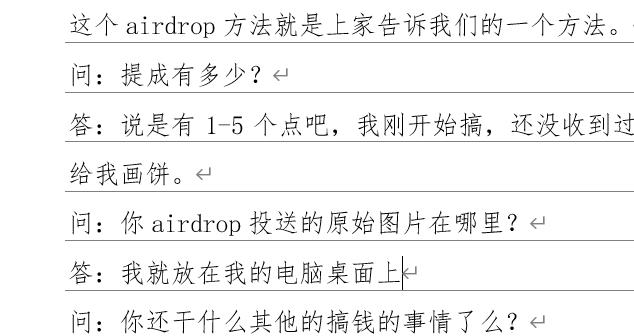](https://img2023.cnblogs.com/blog/2817142/202311/2817142-20231119205819073-1739288154.png)

可以看出是使用了`EFS`加密

[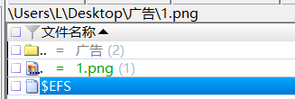](https://img2023.cnblogs.com/blog/2817142/202311/2817142-20231119205819140-6379134.png)

用上面的密码仿真进入系统，直接查看

[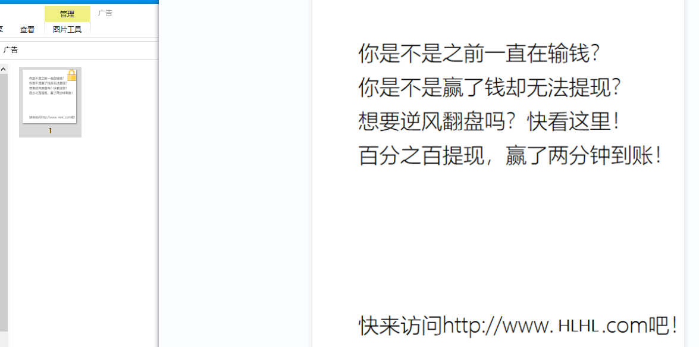](https://img2023.cnblogs.com/blog/2817142/202311/2817142-20231119205818916-291987749.png)

结果为`http://www.HLHL.com`

## 4.请计算嫌疑人计算机中名为“测试模拟器.ldbk”的文件的SHA256值？

根目录一个vhd镜像

[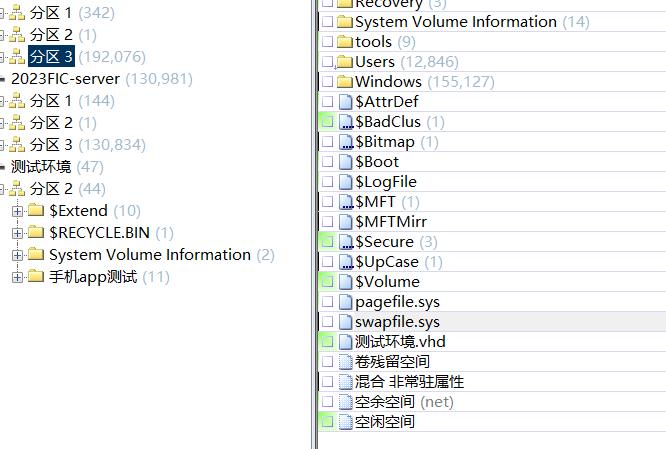](https://img2023.cnblogs.com/blog/2817142/202311/2817142-20231119205819170-619098974.png)

测试模拟器.ldbk再这个镜像里面

[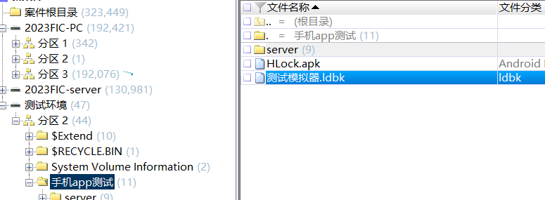](https://img2023.cnblogs.com/blog/2817142/202311/2817142-20231119205819105-324927491.png)

算个sha256

[](https://img2023.cnblogs.com/blog/2817142/202311/2817142-20231119205818822-2061170028.png)

结果为`053950850EC6200C1A06A84B6374BD62242064780F7F680CA23932EE53DC0110`

## 5.请根据笔录交代，分析计算机检材，钱包对应的秘钥计算过程中，调用了以下哪些算法？

**A. AES B. DES C. BASE58 D. BASE64 E. HKDF**

看笔录划重点，重点是`源码`

[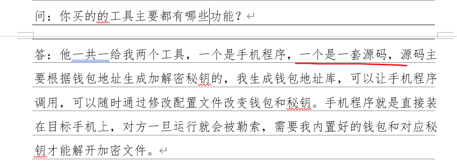](https://img2023.cnblogs.com/blog/2817142/202311/2817142-20231119205819173-1801862025.png)

[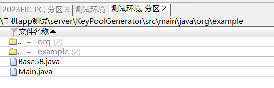](https://img2023.cnblogs.com/blog/2817142/202311/2817142-20231119205819143-1939806888.png)

一眼base58+hkdf

[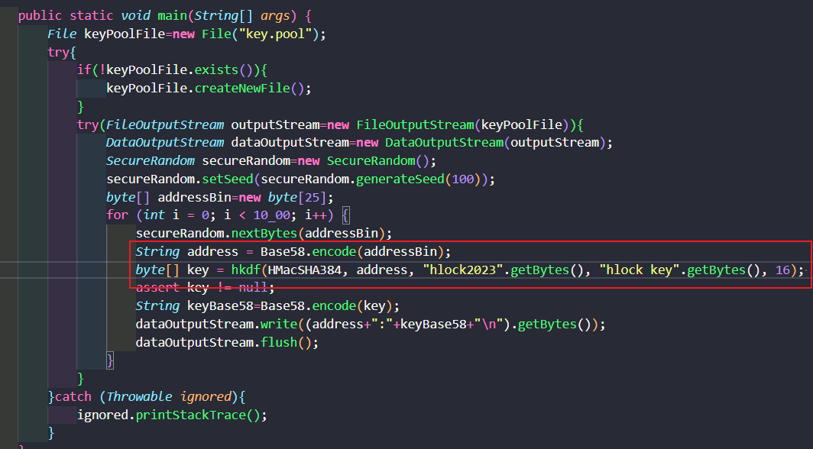](https://img2023.cnblogs.com/blog/2817142/202311/2817142-20231119205818871-1328603206.png)

结果为`CE`

## 6.请分析2023FIC-PC.E01检材，并回答，发现嫌疑人计算机中使用了哪种远程工具？

[](https://img2023.cnblogs.com/blog/2817142/202311/2817142-20231119205819259-824957753.png)

结果为`向日葵`

## 7.请综合分析检材,嫌疑人于2023年8月22日进行远程控制时，被控端的公网IP为？

根据日期看一手日志，主要不要答成上面那个，上面的是向日葵的服务器

[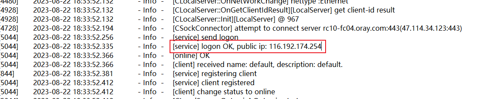](https://img2023.cnblogs.com/blog/2817142/202311/2817142-20231119205819261-643074992.png)

结果为`116.192.174.254`

## 8.请综合分析检材,嫌疑人于2023年8月22日进行远程控制时，被控端的内网IP为？

[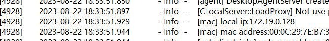](https://img2023.cnblogs.com/blog/2817142/202311/2817142-20231119205818852-49195594.png)

结果为`172.19.0.128`

## 9.请综合分析检材,嫌疑人于2023年8月22日进行远程控制时，被控端通过连接远程工具的中转服务器实现的P2P连接，该中转服务器的IP为？

注意是被控端，因此要去看被控服务器的向日葵日志

[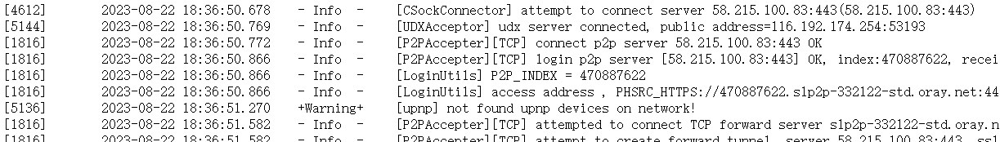](https://img2023.cnblogs.com/blog/2817142/202311/2817142-20231119205819228-809477881.png)

结果为`58.215.100.83`

## 10. 请综合分析检材,嫌疑人于2023年8月22日进行远程控制时，于什么时间释放远控行为？

控制端

[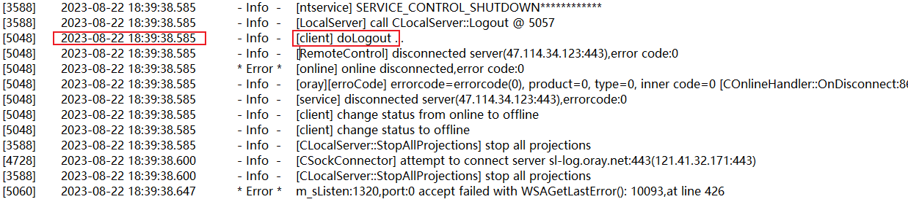](https://img2023.cnblogs.com/blog/2817142/202311/2817142-20231119205819227-1181018745.png)

被控端

[](https://img2023.cnblogs.com/blog/2817142/202311/2817142-20231119205818875-149342128.png)

[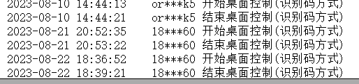](https://img2023.cnblogs.com/blog/2817142/202311/2817142-20231119205819295-12623320.png)

综合来看应该是21或者更早？

结果为`2023-08-22 18:39:21`

# APK分析

## 1.请计算APK勒索样本程序的SHA256值？

[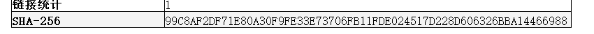](https://img2023.cnblogs.com/blog/2817142/202311/2817142-20231119205819227-936660239.png)

结果为`99C8AF2DF71E80A30F9FE33E73706FB11FDE024517D228D606326BBA14466988`

## 2.APK程序在勒索的时候会向服务器申请钱包地址，请问申请后台IP地址为？

点击地址时会弹出`已复制地址`

[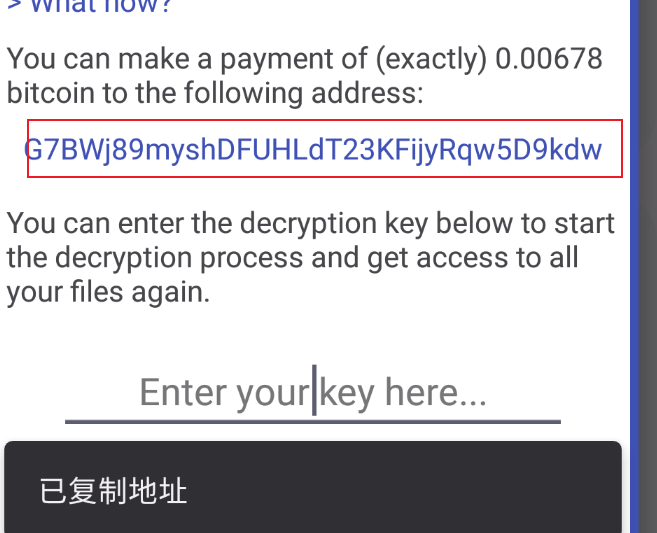](https://img2023.cnblogs.com/blog/2817142/202311/2817142-20231119205818898-1282813284.png)

因此在源码中搜索`clipboard`

[](https://img2023.cnblogs.com/blog/2817142/202311/2817142-20231119205819261-233558930.png)

[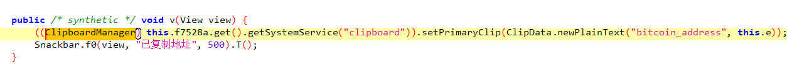](https://img2023.cnblogs.com/blog/2817142/202311/2817142-20231119205819315-1381197137.png)

查找引用，发现是个textView组件，设置的值为`e`，下面一个`z`方法恰好设置了`e`的值，上面有一串字符，调用的是`f`方法

[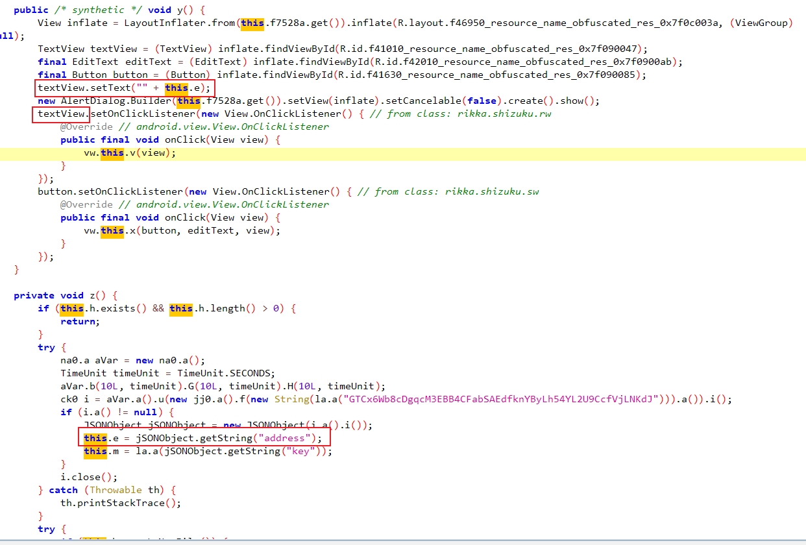](https://img2023.cnblogs.com/blog/2817142/202311/2817142-20231119205818928-521951203.png)

一眼请求相关

[](https://img2023.cnblogs.com/blog/2817142/202311/2817142-20231119205819266-737559474.png)

看引入字符的方法，就算没有异常里的提示，也可以通过字符集来判断是`Base58`

[](https://img2023.cnblogs.com/blog/2817142/202311/2817142-20231119205819155-1182437434.png)

解码

[](https://img2023.cnblogs.com/blog/2817142/202311/2817142-20231119205818915-840724037.png)

结果为`116.192.174.254`

## 3.APK从服务器端申请的包含钱包地址的配置文件的文件名为？

请求完看到后面有写文件的操作，调个引用直接出

[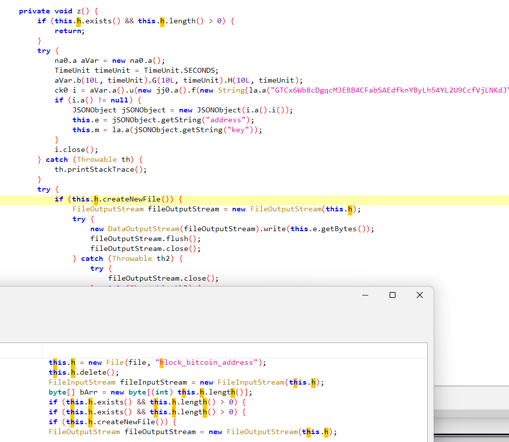](https://img2023.cnblogs.com/blog/2817142/202311/2817142-20231119205819173-145455282.png)

结果为`hlock_bitcoin_address`

## 4.APK程序在嫌疑人测试环境中，申请到的钱包地址为？

没必要问。。

结果为`G7BWj89myshDFUHLdT23KFijyRqw5D9kdw`

## 5.嫌疑人模拟器中，有测试文件被加密，该文件被加密后文件名为？

跟进上面写配置文件的类，可以找到加密的方法，加密文件会被加上`hlock`后缀

[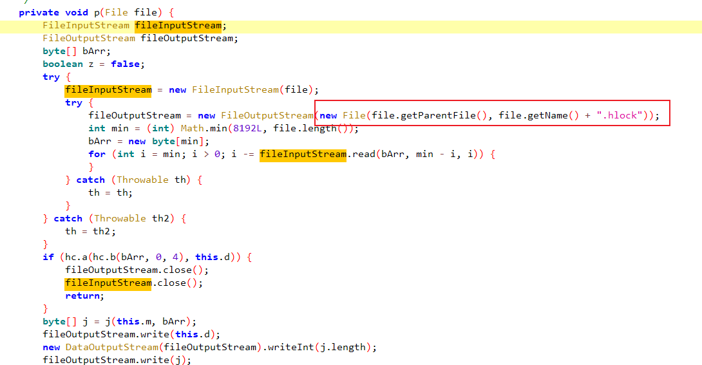](https://img2023.cnblogs.com/blog/2817142/202311/2817142-20231119205819313-1659375557.png)

[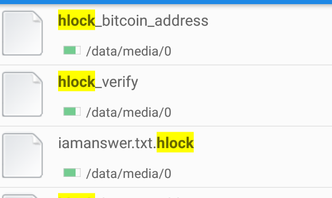](https://img2023.cnblogs.com/blog/2817142/202311/2817142-20231119205818914-1256043722.png)

结果为`iamanswer.txt.hlock`

## 6.APK程序勒索过程中，对于勒索文件使用的加密算法为？

调用`j`方法进行加密

[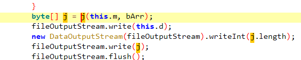](https://img2023.cnblogs.com/blog/2817142/202311/2817142-20231119205819110-1791109211.png)

[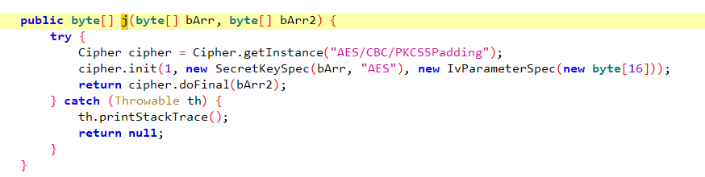](https://img2023.cnblogs.com/blog/2817142/202311/2817142-20231119205819328-136957122.png)

结果为`AES`

## 7.请综合分析检材,嫌疑人模拟器环境中，申请的钱包地址对应的加密秘钥为？

之前密钥生成的代码中，将密钥写入到`key.pool`中，从服务器中找到`key.pool`

[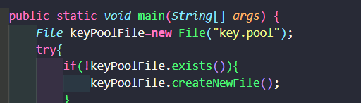](https://img2023.cnblogs.com/blog/2817142/202311/2817142-20231119205818867-272941354.png)

[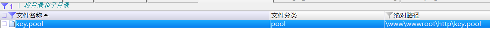](https://img2023.cnblogs.com/blog/2817142/202311/2817142-20231119205819305-833693489.png)

[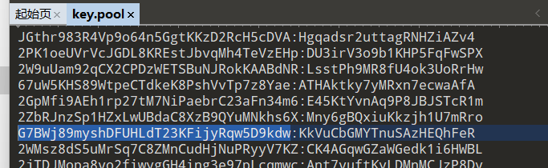](https://img2023.cnblogs.com/blog/2817142/202311/2817142-20231119205819316-433111847.png)

结果为`KkVuCbGMYTnuSAzHEQhFeR`

## 8.嫌疑人模拟器中，有测试文件被加密，被加密文件的文件内容为？

打开app，输入上题密码就可以直接解密了

[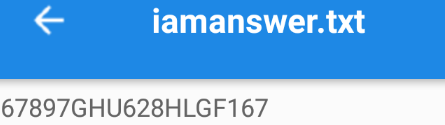](https://img2023.cnblogs.com/blog/2817142/202311/2817142-20231119205818921-1483967248.png)

结果为`67897GHU628HLGF167`

## 9.请综合分析检材,嫌疑人的秘钥库文件的sha256值为？

[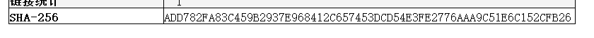](https://img2023.cnblogs.com/blog/2817142/202311/2817142-20231119205819284-30376789.png)

结果为`ADD782FA83C459B2937E968412C657453DCD54E3FE2776AAA9C51E6C152CFB26`

## 10. 如果嫌疑人使用的勒索钱包为74Vmx83bYvuhffEHnxVNnbbq9d1AAfJhXZ，那么该钱包对应的加密KEY为？

已生成的密钥里没有，那么就是要自己生成一下

[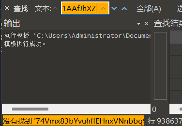](https://img2023.cnblogs.com/blog/2817142/202311/2817142-20231119205819314-46104635.png)

[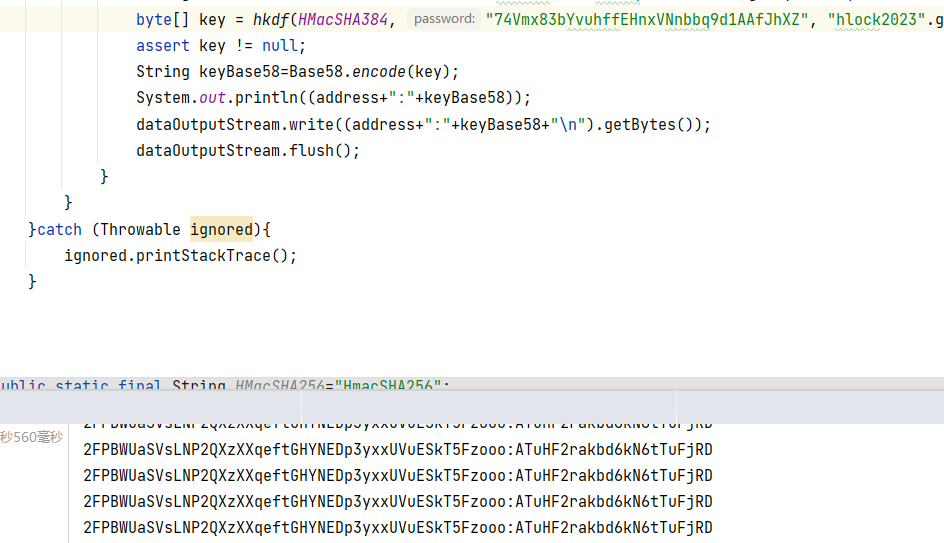](https://img2023.cnblogs.com/blog/2817142/202311/2817142-20231119205818922-795806976.png)

结果为`ATuHF2rakbd6kN6tTuFjRD`

# 数据分析

## 1.请分析服务器中嫌疑人用于赚钱的sql程序，数据库中的用户记录总共有多少条？

导出sql，本地建个mysql环境

[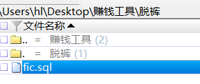](https://img2023.cnblogs.com/blog/2817142/202311/2817142-20231119205819307-1745043966.png)

[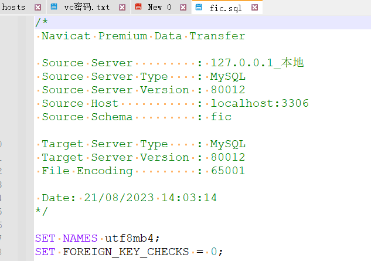](https://img2023.cnblogs.com/blog/2817142/202311/2817142-20231119205819258-68568434.png)

[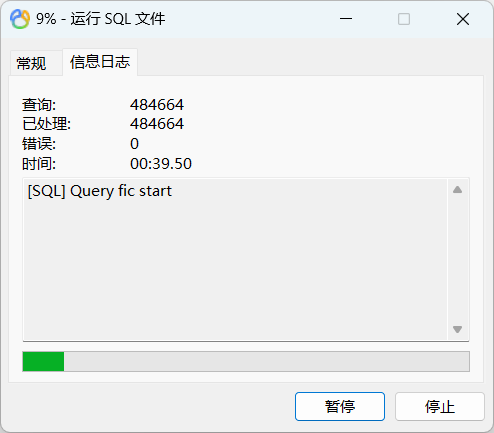](https://img2023.cnblogs.com/blog/2817142/202311/2817142-20231119205818921-1508271894.png)

[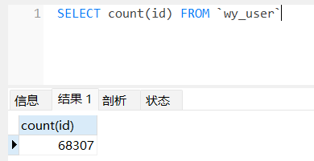](https://img2023.cnblogs.com/blog/2817142/202311/2817142-20231119205819297-1224819495.png)

结果为`68307`

## 2.请分析服务器中嫌疑人用于赚钱的sql程序，用户最早的注册日期是什么？

[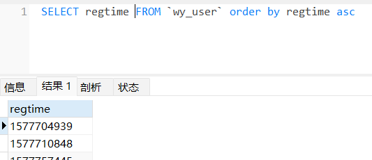](https://img2023.cnblogs.com/blog/2817142/202311/2817142-20231119205819306-163374955.png)

[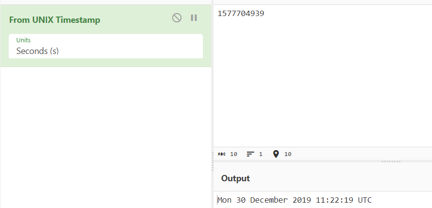](https://img2023.cnblogs.com/blog/2817142/202311/2817142-20231119205818887-392449072.png)

结果为`2019-12-30 19:22:19 UTC+8`

## 3.请分析服务器中嫌疑人用于赚钱的sql程序，用户数据中的最深层级的用户名为？[组织架构中最大层数]

代理层级，需要用到mysql递归，mysql的版本要大于8，可以只把user表复制过去计算，提前修改`UserName`和`pid`的类型为`longtext`，以防层级不够


```sql
WITH RECURSIVE CTE AS (
  SELECT UserName, pid, CONCAT('->', UserName) AS Path
  FROM wy_user
  WHERE pid is null
  
  UNION ALL
  
  SELECT t.UserName, t.pid, CONCAT(CTE.Path, '->', t.UserName)
  FROM wy_user t
  INNER JOIN CTE ON t.pid = CTE.UserName
)
SELECT UserName, pid, Path
FROM CTE
ORDER BY UserName;
```

[](https://img2023.cnblogs.com/blog/2817142/202311/2817142-20231119205819288-765605401.png)

sql跑的时间挺长的，就不让它排序了，导出csv写个脚本看看是谁


```python
with open('daili.csv','r',encoding="utf-8") as fr:
    data = fr.readlines()
    mx = 0
    user = ""
    for v in data:
        t = v.split(",")
        path = t[2]
        length = len(path)
        if length > mx:
            mx = length
            user = t[0]
print("层级最深的是："+user)
```

[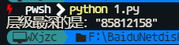](https://img2023.cnblogs.com/blog/2817142/202311/2817142-20231119205819331-786730399.png)

[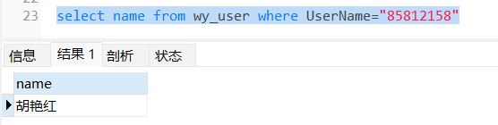](https://img2023.cnblogs.com/blog/2817142/202311/2817142-20231119205818892-1434122699.png)

结果为`胡艳红`

## 4.请分析服务器中嫌疑人用于赚钱的sql程序，直接奖励的总金额是多少？

好家伙要的全都有，估计也是不用看明细了

[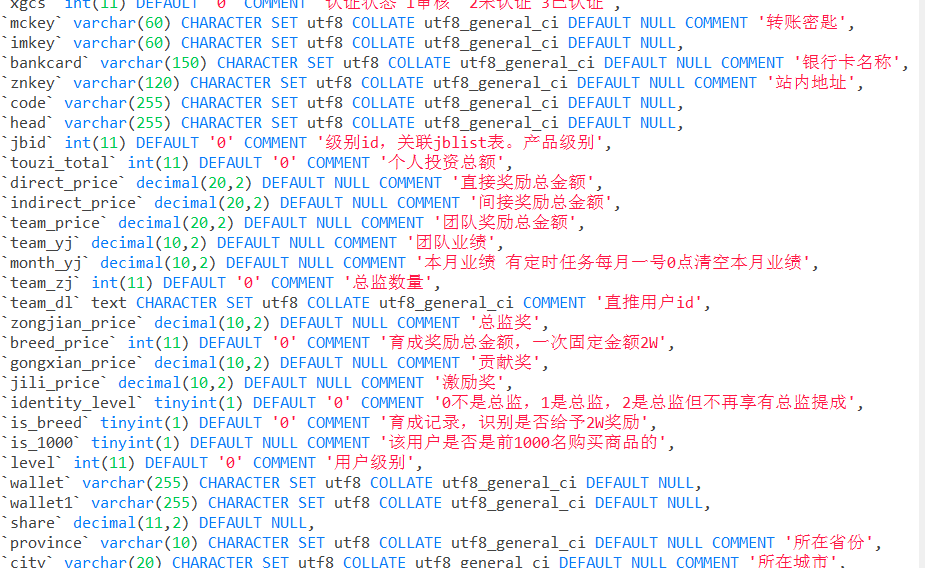](https://img2023.cnblogs.com/blog/2817142/202311/2817142-20231119205819268-217871559.png)

[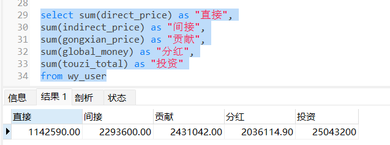](https://img2023.cnblogs.com/blog/2817142/202311/2817142-20231119205819315-1978584905.png)

结果为`1142590.00`

## 5.请分析服务器中嫌疑人用于赚钱的sql程序，间接奖励的总金额是多少？

结果为`2293600.00`

## 6.请分析服务器中嫌疑人用于赚钱的sql程序，贡献奖的总金额是多少？

结果为`2431042.00`

## 7.请分析服务器中嫌疑人用于赚钱的sql程序，全球分红奖励的总金额是多少？

结果为`2036114.90`

## 8.请分析服务器中嫌疑人用于赚钱的sql程序，个人投资的总金额是多少？

结果为`25043200`

## 9. 请分析服务器中嫌疑人用于赚钱的sql程序，没有上线也没有下线的用户数量是多少？

不知道为啥之前排层级的时候，除了`35999866`的下线，其他人都没有排到下线（估计是SQL没写好），好在可以过滤出这些数据，280个，再查询是否存在下级，有`8`个存在下级

[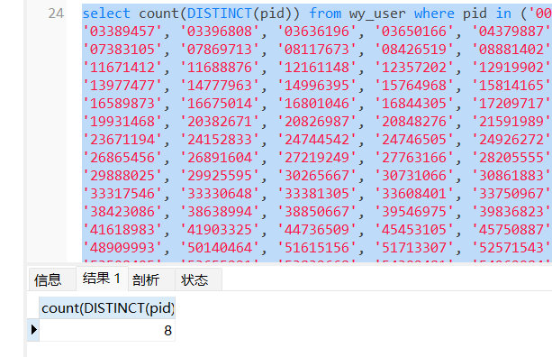](https://img2023.cnblogs.com/blog/2817142/202311/2817142-20231119205818913-1023798192.png)

结果为`272`

## 10.请分析服务器中嫌疑人用于赚钱的sql程序，没有上线但有下线的用户数量有多少？

结果为`8`

# 程序分析

## 1.请分析服务器中嫌疑人用于赚钱的exe程序，并计算其md5值？

[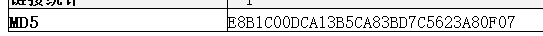](https://img2023.cnblogs.com/blog/2817142/202311/2817142-20231119205819352-1507335430.png)

结果为`E8B1C00DCA13B5CA83BD7C5623A80F07`

## 2.请分析服务器中嫌疑人用于赚钱的exe程序，编译此程序的计算机用户名是什么？

微步，能梭的都梭了

[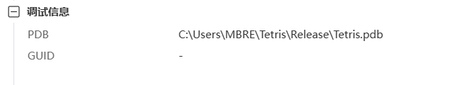](https://img2023.cnblogs.com/blog/2817142/202311/2817142-20231119205819303-1557335284.png)

结果为`MBRE`

## 3.请分析服务器中嫌疑人用于赚钱的exe程序，本程序一共创建了几个窗口？

`WinMain`函数中

[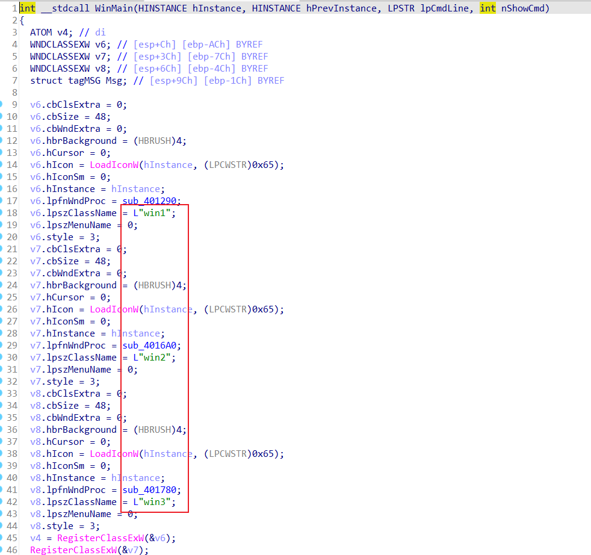](https://img2023.cnblogs.com/blog/2817142/202311/2817142-20231119205818948-749425880.png)

结果为`3`

## 4.请分析服务器中嫌疑人用于赚钱的exe程序，窗口1中所显示的内容是什么？

看一下值

[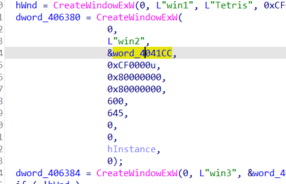](https://img2023.cnblogs.com/blog/2817142/202311/2817142-20231119205819308-1601717529.png)

切换编码后是`窗口1`

[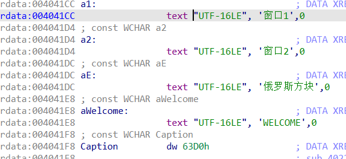](https://img2023.cnblogs.com/blog/2817142/202311/2817142-20231119205819343-836993180.png)

跟一下调用，之前可以知道`hWnd`是第一个窗口，这里出现了，说明跟之前的游戏窗口有关

[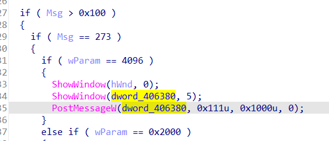](https://img2023.cnblogs.com/blog/2817142/202311/2817142-20231119205818920-1955482699.png)

查看调用，可以找到`PostMessageW`传入的参数中出现过`hWnd`，并且传入的参数与上图的要求匹配`0x111=273`,`0x1000=4096`，因此只需要看`dword_406394`

[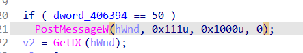](https://img2023.cnblogs.com/blog/2817142/202311/2817142-20231119205819323-568654003.png)

跟一下，可以知道这个是分数，需要打到50分

[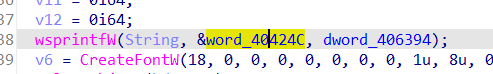](https://img2023.cnblogs.com/blog/2817142/202311/2817142-20231119205819344-33257491.png)

[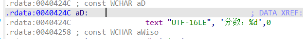](https://img2023.cnblogs.com/blog/2817142/202311/2817142-20231119205818904-1582019466.png)

游戏时间，或者od直接改

[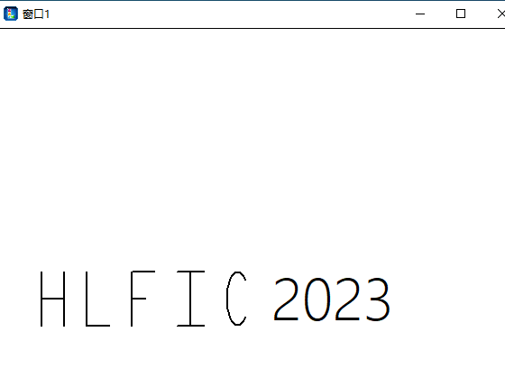](https://img2023.cnblogs.com/blog/2817142/202311/2817142-20231119205819336-1043796258.png)

结果为`HLFIC 2023`

## 5.请分析服务器中嫌疑人用于赚钱的exe程序，窗口1中所显示的内容使用了什么字体？

这里靠猜，设置字体跟font相关，找到这里的`CreateFontW`（其实是微步上见到了`YaHei`）

[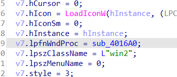](https://img2023.cnblogs.com/blog/2817142/202311/2817142-20231119205819335-940067145.png)

[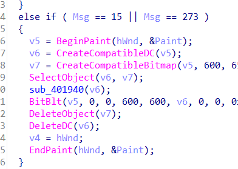](https://img2023.cnblogs.com/blog/2817142/202311/2817142-20231119205818927-850519503.png)

[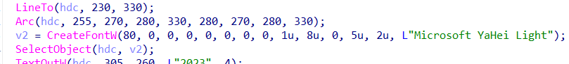](https://img2023.cnblogs.com/blog/2817142/202311/2817142-20231119205819328-1762628607.png)

[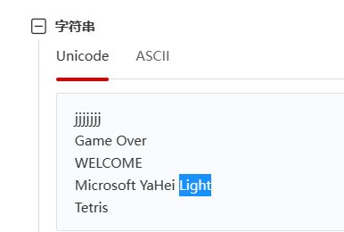](https://img2023.cnblogs.com/blog/2817142/202311/2817142-20231119205819315-1393779037.png)

结果为`Microsoft YaHei Light`

## 6. 请分析服务器中嫌疑人用于赚钱的exe程序，窗口1中显示的字符串第一笔的长度为多少像素？

恰好就在字体设置的地方，创建了一个pen来绘画，先移动到`50,270`，然后划线到`50,330`，50个像素

[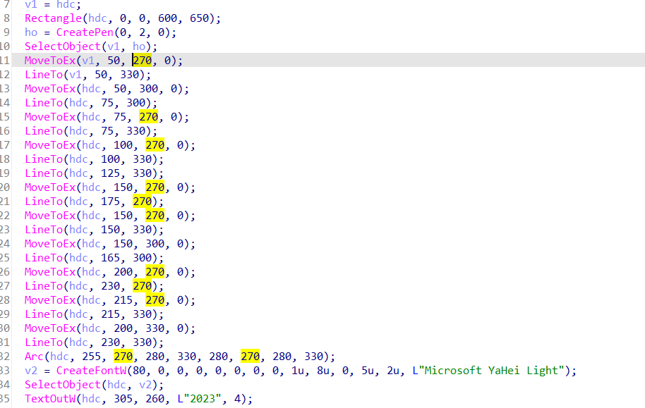](https://img2023.cnblogs.com/blog/2817142/202311/2817142-20231119205818882-1625283543.png)

结果为`50`

## 7.请分析服务器中嫌疑人用于赚钱的exe程序，窗口2中解密字符串所使用的密钥为？

跟`窗口1`一样来跟

[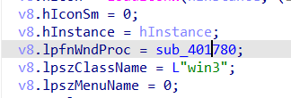](https://img2023.cnblogs.com/blog/2817142/202311/2817142-20231119205819336-328882498.png)

[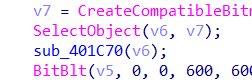](https://img2023.cnblogs.com/blog/2817142/202311/2817142-20231119205819300-946771623.png)

[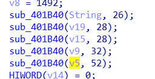](https://img2023.cnblogs.com/blog/2817142/202311/2817142-20231119205818834-216608753.png)

[](https://img2023.cnblogs.com/blog/2817142/202311/2817142-20231119205819386-1931598688.png)

拿去问gpt就知道是`rc4`

[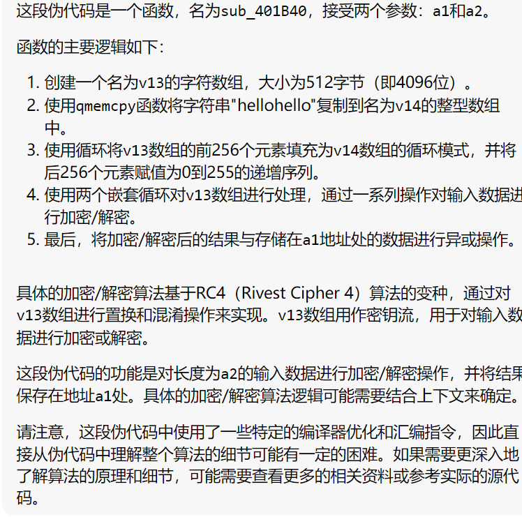](https://img2023.cnblogs.com/blog/2817142/202311/2817142-20231119205819484-1040941761.png)

结果为`hellohello`

## 8."请分析服务器中嫌疑人用于赚钱的exe程序，窗口2中使用了解密算法为？

**A. RC4 B. AES C. DES D. SHA256 E. ECC**

结果为`A`

## 9.请分析服务器中嫌疑人用于赚钱的exe程序，在俄罗斯方块游戏中，在键盘上依次按下哪些键可以进入窗口2？

这里需要`wParam`为`0x2000`

[](https://img2023.cnblogs.com/blog/2817142/202311/2817142-20231119205818927-1460719221.png)

跟一下找到函数，跟这个变量半天没啥东西

[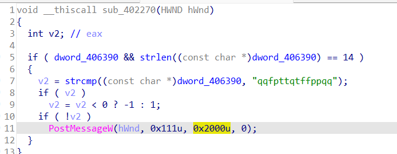](https://img2023.cnblogs.com/blog/2817142/202311/2817142-20231119205819360-1318765308.png)

不过可以判断出这个变量其实就是输入的内容

[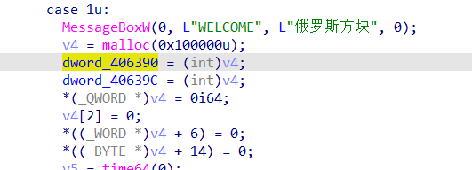](https://img2023.cnblogs.com/blog/2817142/202311/2817142-20231119205819335-1470103125.png)

跟进`dword_40639C`，则有发现，将case和值转为char后，可以看到按键的对应关系`A->f,D->p,S->q,W->t`

[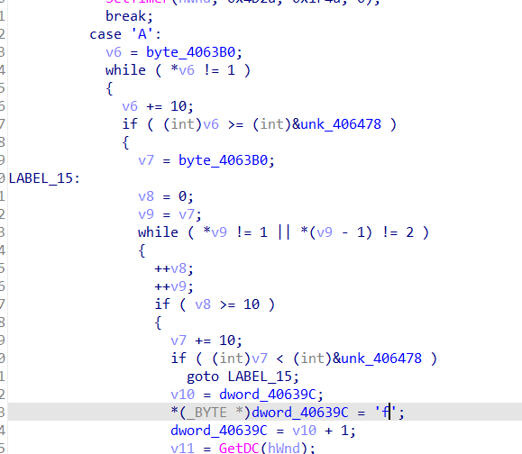](https://img2023.cnblogs.com/blog/2817142/202311/2817142-20231119205818921-209619013.png)

[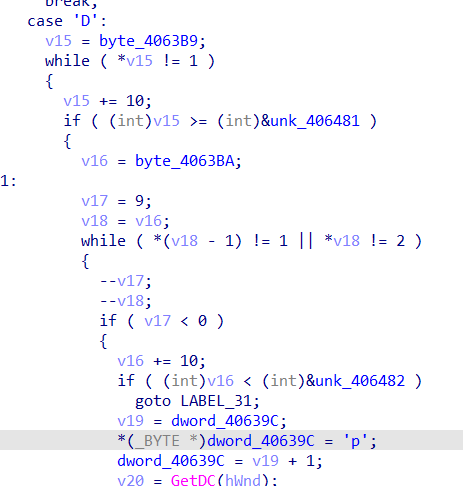](https://img2023.cnblogs.com/blog/2817142/202311/2817142-20231119205819266-1161208057.png)

[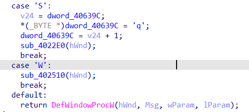](https://img2023.cnblogs.com/blog/2817142/202311/2817142-20231119205819350-1692529502.png)

[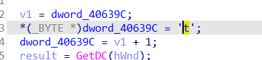](https://img2023.cnblogs.com/blog/2817142/202311/2817142-20231119205818915-438804790.png)

所以`qqfpttqtffppqq`对应过来就是`SSADWWSWAADDSS`

## 10.窗口2植入的告中，赌博网站的域名为?

[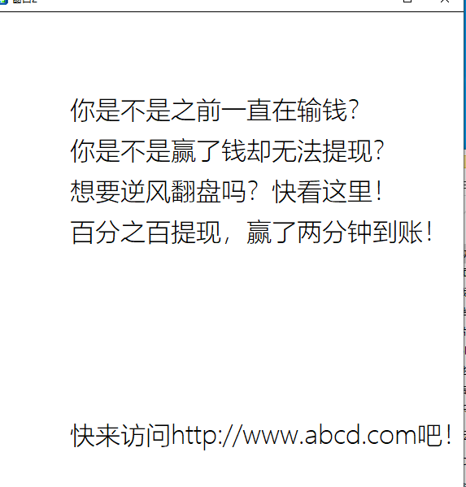](https://img2023.cnblogs.com/blog/2817142/202311/2817142-20231119205819253-1041248566.png)

结果为`www.abcd.com`