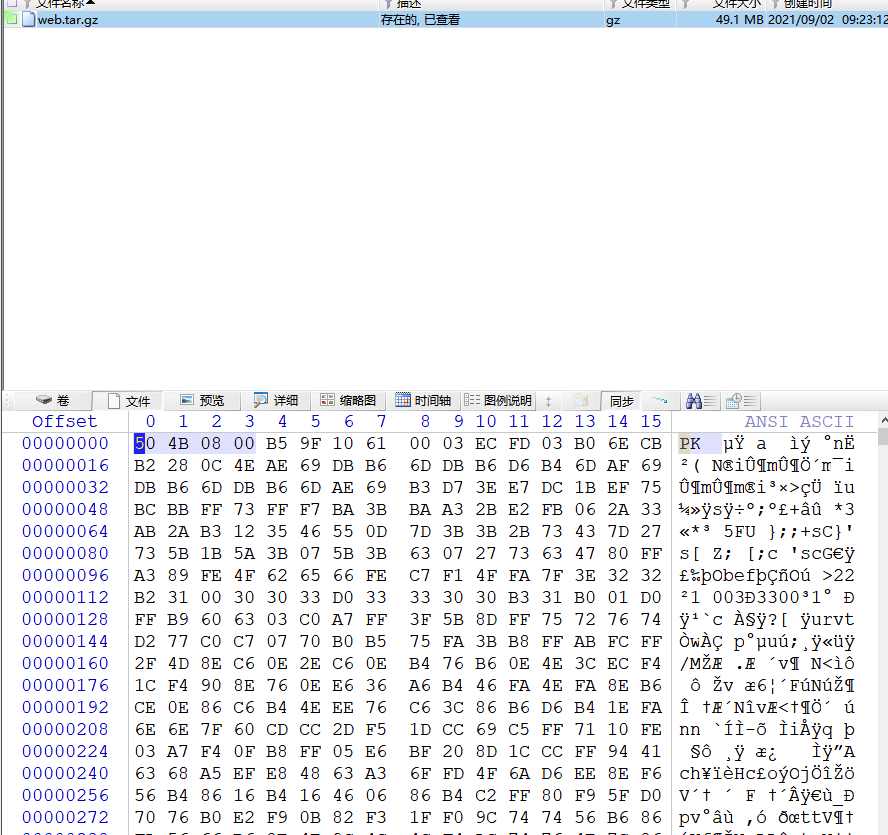
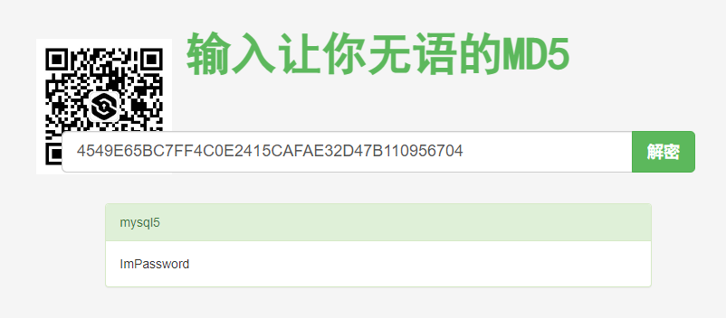

# 2022-CNASGA-IT2

**受疫情影响，线上办公已成为全球各地工作的主要方式，同时线上投资也逐渐增多。某公司通过网站告知投资者，投资该公司的运营项目，可获得高额回报。现获取包含该公司投资网站和****数据库****的磁盘镜像文件，需在该磁盘镜像（包括被删除的文件）中提取和****分析****该网站和****数据库中****包含****的****电子证****据****。**

1、计算样品压缩包中镜像文件“*.dd”的SHA256哈希值为（）。

取证大师计算

结果为`D7467C97B8B314D26B1BD145E8BACA0C725090FA96453965DD3A4BF3C6AC19D7`

2、网站使用的MySQL数据库的版本为（）。

结果为`5.7.35`

3、网站使用的MySQL数据库名称为（）。

在home目录找到网站的配置文件，查看到数据库的用户名与密码

其中用户名为`root`，其密码为`2021msql@PT`

登录到数据库当中，发现除默认数据库之外只有一个数据库

结果为`pt`

4、MySQL数据库的general_log日志文件的SHA256校验值为（）。

使用命令`show variables like '%log%';`查看，发现了general_log的文件目录为`/var/lib/mysql/localhost.log`

计算sha256得到结果

结果为`C26D88129FAB6C5846BB2340B5871463A4CADB63EC4C423F15E1607E6B5AA645`

5、数据库备份文件（bak.sql）的SHA256校验值为（）。

检索到备份文件目录

进入目录查看不到文件

取证大师发现文件被删除

使用UFS恢复文件，得到的结果虽然没有乱码，但内容并不是dump出的sql文件结构

通过同样的命令dump出一个sql文件，观察文件特征

发现在文件首部有“MySQL dump 10.13”字样，在尾部有“Dump completed on”字样，通过在X-Ways Forensics 中检索关键字“Dump completed on 202”，可以找到对应的文件块

选择块尾部

选择块起始位置

将选块视为文件

以bak.sql保存

计算sha256得到结果

结果为`196F11F042D7F5F04F9884C9EA2D0DD83249D6A87605F5C8F1041EC0A336B258`

6、网站备份文件中配置文件（*.properties）的SHA256校验值为（）。

找到备份文件，但是解压时报错

导出使用7zip解压依旧报错，查看文件结构

文件头不匹配，将文件头的`504B08`改为`1F8B08`

成功解压并计算sha256

结果为`6C3890BAB0FA61333BD8A29B4679C66130920807AE38AE98E2136814A64DD523`

7、MySQL数据库用户remote的密码为（）。

登录mysql，使用sql语句`select User,authentication_string from user where User='remote';`进行检索

在网站解md5

结果为`ImPassword`

8、数据库表sys_user中的用户类型为user的用户数为（）。

使用sql语句`select * from sys_user where role='user';`进行查询

结果为`6`

9、网站首页中显示的最后发布的文章的标题为（）。

通过查看历史命令发现这个web服务已经被设置了开启自启动

查看配置文件和ip地址可以确定ip和端口分别为`192.168.159.128`和`8090`

无法直接访问

但是可以访问后台

到数据库中查找用户名与密码

成功登入后台页面

根据时间找到最后发布的文章标题

结果为`Meet the teen investors of the future`

10、网站用户John投资成功的金额总和为（）。

查看网站后台数据，发现John的投资flag为`failed`，并没有投资成功

结果为`0`