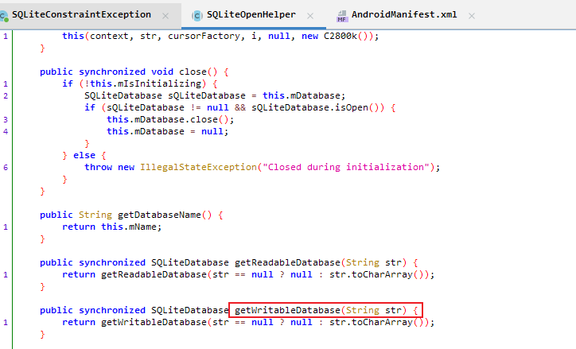

# 2022GA-CNAS-03

## 1. 请计算样品npbk文件的SHA256哈希值。

[](https://img2022.cnblogs.com/blog/2817142/202210/2817142-20221020192622472-246400277.png)

结果为`f182d203fa971fe606bde63266ebaab44f0cef6ab41cd1a58332d5717ad30d1d`

## 2. 请列出检验过程中所有使用的方法标准和软硬件工具。（提示：标准需包含编号，软件设备需包含版本号）

 

## 3. 请列出抖音用户“11”的抖音号。

使用`夜神模拟器`导入`2022GA-CNAS-03.npbk`备份文件，需要提前下载`Android7 64bit`的模拟器文件

[](https://img2022.cnblogs.com/blog/2817142/202210/2817142-20221020192632324-1061748557.png)

[](https://img2022.cnblogs.com/blog/2817142/202210/2817142-20221020192642326-301527254.png)

登录抖音，在消息栏中发现用户`11`，查看其个人资料，发现抖音号`1983348598`

[](https://img2022.cnblogs.com/blog/2817142/202210/2817142-20221020192656476-343492245.png)

[](https://img2022.cnblogs.com/blog/2817142/202210/2817142-20221020192703860-1503988849.png)

结果为`1983348598`

## 4. 请列出包含涉案地理坐标的文件“1.txt”的SHA256哈希值。

发现在抖音和skred中，都有一张比较相似的风景图片，通过比对skred和抖音中的图片，两张图片的高度不一致

[](https://img2022.cnblogs.com/blog/2817142/202210/2817142-20221020192711509-1328612036.png)

根据高度不一致，怀疑抖音中的图片的高度被修改，导致图片显示不全，因此将抖音中的图片的高度改为`1080`，利用winhex将如图位置的`0408`修改为`0438`

[](https://img2022.cnblogs.com/blog/2817142/202210/2817142-20221020192722145-1991370382.png)

保存后重新打开图片，发现数据`2022-pt@SKSB`

[](https://img2022.cnblogs.com/blog/2817142/202210/2817142-20221020192748067-167274670.png)

使用winhex查看skred中图片数据，发现在尾部存在rar压缩文件数据

[](https://img2022.cnblogs.com/blog/2817142/202210/2817142-20221020192754529-2066121762.png)

用`7z`打开该图片，并使用`2022-pt@SKSB`解压，得到`1.txt`

[](https://img2022.cnblogs.com/blog/2817142/202210/2817142-20221020192802098-1527205764.png)

计算`1.txt`的sha256哈希值为3e1bc3d561b7d0631f6ce0997f476042f59f94305fd55021083a18f883365839

[](https://img2022.cnblogs.com/blog/2817142/202210/2817142-20221020192806541-1128543411.png)

结果为`3e1bc3d561b7d0631f6ce0997f476042f59f94305fd55021083a18f883365839`

## 5. 请列出即时通讯软件skred用户“zs”和“啦啦啦”间传输的加密压缩包的密码。

使用第4点的密码解压，可以成功解压

结果为`2022-pt@SKSB`

## 6. 请列出skred聊天记录中用户“zs”发出的语音对应音频文件的SHA256哈希值。

在路径`/data/data/mobi.skred.app/files/conversations/7a66d8c7-33c6-48d6-aee3-1114a31d96f2`下

[](https://img2022.cnblogs.com/blog/2817142/202210/2817142-20221020192812306-1076685937.png)

计算sha256值

[](https://img2022.cnblogs.com/blog/2817142/202210/2817142-20221020192817017-2010378772.png)

结果为`e1ff088740121574b92f298ef167c2202b6847e3e26257625b5c0bd2b1c8ba74`

## 7. 请列出skred数据库表“conversationConversation”中用户“啦啦啦”的uuid。

skred采用了严格的反调试，我个人未解决，以下是逆向大佬解开数据库的过程，弘连的雷电里有通杀脚本也可以解出来

> skred 使用 SQLCipher 数据库进行加密。
>
> 给定的模拟器对于常规的 HOOK 工具兼容性不好，采用 DEX 注入方式获取数据库密钥。
>
> net.sqlcipher.database.SQLiteOpenHelper 类的第一个参数为数据库密钥
>
> [](https://img2022.cnblogs.com/blog/2817142/202210/2817142-20221020192917454-1700003374.png)
>
> [](https://img2022.cnblogs.com/blog/2817142/202210/2817142-20221020192927165-828233111.png)
>
> 注入代码：
>
> [](https://img2022.cnblogs.com/blog/2817142/202210/2817142-20221020192933528-970212666.png)
>
> 注入位置：
>
> [](https://img2022.cnblogs.com/blog/2817142/202210/2817142-20221020192938693-1176965094.png)
>
> 将注入程序编译为 smali
>
> [](https://img2022.cnblogs.com/blog/2817142/202210/2817142-20221020192943672-1328331401.png)
>
> 使用 baksmali.jar 和 smail.jar 修改程序原始 DEX 文件并且替换
>
> 将修改后的 apk 直接替换到安装路径（ROOT权限），重新运行程序。
>
> 在 logcat 中找到密码
>
> [](https://img2022.cnblogs.com/blog/2817142/202210/2817142-20221020192948578-1460949966.png)

拿到密码后使用 DB Browser for SQLCipher 打开并查看数据库（SQLCipher4 默认配置）

[](https://img2022.cnblogs.com/blog/2817142/202210/2817142-20221020192953481-137217335.png)

[](https://img2022.cnblogs.com/blog/2817142/202210/2817142-20221020192957792-414733852.png)

[](https://img2022.cnblogs.com/blog/2817142/202210/2817142-20221020193002580-745400383.png)

根据上题文件路径得到uuid

结果为`d4d6d48f-2e9c-4a08-81d1-1e1c535cda92`

### 后续

后来深入学习了一下hook，发现可以通过hook来搞到数据库的秘钥，所以用自己的手机又试了一下

我们想要获取`net.sqlcipher.database.SQLiteOpenHelper.getWritableDatabase()`方法的`str`参数

[](https://img2022.cnblogs.com/blog/2817142/202211/2817142-20221104163328413-2054738586.png)

代码如下


```javascript
setImmediate(function () {
    Java.perform(function () {
      	//hook类
        var clazz = Java.use("net.sqlcipher.database.SQLiteOpenHelper");
        //hook重载方法
        clazz.getWritableDatabase.overload("java.lang.String").implementation = function(arg){
            console.log("数据库秘钥："+arg);
            var res = this.getWritableDatabase(arg);
            return res
        }
    });
})
```

采用`spawn`附加，运行结果如下

[](https://img2022.cnblogs.com/blog/2817142/202211/2817142-20221104163328435-726190027.png)

通过这个秘钥成功打开我手机上的数据库

## 8. 请列出skred聊天记录中传输的压缩文件“2.rar”对应的原始文件名称。（提示：答案格式“文件名.文件后缀”）

将聊天记录中的两个压缩包保存下来，和文件路径中的2.rar进行哈希值比较

[](https://img2022.cnblogs.com/blog/2817142/202210/2817142-20221020193006881-5225737.png)

结果为`t1.rar`

## 9. 请列出skred用户“zs”和“啦啦啦”最终确认的行动地点。（提示：填写行动地点的名称）

在skred的聊天记录中确定最终行动地点为zx发送的图片拍摄的地点

[](https://img2022.cnblogs.com/blog/2817142/202210/2817142-20221020193011698-873381167.png)

该图片中显示的地名模糊不清

[](https://img2022.cnblogs.com/blog/2817142/202210/2817142-20221020193016569-215151450.png)

在QQ中发送的压缩包（路径\media\0\Android\data\com.tencent.mobileqq\Tencent

\QQfile_recv\916.rar）中有更清晰的图片

[](https://img2022.cnblogs.com/blog/2817142/202210/2817142-20221020193021009-915571480.png)

结果为`苏州工业园区星洋学校`

## 10.请列出QQ号码为“1814194536”的用户在样品安卓虚拟机中存储的真实身份证号码。（提示：填写答案应为18位字符且唯一）

在\media\0\Android\data\com.tencent.mobileqq\Screenshot\Screenshot_20220123-091611_QQ.jpg发现截图

[](https://img2022.cnblogs.com/blog/2817142/202210/2817142-20221020193026109-2135935149.png)

截图中展示了身份证号码

[](https://img2022.cnblogs.com/blog/2817142/202210/2817142-20221020193030202-636027231.png)

结果为`920211198611121234`

[](https://img2022.cnblogs.com/blog/2817142/202210/2817142-20221020192149991-1440520256.png)