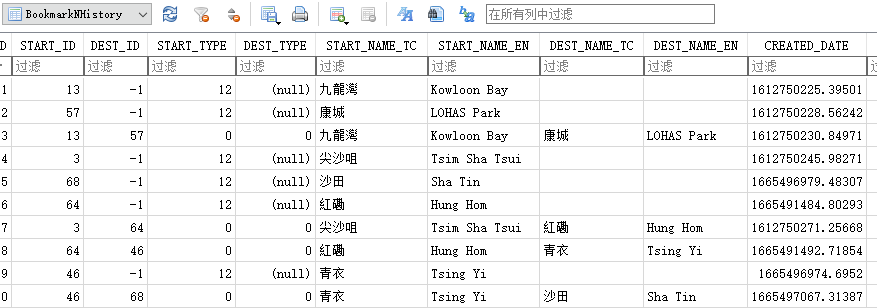
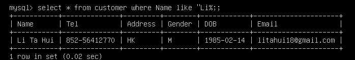

# 2022美亚杯-资格赛

https://www.cnblogs.com/WXjzc/p/16908435.html

# 背景

于2022年10月，有市民因接获伪冒快递公司的电邮，不慎地于匪徒架设的假网站提供了个人信用咭资料导致经济损失。 警方追查下发现当中一名受骗市民男子李大輝 (TaiFai) 的信用卡曾经被匪徒在区内的商舖购物。 后来警方根据IP地址，锁定及拘捕了一名男子林浚熙 （阿熙 ChunHei），并于他的居所发现了一批相信曾被用作犯案的电脑及手机装置。

经调查后，警方发现阿熙除上述案件外，他亦牵涉其他的一些犯罪活动。

警方的电子数据取证小组在现场作出初步了调查并对涉案装置进行了电子数据取证。请你根据得到的资料，协助将事件经过还原。

# 分析

## 61. [填空题]王晓琳手机的 'IMEI' 号是什么? (以阿拉伯数字回答) (1分)

查看备份文件中的`info.plist`

或者取证软件分析

结果为`352978115584444352978116182982`

## 62. [多选题]王晓琳的手机安装了什么即时通讯软件 (Instant Messaging Apps)? (1分)

A. WhatsApp

B. QQ

C. 微讯 (WeChat)

D. LINE

E. Signal

查看`info.plist`

或者取证软件分析

结果为`ACE`

## 63. [单选题]王晓琳于什么日子和时间曾经通过即时通讯软件发出一个 'PDF' 档案? (以时区UTC+8回答) (1分)

A. 2022-10-01 17:39:53

B. 2022-09-30 18:30:28

C. 2022-09-30 17:39:53

D. 2022-10-01 16:30:22

结果为`C`

## 64. [填空题]承上题，这个 'PDF' 档案的MD5哈希值 (Hash Value) 是什么? (以大写英文及阿拉伯数字回答) (1分)

打开文件位置计算哈希

结果为`AE0D6735BBE45B0B8F1AB7838623D9C8`

## 65. [单选题]王晓琳将这个 'PDF' 档案发给哪一个用户, 而该用户的手机号码是什么? (1分)

A. 85259308538

B. 85269707307

C. 85297663607

D. 85246427813

结果为`A`

## 66. [多选题]王晓琳发出这个 'PDF' 档案的原因是什么? (1分)

A. 分享档案内容

B. 错误发出

C. 寻求协助

D. 无法开启

结果为`CD`

## 67. [单选题]承上题，分析王晓琳与上述用户的对话，他们的关系是什么? (1分)

A. 师生

B. 家人

C. 客户

D. 同事

结果为`D`

## 68. [单选题]王晓琳于何时要求上述用户删除一张照片? (1分)

A. 2022-09-28

B. 2022-09-30

C. 2022-10-06

D. 2022-10-03

结果为`D`

## 69. [单选题]承上题，该用户向王晓琳提出什么要求以删除这张照片? (1分)

A. 毒品

B. 性服务

C. 金钱

D. 加密货币

结果为`C`

## 70. [单选题]王晓琳的手机里有什么电子书藉 (Electronic Book) ? (2分)

A. 红楼梦

B. 水浒传

C. 三国演义

D. 西游记

在`iBook`的数据库`BKJaliscoServerSource-v09182016.sqlite`中可以看到

结果为`C`

## 1. [单选题]王晓琳在这本电子书藉里最后对哪段文字加入了重点标示效果 (Highlight)? (2分)

A. 宝玉已是三杯过去了

B. 武松那日早饭罢

C. 卿有何妙计

D.就除他做个弼马温罢

既然书是三国演义那就只能是`卿有何妙计`，事实上数据库文件中也可以找到

结果为`C`

## 2. [多选题]王晓琳的手机里有一个 'MTR Mobile (港铁)' 的手机程序 (Mobile App)。检视其数据库 (Database) 的数据，王晓琳于2022年10月11日 22:04 时将一行程加入书签 (Bookmark)，这段行程的起点及终点站包括? (2分)

A. 青衣

B. 康城

C. 红磡

D. 沙田

E. 尖沙咀

打开数据库并分析

结果为`AD`

## 3. [填空题]王晓琳于2022年10月2日使用她的手机拍摄了多少张的照片? (以阿拉伯数字回答) (1分)

结果为`90`

## 4. [单选题]检视王晓琳的手机照片，她于2022年10月2日到过什么地方? (1分)

A. 城门畔塘径

B. 大榄麦理浩径

C. 大潭郊游径

D. 京士柏卫理径

结果为`A`

## 5. [单选题]李大辉使用的是一台LG V10的手机，它的型号是什么? (1分)

A. LGH961C

B. LGH960H

C. LGH961N

D. LGH961D

E. LGH960C

结果为`C`

## 6. [单选题]李大辉的手机最常搜索的类别 (Category) 是什么? (1分)

A. 旅游

B. 运动

C. 护肤品

D. 学校

结果为`C`

## 7. [填空题]李大辉最近光顾了一家美丰快运公司，这快递件的单号是什么? (不要输入符号及空白，以阿拉伯数字回答) (1分)

查看了所有图片，均没有找到快递单号，猜测后缀不是图片后缀，手机中有谷歌相册，在数据路径下成功找到缓存

结果为`4567567812344567`

## 8. [单选题]李大辉收到的电邮中有一个钓鱼链结 (Phishing Link)，这个链结的地址是什么? (1分)

A. https://bit.ly/3yeARc0

B. https://bit.ly/5vM12

C. 以上皆非

D. http://bit.ly/Hell0

直接查看数据库`mailstore.litahui18@gmail.com.db`

结果为`A`

## 9. [单选题]承上题，这封电邮是从哪个电邮地址寄出的? (1分)

A. Cavinchow456@yahoo.com

B. 2020ChanChan@hotmail.com

C. 以上皆非

D. 30624700Peter@proton.me

查看数据库

结果为`D`

## 10. [单选题]承上题，寄出这封电邮的IP地址是? (2分)

A. 65.54.185.39

B. 10.13.105.56

C. 以上皆非

D. 58.152.110.218

安卓GMAIL不会记录邮件ip

结果为`C`

## 11. [单选题]李大辉手机有一个 'order.xlsx' 的档案被加密了，解密钥匙是什么? (1分)

A. 20221101

B. Nov2022!

C. 2022_Nov!

D. P@ssw0rd!

结果为`B`

## 12. [填空题]香港的街道上每一枝街灯都有编号。分析李大辉手机里的程序 'KMB 1933'，哪一枝街灯在经度 (Latitude) 22.4160270000，纬度 (Longitude) 114.2139450000 附近，它的编号是什么?(以大㝍英及阿拉伯数字回答) (2分)

结果为`CE1453`

## 13. [填空题]李大辉的手机里有一张由该手机拍的照片，照片的元资料 (Metadata) 曾被修改，这张照片的档案名是什么?(以大写英文及数字回答，不用回答副档名) (2分)

结果为`20220922152622`

## 14. [单选题]分析李大辉的手机里的资料，他在哪一间公司工作? (2分)

A. 步步高贸易公司

B. 盛大国际有限公司

C. 美丽好化妆品公司

D. 永恒化妆品公司

结果为`C`

## 15. [填空题]林浚熙曾经以手机登录Google账户的验证码是什么? (不要输入符号，以大写英文及阿拉伯数字回答) (1分)

结果为`G785186`

## 16. [填空题]林浚熙手机的 'WhatsApp' 号码是什么? ( 号码 ) @s.whatsapp.net? (以阿拉伯数字回答) (1分)

结果为`85259308538`

## 17. [单选题]通过分析林浚熙手机的照片，判断他在何处偷拍王晓琳? (1分)

A. 郊野公园

B. 游泳池

C. 交通工具

D. 酒店房间

结果为`D`

## 18. [填空题]林浚熙曾经删掉自己拍摄的照片，这张照片的档案名 (Filename) 是什么? (不要输入 '.'，以大写英文及阿拉伯数字回答。如 Cat10.jpg，需回答CAT10JPG) (2分)

结果为`IMG0444JPG`

## 19. [填空题]王晓琳曾经发送一个PDF档案予林浚熙，这个档案的文件签名 (File Signature) 是什么? (以十六进制数字回答首八位数值，如F0A1C5E1) (2分)

结果为`D0CF11E0`

## 20. [填空题]承上题，该PDF档案内包含一位曾经被骗的受害者资料。分析林浚熙手机的数据，这位受害者的英文名字是什么? (不要输入符号及空白，以大写英文回答) (2分)

通过分析聊天记录，可以发现这个pdf文件实际上是xls文件

更改后缀查看文件

查看其在WhatsApp给本人发送的信息，对比得到结果

结果为`WONGSAIPING`

## 21. [单选题]分析林浚熙手机上的数据，他在2022年10月17日计划去什么地方? (2分)

A. 荃湾站

B. 沙田站

C. 以上皆非

D. 国际金融中心二期

备忘录和日历中均没有记录相关信息，猜测需要手动分析程序，查看程序列表，发现有`google地图`和`waze`

最终在`waze`的数据库`com.waze.iphone/Documents/user.db`中发现记录，根据时间戳进行转换发现是沙田站

结果为`B`

## 22. [填空题]承上题，上述行程的结束时间是? (如答案为 16:01:59，需回答 160159) (2分)

时间戳转换即可

结果为`124500`

## 23. [填空题]于林浚熙的手机里，在2022年9月1日或以后，哪一张照片是由其他手机拍摄的，而它的档案名是什么?(不要输入 '.'，以大写英文及阿拉伯数字回答。如 Cat10.jpg，需回答CAT10JPG) (2分)

根据24题找到的字段来搜索，发现源文件名不一致，说明这个文件是其他手机拍摄的`select ZASSET.ZFILENAME,ZADDITIONALASSETATTRIBUTES.ZIMPORTEDBYBUNDLEIDENTIFIER,ZADDITIONALASSETATTRIBUTES.ZORIGINALFILENAME from ZASSET,ZADDITIONALASSETATTRIBUTES where ZASSET.Z_PK = ZADDITIONALASSETATTRIBUTES.Z_PK group by ZASSET.ZFILENAME`

结果为`IMG0446HEIC`

## 24. [单选题]根据照片的数据库 (Photos.sqlite) 资料，哪一个栏目标题 (Column Header) 可以显示这张照片的接收方式? (2分)

A. ZIMPORTEDFROMSOURCEIDENTIFIER

B. ZIMPORTEDBYBUNDLEIDENTIFIER

C. ZRECEIVEMETHODIDENTIFIER

D. ZRECEIVEDFROMIDENTIFIER

通过搜索，可以看到通过`ZIMPORTEDBYBUNDLEIDENTIFIER`可以定位到图片的来源软件包名

结果为`B`

## 25. [单选题]承上题，这张照片通过什么方式接收? (2分)

A. WhatsApp软件传送

B. 以上皆非

C. 蓝牙传送

D. Signal软件传送

E. 网页下载

第23题可以看到使用的是`com.apple.sharingd`传送的，百度一下发现是`AirDrop`

结果为`B`

## 26. [填空题]承上题，这张照片原本的档案名 (Original Filename) 是什么? (不要输入 '.'，以大写英文及阿拉伯数字回答。如 Cat10.jpg，需回答CAT10JPG) (3分)

接第23题，得到文件名

结果为`IMG0730HEIC`

## 27. [填空题]林浚熙手机里有一个备忘录 (Notes) 被上了锁，这个备忘录的名称是什么? (以大写英文及阿拉伯数字回答) (1分)

通过查看数据库，发现有两个备忘录有密码保护，且密码提示是`2-7`

结果为`HALO`

## 28. [填空题]承上题，上述备忘录的内容有一串数字，它是什么? (以阿拉伯数字回答) (2分)

创建一个mac虚拟机，将mac中备忘录的数据库`~/Library/Group Containers/group.com.apple.notes/NoteStore.sqlite`用手机中的数据库替换，使用密码`234567`成功打开并看到内容

结果为`123456`

## 29. [单选题]林浚熙计算机 (Computer) 的操作系统 (Operating System) 版本是什么? (1分)

A. Windows 10 Pro 22H2

B. Windows 10 Home 21H2

C. Windows 10 Pro for Workstations 21H2

D. Windows 10 Pro for Workstations 21H1

结果为`C`

## 30. [填空题]林浚熙计算机安装了什么品牌的虚拟专用网络 (Virtual Private Network - VPN) 软件? (不要输入符号及空白，以大写英文及阿拉伯数字回答) (1分)

结果为`EXPRESSVPN`

## 31. [填空题]承上题，分析该虚拟专用网络的日志 (Log)，他在哪天安装该虚拟专用网络? (如答案为 2022-12-29，需回答 20221229) (2分)

系统日志和软件日志均可

结果为`20220915`

## 32. [填空题]检视林浚熙计算机的数据，他使用哪种加密货币 (Cryptocurrency) 以支付虚拟专用网络软件? (以大写英文回答该加密货币的全名，如BITCOIN) (1分)

钱包软件的`cert`目录下保存有比特币的信息

结果为`BITCOIN`

## 33. [填空题]林浚熙的加密贷币钱包 (Cryptocurrency Wallet) 名称是什么? (不要输入符号，以大写英文及阿拉伯数字回答) (2分)

结果为`TELLAWIEH`

## 34. [多选题]林浚熙计算机里安装了哪个浏览器 (Web Browser)? (1分)

A. Tor Browser

B. Opera

C. Google Chrome

D. Internet Explorer

E. Microsoft Edge

要注意还有暗网的洋葱浏览器

结果为`ACDE`

## 35. [单选题]林浚熙使用浏览器 'Google Chrome' 曾经浏览最多的是哪一个网站? (1分)

A. https://mail.google.com/mail

B. https://web.whatsapp.com

C. https://gmail.com

D. https://facebook.com

综合比较下来，`whatsapp`浏览次数最多

结果为`B`

## 36. [多选题]除了上述网站,林浚熙曾使用浏览器 'Google Chrome' 搜索过什么? (1分)

A. docker image教学

B. tor教学

C. php sql教学

D. electrum教学

E. javascript教学

结果为`ABCD`

## 37. [单选题]林浚熙的计算机安装了一个通讯软件 'Signal'，它的用戶資訊儲存路径是什么? (1分)

A. \Users\HEI\AppData\Roaming\Signal

B. \Program Files (x86)\Signal

C. \Users\HEI\Desktop\Signal

D. \Users\user\Roaming\Signal

结果为`A`

## 38. [填空题]通讯软件 'Signal' 采用一个档案存放用户的聊天记录，它的档案名是什么? (不要输入 '.'，以大写英文及阿拉伯数字回答。如 Cat10.jpg，需回答CAT10JPG) (2分)

结果为`DBSQLITE`

## 39. [填空题]承上题，对上述档案迸行分析，林浚熙的联络人当中有多少人安装了Signal? (以阿拉伯数字回答) (3分)

上述数据库被加密，但是signal的密钥会被明文保存

使用原始密钥就能解开数据库，查看`conversations`表，一共`5`个，注意要去掉号主

结果为`4`

## 40. [填空题]林浚熙在 'Signal' 曾经与某人对话，那人的手机号码是什么? 需要与区码 (Area Code) 一同回答 (以阿拉伯数字回答) (3分)

查看`messages`表

结果为`85270711901`

## 41. [多选题]承上题，两人在 'Signal' 的对话中有些讯息 (Message) 包含附件，这些讯息的 'ID' 包括? (2分)

A. 46a8762b-78ea-49aa-a6f5-b24975ec189f

B. 9729bf92-ab9c-45f7-8147-66234296aele

C. 5b9650fe-3bb6-4182-9900-f56177003672

D. 47233ffe-1a73-4b3d-b97c-626246ec3129

字段`hasAttachments`表示是否有附件，过滤一下就可以

结果为`AB`

## 42. [填空题]承上题，林浚熙曾经于2022年10月20日轉账 (Transfer Money) 予上述对话人士, 那次轉賬的参考编号是什么? (以大写英文及阿拉伯数字回答) (3分)

最简单的方式就是仿真看

或者可以查看数据库中记录的文件信息查找文件

结果为`N91088774024`

## 43. [单选题]林浚熙的计算机安装了多少台虚拟机 (Virtual Machine - VM) ? (以阿拉伯数字回答) (1分)

A. 1

B. 2

C. 4

D. 3

结果为`1`

## 44. [单选题]林浚熙的计算机里的虚拟机 (VM) 存放在什么路径? (1分)

A. \Users\Public\Documents\Virtual Machines

B. \Program Files\Virtual Machines

C. \User\HEI\Roaming\Virtual Machines\

D. \Users\HEI\Documents\Virtual Machines

结果为`D`

## 45. [单选题]虚拟机 (VM) 使用什么版本的作业系统 (Operating System) ? (1分)

A. Ubuntu 22.04.1 LTS

B. CentOS Linux release 7.6.1810(Core)

C. CentOS Linux 7.5.1804 (Core)

D. Ubuntu 20.04.5 LTS

结果为`D`

## 46. [多选题]虚拟机 (VM) 中的文件传输服务器 (FTP Server) 有哪些用户? (2分)

A. man

B. admin

C. root

D. ftpuser

E. nobody

注意是ftp的用户，不是系统用户，在`/etc/ftpusers`中查看

结果为`AE`

## 47. [多选题]虚拟机设置了什么网页服务器 (Web Server)? (2分)

A. APACHE

B. WORDPRESS

C. LIGHTTPD

D. IIS

E. NGINX

结果为`AE`

## 48. [单选题]网页服务器目录内有图片档案，而此档案的储存位置是? (1分)

A. /var/www/post

B. /var/www/html/post/vendor

C. /var/www/html/post/css

D. /var/www/html/post

E. /var/www/html/post/src

结果为`C`

## 49. [单选题]分析网页服务器的网站数据，假网站的公司名称是什么? (1分)

A. Global Logistics

B. Krick Post Global Logistics

C. Krick Global Logistics

D. Krick Post

结果为`B`

## 50. [单选题]检视假网站首页的显示， 'AY806369745HK' 代表什么? (1分)

A. 邮件收费号码

B. 邮件序号

C. 邮件号码

D. 邮件参考号码

结果为`C`

## 51. [填空题]分析假网站的资料，当受害人经假网站输入数据后，网站会产生一个档案，它的档案名是什么? (不要输入 '.'，以大写英文及阿拉伯数字回答。如 Cat10.jpg，需回答CAT10JPG) (2分)

结果为`VUTXT`

## 52. [多选题]分析假网站档案 'process.php' 源码 (Source Code), 推测此档案的用途可能是? (2分)

A. 产生档案

B. 发出邮件

C. 改变函数

D. 更新数据库

分析代码，发现使用了`SMTP`操作邮件

结果为`AB`

## 53. [填空题]检视档案 'process.php' 源码, 林浚熙的电邮密码是? (以大写英文回答) (1分)

结果为`RTATSCEUCPACOCBDACS`

## 54. [多选题]分析档案 'process.php' 源码, 它不会收集哪些资料? (2分)

A. 电话号码

B. 短讯验证码

C. 信用卡号码

D. 电邮地址

E. GPS位置

查看代码，只拿了卡号和邮箱

结果为`ABE`

## 55. [填空题]虚拟机 (VM) 安装了 Docker 程序，列出一个以'5'作为开端的 'Docker' 镜像 (Image) ID (以阿拉伯数字及大写英文回答) (2分)

结果为`5D58C024174DD06DF1C4D41D8D44B485E3080422374971005270588204CA3B82`

## 56. [填空题]Docker 容器 (Container) 'mysql' 对外开放的通讯端口 (Port) 是? (3分)

容器的端口是`3306`，但映射的是`43306`，所以对外需要通过`43306`端口访问

结果为`43306`

## 57. [填空题]Docker容器 'mysql'，用户 'root' 的密码是? (以大写英文及阿拉伯数字回答) (2分)

查看mysql容器的配置文件`config.v2.json`

或者看终端记录

结果为`2WSC3EDC`

## 58. [填空题]Docker容器 'mysql' 里哪一个数据库储存了大量个人资料? (以大写英文回答) (3分)

通过过滤mysql文件夹，定位目录

或者直接连接看

结果为`KRICKPOST`

## 59. [填空题]检视 Docker 容器 'mysql' 内数据库里的资料，李大辉的出生日期是? (如答案为 2022-12-29，需回答 20221229) (3分)

分析表结构，过滤李大辉

使用sql`select * from customer where Name like "Li%";`

结果为`19850214`

## 60. [多选题]通过取证调查结果迸行分析 (包括但不限于以上问题及情节)，林浚熙的行为涉及哪一种罪案? (5分)

A. 勒索金钱

B. 诈骗

C. 抢劫

D. 购买毒品

E. 传送儿童色情物品

结果为`ABD`