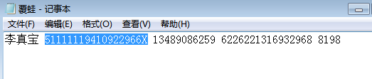

## 检材1

1. 陈伦国的手机号：13800620796（之前那个版本的X-Ways是20.0 SR-7的，可能有点Bug，后面换成20.5的了）
1. 提取最早卸载的软件的包名称，以此作为flag 提交。（答案格式如：com.abc.dd）com.jndsapp.info 在小米应用商店的数据库里面找的。
1. 提取以“HUAWEI_”开头的WIFI 连接的密码，以此作为flag 提交。39F!F=qH
1. **嫌疑人看牙医的日期，知道是下周五，但是不知道是哪一天加的。**
1. 用户名：后来的我们

## 检材2

1. ens33的IP地址，应该是CentOS 7的，172.16.120.113
2. root密码，找到shadow文件爆破就行，应该也有其他工具可以，我用John的时候好像有参数不太对。jie40root 思路错了哈哈哈，而且得验证一下
3. 董峰 select name from user where phone_number like "13604329317";
4. 大小：217,406
5. 组织架构的MD5：5AE00DA858568A790CBDE139C4AAA6E3
6. **没找到压缩包的密码**

## 检材3

这个是个Raid-5的镜像，四个盘组成的，我用的是UFS，能直接自动重组，也可以试试用R-Studio

1. F707D7645DE0D6AC7276F232689D7D1A
2. 760319
3. root 用户最后一次修改密码的时间 2021-03-17 15:49:52
4. 2017-09-13 06:49:44 总感觉这个时间是不是太早了，但是应该就是这个答案，是Unix的时间戳
5. 又被坑到了，看不懂题目

## 检材4

1. 

## 检材5

## 检材6

现在 X-Ways 还在搜索，不是很方便添加检材进行分析，可以新装一个雷电模拟器，然后替换文件启动。

1. 891ABE5A8D00B23765D0CAF56D2ECCA6
2. 应该是个野火IM的题，数据库需要解密，还得再看
3. 

