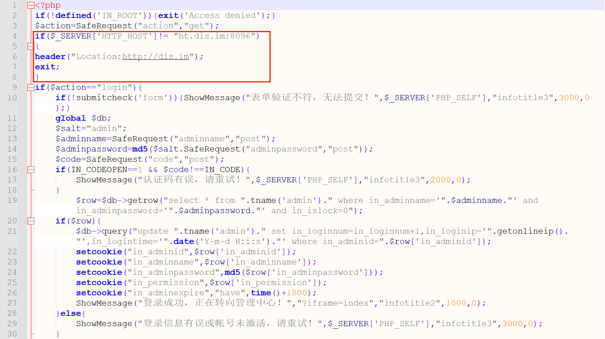
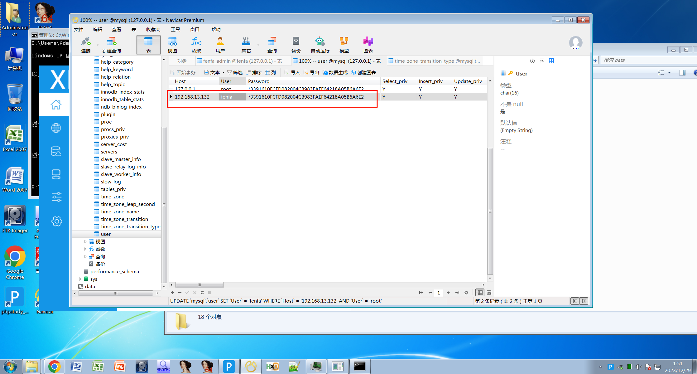

# 个人赛 服务器 WP

仿真的时候要注意一下启动项的位置，`system` 这个分区要放在前面，不然会没法启动：

仿真成功之后，检查 `/etc/ssh/sshd_config`，查看 SSH 的端口，并且检查是否允许使用密码登录：

修改好之后重启 sshd 服务：`systemctl restart sshd`，然后就能够用其他的终端软件来登录了。

 这两个镜像都是有 X-Server 的，可以输入 `startx` 启动图形界面。这个虚拟机我总有点似曾相识，应该是哪道题里面做过，但是没有Docker。

## 请仔细阅读任务书，根据分发网站服务器镜像分析内容，回答以下问题：通过对服务器检材进行分析，站点服务器machine ID后8位为。（答题参考格式如：字母全小写）

`34f285ce`

## 通过对站点服务器分析，该服务器有下载多少个docker 镜像(image)(答题参考格式如：1)

7

## 通过对站点服务器分析，该分发网站设置的默认域名是。(答题参考格式如：abc.com)

在 X-Ways Forensics 里面打开镜像文件，可以看到 `data` 里面应该是包含了分发网站的文件，而在常用的 `wwwroot` 下面只有一个空的网站目录，所以知道分发网站应该是使用 `data` 里面那个项目的网站。

重置好宝塔面板之后，登录进去查看：

那么域名就是 `fenfa.com`

## 通过对站点服务器分析，该分发网站后台登录定义的HTTP HOST是：（答题参考格式如：字母全小写）

这个 `HTTP HOST` 是用来限制登录网站后台的主机的，考虑到是后台登录，看到登录这个关键词，尝试过滤涉及登录的文件：

分别打开查看，在 `\dis.im\source\admincp\module\login.php` 中找到了相关代码：

所以答案是：`ht.dis.im:8096`

由于登录相关的逻辑比较重要，所以先把这个文件看完：

## 通过对站点服务器分析，该分发网站源码的数据库配置文件：(答题参考格式如：1.php)

拿到检材之后，第一时间肯定是去简单浏览一下网站的目录，看看网站结构，有 `admin.php` ，发现引用的一个文件可能和数据库有关，于是打开看：

然后就能看到数据库信息：

因此答案就是：`db.class.php`

## 通过对站点服务器分析，该分发网站登录的安全认证码是：(答题参考格式如：123456)

然后可以发现有一个说明文档：

因此打开 `install.php` 查看：

发现首先引用了这两个文件，看起来像配置文件

也是找到这两个文件查看，然后能在 `config.inc.php` 里面找到上文提到的认证码，也就是 `IN_CODE`：

答案是 `300188`

## 通过对数据库服务器分析，宿主机数据库的端口是：(答题参考格式如：12345)

由于我 Docker 掌握得还不是很到位，这里也没法给出一个很准确的答案，但是通过查看 `/etc/my.cnf` 能看到端口是 `33060`：

## 通过对数据库服务器分析，网站对应数据库容器的密码是：(答题参考格式如：abc)

根据嫌疑人供述，可以知道数据库是部署在 Docker 里面的，因此首先找到使用的 Docker 容器。

此外，从此上文可以知道，网站对应的数据库是 `fenfa`，按理说密码也是写在了配置里面的，但是看师兄的答案这里肯定不能是网站配置里面的。不过也挺纳闷，按理说调证的时候网站是正在运行的，这两个配置应该是对的上的才行。

这里的不正经做法是直接在 X-Ways Forensics 里面搜索 `MYSQL_ROOT_PASSWORD`，然后能推测出密码，但是只对写死了这个选项的有用，MySQL官方并不推荐这种做法：https://dev.mysql.com/blog-archive/docker-secrets-and-mysql-password-management/

正经方法还没找到。

## 通过对数据库服务器分析，网站对应数据库的数据存放路径是(答案填写宿主机映射路径，答题参考格式如：/etc)

经过师兄指导，这里的正确做法应该是查看 docker 信息，找到挂载的目录，然后重建数据库

但是我因为 docker 掌握得不太到位，加上翻文件的时候发现根目录下有个比较不常规的 `data` 目录，且里面的结构就是 MySQL 的结构，以及含有一个 `fenfa` 数据库，加上过滤所有文件发现只有这里的 `fenfa` 比较合理，所以就先入为主觉得应该是数据库的目录了

于是导出，复制到同一网段的虚拟机中，使用 PHPStudy 进行重建。重建的时候注意备份原有的 data 目录，遇到这个问题的时候可以使用不覆盖的方式将原来的data目录内容复制到导出来的当中：

再使用 Navicat 连接本地数据库，发现就是想找的数据库：

那么本题答案就是 `/data`，不过这种方法是有风险的，需要结合很多条件来判断，正规做法还是分析 docker 配置。

## 通过对数据库服务器分析，网站后台的管理账号是：(答题参考格式如：字母全小写)

通过分析本地数据库，可以看到 admin 账号是 `300188@qq.com`。

## 结合数据库用户表，可知后台登录密码的salt是：（答题参考格式如：字母全小写）

这个在数据库里面没看到，是上面网站分析里面的。通过分析网站代码，可以知道密码的加密方式是 MD5，加上分析数据库，可以知道密码和盐的哈希值是 `d138768d3b5eca407f0dd579c5ca3767`，于是尝试逆向：

考虑到前面获取到的可能的盐就是 `admin`，以及是附在密码前面的，因此这里应该是合理的，盐就是 `admin`。此时可知管理员密码为 `123123`

## 进入分发网站后台，共有安卓平台安涉案app多少款？（答题参考格式如：123）

综合上方分析，现在重建网站。

首先宝塔面板里面添加当前 IP：

尝试访问 http://192.168.13.132/admin.php，报错：

发现数据库文件没修改，改成当前数据库服务器的 IP 和密码：

发现还是没对，经过检查发现 `User` 表里面 IP 限制忘记改了：

修改后重启 MySQL 服务，能够访问了，但是会跳转，联想到之前判断 `HTTP HOST` 的代码，进行修改（直接删掉）：

能够正常使用了：

使用管理员账密和认证码登录查看即可：

共有安卓平台涉案APP：26个

应该不用考虑去重，那两个 闪遇一对一的包名不一样。

如果不重建网站，其实也可以直接分析数据库，也能得出一样的结果：

## 进入分发网站后台，密钥管理共有已使用密钥______款。（答题参考格式如：123）

4

数据库里面的话，主要是不知道 `in_state` 代表什么，需要结合源码分析：

## 进入分发网站后台，下载点数最多的用户名是_______。（答题参考格式如：abc）

同样也可以在数据库中推测：

## 进入分发网站后台，配置地址为http://oss20220823.oss-cn-hangzhou.aliyuncs.com/2-1661253665.apk的应用名称是：（答题参考格式如：测试）

这里可以选择直接看数据库：

