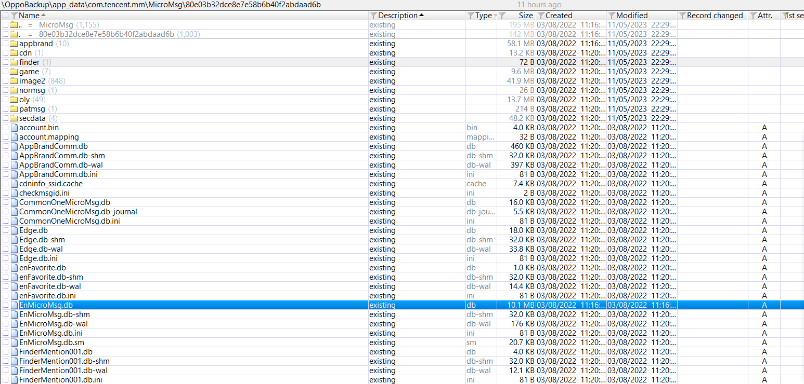
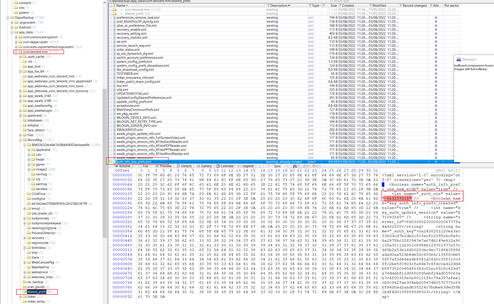

# 微信数据库取证

## Windows端

项目地址：https://github.com/AdminTest0/SharpWxDump

## 安卓端

数据库一般是这个文件：

密钥是`md5(IMEI+UIN)`的前七位（小写）：

UIN需要保留符号；

低版本安卓由于能够获取到IMEI，所以就是设备的IMEI，高版本的安卓可能无法直接获取到，所以会使用：`1234567890ABCDEF`。

UIN一般在 `com.tencent.mm/shared_prefs/auth_info_key_prefs.xml`里面获取：

解密的时候可以用：

