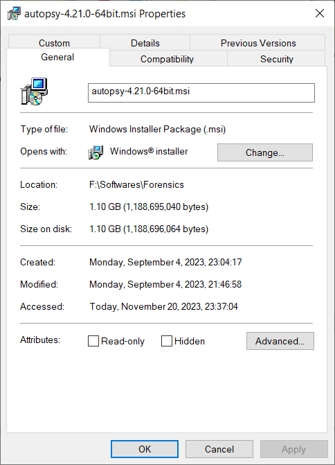
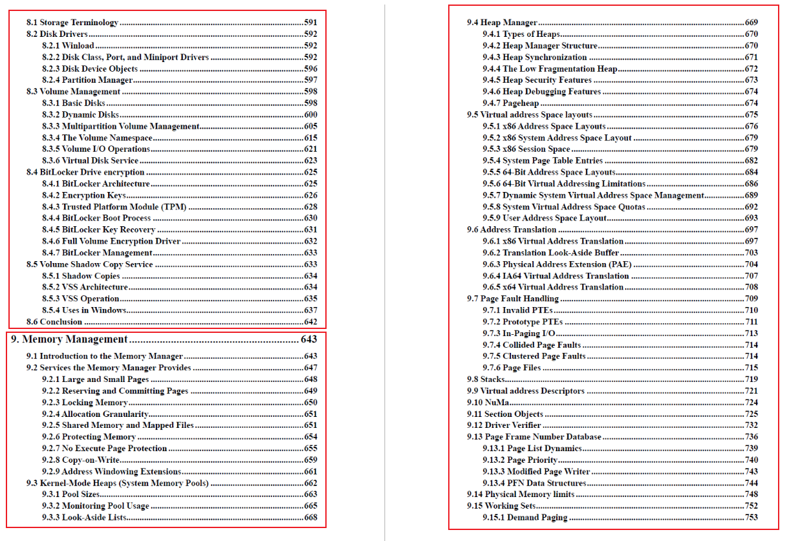
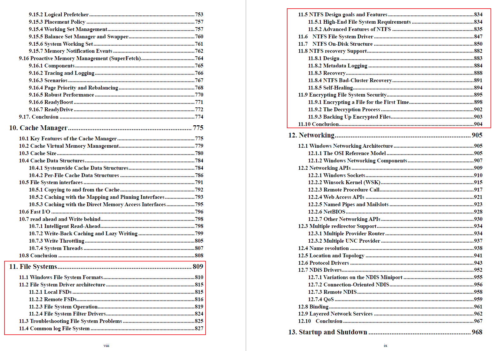

# 开源软件Autopsy介绍 & 相关资料推荐

更深入的不太方便讲，另外就是大家在软件获取上可能有一定的困难，所以给大家推荐一些容易获得的或者是开源的软件，以及一些国外公开发行的电子资料。

## Autopsy介绍

https://www.autopsy.com/

https://github.com/sleuthkit/autopsy/

Autopsy® is a digital forensics platform and graphical interface to The Sleuth Kit® and other digital forensics tools. It can be used by law enforcement, military, and corporate examiners to investigate what happened on a computer. You can even use it to recover photos from your camera's memory card.

Based on JAVA. Installer 1.1 GiB.

---

## 博客（公众号）推荐

https://www.cnblogs.com/WXjzc/ 

公众号：DFIR

## 书籍推荐

### 基础入门书籍

普林斯顿计算机公开课 （Understanding the Digital World: What You Need to Know about Computers, the Internet, Privacy, and Security）计算机科学方面的入门书籍

计算机科学导论（机械工业出版社）

Python相关的入门书籍（必须掌握至少一门编程语言）

---

Introductory Computer Forensics 啥都讲，但是都不深，是一本比较好的入门书籍

Digital Forensics Workbook Hands-on Activities in Digital Forensics (Michael K Robinson) 有附件可以下载（https://www.digitalforensicsworkbook.com/data-sets），属于手把手实操的书籍，对于综合取证工具的依赖较少

### Windows取证

Practical Windows Forensics 基础入门之用

Windows Internals 5th（主要是 Storage Management、Memory Management和 File Systems 板块），能更加深入地理解Windows操作系统内部的一些细节，也有助于对Windows操作系统的取证。

### 内存取证

The Art of Memory Forensics - Detecting Malware and Threats in Windows, Linux, and Mac Memory (2014)

### 文件系统取证

File System Forensic Analysis 经典老书了，是The Sleuth Kit的作者写的，里面涉及了一些底层原理，可以拿来精读。

