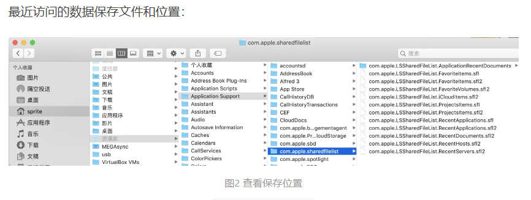
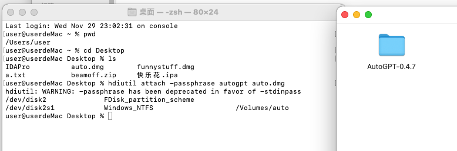

# MacOS 取证

用户主目录：`\Users\<username>\`

用户账户：

```
（1）root账户
（2）管理员账户
（3）普通账户
（4）访客账户
（5）共享用户
（6）系统账户
```

macOS中主要的系统信息存储位置如下：

> 系统版本：`/System/Library/CoreServices/SystemVersion.plist`
>
> 语言和时区：`/Library/Preferences/.GlobalPreferences.plist`
>
> 系统设置：`/Library/Preferences/SystemConfiguration/preferences.plist`
>
> 最后更新：`/Library/Preferences/com.apple.SoftwareUpdate.plist`
>
> 最后休眠时间：
>
> `/Library/Preferences/SystemConfigurations/com.apple.PowerManagement.plist`
>
> 蓝牙记录：`/Library/Preferences/com.apple.Bluetooth.plist`
>
> 键盘设置：`/Library/Preferences/com.apple.HIToolbox.plist`
>
> 打印机设置：`/Library/Preferences/org.cups.printers.plist`
>
> 时间机器：`/Library/Preferences/com.apple.TimeMachine.plist`
>
> 防火墙：`/Library/Preferences/com.apple.alf.plist`
>
> AirPort：`/Library/Preferences/SystemConfigurations/com.apple.airport. preferences.plist`
>
> 用户信息：`/private/var/db/dslocal/nodes/Default/Users/`
>
> 最后登录的用户：`/Library/Preferences/com.apple.loginwindow.plist`
>
> MAC地址：`/private/var/log/daily.out`
>
> 启动项：`/Library/LaunchAgents/`、`/Library/LaunchDaemons/`、`/System/Library/LaunchAgents/`、`/System/Library/LaunchDaemons/`
>
> 隔空投送（AirDrop）：`/var/db/uuidtext/`
>
> USB连接记录：`/private/var/db/diagnostics/persist/XXXXX.tracev3`
>
> ---
>
> 最近使用痕迹
>
> macOS中包含大量最近使用痕迹，主要信息及存储位置如下：
>
> ①最近使用的项目：`~/Library/ApplicationSupport/com.apple.sharedfilelist`
>
> ②最近使用的程序：`com.apple.LSSharedFileList.RecentApplications.sfl`
>
> ③最近使用的文稿：`com.apple.LSSharedFileList.RecentDocuments.sfl`
>
> ④最近访问过的服务器：`com.apple.LSSharedFileList.RecentHosts.sfl和com.apple.LSSharedFileList.RecentServers.sfl`
>
> ⑤每个程序的最近使用记录：`com.apple.LSSharedFileList.ApplicationRecentDocuments`
>
> ⑥访达最近使用的文件夹：`~/Library/Preferences/com.apple.finder.plist`
>
> 

## 系统日志

HFS+时代日志存储在系统根目录`/.fseventsd`文件夹下，APFS时代则存储在系统根目录`/private/var/log`文件夹下。

针对已经普及的APFS环境，macOS的日志目录下较清晰的存储着操作系统日志（system.log）、应用程序日志（install.log）、文件系统日志（fsck_apfs.log）、WiFi日志（wifi.log）等。其中，应用程序日志记录着程序的安装、更新、卸载等信息，文件系统日志记录着卷的挂载、卸载以及文件和文件夹的创建、修改等信息。


Application Logs: `\Users\<username>\Library\Application Support\`

Recent Log:


这个取证软件是可以分析出来的。

## 系统活动记录

（1）KnowledgeC

KnowledgeC.db是一个记录了苹果电脑大量活动的SQLite数据库，包括应用程序活动、设备插入焦点、Safari历史记录、屏幕背光状态等。这些记录可以间接地反映用户在使用操作系统留下的行为痕迹。该文件存储于“`/private/var/db/CoreDuet/Knowledge/`”下。

（2）已隔离文件

已隔离文件（Quarantined Files）记录了使用苹果电脑从互联网下载文件的相关信息，这些信息包括日期、时间和文件下载位置。该文件位于“`~/library/Preferences/com.apple.LaunchServices.QuarantineEvensV2/`”下，当需要打开这些文件时，系统会提示这些文件是从互联网下载的，需要进行安全性确认。

（3）Diagnostics

Diagnostics位于“`/var/db/diagnostics/`”，是macOS的诊断报告，其中记录了系统、应用程序和用户的操作行为，在系统诊断和使用信息中可以看到大量的行为记录。

## 用户痕迹

### 系统功能使用痕迹

#### 通讯录

通讯录是macOS自带的应用程序，其主要数据存储在“`~/Library/Application Support/AddressBook/AddressBook-v22.abcddb`”文件中，该文件为SQLite格式。通讯录中的联系人信息分散的存储在“`~/Library/Application Support/AddressBook/Sources/<string>/`”目录中，其中“Metadata”文件夹中包含联系人明细信息，文件扩展名为`.abcdp`，这些文件是Plist格式，可以直接用PlistEdit Pro打开查看。“Images”文件夹包含的图片是与联系人相关的头像图片，实际为jpeg格式，可以直接预览查看。


#### 聚焦搜索记录

聚焦搜索（Spotlight）是Mac OS X 10.4开始推出的快速搜寻引擎。Spotlight使用Metadata搜索引擎，可以广泛查找任何位于电脑中的项目，包含文件、图片、音乐、应用程序等，还可以搜索到文档中指定的文字内容。Spotlight历史记录存储在`~/Library/Preferences/com.apple.Spotlight.plist`中。

#### 用户行为痕迹

在用户对应账户目录中隐藏着一些重要的行为信息：

①终端输入的历史命令：`~/.bash_history`、`~/bash_sessions`、`~/.zsh_history`、`~/.zsh_sessions`

②默认打印机：`~/.cups/lpoptions`

③默认文本编码和区域语言设置：`.CFUserTextEncoding`

④废纸篓记录：`~/.Trash`

#### 程序痕迹

用户对应用程序进行设置或启动运行时，会产生很多程序痕迹数据，主要信息包括：

①程序坞记录。

②保存的程序状态。

③开机时重新运行的程序。

### 打印记录

与Windows一样，用户在连接打印机执行打印任务时，会留下大量打印痕迹。主要信息及存储位置如下：

①最近使用的打印机：`~/Library/Preferences/org.cups.PrintingPrefs.plist`

②打印日志：`/var/log/cups/`

③打印job control文件：`/private/var/spool/cups/`（只在打印过程中出现PDF文件）


### WiFi 记录

`\BenChen_MacBookPro_2023-1\Library\Preferences\SystemConfiguration\com.apple.wifi.message-tracer.plist`

除此以外还有很多其他的文件。


上下两部分的内容是一样的。文件放在img下面的附件目录了。

### 浏览器记录

Safari是macOS自带的浏览器程序，绝大多数核心数据以Plist文件存储，自V3版本开始引入了SQLite格式，开创了一种全新的缓存方式。大部分Safari的数据存储在以下4个地方：`~/Library/Safari/`、`~/Library/Caches/com.apple.Safari/`、`~/Library/Caches/Metadata/`和`~/Library/Preferences/`。Safari中的缓存页面如图所示。


重点痕迹具体分布如下：

①浏览器配置：`~/Library/Preferences/com.apple.Safari.plist`

②下载历史：`~/Library/Safari/Downloads.plist`

③访问历史：`~/Library/Safari/History.db`（History_items存放URL和访问次数，History_visits保存时间和网页的标题）

④隐私浏览记录：`~/Library/Preferences/com.apple.Safari.SafeBrowsing.plist`

⑤上次打开的窗口：`~/Library/Safari/LastSession.plist`

⑥书签：`~/Library/Safari/Bookmarks.plist`

⑦缓存：`~/Library/Caches/com.apple.Safari/Cache.db`

⑧缓存的页面：`~/Library/Caches/com.apple.Safari/Webpage Previews/`

⑨Cookies：`~/Library/Cookies`

⑩最常浏览的网站：`TopSites.plist`（Safari V4-V6使用coverflow窗口来显示用户最常访问（最近访问））的网址，其中包括最后修改的日期、网站URL和网站标题。

### 邮件记录

用户在使用系统邮件客户端时产生的数据存储在`~/Library/Mail/V#`中，目前最新版本为V8，因此实际存储位置为`~/Library/Mail/V8`，如图所示。V8目录下，`Maildata/Signatures/`记录了邮件客户端中添加的邮件账户及其签名信息，主要分布在`AccountsMap.plist`和`AllSignatures.plist`文件中。V8下存储的两个名称较长的目录即`AccountsMap.plist`中对应的账户，账户目录下包含发件箱、收件箱、垃圾邮件、草稿、已发送邮件、已删除邮件等重要数据。


如上图右侧内容所示，邮件的核心数据均存储在这些以`.mbox`结尾的目录中，以收件箱`.mbox`为例，Data目录中每个数字子目录代表一个组（macOS邮件客户端的智能邮箱分组），每个组中均有`Attachments`和`Messages`两个目录，分别存储邮件附件（支持直接打开查看）和邮件文件（即emlx文件，默认通过邮件客户端程序打开，支持文本方式查看邮件头信息），如下图所示。


### 即时通信记录 & 常用软件

#### iMessage

iMessage是苹果公司推出的即时通信软件，可以发送短信、视频等，拥有非常高的安全性。iMessage虽然与短信/彩信共同使用系统自带的“消息”应用进行数据展现，但实际上用户仅需要通过WiFi或蜂窝数据网络进行通信，依托同一个Apple ID，短信可以在iPhone、iPad和Mac之间实现同步推送。

iMessage的消息记录存储在`/Library/Messages/Attachments/`目录中。

#### 微信

微信是腾讯公司推出的一款综合社交工具，广受用户欢迎。相比其他平台，Mac版微信虽然用户基数不大，但作为与手机微信交互的重要数据源，往往在案件中发挥着意想不到的作用。

微信的用户数据存储在`~/Library/Containers/com.tencent.xinWeChat/Data/Library/ Application Support/com.tencent.xinWeChat/<版本号>/<MD5字符串>/`目录下。

当然，微信出于安全性保护，上述关键信息中绝大部分db格式的SQLite数据库都处于加密状态，解密密钥并不在计算机本地离线存储，且加密方式与手机微信截然不同，暴力破解的可行性微乎其微。因此需要在联网状态下借助常规登录方式（帐号密码、手机验证等）登录后进行取证。

#### QQ

QQ的数据分布相比微信更加简单，主要的用户数据存储在`~/Library/Containers/com.tencent.qq/Data/Library/Application Support/QQ/<QQ号>/`目录下，与Windows版类似，消息记录也存储在msg3.0.db文件中，附件存储于并行目录中，如image存储图片，video存储视频等。

#### iTunes备份

通常情况下Mac计算机用户同时使用iPhone的几率很高，因此其中很有可能存储着机主的iPhone手机的备份数据。iPhone在macOS中默认的存储在`~/Library/Application Support/MobileSync/Backup/`目录中。

#### 其他应用数据 （百度网盘、迅雷、印象笔记）

①百度网盘：`~/Library/Preferences/com.baidu.BaiduNetdisk-mac.plist`

`~/Library/Application Support/com.baidu.BaiduNetdisk-mac/<字符串>/file.db`

②迅雷：`~/Library/Preferences/com.xunlei.Thunder.plist`

③印象笔记：`~/Library/Containers/com.evernote.Evernote/Data/Library/Application Support/com.evernote.Evernote/accounts/app.yinxiang.com/<ID>/localNoteStore/LocalNoteStore.sqlite`

---


## 关于DMG文件的取证（加密DMG）

2023美亚杯团体赛

DMG加密命令：

```
hdiutil create -encryption -stdinpass -fs ExFAT -volname funnystuff -o funnystuff.dmg -size 100M
```

DMG文件解密命令（需要指定密钥）：

```
hdiutil attach -passphrase 密码 文件
```

解密后是挂载为一个虚拟的磁盘：



这个DMG文件下有这些文件，其实就是对应用程序所需要的文件进行打包，做成一个虚拟磁盘的映像，以便于安装：


---

以下是WP原文：

> ##### 56.请参考陈大昆MacBook镜像文件回答以下题目:有两个加密的.dmg文件在取证镜像文件内。按照.dmg文件的创建时间先后，请填写下面的空白：文件名称包括扩展名(如adcd.dmg)第一个创建.dmg文件的名称是：_____，密码是：____第二个创建.dmg文件的名称是：_____，密码是：____请按照以下格式回答:xxx_xxx_xxx_xxx，例子:如(1)的内容是abc、(2)的内容是123、(3)的内容是DEF、(4)的内容是8.8，答案为：abc_123_DEF_8.8(2分)
>
> 加密命令，密码是终端输入的，不过根据文件名和上题，可以猜测密码分别是`funnystuff`和`autogpt`
>
> [](https://img2023.cnblogs.com/blog/2817142/202311/2817142-20231123224902961-1590463371.png)
>
> 解密测试成功
>
> [](https://img2023.cnblogs.com/blog/2817142/202311/2817142-20231123224902972-1154157609.png)
>
> 结果为`funnystuff.dmg_funnystuff_auto.dmg_autogpt`
>
> ##### 57.请参考陈大昆MacBook镜像文件回答以下题目:有一个应用程序托管在.dmg文件中，该程序需要一个密钥才能启用，请填写以下空格：（文件名称包括所有英文字母、数字和符号，区分大小写，不需要空格）存有密钥的文件名称是：________密钥的值是：________请按照以下格式回答:xxx_xxx，例子:密钥文件名称是：abc.def，密钥的值是：123，答案为：abc.def_123(2分)
>
> 进入后能看到是`autogpt`，根据相关文档，密钥配置在`.env`中
>
> [](https://img2023.cnblogs.com/blog/2817142/202311/2817142-20231123224902976-1957950156.png)
>
> [](https://img2023.cnblogs.com/blog/2817142/202311/2817142-20231123224902966-2029520369.png)
>
> 结果为`.env_sk-Px1cCE5XZsXWYXij0K3BT3BlbkFJ4jVGVQ7eUpOmewvth1ep`

## .Spotlight-V100 解析

https://forensicsandsecurity.com/papers/SpotlightMacForensicsSlides.pdf

是什么：每个已安装卷的Spotlight元数据。该**m[dw](https://link.zhihu.com/?target=https%3A//www.macdown.com/z/s_4.html)orker**进程使用这个元数据来更新Spotlight搜索。


考题：

> ##### 59.参考’陈大昆MacBook镜像文件’,按照您的检验，以下哪个陈述（或多个陈述）在描述路径`~/Desktop/.Spotlight-V100/`下的文件是正确的?(3分)
>
> A."coins1.jpg alias"是一个档案捷径(alias)
>
> B."coins.jpg alias"和"coins1.jpgalias"都是符号链接(Symlink)文件
>
> C."CryptoWallet-link1"是一个档案捷径(alias)
>
> D."CryptoWallet-link1"和"CryptoWallet-link2"链接相同的文件
>
> E."CryptoWallet-link2"是一个硬链接(HardLink)
>
> `coins1.jpg alias`是快捷方式
>
> [](https://img2023.cnblogs.com/blog/2817142/202311/2817142-20231123224902964-1294457219.png)
>
> `CryptoWallet-link1`和`CryptoWallet-link2`哈希都相同，查看历史命令
>
> [](https://img2023.cnblogs.com/blog/2817142/202311/2817142-20231123224902773-603795222.png)
>
> 结果为`ACD`


---

## MacOS 基础

###  MacOS 登录口令

MacOS 10.4 ~ 10.6中，账户密码存储在 `/private/var/db/shadow/hash` 目录下，以每个账户的UUID为名。

MacOS 10.7及以后中，保存在 `/var/db/dslocal/nodes/Default/users/` 下的plist文件中。

加密算法：主要使用SHA-1或SHA-512进行加密，并且加上长度为4字节的salt，最终生成密文。


### MacOS 时间戳：小坑（数据库取证中）

| **名称**    | **长度** | **起始时间**               | **单位** |
| ----------- | -------- | -------------------------- | -------- |
| Mac绝对时间 | 32位     | 2001年1月1日  00:00:00 UTC | 秒       |
| Unix时间戳  | 32位     | 1970年1月1日  00:00:00 UTC | 秒       |
| HFS+时间戳  | 32位     | 1904年1月1日  00:00:00 UTC | 秒       |

在取证过程中，macOS时间戳提供了大量有用信息，图6-7所示的是在一个docx文件上运行mdls命令的显示信息，其中重要的时间戳有：

①内容创建时间：`kMDItemContentCreationDate`

②内容修改时间：`kMDItemContentModificationDate`

③添加时间：`kMDItemDateAdded`（这是文件被添加到当前目录的时间）

④内容改变时间：`kMDItemFSContentChangeDate`

⑤文件创建时间：`kMDItemFSCreationDate`

⑥上次使用时间：`kMDItemLastUsedDate`


### MacOS 根目录

| **名称**                 | **功能描述**                                                 |
| ------------------------ | ------------------------------------------------------------ |
| 系统（System）           | 通常包含仅属于操作系统的数据                                 |
| 应用程序（Applications） | 所有程序都默认安装在该目录下，可以直接启动                   |
| 用户（Users）            | 包含所有用户目录，其下的共享目录可用于不同用户间的数据共享   |
| 资源库（Library）        | 包含应用程序相关数据，这里安装的软件会应用于整个系统、所有用户 |
| 隐私（private）          | 隐藏状态，包含系统级的日志、打印记录、密码信息、睡眠交换文件等信息 |
| 卷（Volumes）            | 隐藏状态，连接的存储介质的加载点，加载点是动态的，断开后自动消失，与Linux下的“/mnt”或“/media”目录相似 |
| 网络（Network）          | 隐藏状态，域控制、活动目录等                                 |
| DocumentRevisions-V100   | 隐藏状态，保存之前文件的位置信息，APFS中无此目录             |
| .fseventsd               | 隐藏状态，包含HFS+文件系统日志，APFS中无此目录               |
| .Spotlight-V100          | 隐藏状态，保存Spotlight索引信息，APFS中无此目录              |
| .DS_Store                | 隐藏状态，保存目录的设置和视图信息，APFS中无此目录           |
| .Trashes                 | 隐藏状态，启动卷以外的卷中删除的数据，APFS卷中无此目录       |

### MacOS 文件系统

| **名称**     | **HFS** | **HFS+** | **APFS** |
| ------------ | ------- | -------- | -------- |
| 推出时间     | 1984    | 1998     | 2017     |
| 位数         | 16      | 32       | 64       |
| 最大文件大小 | 2GB     | 8EB      | 8EB      |
| 最大硬盘容量 | 2TB     | 8EB      | 8EB      |
| 文件保险箱   | 无      | 有       | 有       |
| 时间机器     | 无      | 有       | 有       |
| 写时复制     | 无      | 无       | 有       |
| 磁盘快照     | 无      | 无       | 有       |
| 共享空间     | 无      | 无       | 有       |
| 多密钥加密   | 无      | 无       | 有       |

#### HFS

Mac OS标准格式（HFS）是Mac设备在较长时间里使用的专有文件系统，也是苹果Open Firmware所支持的最基本的文件系统，常见于早期的Mac电脑的硬盘、软盘和光盘等。HFS不但保留了之前文件所设定的基本概念，更带来了极大的功能增强，如应用了全新的目录文件、支持子目录结构、支持最初的权限概念、支持更多的Mac文件属性等。HFS一直使用至今，但在Mac OS X 10.5之前，HFS可以挂载为读写，而之后只可以挂载为只读。

#### HFS+

Mac OS扩展格式（HFS+或HFS Plus）是在HFS的基础上进行改进的文件系统格式。在1998年Mac OS 8.1中，苹果首次带来了对HFS+的支持。HFS+放弃HFS中使用的MacRoman，从而执行Unicode作为文件命名的编码标准；HFS+通过增加可分配块数目，降低了单一文件的最大大小值。HFS+推出的主要目标是优化大容量硬盘的存储能力，同时HFS+扩大了文件数量大小，将单个文件的大小和硬盘容量扩展到8EB。

#### APFS

Apple文件系统（APFS）是运行macOS 10.13或后续版本的Mac电脑所使用的默认文件系统，它具有改进的文件系统基础、强加密、空间共享、磁盘快照、快速目录大小统计等特性。macOS 10.13及以上版本支持将APFS用于启动盘和数据盘。APFS具有以下特点：

（1）按照需求分配容器中的磁盘空间

（2）支持写时复制

（3）支持磁盘快照

| **文件系统** | **支持情况** | **说明**                               |
| ------------ | ------------ | -------------------------------------- |
| MFS          | 部分支持     | Mac  OS 8起取消对MFS的支持             |
| UFS          | 部分支持     |                                        |
| HFS          | 支持         | Mac  OS X 10.5起仅支持只读             |
| HFS+         | 读写         |                                        |
| APFS         | 读写         |                                        |
| FAT16/32     | 读写         | macOS中称为“MS-DOS”                    |
| ExFAT        | 读写         |                                        |
| NTFS         | 读           | 可开启系统自带支持或安装第三方应用支持 |
| EXT/2/3/4    | 不支持       |                                        |
| BtrFS        | 不支持       | 安装第三方应用支持                     |
| XFS          | 不支持       | 安装第三方应用支持                     |
| ZFS          | 读           |                                        |

### MacOS File Vault

从Mac OS X 10.7开始，Apple重新设计并加强了加密方案，并作为FileVault 2发布。FileVault 2使用全磁盘、128位AES加密（XTS-AESW模式）来保证数据安全，该加密软件自动实时加密和解密，对具备权限的用户来说是透明的。但对于取证人员而言，即使磁盘被移除并连接到其他计算机，或者不拆机直接获取到磁盘镜像，内部的APFS宗卷也会保持加密状态，在未解密的情况下，也无法查看其中的信息。

此外，可根据开机启动界面判断其是否开启了文件保险箱功能。开启了文件保险箱功能的目标计算机在其待机界面中有睡眠标签，且能显示其他账户。


### 资源库（软件存储、配置等地址）

#### Containers

Containers中包含从macOS的App Store下载的应用程序的支持文件、缓存的数据和临时文件。

应用数据存储的传统位置是`~/Library/Application Support/`（其中，`~`代替用户目录），而使用沙箱保护的应用数据会存储在`/Library/Containers/<Bundle ID>/Data/Library/Application Support/`中，因此，应用数据可能保存在一个或两个目录中。

#### Preferences

Preferences目录存储应用和系统设置的plist文件。类似地，相关plist文件可能存储在`~/Library/Preference/ByHost/`和`~/Library/Containers/<Bundle ID>/Data/Library/Preference/`两个目录中。其中，`~/Library/Preference/ByHost/`目录下存储的plist文件的命名采用了“反向DNA”格式。


#### **Caches**

Caches目录存储着每个应用的缓存数据，大部分缓存文件存储在`~/Library/Caches/<Bundle ID>/fsCachedData/`下，并采用“反向DNA”格式命名。


### MacOS 用户管理

#### Group

系统默认下，普通用户被指定为`staff`组，管理员被指定为`admin`组和`staff`组，而`root`账户，则会被指定为`wheel`组。

