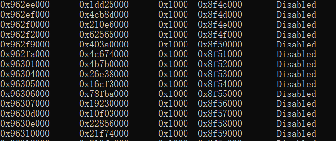
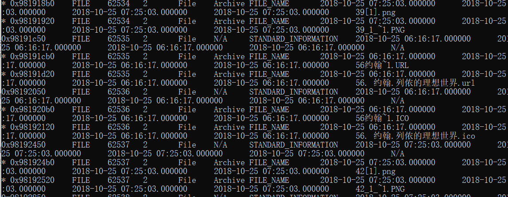
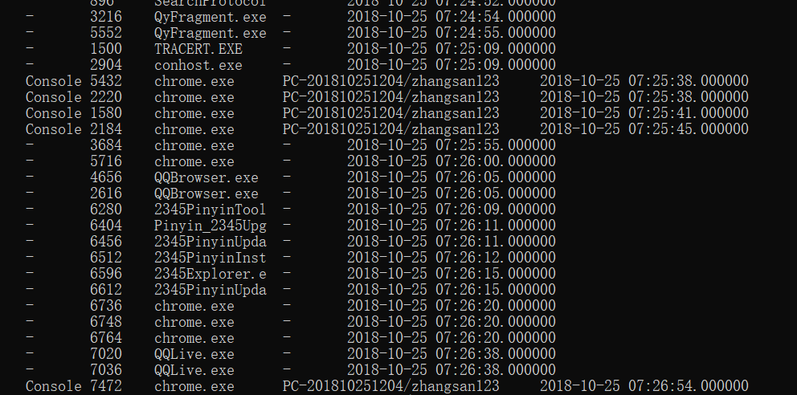

# Volatility 内存取证

## 配合使用其他命令

`grep -i "" -C 20` 显示20行

`strings -e l ` 使用小端序模式

##常用命令

Volatility 3:

```
python3 vol.py -f ../../RedLine/MemoryDump.mem windows.filescan.FileScan # 扫描文件

python3 vol.py -f ../../RedLine/MemoryDump.mem windows.netscan.NetScan # 扫描网络连接（相比2来说更加全面）

vol3 -f 20210430-Win10Home-20H2-64bit-memdump.mem -o pid6988/ windows.pslist.PsList --pid 6988 --dump # Dump the process of 6988, and it contains a full excutable file

xxd --seek 0x45BE876 20210430-Win10Home-20H2-64bit-memdump.mem | less # get the offset, and it can also be using command head

vol3 -f 20210430-Win10Home-20H2-64bit-memdump.mem  windows.cmdline.CmdLine | grep notepad
```

Volatility 2:

```
vol.py -f MemoryDump.mem --profile=Win10x64_19041 netscan
vol.py -f MemoryDump.mem --profile=Win10x64_19041 pslist
vol.py -f MemoryDump.mem --profile=Win10x64_19041 pstree

vol.py -f win7_trial_64bit.raw --profile=Win7SP0x64 procdump -D dump/ -p 296
```

- imageinfo
- 进程分析
  - pslist/pstree
  - dlllist
  - svscan
  - svcscan
  - malscan
  - psxview 查看被隐藏的进程
  - procdump
  - memdump
    - 将进程导出
- netscan
- cmdline/cmdscan
- clipboard
- iehistory
  - 如果需要解析其他浏览器的，可以自行添加扩展（Plugins）
- 密码/密钥
  - hashdump
  - truecryptsummary/truecryptmaster/truecryptpassphrase
  - bitlocker
- 文件系统
  - filescan
  - mftparser
  - timeliner
- 注册表
  - printkey
  - hivelist
  - Dumpregitry
- Dump指定进程
  - vol3 -f memdump.mem -o pid6988/ windows.pslist.PsList --pid 6988

```
注意看Volatility的Readme
```

## shimcache

`vol.py -f ./Triage-Memory.mem --profile=Win7SP1x64 shimcache | grep -i '2019-03-07 23:06:58'`

查看程序运行时间。


## procdump vs memdump

`procdump` 是针对进程的，dump下来的是进程本身，不包含其他数据，`memdump` 是针对进程及其数据的，包含正在使用的内存。


## mftparser 根据 Record 寻找文件


## VAD

`vadinfo` ：可以查看进程的VAD信息，通常配合 grep 使用。

 https://cyberdefenders.org/blueteam-ctf-challenges/65#nav-questions


https://blackninja23.medium.com/cyberdefenders-writeup-dumpme-644d5c2a6f3a

Ten challenge: What memory protection constants does the VAD node at 0xfffffa800577ba10 have?What is VAD? VAD is used by the Windows memory manager to describe memory ranges used by a process as they are allocated. When a process allocates memory with VirutalAlloc, the memory manager creates an entry in the VAD tree. You can read more from https://www.sciencedirect.com/science/article/pii/S1742287607000503 Plugin that we can use is vadinfo.

COMMAND: `python2 volatility/vol.py -f Triage-Memory.mem — profile=Win7SP1x64 vadinfo|grep 0xfffffa800577ba10 -C 4`

Now we can see protection is PAGE_READONLY

Eleven Challenge: What memory protection did the VAD starting at 0x00000000033c0000 and ending at 0x00000000033dffff have?

Command: `python2 volatility/vol.py -f Triage-Memory.mem — profile=Win7SP1x64 vadinfo|grep ‘0x00000000033c0000 End 0x00000000033dffff’ -C 4`

Our permission now is PAGE_NOACCESS


## Volatility 2、3区别

---

> volatility3和volatility有很大的区别
>
> 查看镜像信息，volatility会进行分析`python vol.py -f F:\BaiduNetdiskDownload\ZKSS-2018\Q1.Windows7_memory.dd windows.info`
>
> [](https://img2022.cnblogs.com/blog/2817142/202206/2817142-20220605223506967-1588202177.png)
>
> 查看进程`python vol.py -f F:\BaiduNetdiskDownload\ZKSS-2018\Q1.Windows7_memory.dd windows.pslist`或者`python vol.py -f F:\BaiduNetdiskDownload\ZKSS-2018\Q1.Windows7_memory.dd windows.pstree`
>
> [](https://img2022.cnblogs.com/blog/2817142/202206/2817142-20220605223506960-788048027.png)
>
> [](https://img2022.cnblogs.com/blog/2817142/202206/2817142-20220605223506941-755922693.png)
>
> 列出缓冲池`python vol.py -f F:\BaiduNetdiskDownload\ZKSS-2018\Q1.Windows7_memory.dd windows.bigpools.BigPools`
>
> [](https://img2022.cnblogs.com/blog/2817142/202206/2817142-20220605223506938-651917442.png)
>
> 转储密码`python vol.py -f F:\BaiduNetdiskDownload\ZKSS-2018\Q1.Windows7_memory.dd windows.cachedump.Cachedump`，不过我这边没有成功，不知道原因
>
> 调出内存回调`python vol.py -f F:\BaiduNetdiskDownload\ZKSS-2018\Q1.Windows7_memory.dd windows.callbacks.Callbacks`
>
> [](https://img2022.cnblogs.com/blog/2817142/202206/2817142-20220605223507000-1945680295.png)
>
> 查看进程命令行参数`python vol.py -f F:\BaiduNetdiskDownload\ZKSS-2018\Q1.Windows7_memory.dd windows.cmdline.CmdLine`
>
> [](https://img2022.cnblogs.com/blog/2817142/202206/2817142-20220605223506975-1320374828.png)
>
> 不知道是干啥的，手册里没有给出描述，运行也报错`python vol.py -f F:\BaiduNetdiskDownload\ZKSS-2018\Q1.Windows7_memory.dd windows.crashinfo.Crashinfo`
>
> [](https://img2022.cnblogs.com/blog/2817142/202206/2817142-20220605223506977-69864130.png)
>
> 列出设备，乱码`python vol.py -f F:\BaiduNetdiskDownload\ZKSS-2018\Q1.Windows7_memory.dd windows.devicetree.DeviceTree`
>
> [](https://img2022.cnblogs.com/blog/2817142/202206/2817142-20220605223506967-657875075.png)
>
> 列出dll`python vol.py -f F:\BaiduNetdiskDownload\ZKSS-2018\Q1.Windows7_memory.dd windows.dlllist.DllList`
>
> [](https://img2022.cnblogs.com/blog/2817142/202206/2817142-20220605223506987-1022951234.png)
>
> 列出驱动的irp`python vol.py -f F:\BaiduNetdiskDownload\ZKSS-2018\Q1.Windows7_memory.dd windows.driverirp.DriverIrp`
>
> [](https://img2022.cnblogs.com/blog/2817142/202206/2817142-20220605223507003-1834044733.png)
>
> 扫描驱动`python vol.py -f F:\BaiduNetdiskDownload\ZKSS-2018\Q1.Windows7_memory.dd windows.drivescan.DriverScan`
>
> [](https://img2022.cnblogs.com/blog/2817142/202206/2817142-20220605223507059-1793429953.png)
>
> 转储文件`python vol.py -f F:\BaiduNetdiskDownload\ZKSS-2018\Q1.Windows7_memory.dd windows.dumpfiles.DumpFiles`
>
> [](https://img2022.cnblogs.com/blog/2817142/202206/2817142-20220605223506978-478754450.png)
>
> [](https://img2022.cnblogs.com/blog/2817142/202206/2817142-20220605223507002-1515029379.png)
>
> 列出进程的环境变量`python vol.py -f F:\BaiduNetdiskDownload\ZKSS-2018\Q1.Windows7_memory.dd windows.envars.Envars`
>
> [](https://img2022.cnblogs.com/blog/2817142/202206/2817142-20220605223506994-1752906556.png)
>
> 扫描文件`python vol.py -f F:\BaiduNetdiskDownload\ZKSS-2018\Q1.Windows7_memory.dd windows.filescan.FileScan`还是有乱码，可能是编码问题
>
> [](https://img2022.cnblogs.com/blog/2817142/202206/2817142-20220605223507041-67136686.png)
>
> 列出tokensid`python vol.py -f F:\BaiduNetdiskDownload\ZKSS-2018\Q1.Windows7_memory.dd windows.getservicesids.GetServiceSIDs`
>
> [](https://img2022.cnblogs.com/blog/2817142/202206/2817142-20220605223507069-1724233560.png)
>
> 列出每个进程的sid`python vol.py -f F:\BaiduNetdiskDownload\ZKSS-2018\Q1.Windows7_memory.dd windows.getsids.GetSIDs`
>
> [](https://img2022.cnblogs.com/blog/2817142/202206/2817142-20220605223507067-1872061646.png)
>
> 列出进程句柄`python vol.py -f F:\BaiduNetdiskDownload\ZKSS-2018\Q1.Windows7_memory.dd windows.handles.Handles`
>
> [](https://img2022.cnblogs.com/blog/2817142/202206/2817142-20220605223506998-1301539649.png)
>
> 列出用户哈希`python vol.py -f F:\BaiduNetdiskDownload\ZKSS-2018\Q1.Windows7_memory.dd windows.hashdump.Hashdump`不过我这个镜像没有
>
> [](https://img2022.cnblogs.com/blog/2817142/202206/2817142-20220605223507064-1712936084.png)
>
> 转储lsa密码，与cache类似`python vol.py -f F:\BaiduNetdiskDownload\ZKSS-2018\Q1.Windows7_memory.dd windows.lsadump.Lsadump`
>
> 列出可能包含注入代码的进程内存范围`python vol.py -f F:\BaiduNetdiskDownload\ZKSS-2018\Q1.Windows7_memory.dd windows.malfind.Malfind`
>
> [](https://img2022.cnblogs.com/blog/2817142/202206/2817142-20220605223507071-1976086630.png)
>
> 扫描并分析潜在的主引导记录`python vol.py -f F:\BaiduNetdiskDownload\ZKSS-2018\Q1.Windows7_memory.dd windows.mbrscan.MBRScan`
>
> 输出内存映射`python vol.py -f F:\BaiduNetdiskDownload\ZKSS-2018\Q1.Windows7_memory.dd windows.memmap.Memmap`
>
> [](https://img2022.cnblogs.com/blog/2817142/202206/2817142-20220605223507040-409919285.png)
>
> 扫描特定windows内存映像`python vol.py -f F:\BaiduNetdiskDownload\ZKSS-2018\Q1.Windows7_memory.dd windows.mftscan.MFTScan`
>
> [](https://img2022.cnblogs.com/blog/2817142/202206/2817142-20220605223507102-1498425562.png)
>
> 扫描模块`python vol.py -f F:\BaiduNetdiskDownload\ZKSS-2018\Q1.Windows7_memory.dd windows.modscan.ModScan`
>
> [](https://img2022.cnblogs.com/blog/2817142/202206/2817142-20220605223507127-1671906270.png)
>
> 列出加载的内核模块`python vol.py -f F:\BaiduNetdiskDownload\ZKSS-2018\Q1.Windows7_memory.dd windows.modules.Modules`
>
> [](https://img2022.cnblogs.com/blog/2817142/202206/2817142-20220605223507104-470289345.png)
>
> 扫描互斥的mutex`python vol.py -f F:\BaiduNetdiskDownload\ZKSS-2018\Q1.Windows7_memory.dd windows.mutantscan.MutantScan`
>
> [](https://img2022.cnblogs.com/blog/2817142/202206/2817142-20220605223507103-1028632372.png)
>
> 扫描网络对象`python vol.py -f F:\BaiduNetdiskDownload\ZKSS-2018\Q1.Windows7_memory.dd windows.netscan.NetScan`
>
> [](https://img2022.cnblogs.com/blog/2817142/202206/2817142-20220605223507127-1974639972.png)
>
> 输出网络状态`python vol.py -f F:\BaiduNetdiskDownload\ZKSS-2018\Q1.Windows7_memory.dd windows.netstat.NetStat`
>
> [](https://img2022.cnblogs.com/blog/2817142/202206/2817142-20220605223507097-314557007.png)
>
> 通用池扫描程序插件`python vol.py -f F:\BaiduNetdiskDownload\ZKSS-2018\Q1.Windows7_memory.dd windows.poolscanner.PoolScanner`
>
> [](https://img2022.cnblogs.com/blog/2817142/202206/2817142-20220605223507063-175644933.png)
>
> 列出进程token权限`python vol.py -f F:\BaiduNetdiskDownload\ZKSS-2018\Q1.Windows7_memory.dd windows.privileges.Privs`
>
> [](https://img2022.cnblogs.com/blog/2817142/202206/2817142-20220605223507064-1705096112.png)
>
> 扫描进程`python vol.py -f F:\BaiduNetdiskDownload\ZKSS-2018\Q1.Windows7_memory.dd windows.psscan.PsScan`
>
> [](https://img2022.cnblogs.com/blog/2817142/202206/2817142-20220605223507066-742085360.png)
>
> 列出注册表证书存储中的证书`python vol.py -f F:\BaiduNetdiskDownload\ZKSS-2018\Q1.Windows7_memory.dd windows.registry.certificates.Certificates`
>
> [](https://img2022.cnblogs.com/blog/2817142/202206/2817142-20220605223507129-768351659.png)
>
> 列出注册表配置单元`python vol.py -f F:\BaiduNetdiskDownload\ZKSS-2018\Q1.Windows7_memory.dd windows.registry.hivelist.HiveList`
>
> [](https://img2022.cnblogs.com/blog/2817142/202206/2817142-20220605223507067-1291257670.png)
>
> 扫描注册表配置单元`python vol.py -f F:\BaiduNetdiskDownload\ZKSS-2018\Q1.Windows7_memory.dd windows.registry.hivescan.HiveScan`
>
> [](https://img2022.cnblogs.com/blog/2817142/202206/2817142-20220605223507078-2001030875.png)
>
> 列出配置单元或特定键值下的注册表项`python vol.py -f F:\BaiduNetdiskDownload\ZKSS-2018\Q1.Windows7_memory.dd windows.registry.printkey.PrintKey`
>
> [](https://img2022.cnblogs.com/blog/2817142/202206/2817142-20220605223507064-1197845523.png)
>
> 打印userassist注册表项和信息`python vol.py -f F:\BaiduNetdiskDownload\ZKSS-2018\Q1.Windows7_memory.dd windows.registry.userassist.UserAssist`
>
> [](https://img2022.cnblogs.com/blog/2817142/202206/2817142-20220605223507151-846942889.png)
>
> 列出从环境变量中提取会话信息的流程`python vol.py -f F:\BaiduNetdiskDownload\ZKSS-2018\Q1.Windows7_memory.dd windows.sessions.Sessions`
>
> [](https://img2022.cnblogs.com/blog/2817142/202206/2817142-20220605223507103-958710507.png)
>
> 查找骨架键恶意软件的迹象`python vol.py -f F:\BaiduNetdiskDownload\ZKSS-2018\Q1.Windows7_memory.dd windows.skeleton_key_check.Skeleton_Key_Check`无结果
>
> 列出系统调用表`python vol.py -f F:\BaiduNetdiskDownload\ZKSS-2018\Q1.Windows7_memory.dd windows.ssdt.SSDT`
>
> [](https://img2022.cnblogs.com/blog/2817142/202206/2817142-20220605223507126-1111250578.png)
>
> 读取strings命令的输出，并指示每个字符串属于哪个进程`python vol.py -f F:\BaiduNetdiskDownload\ZKSS-2018\Q1.Windows7_memory.dd windows.strings.Strings`不会用
>
> 扫描服务`python vol.py -f F:\BaiduNetdiskDownload\ZKSS-2018\Q1.Windows7_memory.dd windows.svcscan.SvcScan`
>
> [](https://img2022.cnblogs.com/blog/2817142/202206/2817142-20220605223507107-543927398.png)
>
> 扫描链接`python vol.py -f F:\BaiduNetdiskDownload\ZKSS-2018\Q1.Windows7_memory.dd windows.symlinkscan.SymlinkScan`乱码
>
> [](https://img2022.cnblogs.com/blog/2817142/202206/2817142-20220605223507098-466549369.png)
>
> 列出进程内存范围`python vol.py -f F:\BaiduNetdiskDownload\ZKSS-2018\Q1.Windows7_memory.dd windows.vadinfo.VadInfo`
>
> [](https://img2022.cnblogs.com/blog/2817142/202206/2817142-20220605223507129-906588070.png)
>
> 使用yara扫描所有虚拟地址描述符内存映射`python vol.py -f F:\BaiduNetdiskDownload\ZKSS-2018\Q1.Windows7_memory.dd windows.vadyarascan.VadYaraScan`报错
>
> 列出PE文件中的版本信息`python vol.py -f F:\BaiduNetdiskDownload\ZKSS-2018\Q1.Windows7_memory.dd windows.verinfo.VerInfo`
>
> [](https://img2022.cnblogs.com/blog/2817142/202206/2817142-20220605223507103-1121357943.png)
>
> 列出虚拟映射session`python vol.py -f F:\BaiduNetdiskDownload\ZKSS-2018\Q1.Windows7_memory.dd windows.virtmap.VirtMap`
>
> [](https://img2022.cnblogs.com/blog/2817142/202206/2817142-20220605223507089-1827140093.png)
