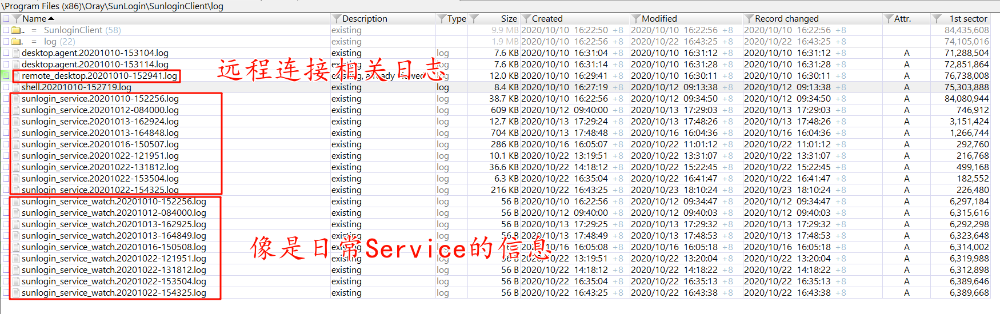

# Windows 向日葵 日志分析

## 本机连接对方机器日志

日志地址：`\Program Files (x86)\Oray\SunLogin\SunloginClient\log`



sunlogin_service.时间：日常自检的信息记录

`remote_desktop.20201010-152941.log`：远程连接别人的记录，内容如下：

关注重点：

```
2020-10-10 15:29:42.764	- Info  -	[udpwrapper] attempt to establish P2P connection via: 180.97.156.87:4118, (local)192.168.43.87:15828|(public)36.17.87.39:37166 ==> (local)192.168.2.177:15834|(public)183.134.185.41:15834
```

对方公网IP：183.134.185.41:15834

本机公网IP：192.168.43.87:15828

中转服务器：180.97.156.87:4118

