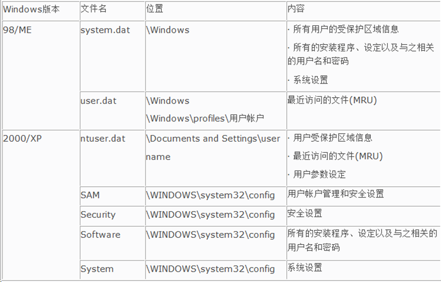

# Windows 注册表取证

注意：

在64bit系统下，通过regedit中查看到指定路径下的注册表项均为64位注册表项，而32位注册表项被重定位到： `HKEY_LOCAL_MACHINE\Software\WOW6432Node`

工具：

```
EnCase Forensic
FTK Registry Viewer
X-Ways Forensics
Registry Recon
Mitec WRR
```

## 常用分析项

### 用户帐户及安全设置(SAM/SECURITY)

• 用户帐号/SID

• 登录时间、登录次数

• 最后登录时间等

### 系统及软件信息(SYSTEM/SOFTWARE)

• 系统信息（OS版本、安装日期、最后关机时间等）

•时区信息 （Time Zone）

• 硬件信息 /服务列表

• 网络配置信息 /共享文件夹信息

• 应用程序运行痕迹记录

• USB设备使用记录等

### 用户相关信息(NTUSER.DAT)

最近打开的文件记录(MRU, RecentDocs)

---

## 注册表结构

- 项/主键(Key)

- 子项/子键(SubKey)

- 值项/键值(Value)

- 配置单元(Hive)

- 预定义项

- 子树(SubTree) /分支(Branch)


举例：

查看IE的首页：

`HKEY_CURRENT_USER\Software\Microsoft\Internet Explorer\Main`

- 键值名称为：Start Page

- 键值数据为：[http:](http://www.msn.com/)[/](http://www.msn.com/)[/w](http://www.msn.com/)[w](http://www.msn.com/)[w](http://www.msn.com/)[.](http://www.msn.com/)[m](http://www.msn.com/)[sn.com](http://www.msn.com/)


### 项值数据类型

| **类型** | **名称**             | **描述**                                                     |
| -------- | -------------------- | ------------------------------------------------------------ |
| 0        | REG_NONE             | 无定义值类型                                                 |
| 1        | REG_SZ               | 以零结尾的字符串，ANSI或Unicode                              |
| 2        | REG_EXPAND_SZ        | 包含未扩充的环境变量引用的零结尾的字符串，如%PATH%           |
| 3        | REG_BINARY           | 二进制数据，以十六进制符号显示                               |
| 4        | REG_DWORD            | 32位的数字，有时存储的值也用来表示布尔类型标识，如00为禁 用，01为启用 |
| 5        | REG_DWORD_BIG_ENDIAN | 双字节的值，用来存储Big Endian类型的值                       |
| 7        | REG_MULTI_SZ         | 零结尾的字符串数组，以2个空字符结束                          |
| 11       | REG_QWORD            | 64位的数字                                                   |

### 预定义项

预定义项，是代表注册表中的主要部分的项，指在注册表中以HKEY作为前缀的文件夹，位于注册表树状结构的最顶层。预定义项类似于硬盘上的根目录，Windows 2000/XP注册表编辑器中有五大预定义项，分别为 ：

- HKEY_CLASSES_ROOT

- HKEY_CURRENT_USER

- HKEY_LOCAL_MACHINE

- HKEY_USERS

- HKEY_CURRENT_CONFIG

- 在Windows 9x操作系统的注册表中，另外还有一个预定义项

	HKEY_DYN_DATA

| **预定义项**        | **简写** | **描述**                                                     |
| ------------------- | -------- | ------------------------------------------------------------ |
| HKEY_CLASSES_ROOT   | HKCR     | 包含文件扩展关联信息及OLE数据库，存储在这里的信息可确保使 用 Windows 资源管理器打开文件时能打开正确的程序 |
| HKEY_CURRENT_CONFIG | HKCC     | 在启动过程中动态创建，包含系统启动时的硬件相关的配置信息     |
| HKEY_LOCAL_MACHINE  | HKLM     | 包含特定于计算机的配置信息（用于任何用户），如软件，硬件及安全 |
| HKEY_USERS          | HKU      | 包含计算机上的所有以活动方式加载的用户信息和默认配置文件， 默认配置文件决定了没有人登录时，计算机如何响应 |
| HKEY_CURRENT_USER   | HKCU     | 包含登录到系统的当前用户的配置信息，该用户的文件夹、屏幕颜色和“控制面板”设置都存储在这里。这些信息与用户的配置文件相关联 |


## 配置单元（Hive）

配置单元是作为文件出现在系统注册表的一部分，位于 `HKEY_LOCAL_MACHINE` 和 `HKEY_USERS` 两个预定义项下，是项、子项和值的离散体，它位于注册表层的顶部。

配置单元是一个文件，可以通过注册表编辑器中“加载配置单元”（Load Hive）和“卸载配置单元”选项，从一个系统移动到另一个系统 。

说白了就是选择特定的Hive文件来加载到管理器。

| 注册表配置单元              | 相关文件                                                     |
| --------------------------- | ------------------------------------------------------------ |
| HKEY_LOCAL_MACHINE\SAM      | SAM、SAM.log、SAM.sav                                        |
| HKEY_LOCAL_MACHINE\Security | SECURITY、Security.log、Security.sav                         |
| HKEY_LOCAL_MACHINE\Software | SOFTWARE、Software.log、Software.sav                         |
| HKEY_LOCAL_MACHINE\System   | SYSTEM、System.alt、System.log、System.sav                   |
| HKEY_USERS\DEFAULT          | Default、Default.log、Default.sav                            |
| HKEY_CURRENT_CONFIG         | System、System.alt、System.log、System.sav、 Ntuser.dat、Ntuser.dat.log |

注册表文件扩展名及其描述：

| 扩展名   | 描述                                                         |
| -------- | ------------------------------------------------------------ |
| 无扩展名 | 注册表的配置单元文件无扩展名，如SAM、SECURITY、system、software |
| .alt     | 在Windows2000中，System.alt文件是System文件的备份文件，在WindowsXP中未使用 |
| .sav     | 配置单元文件的备份文件，在系统安装的时候生成                 |
| .log     | 配置单元修改操作的日志文件                                   |

`HKEY_CURRENT_USER` 的Hive在用户目录下。

## 注册表内容

