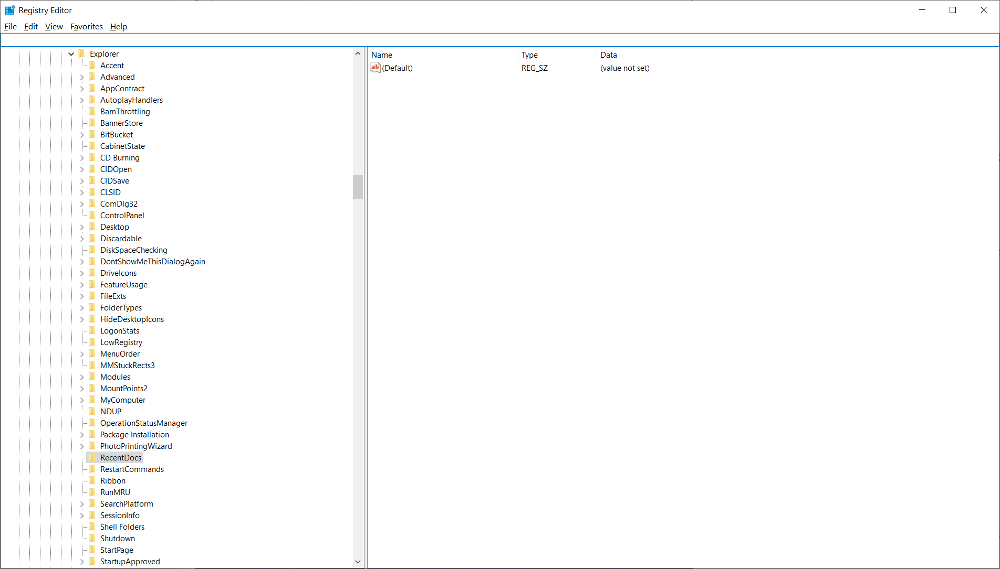

# Windows 注册表取证 常用分析项

注册表主要单元：

```
SYSTEM：对应的注册表分支为HKEY_LOCAL_MACHINE\SYSTEM，对应的存储文件是\Windows\System32\config\SYSTEM，其作用是存储计算机硬件和系统的信息。
NTUSER.DAT：对应的注册表分支是HKEY_CURRENT_USER，存储在用户目录下，与其他注册表文件是分开的，主要用于存储用户的配置信息。
SAM：分支是HKEY_LOCAL_MACHINE\SAM，存储在C:\Windows\System32\config\SAM文件中，保存了用户的密码信息。
SECURITY：对应的分支HKEY_LOCAL_MACHINE\SECURITY，存储在C:\Windows\System32\config\SECURITY文件中，保存了安全性设置信息。
SOFTWARE：分支是HKEY_LOCAL_MACHINE\SOFTWARE，文件存储在C:\Windows\System32\config\SOFTWARE中，保存安装软件的信息。
```

## 系统基本信息

### 操作系统安装时间

`HKEY_LOCAL_MACHINE\SOFTWARE\Microsoft\Windows NT\CurrentVersion` 的 `InstallDate`子键


### 关机时间

`HKEY_LOCAL_MACHINE\SYSTEM\ControlSet001\Control\Windows` 的 `ShutdownTime`键值，以64位`Windows/FILETIME`时间格式保存。

### 计算机名称

`HKEY_LOCAL_MACHINE\SYSTEM\ControlSet001\Control\ComputerName\ComputerName `的 `ComputerName`

### 本地用户

`HKEY_LOCAL_MACHINE\SAM\SAM\Domains\Account\Users\Names`

### 最后登录的用户

`HKEY_LOCAL_MACHINE\SOFTWARE\Microsoft\Windows\CurrentVersion\Authentication\LogonUI`

### 当前登录用户

`HKEY_LOCAL_MACHINE\SOFTWARE\Microsoft\Windows\CurrentVersion\Authentication\LogonUI\SessionData\1`

### 卷标名称

`HKEY_LOCAL_MACHINE\SOFTWARE\Microsoft\Windows Portable Devices\Devices`

### 安装的程序

`HKEY_LOCAL_MACHINE\SOFTWARE\Microsoft\Windows\CurrentVersion\App Paths`

### 卸载的程序

`HKEY_LOCAL_MACHINE\SOFTWARE\Microsoft\Windows\CurrentVersion\Uninstall`

### 最近使用的文件

`HKEY_CURRENT_USER\Software\Microsoft\Windows\CurrentVersion\Explorer\ComDlg32\OpenSavePidlMRU`

### 最近运行的命令行

`HKEY_CURRENT_USER\Software\Microsoft\Windows\CurrentVersion\Explorer\RunMRU`

## 网络信息

### 连接过的网络

```
HKEY_LOCAL_MACHINE\SOFTWARE\Microsoft\Windows NT\CurrentVersion\NetworkList\Profiles
```


### IE 输入过的链接

```
HKEY_CURRENT_USER\Software\Microsoft\Internet Explorer\TypedURLs
```

### IP 地址等信息

```
HKEY_LOCAL_MACHINE\System\Services\CurrentControlSet\services\Tcpip\Parameters\Interfaces
```

实测Windows 10可用：
```
HKEY_LOCAL_MACHINE\SYSTEM\CurrentControlSet\Services\Tcpip\Parameters\Interfaces\
```

在Autopsy里面也是可以的，在`SYSTEM`下`ControlSet001`里面，可以翻到：


## 用户痕迹

### 启动项

```
HKEY_LOCAL_MACHINE\Software\Microsoft\Windows\CurrentVersion\Run
```


这里面的 `RunOnce` 也要注意，也可能被用来启动木马，维持状态。

在 `Services` 下：2=自动启动；3=手动启动；4=禁用

另外在 `HKEY_CURRENT_USER\Software\Microsoft\Windows\CurrentVersion\Run` 中，可能有对特定用户登陆时设置的启动项。

### USB 存储设备使用记录

```
\HKEY_LOCAL_MACHINE\SYSTEM\ControlSet001\Enum\USBSTOR\
```


https://www.doc88.com/p-9107655008710.html?r=1


### 挂载过的设备

```
HKEY_LOCAL_MACHINE\SYSTEM\MountedDevices
```


### 最近使用（Recent）

```
HKEY_CURRENT_USER\Software\Microsoft\Windows\CurrentVersion\Explorer\RecentDocs
```

我这里是因为关闭了最近使用的记录，所以没有显示。



同一级下还有其他信息，比如用户对快捷访问文件夹的定义：


可以看到用户壁纸记录（如果是在线的，那么也可以直接打开设置查看）：


以及安装信息：

```
\HKEY_CURRENT_USER\SOFTWARE\Microsoft\Windows\CurrentVersion\Uninstall\
```


# 使用 AutoPsy 等软件进行离线分析

## 系统基本信息

### 操作系统版本信息

```
SOFTWARE\Microsoft\Windows NT\CurrentVersion
```


### 系统时区信息

```
SYSTEM\ControlSet001\Control\TimeZoneInformation
```


## 网络信息

### 网络连接记录

```
SOFTWARE\Microsoft\Windows NT\CurrentVersion\NetworkList\Profiles\
以及 Signatures
```


### NetDrive 连接记录（\\IP）

用户目录下的 `NTUSER.DAT`

> ## 33. [单选题]AGC-CS计算机里的用户 'Carson' 链接了一个网络磁盘机 (Network Drive)，在下列哪一个档案有相关资料? (2分)
>
> A. \Users\Carson\NTUSER.DAT
>
> B. \Users\admin\NTUSER.DAT
>
> C. \Windows\System32\config\SYSTEM
>
> D. \Windows\System32\config\SOFTWARE
>
> E. \Windows\System32\config\SECURITY
>
> 网络磁盘采用`\\ip`的方式进行访问，查看资源管理器的记录
>
> [](https://img2022.cnblogs.com/blog/2817142/202211/2817142-20221126154016407-1687192735.png)
>
> 跳转到源文件即可
>
> [](https://img2022.cnblogs.com/blog/2817142/202211/2817142-20221126154016603-490153687.png)
>
> 结果为`A`
>
> ## 34. [单选题]承上题，用户 'Carson' 连接的网络磁盘机的IP地址是什么? (1分)
>
> A. \\192.168.182.134\
>
> B. \\192.168.182.134\photo
>
> C. \\192.168.182.134\share
>
> D. \\192.168.182.134\AGC
>
> E. \\192.168.182.134\AGC photo
>
> 见上题
>
> 结果为`C`

### TCP/IP 连接记录（分配IP等）

```
SYSTEM\(Control Sets)\services\Tcpip\Parameters\Interfaces
```


## 应用运行记录

```
System\ControlSet001\Control\Session Manager\AppCompatCache
```


### Amcache

```
C:\Windows\appcompat\Programs\Amcache.hve
```

