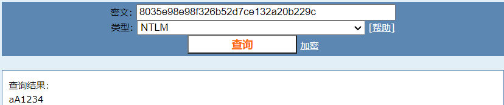

# Windows 取证 知识点

User SID：SID**安全标识符**（Security Identifiers），是**标识用户**、组和计算机账户**的唯一的号码**，在第一次创建该用户时，将给网络上的每一个用户发布一个唯一的SID。同名先后创建的两个用户SID是不一样的，所以权限也不一样。操作系统中的进程是根据用户的SID判断用户的权限的，而不是用户或组名

一个典型的SID：S－1-5-21-1683771068-12213551888-624655398-1001.它遵循的模式是：S－R－IA－SA－SA－RID。

1、字母S指明这是一个SID标识符，它将数字标记为一个SID。
2、R代表Revision（修订），Windows生成的所有SID都使用修订级别 1.
3、IA代表颁发机构。在Widnwos中，几乎所有SID都指定NT机构作为颁发机构，它的ID编号为5.但是，代表已知组和账户的SID例外。
4、SA代表一个子机构。SA指定特殊的组或职能。例如、21表明SID由一个域控制器或者一台单机颁发。随后的一长串数字（1683771068-12213551888-624655398）就是颁发SID的那个域或机器的SA。
5、RID是指相对ID（RID）、是SA所指派的一个惟一的、顺序的编号、代表一个安全主体（比如一个用户、计算机或组）

注：在经典NT和windows2000中，Local System账户SID S－1-5-18为几乎所有服务提供了安全上下文，该账户具有很大的特权。Windows2003则引入了另外两个“已知SID”来为服务提供一个安全上 下文、即LocalService和NetworkService。

所以RID就是指最后的那一部分，这里的就是指 1001

---

文件系统！！！


---

## Windows痕迹分析

`dxdiag` DirectX诊断工具，可以查看系统基本信息

`systeminfo`

`wmic bios get serialnumber`：获取电脑序列号

`whoami /user` 查看当前用户的SID

`wmic useraccount get name,sid` 查看所有用户的SID

`%windir%\explorer.exe shell:::{4234d49b-0245-4df3-b780-3893943456e1}` ：查看已安装的软件

Prefetch：查看最近使用过的程序

`recent` 最近打开的文件

## Windows内存取证


```
python2 vol.py -f memdump.mem imageinfo
python2 vol.py -f memdump.mem --profile=Win7SP1x86_23418 plist # 打印进程列表
```

`getsids` 打印拥有每个进程的SID

`hashdump` 转储密码哈希（LM/NTLM）

`netscan` 获取当时的网络连接信息

`hivelist` 注册表解析

`iehistory` 打印IE缓存和历史记录

`mftparser` 打印NTFS主文件表的信息

`shellbags` 打印打开的文件夹的信息（即ShellBags注册表项的信息）

### 加密盘相关

`bitlocker`

`truecryptmaster` 主密钥

`truecryptpassphrase` 缓存密码短语查找

`truecryptsummary`


---


跳转到某某扇区：

1扇区包含512字节，扇区数*512即为偏移量，跳转过去即可。

---

### 通知内容解析

**Windows 10**

In Windows 10, the notifications are stored in `\Users\<username>\AppData\Local\Microsoft\Windows\Notifications\wpndatabase. db` as an SQLite database.

**Google Chrome Notification**

`C:\Users\OMEN\AppData\Local\Google\Chrome\User Data\Default\Platform Notifications`

## Windows 镜像密码破解

可以将获得的windows镜像先挂载获取SAM和SYSTEM注册表文件，然后使用mimikatz

[](https://img2022.cnblogs.com/blog/2817142/202208/2817142-20220816172011223-116442487.png)

提取windows的密码ntml哈希值`8035e98e98f326b52d7ce132a20b229c`

解密得到密码为`aA1234`[](https://img2022.cnblogs.com/blog/2817142/202208/2817142-20220816172011265-892620734.png)
