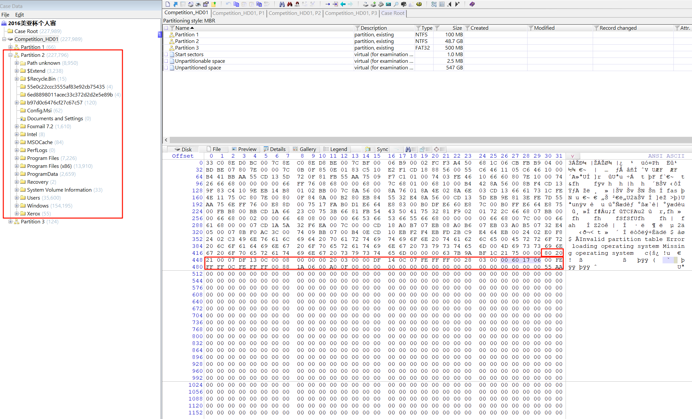
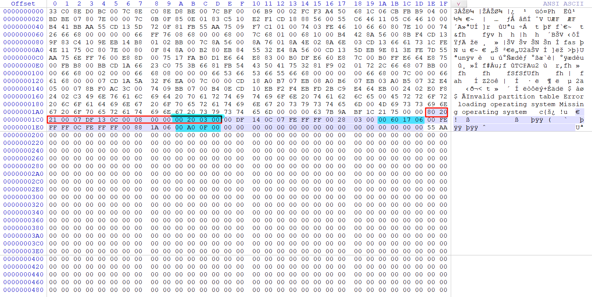
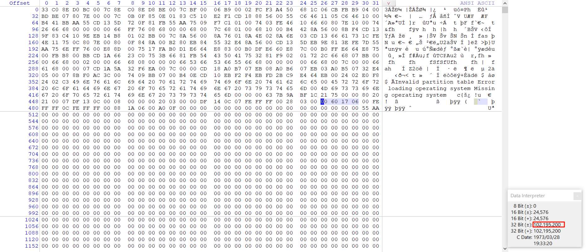
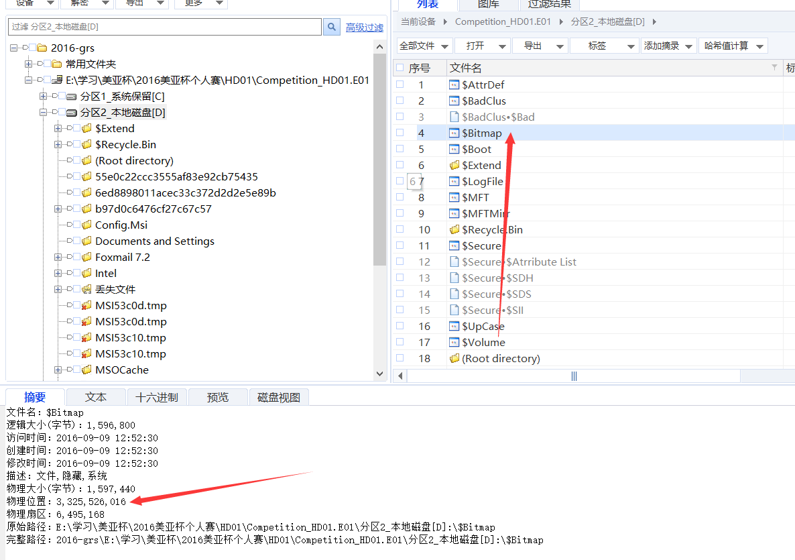

# Windows 取证硬件相关 & 文件系统知识点

## 卷序列号：

## MBR

参见：1.MBR磁盘分区表的数据结构.ppt

根据主引導記錄（MBR），以下哪組偏移显示了包含操作系统分区的总扇区数？
A) 偏移 446-449
B) 偏移 458-461
C) 偏移 474-477
D) 偏移 490-493
E) 偏移 506-509

详细：

判断DBR、MBR、EBR：1FE - 1FF 是 55AA

FAT16的DBR:EB 3C 90 没有备份的DBR
FAT32的DBR:EB 58 90 (备份的DBR） 在该分区的第6扇区
NTFS 的 DBR:EB 52 90 (备份的DBR） 在该分区的最后一个扇区

判别MBR的方法:
MBR就在LBA第一个扇区，打开物理硬盘，第一个扇区就是了。MBR的分区表在1BE偏移往后到1FD，共64个字节，每项16个字节。
1FE-1FF就是“55 AA”

判别EBR的方法:
EBR的结构和MBR的结构是一样的，在倒数第五行倒数第二个字节应该是00 01，并且前446个字节应该是0

主引导MBR是起始扇区中第一扇区的。00000001BE-00000001FF

选中的即为答案。

### 分区表项

根据主引導記錄（MBR），包含操作系统的分区的总扇区数是多少？
（答案格式：5246852048 sectors）

详细：`102195200`

这里可以直接根据取证大师里面提供的数据看出来

每16个字节是一条记录，最多4条，每条记录最后4个字节是该分区的扇区数。

于包含操作系统的分区內，$Bitmap的物理起始偏移位置是什么？
（答案格式：256363）

`35987456`

详细：可以直接用物理位置减去D盘的物理位置 = 3,325,526,016 - 105,906,176 = `3219619840`

这个地方需要注意的是，题目设问的是 系统分区 里面这个Bitmap的 “偏移” ，问的就是一个相对的量。

